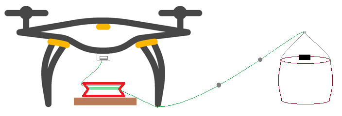
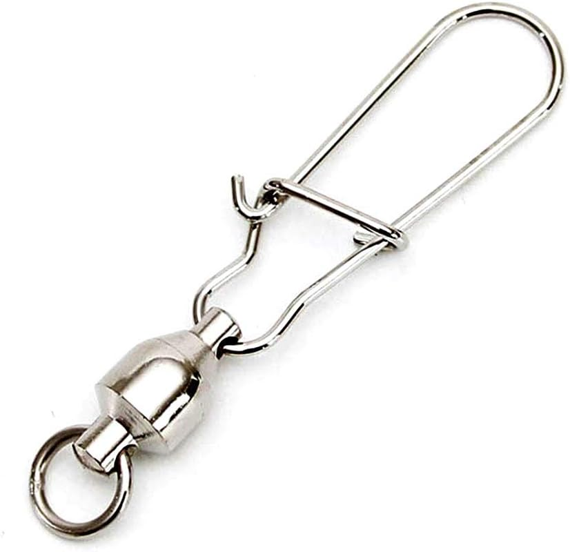
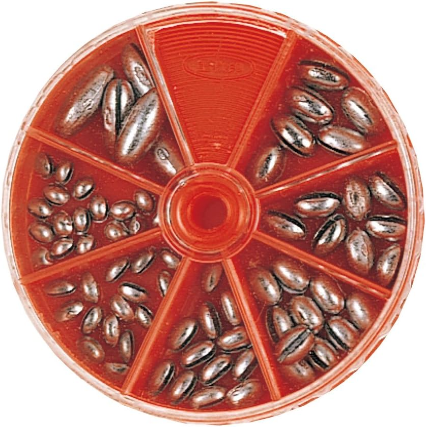
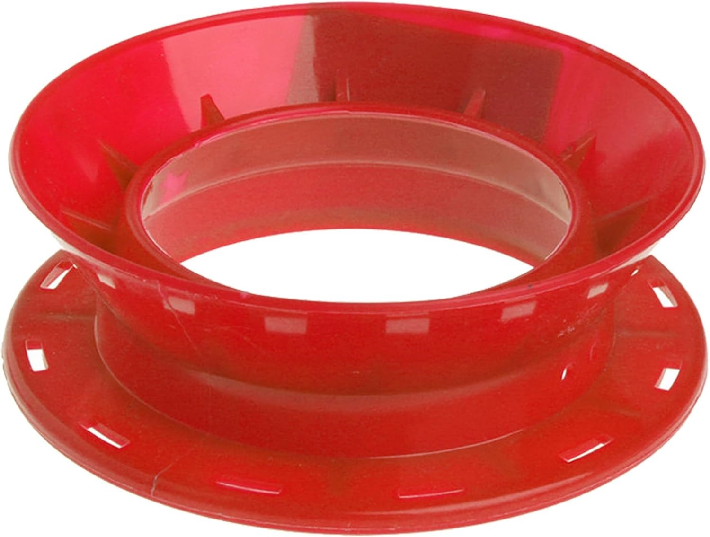
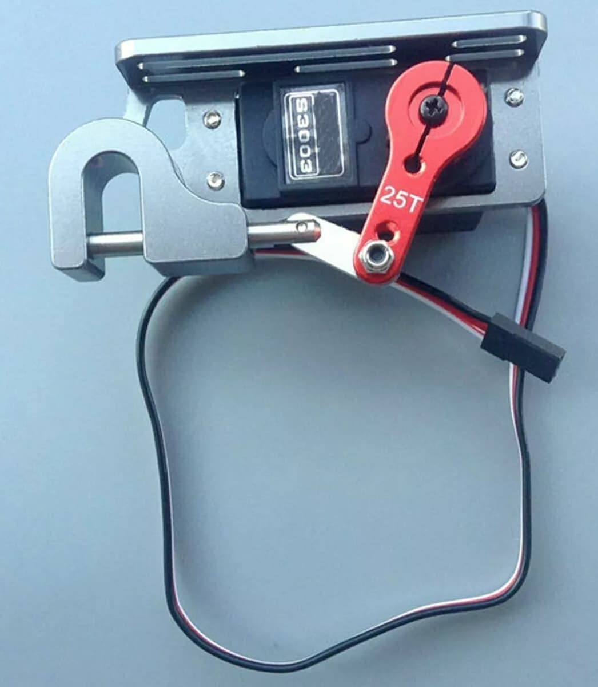

.. _slung-payload:

=============
Slung Payload
=============

..  youtube:: qgP2zsTCVPw
    :width: 100%

For package delivery using a slung payload can be simpler and more reliable than using a :ref:`winch <common-daiwa-winch>`

Copter-4.6 (and higher) supports the `copter-slung-payload.lua <https://github.com/ArduPilot/ardupilot/blob/master/libraries/AP_Scripting/applets/copter-slung-payload.lua>`__ script which can be used to reduce the oscillation of the payload

Hardware Setup
==============

- Mount an autopilot, GPS and telemetry radio to the payload.  This payload autopilot must transmit the `GLOBAL_POSITION_INT <https://mavlink.io/en/messages/common.html#GLOBAL_POSITION_INT>`__ mavlink message to the autopilot at 10hz using a system id that is different from the autopilot's.  In the video above a `Here4 GPS running ArduPilot <https://docs.cubepilot.org/user-guides/here-4/here-4-manual#id-8.-installing-ardupilot-on-here4>`__ was used along with an ESP32 radio running `DroneBridge ESP32 <https://github.com/DroneBridge/ESP32>`__.  A `ready-to-use device is available from Japan Drones <https://japandrones.com/shop/shopdetail.html?brandcode=000000000193>`__
- The payload should be connected to the delivery vehicle with fishing line (or equivalent).  Both ends of the fishing line should have fishing tackle bearing swivels attached to allow the payload to rotate freely.  Two or three fishing sinkers should be attached at 0.5m intervals to the end of the line closest to the payload
- The fishing line should be wound around a fishing line coiling plate starting from the payload end
- The coiling plate should be attached to a heavy base board and placed directly under the delivery vehicle so that the line uncoils smoothly as the vehicle climbs
- The delivery drone should have a :ref:`servo gripper <common-gripper-servo>` allowing it to release the entire line during the :ref:`payload place mission command <mission-command-list>`

Software Configuration and Testing
==================================

- Install the `copter-slung-payload.lua <https://github.com/ArduPilot/ardupilot/blob/master/libraries/AP_Scripting/applets/copter-slung-payload.lua>`__ script onto the delivery vehicle's autopilot (see :ref:`Lua script installation instructions here <common-lua-scripts>`)
- Follow the "How To Use" section of the `copter-slung-payload.md file <https://github.com/ArduPilot/ardupilot/blob/master/libraries/AP_Scripting/applets/copter-slung-payload.md>`__ including copying the `modules directory <https://github.com/ArduPilot/ardupilot/tree/master/libraries/AP_Scripting/modules>`__ to the vehicle's autopilot's SD card's scripts directory
- Power on the vehicle and the payload's autopilot
- Connect to the vehicle's autopilot with a ground station (e.g. Mission Planner) and confirm that both the vehicle and payload appear on the map.  If they do not then there is likely an issue with the telemetry radios or the delivery vehicle and payload's  sysid conflict (see :ref:`MAV_SYSID <MAV_SYSID>`)
- Create an auto mission with SCRIPT_TIME and/or PAYLOAD_PLACE :ref:`mission commands <mission-command-list>`
- Fly the mission and confirm that the delivery vehicle's autopilot reports, "copter-slung-payload: activated" during the NAV_SCRIPT and/or PAYLOAD_PLACE mission commands.  Also confirm the vehicle moves slightly towards the payload when activated
- If the delivery vehicle moves strangely, simply switch the vehicle to a different flight mode (e.g. Guide, RTL, etc) or advance the mission so that neighter a NAV_SCRIPT nor PAYLOAD_PLACE command is executed

Videos
======

..  youtube:: pLeGaxk74hs
    :width: 100%

..  youtube:: EbfZ-fO4gWY
    :width: 100%
