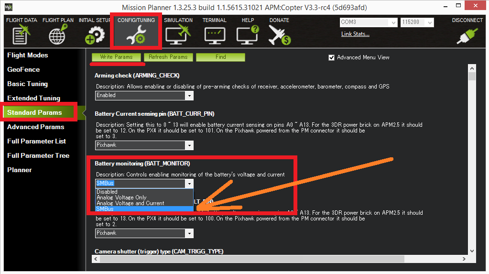

.. _smart-battery:

=============
Smart Battery
=============

Copter supports "smart batteries" that communicate using
`SMBus <https://en.wikipedia.org/wiki/System_Management_Bus>`__ `like those found on the Solo <https://store.3dr.com/products/solo-smart-battery>`__. 
This allows easier setup than available when using a traditional power
module.

.. note::

   Support for smart batteries was introduced in Copter 3.3

.. image:: ../../../images/SmartBattery_Solo.jpg
    :target: ../_images/SmartBattery_Solo.jpg

Connecting to the Pixhawk
=========================

SMBus is close enough to I2C that the GND, SDA and SCLK lines from the
battery can be connected to the Pixhawk's I2C connector (see I2C pin
assignment on :ref:`this page <common-pixhawk-overview_pixhawk_connector_pin_assignments>`).

Setup through Mission Planner
=============================

Simply set the :ref:`BATT_MONITOR <BATT_MONITOR>`
parameter to "SMBus" and reboot the board.  When it restarts, if it
successfully finds the battery, the :ref:`BATT_CAPACITY <BATT_CAPACITY>`
parameter should be automatically updated to the batteries actual
capacity in mAh.

Limitations
===========

-  Battery "address discovery" is not supported so the battery must use
   slave address 0x0B (7 bit address).
-  Start-up scripts for ArduPilot only search for the battery on the
   "internal" I2C bus which is not easily accessible on the Pixhawk
   board.  This can be changed in `the startup scripts <https://github.com/diydrones/ardupilot/blob/master/mk/PX4/ROMFS/init.d/rc.APM#L465>`__
   (see line below) to tell the **batt_smbus** driver to searching on
   bus "1" instead of "2":

   ::

       # optional smbus battery monitor
       if batt_smbus -b 2 start 

Additional information
======================

`SMBus specifications (see ver 1.1, ver 2.0) <http://smbus.org/specs/>`__

`Software driver for ArduPilot/PX4 <https://github.com/diydrones/PX4Firmware/blob/master/src/drivers/batt_smbus/batt_smbus.cpp>`__
