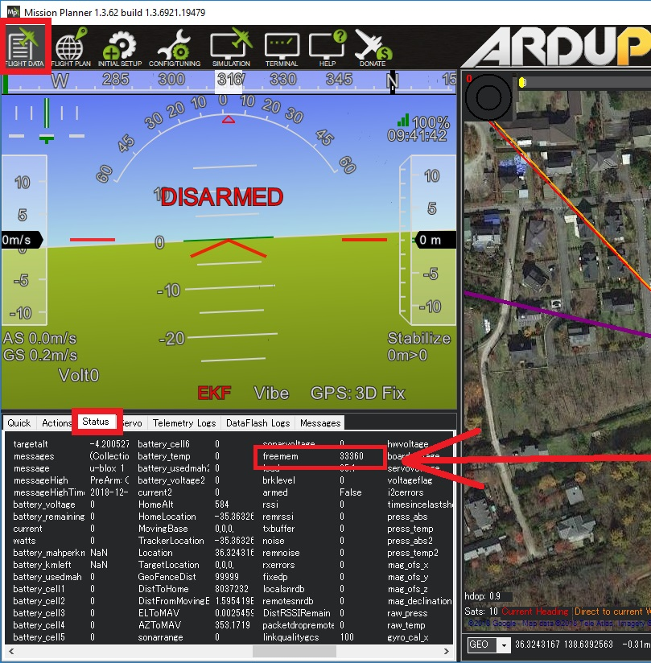

.. _smartrtl-mode:

==============
Smart RTL Mode
==============

..  youtube:: gXfBmFn_JEU
    :width: 100%

When switched into Smart RTL, like regular RTL, the vehicle will attempt to return home.  The "Smart" part of this mode is that it will retrace a safe path home instead of returning directly home.  This can be useful if there are obstacles between the vehicle and the home position.

.. note::

   SmartRTL is available in Copter-3.6 (and higher)
   The vehicle must have a good position estimate (LEDs should be green) when the vehicle is armed or SmartRTL will be disabled.  If the vehicle is armed without a good position estimate, "SmartRTL deactivated: bad position" will be sent to the ground station.

The path used to return home is captured in a buffer as the vehicle drives around in any other mode.  The path is "simplified" (meaning curved paths are turned into a series of straight lines) and "pruned" (meaning loops are removed).  The buffer is of a limited size (see below) and once it is full, "SmartRTL deactivated: buffer full" will appear on the ground stations's HUD and the user will no longer be able to switch into this mode. The altitude at each point is also stored and used on the return.

SmartRTL saves points at a maximum of 3 per second, but only if the vehicle has moved at least :ref:`SRTL_ACCURACY <SRTL_ACCURACY>` meters from the previous point. So for example, if the vehicle was moving at 10m/s it would save the points at 3.3m intervals. After 50 points are saved it goes back and simplifies them into lines again using that :ref:`SRTL_ACCURACY <SRTL_ACCURACY>`. It will replace a string of points with just two end points if all the intermediate points are no more than :ref:`SRTL_ACCURACY <SRTL_ACCURACY>` from the line between the end points. This is how it manages to create a smart path home without flying unecessary maneuvers.

There are multiple ways that the vehicle can mode switch into SmartRTL. Either through user selected, or through failsafe selections. 

The :ref:`FS_GCS_ENABLE <FS_GCS_ENABLE>` and :ref:`FS_THR_ENABLE <FS_THR_ENABLE>` parameters set to 4 or 5 the vehicle will switch to SmartRTL->RTL or SmartRTL->Land based on whether the correct conditions allows the mode. The setting indicates that it will try SmartRTL first, then downgrade to RTL (4) or Land (5)

Additional Failsafes that may be set to switch to SmartRTL are: :ref:`BATT_FS_CRT_ACT <BATT_FS_CRT_ACT>`, :ref:`BATT_FS_LOW_ACT <BATT_FS_LOW_ACT>`, :ref:`BATT2_FS_LOW_ACT <BATT2_FS_LOW_ACT>`, and :ref:`BATT2_FS_CRT_ACT <BATT2_FS_CRT_ACT>`.

SmartRTL Parameters
===================

-  :ref:`RTL_SPEED <RTL_SPEED>` can be used to set the speed (in meters/second) at which the vehicle will return to home.  By default this parameter is zero meaning the :ref:`WPNAV_SPEED <WPNAV_SPEED>`  parameter value will be used.
-  :ref:`RTL_ALT_FINAL<RTL_ALT_FINAL>` if set to 0, will land at home, otherwise will stop and hover above home at this altitude upon completion of the return.
-  :ref:`SRTL_ACCURACY <SRTL_ACCURACY>` controls the accuracy (in meters) of the simplification and pruning performed.  The simplify algorithm will turn curved paths into straight lines but the line should never be more than this distance from the original path.  The pruning algorithm will cut paths that come within this many meters of each other.
-  :ref:`SRTL_POINTS <SRTL_POINTS>` controls the maximum number of points that can be stored.  Each additional 100 points requires about 3k of RAM and the image below shows how to check the autopilot's available memory (most autopilots have enough memory for 500 points). If the maximum number of points is exhausted, "SmartRTL deactivated: buffer full" will be sent to the ground station and the user will not be able to switch into SmartRTL.

.. note:: SmartRTL can be deactivated as a mode by simply setting :ref:`SRTL_POINTS <SRTL_POINTS>` to "0".

