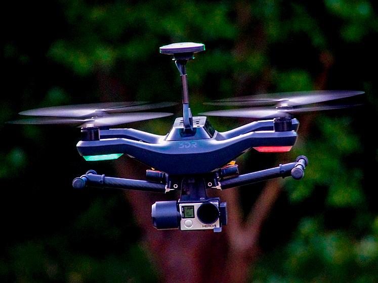
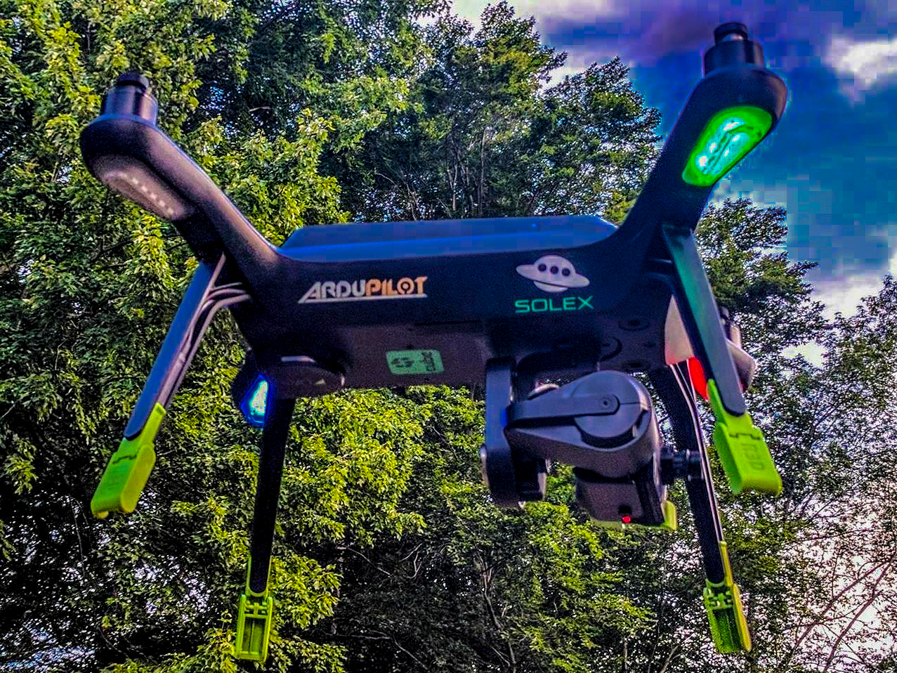
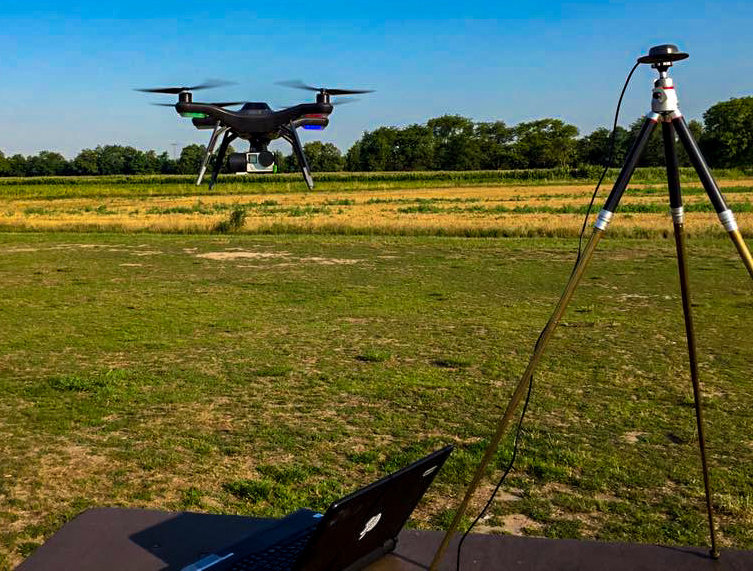
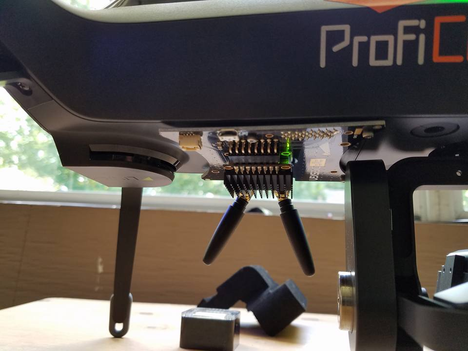
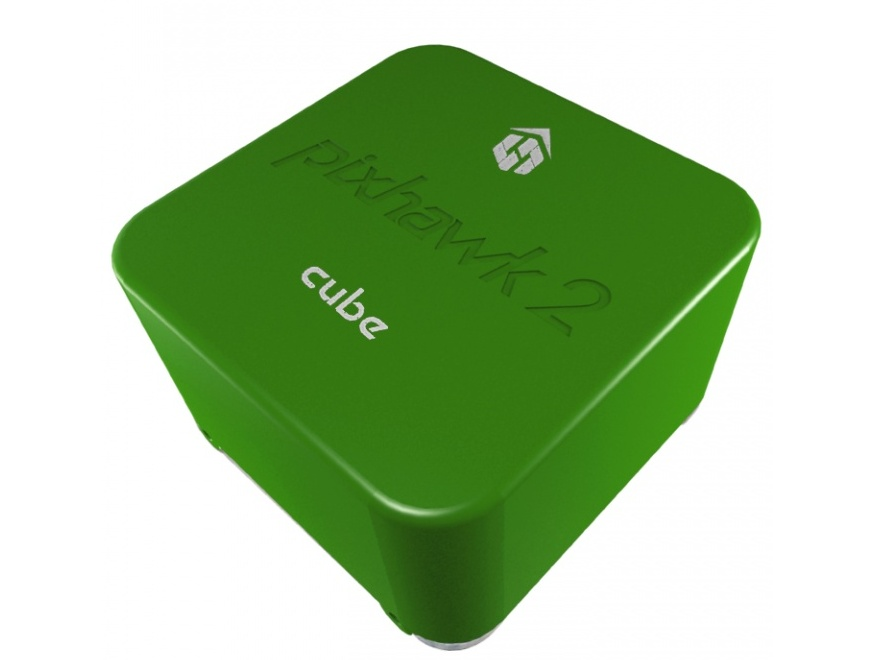
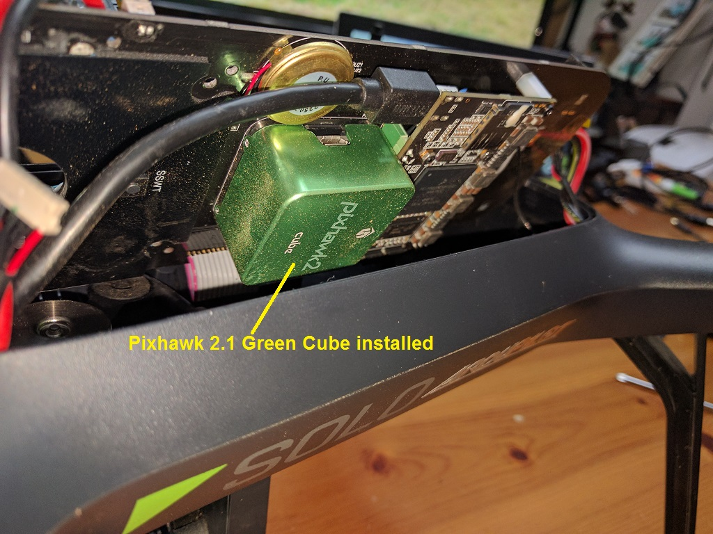

.. _solo_arducopter_upgrade:

====================================
3DR Solo - ArduCopter Master Upgrade
====================================

This article details upgrading and operating ArduCopter version 3.5.0 and higher a 3DR Solo.

Overview
--------
The 3DR Solo contains, among many things, a Pixhawk 2.0 autopilot. It comes with a heavily customized branch of an early ArduCopter 3.3 compiled specifically for the Solo by 3DR. When you do the initial pre-flight update on a new Solo (or after a factory reset), part of that update is this Solo  branch of ArduCopter. It is installed on the Pixhawk, and has all the necessary default parameters and customizations baked into it. It is essentially transparent to the user, taking place behind the curtains.  Since 3DR is no longer in the consumer UAS business, this custom branch of ArduCopter will not be seeing any further updates. It was last updated in early 2016, and is now very far behind.

Life After 3DR
^^^^^^^^^^^^^^
Since the Solo uses a Pixhawk autopilot, it is capable of running variations of ArduCopter besides the 3DR customized Solo version. This article will focus on installing, configuring, and operating ArduCopter version 3.5.0 or higher on a 3DR Solo. ArduCopter continues where 3DR left off, keeping the Solo a modern, advanced, and highly capable sUAS.  There are countless advances in the autopilot firmware making it a more stable, reliable, and agile aircraft. There are many new features such as boat mode, RTK GPS, enhanced telemetry, ADS-B, lidar laser altimeters, terrain awareness and following, IR precision landing, and even and "indoor GPS".

*Photos by Andrew Emmett, Matt Lawrence, Stephan Schindewolf, & Paul Dinardi*

|

Hardware Requirements
^^^^^^^^^^^^^^^^^^^^^
The Pixhawk 2.1 Green Cube (or a traditional Cube with the internal jumper set for 5 volts) is currently required for safe and reliable use of ArduCopter 3.5.0 and higher on a 3DR Solo. You can purchase the Green Cube from `Jesters Drones <http://www.jestersdrones.org/store/index.php?rt=product/category&path=68>`_ or directly from  `ProfiCNC <http://www.proficnc.com/3dr-solo-accessories/79-the-cube.html>`_.  The Cube has significantly more advanced components.  This includes 3 temperature controlled IMUs and the 5 volt signalling the Solo needs to operate safely. If you already have a Cube, you can set an internal solder jumper to 5 volt signalling and use it in your Solo.  The Green Cube comes with this jumper pre-set for 5 volts.

You *can* install ArduCopter master on the stock Pixhawk 2.0, but it is highly discouraged. It will install, and it will fly.  But you are at fairly high risk for motors shutting down in flight, leading to a serious crash. This is because of an electrical hardware flaw in the Solo's motor pods.  The old stock firmware has a software patch to *mostly* mitigate this flaw. This is what you may hear referred to as "slew rate protection". You can view the code for the slew rate protection in the stock 3DR firmware `here on their GitHub site <https://github.com/3drobotics/ardupilot-solo/blob/master/libraries/AP_Motors/AP_MotorsMatrix.cpp#L388>`_.  The production versions of ArduCopter, including ArduCopter 3.5 do not have this slew rate protection. It is severely handicapping and difficult to manage for a world of vehicles that use ArduCopter besides the Solo.  The 5 volt signalling used in the Pixhawk 2.1 Green Cube effectively solves the electrical problem on the motor pods.

There are other potential ways to mitigate the electrical problem with the motor pods without buying a new Cube.  You could use conventional DIY ESCs and bypass the ones built into the motor pods.  Or you could build a level converter that steps the signalling voltage up from 3v to 5v.  None of these solutions are commercially available as a kit, but can be done on a DIY basis if you are creative. You would not have the benefit of enhanced hardware in The Cube, but it would be just as safe and reliable to fly.

You cannot use the old stock 3DR Solo firmware on the Cube. It is entirely incompatible. This also means you cannot do a factory reset on the Solo with The Cube still in the Solo. The factory reset tries to reload the old Solo firmware, which is incompatible.  If you need to Factory Reset, you will need to put the old stock Pixhawk 2.0 back in, run the full factory reset and update, then put the Green Cube back in. This is annoying, but there is no way around it now or in the foreseeable future. In short, do not need to factory reset. Which also means do not lose your WiFi password!  Do not throw away your old stock cube!

|

Resources
^^^^^^^^^
There are several great resources online for modification ideas,vendors, beta testing firmware, troubleshooting, and support

-  `Solo Beta Test Facebook group <https://www.facebook.com/groups/617648671719759/>`_
-  `Solo Mod Club Facebook group <https://www.facebook.com/groups/3DRSOLOModClub/>`_
-  `Solex Users Facebook group <https://www.facebook.com/groups/176789056089526/>`_
-  `ArduPilot Discuss Forums <https://discuss.ardupilot.org/c/arducopter/copter-3-5>`_
-  `ArduPilot copter Wiki <https://ardupilot.org/copter/docs/common-advanced-configuration.html>`_
-  `3DR Pilots Forum <https://3drpilots.com/>`_ 
-  :ref:`Solo Battery Calibration Process <solo_battery_calibration>`

.. _solo_aducopter_upgrade_process:

|
|
|

Upgrade Process
---------------

Preparation
^^^^^^^^^^^
Before beginning the upgrade to ArduCopter 3.5 with the Pixhawk 2.1 Green Cube on your Solo, you need to complete some important requisites.

- Complete Solo and controller in good working order, paired, flyable, and fully charged.
- Solo and controller both up to date with current 3DR Solo firmware from the initial pre-flight update. The current 3DR firmware is 2.4.2.
- Flight tested, working properly in all respects. An untested or malfunctioning Solo should not be used for this process. It won't fix it.
- Pixhawk 2.1 Green Cube
- Philips and flat head screwdrivers
- Solex App for Android or a Windows PC for Mission Planner and WinSCP

Instructions
^^^^^^^^^^^^
There are two ways to do the upgrade that have detailed instructions published here.

-  :ref:`Initial installation using the Solex app <solo_arducopter_solex_install>`. This is by far the most straight forward and highly recommended method.  Solex has the means to load and reset firmware and parameters, and has access to all the necessary files online directly.
-  :ref:`Initial installation using Mission Planner and WinSCP <solo_arducopter_other_install>`. This method is a little more involved but is just as successful. You will need to download zip files, use Mission Planner to change settings, and use WinSCP to transfer files.  If you do not have the Solex app, this is the method you will need to follow.

.. _solo_arducopter_first_flight:

FIRST FLIGHT
------------
Once the upgrade process is complete, you're ready to make your first flight using ArduCopter 3.5 on the Solo.  It is recommended that your first flight be conducted at a location and time that allows you to test some basic functions and safety systems. Choose a wide open are free of obstructions, crowds of people, lakes, etc.  

Solo/Solex App Settings
^^^^^^^^^^^^^^^^^^^^^^^
You will need to go through all the settings in the 3DR Solo App (and the Solex app if you use that too) to verify and update sliders, options, and settings. Hot items to set include in this sweep include but are certainly not limited to:

- RTH altitude
- RTH/RTM* & Rewind
- Maximum altitude
- A/B Buttons
- Advanced Flight Modes
- Speed sliders
- GoPo settings

Go Airborne
^^^^^^^^^^^
With all of the above complete, it is time to take your first flight on ArduCopter master!

- Take off and verify the Solo flies stable and predictably. 
- Test all axes... pitch, roll, yaw, climbs, descends, and even all at once.
- Test the flight modes you have on the A & B buttons
- Make sure you are getting a good GPS lock
- Make sure the distance, altitude, speed, modes, and GPS data displayed on the app and controller are correct and as you expect to see.
- Let the battery run down to the failsafe while hovering safely nearby. Observe its behavior and verify it appropriately executed the RTH/RTM procedure.

.. note:: If you need help troubleshooting a problem during with this process or have questions, the `Solo Beta Test Facebook group <https://www.facebook.com/groups/617648671719759/>`_ is the best place to go.

.. _solo_arducopter_upgrade_parameters:

|
|
|

ArduCopter Parameters
---------------------
There are over 700 parameters in ArduCopter. For everyday use of the Solo, you still do not need to worry about any of them. They're all pre-set for you in the above processes and by way of defaults.  All the configuration parameters for the Solo that require a value different from the ArduCopter defaults can be found in the `ArduPilot GitHub repository /tools/frame_params/ directory <https://github.com/ArduPilot/ardupilot/blob/master/Tools/Frame_params/Solo_AC35.param>`_. These are the parameters that are loaded during the upgrade process. If you are not familiar with editting parameters and have no special use case to warrant changing them, altering them is not recommended. 

However, there are some advanced and special use cases that may require changing some parameters. Some key parameters for advanced users are detailed below. This list will likely grow as new use cases and modifications develop.

=====   =======
:ref:`COMPASS_ORIENT <COMPASS_ORIENT>` is the orientation of the external compass.
---------------
Value   Meaning
=====   =======
38      Stock compass in right rear leg
0       HERE External Compass
=====   =======

=====   =======
:ref:`FS_THR_ENABLE <FS_THR_ENABLE>` controls how the Solo respond to a loss of signal from the controller.
---------------
Value   Meaning
=====   =======
0       No failsafe. This should not be used.
1       RTH/RTM will initiate if GPS available. If no GPS, Solo will land.
2       Continue with Smart Shot or auto mission. Otherwise RTH/RTM if GPS available. If no GPS, Solo will land.
3       Land only, no RTH/RTM. This is useful for indoor flying.
=====   =======

=====   =======
FS_BATT_ENABLE controls the low battery failsafe action for Copter-3.5 (and earlier). For Copter-3.6 (and higher) check the :ref:`BATT_FS_LOW_ACT <BATT_FS_LOW_ACT>` parameter. The low battery failsafe kicks in when when the values set in parameters ``FS_BATT_VOLTAGE`` or ``FS_BATT_MAH`` are breached.
---------------
Value   Meaning
=====   =======
0       No failsafe action
1       Land immediately, no RTH/RTM. Useful for indoors.
2       RTH/RTM
=====   =======

=====   =======
FS_BATT_VOLTAGE is the low battery voltage threshold for Copter-3.5 (and earlier). For Copter-3.6 (and higher) check the :ref:`BATT_LOW_VOLT <BATT_LOW_VOLT>` parameter. When the battery voltage drops below this point, the low battery beeper sounds and it will do what you have ``FS_BATT_ENABLE`` set for. This value is expressed in volts. The default is 14.0. You can adjust this higher or lower depending on use case and preference.
---------------
Value   Meaning
=====   =======
0       No low voltage alarm or failsafe
14      14 volts
=====   =======

=====   =======
FS_BATT_MAH is the battery capacity remaining threshold expressed in milliamperes (MAH) for Copter-3.5 (and earlier). For Copter-3.6 (and higher) check the :ref:`BATT_LOW_MAH <BATT_LOW_VOLT>` parameter. When the battery remaining capacity drops below this point, the low battery beeper sounds and it will do what you have ``FS_BATT_ENABLE`` set for. The default is 520. On the solo, that is on average about 1.5 minutes of flying time remaining. You can adjust this up or down to fit your preference and use case. Setting it for 0 will disable capacity remaining based alarms and failsafes.
---------------
Value   Meaning
=====   =======
0       No battery capacity remaining alarm or failsafe
520     520 MAH
=====   =======

=====   =======
:ref:`WP_YAW_BEHAVIOR <WP_YAW_BEHAVIOR>` specifies the yaw behavior in auto missions and RTH/RTM.
---------------
Value   Meaning
=====   =======
0       No change. The Solo's yaw will keep pointing in the same direction unless you change it.
1       Face the next waypoint regardless of direction of flight.
2       Face the next waypoint except in RTH/RTM.
3       Face forward along the GPS course.
=====   =======

=====   =======
**NTF_OREO_THEME** controls the Solo's motor pod LED theme. This is for ArduCopter 3.5.0 and higher only.
---------------
Value   Meaning
=====   =======
0       Disabled   
1       Aircraft theme with red/green front and white strobes rear.    
2       Rover theme with white front & red rear (like a stock Solo used to be).
=====   =======

=====   =======
:ref:`AHRS_GPS_USE <AHRS_GPS_USE>` is for enabling or disabling the GPS on you Solo. The default is 1 for enabled. The primary use case for disabling the GPS is for indoor flight. If the GPS is disabled, it cannot and will not try to use it for flight, failsafes, or any other function. That means RTH mode is not available. You must be familiar with how the failsafes work without a GPS. In most cases, the Solo will land since it cannot RTH.
---------------
Value   Meaning
=====   =======
0       GPS disabled
1       GPS enabled
=====   =======

=====   =======
:ref:`LOG_DISARMED <LOG_DISARMED>` enables and disables dataflash (\*.bin) logging when the Solo is disarmed.  It is currently enabled by default since it can be very useful for testing and troubleshooting. But it does result in large and often unneccessary logs.  If you are comfortable and confident in your Solo, you disable logging while disarmed.  The dataflash logs be much cleaner and volumnous.
---------------
Value   Meaning
=====   =======
0       Disabled / No dataflash logging while disarmed
1       Enabled / Dataflash logging while disarmed and armed.
=====   =======

Further Information
-------------------

.. toctree::
    :maxdepth: 1

    solo_arducopter_other_install
    solo_arducopter_solex_install
    solo_battery_calibration