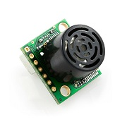
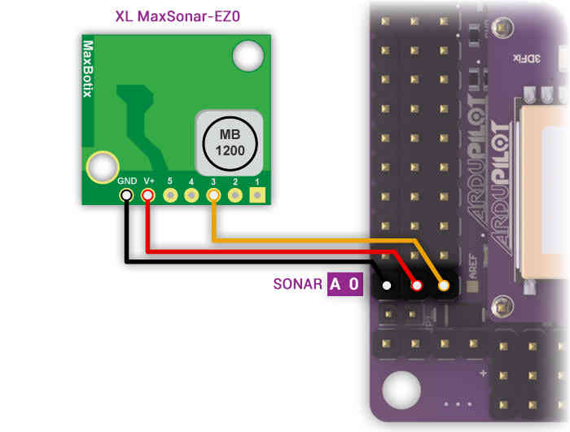
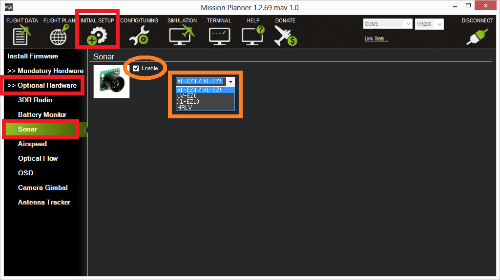
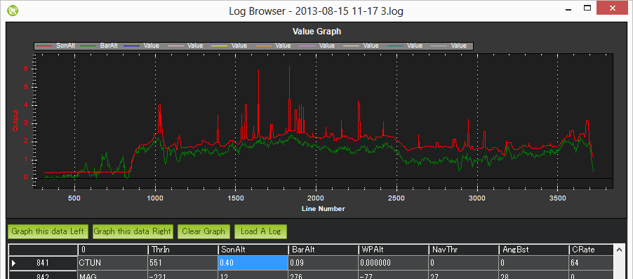

.. _sonar:

==============================
ARCHIVED: Analog Sonar (AC3.1)
==============================

.. note:: this document superceded by :ref:`common-rangefinder-maxbotix-analog`

Copter supports the MaxSonar line of sonar sensors for "Terrain
Following" while in Loiter or Alt Hold modes.  In these modes, the
copter will attempt to maintain a constant distance from the ground. 
The sonar is also used during
:ref:`LAND <land-mode>` mode.  The copter
will slow its descent to 50cm/s (configurable with LAND_SPEED
parameter) when the sonar detects something below the vehicle.

    
   
.. warning::
   
   RNGFND_MAX_CM must be set to a tested, appropriate value.  If RNGFND_MAX_CM is set to a value
   greater than the range of the sensor, the autopilot will not respond correctly to the 
   data provided.

Supported Sonars
================

The Maxbotix recommended Sonar for Multicopter use is the `MaxBotix XL-EZ4 <https://www.maxbotix.com/Ultrasonic_Sensors/MB1240.htm>`__
(aka MB1240) which has a 7.65m max range and a narrow beam which helps
reduce the chance of interference from other sources of sound at the same frequency.

It is definitely worth reading the `Interfacing an Ultrasonic Sensor with a Pixhawk or ArduPilot Mega <https://www.maxbotix.com/articles/ultrasonic-sensors-pixhawk-ardupilot.htm>`__ article by Maxbotix.

These other sonar are also supported:

-  `XL-EZL0 <https://www.maxbotix.com/Ultrasonic_Sensors/MB1260.htm>`__
   (10.68m max range but lower resolution, also XLL)
-  `HRLV-EZ4 <https://www.sparkfun.com/products/11309>`__ (5m max range
   but higher resolution, also HRLV-EZ0)
-  `LV-EZ4 <https://www.maxbotix.com/Ultrasonic_Sensors/MB1040.htm>`__
   (6.45m max range, cheaper but less resistant to noise, also LV_EZ0)

We do not yet support I2C based MaxBotix sonars.

Building a cable to reduce sonar noise
======================================

As described in `this Maxbotix article <https://www.maxbotix.com/articles/maxsonar-troubleshooting.htm>`__, 
you will need to make a special cable which requires:

-  `100uF capacitor <https://www.sparkfun.com/products/96>`__
-  `10ohm resistor <https://www.sparkfun.com/products/10969>`__
-  3-wire shielded cable
-  `0.1" crimp connector housing <https://www.pololu.com/product/1901>`__ and `crimp pins <https://www.pololu.com/product/1930>`__

..  youtube:: Rba1ZdL0vyE
    :width: 100%

Connecting the Sonar Sensor on APM 2.x
======================================

The sensor's GND, V+ and "AN" or "3" pins should be connected to APM 2's
A0 pins as shown in the diagram below:

Connecting the Sonar Sensor on PX4FMU
=====================================

You will need to assign the Sonar (signal line) to an appropriate PX4
pin in Mission Planner - Configuration - Advanced Params - Adv Parameter
List using the SONAR_PIN parameter.  The following PX4 "Pins" are available for SONAR use.

SONAR_PIN = 11 - (recommended)

The "airspeed" pin. Located on a 3 pin DF13 connector on the PX4IO board, but directly visible to the ADC on the PX4FMU. 
This pin can take voltages up to 6.6V (it has an internal voltage divider).

SONAR_PIN = 12

A general analog input pin. Located on pin 3 of the "FMUSPI" port on
the PX4IO board, this pin is directly visible to the PX4FMU analog
input code. This can take voltages up to 3.3V.

SONAR_PIN = 13

A general analog input pin. Located on pin 4 of the "FMUSPI" port on
the PX4IO board, this pin is directly visible to the PX4FMU analog
input code. This can take voltages up to 3.3V.  It is being worked on
and will be included in this section when it is available.

Mounting the Sonar Sensor
=========================

It's important that the sonar sensor be mounted at least three inches (10cm) away from sources of electrical noise including the ESCs and other interference. 

Enabling the Sonar through Mission Planner
==========================================

Enable the sonar by connecting your APM/PX4 to the Mission Planner and then:

-  Go to Initial Setup > Optional Hardware > Sonar
-  Check the "Enable" checkbox
-  Select the sonar model from the drop down list

Testing the sonar
=================

You can test the sonar basically works by connecting your APM/PX4 to the
mission planner and then:

-  Go to the Terminal window and press "Connect to APM" or "Connect to PX4"
-  when the prompt appears type *test*
-  type *sonar*

The current distanced sensed by the sonar should be displayed.  Aim the
sonar at targets of different distances (i.e. ceiling, wall, etc) and
ensure the numbers change.  If they do not then there may be a hardware
issue with the sonar or cabling.

You should also hear the sonar clicking very rapidly (10hz) whenever
power is applied if you do not hear this then it's possible that the
sonar is defective or is not being powered for some reason.

Tuning the gain
===============

If when flying you find that your copter bobs up and down it is possible
that the default SONAR_GAIN is too high for your copter.  Go to the
mission planner's Config/Tuning > Full Parameter List and reduce the
SONAR_GAIN parameter from its default of 0.2 to 0.1 or even 0.05 and
press "Write Params".

Sonar Maximum Altitude
======================

-  When enabled Sonar is used as the means of determining altitude
   below Sonar Maximum Altitude, above that the barometer is used.
-  Sonar Maximum Altitude is calculated as 60 percent of the factory
   specified maximum Sonar range for the Sonar type selected.
-  Sonar is used for determining altitude only when the Sonar itself is
   detecting the ground and is below its Sonar Maximum Altitude.

   -  XL-EZ4 or XL-EZ0 have a Maximum range of 7.65 meters and a Sonar
      Maximum Altitude of 4.59 meters.
   -  XL-EZLO have a Maximum range of 10.68 meters and a Sonar Maximum
      Altitude = 6.4 meters.
   -  HRLV-EZ4 or HRLV-EZ0 with Maximum range of 5 meters and a Sonar
      Maximum Altitude of 3 meters.
   -  LV-EZ4 or LV-EZ0 have a Maximum range of 6.45 meters and a Sonar
      Maximum Altitude = 3.87 meters.

-  If the Sonar gets an unreliable return below the Sonar Maximum
   Altitude, it is ignored and the Barometer altitude is used.

Cold weather performance
========================

The :ref:`MaxBotix <common-rangefinder-maxbotix-analog>`
XL-EZ0 sonar (and other variations of their indoor sonar) may not
function for about 10 minutes after an extreme drop in temperature (i.e.
a drop from a warm 27C/80F house to the chilly 10C/50F outdoors) because
of condensation building up on the sensor.

`This post <https://diydrones.com/forum/topics/arducopter-2-0-48?xg_source=activity&id=705844%3ATopic%3A676942&page=31#comments>`__ includes
one member's (`Geir Engebakken <https://www.diydrones.com/forum/topic/listForContributor?user=3a28calx54gma>`__)
solution (initially suggested by the developer Olivier ADLER) involving
attaching 4x10Ohm resistors to the base of the sonar powered from a 5V
source.

Other Potential Causes of Sonar Noise
=====================================

If you are having problems with excessive noise on your sonar as shown
in the dataflash log below (sonar is in red, baro is in green)

There are a number of possible causes which should be investigated:

Sonar is susceptible to "noise" from a variety of sources and several
"fixes" may be required to achieve adequate performance.

-  Electrical noise caused by ESCs, Servos, or switching BEC's on the
   same circuit as the Sonar.

   -  The RC filter and use of shielded cable as described above are
      usually sufficient.

-  EMF radiation from motors, motor wires, ESC's or Xbee.

   -  Sonar is especially susceptible to AC EMF noise generated by the
      ESCs and ESC to motor wiring.
   -  This can be greatly reduced by wrapping the nearby ESCs and their
      motor wiring in aluminum (gutter) tape.

-  Acoustic noise from propellers, prop wash and turbulence.

   -  It is very important to keep the Sonar out of direct prop wash or
      turbulence.
   -  Balancing propellers (and motors) can help.
   -  Mounting the sonar sensor inside a small can or tube thinly lined
      with foam can greatly reduce unwanted exterior acoustic noise.
   -  Wrap Sonar module board and components in rubber or foam tape to
      reduce transferred acoustic noise.

-  Vibration from motors, props, etc.

   -  Sonar is very subject to frame transmitted vibration.
   -  Mounting the Sonar module on double sided foam or Gel tape will
      pretty much eliminate this noise source.

-  The MB 1240 series is the only Sonar considered suitable for
   multicopter use by the manufacturer - Maxbotix.

.. note::

   Please read this tutorial for a comprehensive review: `Interfacing an Ultrasonic Sensor with a Pixhawk or ArduPilot Mega <https://www.maxbotix.com/articles/ultrasonic-sensors-pixhawk-ardupilot.htm>`__. 
