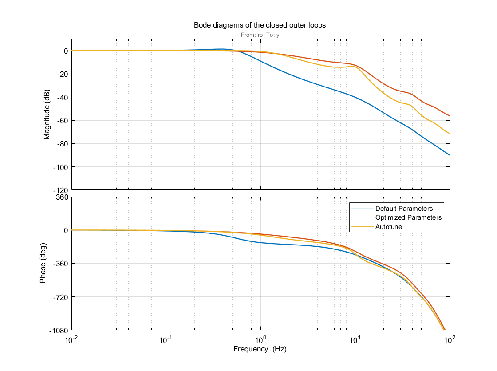

.. _systemid-mode-ctrl-optimization:

.. contents::

Multicopter Flight Controller Optimization
==========================================

After a mathematical model for the Multicopter is determined using System ID Mode <systemid-mode-operation>, the PID flight controller parameters are optimized using a multi-objective optimization.
Since the model is linear, a control optimization tool for linear system analysis in MATLAB is applied.
To make the controller parameters adjustable by the optimization algorithm, the PID flight controllers for the stabilize flight mode have been modeled in MATLAB.
The following sections regarding the optimization goals and results are **only valid for the examined quadcopter** with a weight of 1.5 kg, an arm length of 22 cm and 9 inch propellers.
The resulting parameters are specifically applicable for this copter configuration and **must not** be used for any other copter.

Optimization Goals
------------------

The following table shows the goals/requirements of the controller optimization.
The dynamics of the roll and pitch axes are very similar.
Therefore, identical goals are applied to both axes.
The yaw axis behaves quite differently.
It is assumed that disturbances due to translational motion and wind mainly influence the pitch and roll axes, hence the disturbance rejection is not optimized for the yaw axis.

+------------------------------------+-----------------+---------------+----------------------+
| Requirement Goal                   | Pitch & Roll    | Yaw           | Optimization Target  |
+------------------------------------+-----------------+---------------+----------------------+
| Phase Margin                       | 50°             | 50°           | Larger is better     |
+------------------------------------+-----------------+---------------+----------------------+
| Gain Margin                        | 7 dB            | 7 dB          | Larger is better     |
+------------------------------------+-----------------+---------------+----------------------+
| Step Response: Response Time       | 0.02 s          | 0.2s          | Smaller is better    |
+------------------------------------+-----------------+---------------+----------------------+
| Step Response: Overshoot           | 5 %             | 5 %           | Smaller is better    |
+------------------------------------+-----------------+---------------+----------------------+
| Step Response: Stationary Error    | 5 %             | 0.1 %         | Smaller is better    |
+------------------------------------+-----------------+---------------+----------------------+
| Control Variable Max. Overshoot    | 80 %            | 10 %          | Smaller is better    |
+------------------------------------+-----------------+---------------+----------------------+
| Disturbance Rejection              | see graph below |not applied    | Smaller is better    |
+------------------------------------+-----------------+---------------+----------------------+

The frequency-based disturbance rejection curve in decibel is shown below.
As a reference, the blue line represents the rejection gain that is achieved with the default parameters of ArduCopter.
The optimized system is required to stay bellow the yellow area to have a better disturbance rejection.

.. image:: ../images/disturbance_rejection_requirement.png
:name: fig-dist-reject-req

Optimization Results in the Simulation
--------------------------------------

The next four plots show the bode plot of the closed-loop system, the simulation results for the tracking behavior of a 10 degree step, the normalized controller output corresponding to the angle step, and the disturbance behavior for the roll axis.
The normalized controller output evaluates whether the optimized behavior can actually be realized by the real system.
It is assumed that the disturbances act as external torques on the airframe.
Therefore, the disturbance behavior is simulated as a step added to the controller output signal.

Bode plot of the closed-loop system:

:name: fig-bode-cl-system

Tracking Behaviour:

:name: fig-track-roll-sim

Controller Output:

.. image:: ../images/roll_axis_tracking_ctrl_var_sim.png
:name: fig-ctrlvar-roll-sim

Disturbance Behaviour:

.. image:: ../images/roll_axis_disturbance_sim.png
:name: fig-dist-roll-sim

In general, all figures show that the optimized parameters and the parameters obtained from autotune lead to a much better controller performance.
The first :ref:`figure<fig-track-roll-sim>` shows that the tracking behavior of the optimized parameterization is the fastest and does produce less overshoot than the other two controller parameter variants.
This is achieved by a sharp rise in the control variable, as depicted in the second :ref:`figure<fig-ctrlvar-roll-sim>`.
Though, compared to autotune, the control output does not oscillate as much and decreases faster.
This behavior is easier to get executed by the motors, hence more desirable than the one from the autotuned parameters.
Heavier oscillations in the controller outputs lead to higher ESC temperatures and higher risk of ESC de-sync issues.
Disturbances lead to a larger system response for the optimized parameterization compared to autotune, as can be seen in the third :ref:`plot<fig-dist-roll-sim>`.
Though, the disturbance rejection happens much faster.
After two seconds, the vehicle has returned to the hover state.

The next plots show the results for the yaw axis.
Only the bode plot and the input tracking behavior is shown as the disturbance rejection was not optimized.

Bode plot of the closed-loop system:

:name: fig-bode-cl-system-yaw

Tracking Behaviour:

:name: fig-track-yaw-sim

Control Variables:

.. image:: ../images/yaw_axis_tracking_ctrl_var_sim.png
:name: fig-ctrlvar-yaw-sim

The :ref:`tracking behaviour<fig-track-yaw-sim>` is clearly improved by the optimization.
It is faster than the controller parameterized by autotune and does not produce any overshoot.
Again, as the second :ref:`figure<fig-ctrlvar-yaw-sim>` illustrates, this is caused by a larger controller output.
Though, its value stays in a acceptable range and is realizable in real flight.

For performance evaluation, the following metrics from classic control theory are used:

+-----------------------------------------+------------------------------------------------------------------------+-----------------------------------+
| Criteria                                | Description                                                            | Qualitative Target                |
+-----------------------------------------+------------------------------------------------------------------------+-----------------------------------+
| **Bandwidth**                           | First frequency where the amplitude gain drops below -3  dB            | Larger is better                  |
+-----------------------------------------+------------------------------------------------------------------------+-----------------------------------+
| **Gain Margin**                         | Amplitude gain reserve that can still be applied                       |                                   |
|                                         | at a phase shift of -180° without the system losing                    | Larger is better                  |
|                                         | stability. Needs to be positive for the system to be stable.           |                                   |
+-----------------------------------------+------------------------------------------------------------------------+-----------------------------------+
| **Phase Margin**                        | Phase shift reserve at an amplitude gain of 0 dB.                      |                                   |
|                                         | Needs to be positive for the system to be stable.                      | Larger is better                  |
+-----------------------------------------+------------------------------------------------------------------------+-----------------------------------+
| **Phase Crossing Frequency**            | Frequency at which the phase shift curve crosses -180°                 | Neutral                           |
+-----------------------------------------+------------------------------------------------------------------------+-----------------------------------+
| **Gain Crossing Frequency**             | Frequency at which the amplitude gain crosses 0 dB. A larger crossing  | Larger is better                  |
|                                         | frequency means that closed control loop has a larger cutoff frequency |                                   |
|                                         | as well. As a consequence, the closed-loop has a quicker reaction to   |                                   |
|                                         | changes of the desired value or of disturbances                        |                                   |
+-----------------------------------------+------------------------------------------------------------------------+-----------------------------------+
| **Tracking Rise Time**                  | Time that the system response needs to go from 10% to 90%              |                                   |
|                                         | of the final step value.                                               | Smaller is better                 |
+-----------------------------------------+------------------------------------------------------------------------+-----------------------------------+
| **Tracking Overshoot**                  | Exceedance of the final step value expressed in percentage             |                                   |
|                                         | of the desired step height.                                            | Smaller is better                 |
+-----------------------------------------+------------------------------------------------------------------------+-----------------------------------+
| **Tracking Settling Time**              | Point of time after which the system response stays in 2% error band   |                                   |
|                                         | around the final step value.                                           | Smaller is better                 |
+-----------------------------------------+------------------------------------------------------------------------+-----------------------------------+
| **Disturbance Rejection Overshoot**     | Exceedance of zero (= no system response to disturbance) expressed     |                                   |
|                                         | in percentage of the disturbance step height.                          | Smaller is better                 |
+-----------------------------------------+------------------------------------------------------------------------+-----------------------------------+
| **Disturbance Rejection Settling Time** | Point of time after which the system response stays in 2% error        |                                   |
|                                         | band around stationary state (= 0).                                    | Smaller is better                 |
+-----------------------------------------+------------------------------------------------------------------------+-----------------------------------+

The following table shows these metrics for all three controller parameter variations for the roll axis.
Bold numbers show the best result of the respective category.
It shows that the default parameterization has the highest gain and phase margin due to its slow controller.
All other criteria of the default parameters confirm the bad performance seen in the plots above.
The last four metrics could not be computed since the controller is not able to reach the final step value for the tracking or to make the vehicle return to steady state in case of an disturbance respectively.
The optimized controller still has very high gain and phase margins compared to the autotune controller.
It also produces a low tracking overshoot and is able to reach the 2% error band of the desired step value very quick.
The autotune controller shows a slightly faster rising time which also corresponds to the higher bandwidth and gain crossover frequency of the controller with the autotune settings.
The metrics for the disturbance rejection also reflect the plotted results above.
While the disturbance rejection overshoot of the autotune is lower by a fair bit, the optimized controller only needs about halve the time to compensate the disturbance.

+----------------------------------------+-----------+-----------+-----------+-------------------+
| Criteria                               | Default   | Optimized | Autotune  | Qualitative Target|
+----------------------------------------+-----------+-----------+-----------+-------------------+
| Bandwidth (Hz)                         | 0.92      | 5.14      | **8.66**  | Larger is better  |
+----------------------------------------+-----------+-----------+-----------+-------------------+
| Gain Margin (dB) at f_pc               | **13.96** | 8.65      | 1.85      | Larger is better  |
+----------------------------------------+-----------+-----------+-----------+-------------------+
| Phase Margin (deg) at f_gc             | **79.36** | 56.75     | 50.19     | Larger is better  |
+----------------------------------------+-----------+-----------+-----------+-------------------+
| Phase crossover frequency f_pc (Hz)    | 5.01      | 5.94      | 6.35      | neutral           |
+----------------------------------------+-----------+-----------+-----------+-------------------+
| Gain crossover frequency f_gc (Hz)     | 0.75      | 2.3       | **2.52**  | Larger is better  |
+----------------------------------------+-----------+-----------+-----------+-------------------+
| Tracking Rise Time (s)                 | 8.35      |  0.068    | **0.047** | Smaller is better |
+----------------------------------------+-----------+-----------+-----------+-------------------+
| Tracking Overshoot (%)                 | 0.00      | **6.57**  | 29.49     | Smaller is better |
+----------------------------------------+-----------+-----------+-----------+-------------------+
| Tracking Settling Time (s)             | n.a.      | **1.81**  | 7.67      | Smaller is better |
+----------------------------------------+-----------+-----------+-----------+-------------------+
| Disturbance Rejection Overshoot (%)    | 110.04    | 46.61     | **29.92** | Smaller is better |
+----------------------------------------+-----------+-----------+-----------+-------------------+
| Disturbance Rejection Settling Time (s)| n.a.      |  **1.39** | 3.46      | Smaller is better |
+----------------------------------------+-----------+-----------+-----------+-------------------+

The next table contains the metrics for the yaw axis.
Again, the default controller shows the highest gain margin followed by the optimized parameterization and the autotune controller with the lowest margins.
Contrary to the roll axis, the optimized controller has the highest phase margin and the highest bandwidth as well.
Regarding the tracking behavior, the autotune controller has a slightly shorter rise time.
The optimized parameterization has no tracking overshoot at all and needs less time to reach the 2% error band of the final step value, as it was already the case for the roll axis.

+----------------------------------------+-----------+-----------+----------+-------------------+
| Criteria                               | Default   | Optimized | Autotune | Qualitative Target|
+----------------------------------------+-----------+-----------+----------+-------------------+
| Bandwidth (Hz)                         | 0.73      | **1.84**  | 1.58     | Larger is better  |
+----------------------------------------+-----------+-----------+----------+-------------------+
| Gain Margin (dB) at f_pc               | **25.92** | 11.44     | 2.35     | Larger is better  |
+----------------------------------------+-----------+-----------+----------+-------------------+
| Phase Margin (deg) at f_gc             | 13.27     | **60.63** | 7.97     | Larger is better  |
+----------------------------------------+-----------+-----------+----------+-------------------+
| Phase crossover frequency f_pc (Hz)    | 3.01      |    5.9    | 3.01     | neutral           |
+----------------------------------------+-----------+-----------+----------+-------------------+
| Gain crossover frequency f_gc (Hz)     | 0.55      |  **1.84** | 1.76     | Larger is better  |
+----------------------------------------+-----------+-----------+----------+-------------------+
| Tracking Rise Time (s)                 | 0.47      | 0.214     | **0.21** | Smaller is better |
+----------------------------------------+-----------+-----------+----------+-------------------+
| Tracking Overshoot (%)                 | 17.16     | **0.00**  | 3.96     | Smaller is better |
+----------------------------------------+-----------+-----------+----------+-------------------+
| Tracking Settling Time (s)             | 3.25      | **1.42**  | 1.65     | Smaller is better |
+----------------------------------------+-----------+-----------+----------+-------------------+

The following two tables show the optimized flight controller parameters for the roll and yaw axis compared to the default parameters of ArduCopter.
The defaults are also used as initial parameters for the optimization.
As a reference, parameters obtained from an autotune flight with :ref:`AUTOTUNE_AGGR<AUTOTUNE_AGGR>` = 0.1 are also shown.
It shows that the optimized parameters differ greatly from the default and autotune parameters.
Again remember that the presented results are **only valid for the examined quadcopter** with a weight of 1.5 kg, an arm length of 22 cm and 9 inch propellers.
The resulting parameters are specifically applicable for this copter configuration and **must not** be used for any other copter.

Roll:

+-------------------------------------------+-----------------------+----------------------+------------------------+
| Parameter                                 | Default               | Optimized            | Autotune               |
+-------------------------------------------+-----------------------+----------------------+------------------------+
| :ref:`ATC_RAT_RLL_P<ATC_RAT_RLL_P>`       | 0.1350                | 0.123                | 0.240025               |
+-------------------------------------------+-----------------------+----------------------+------------------------+
| :ref:`ATC_RAT_RLL_I<ATC_RAT_RLL_I>`       | 0.1350                | 1.0                  | 0.240025               |
+-------------------------------------------+-----------------------+----------------------+------------------------+
| :ref:`ATC_RAT_RLL_D<ATC_RAT_RLL_D>`       | 0.0036                | 0.0053               | 0.007948               |
+-------------------------------------------+-----------------------+----------------------+------------------------+
| :ref:`ATC_RAT_RLL_FF<ATC_RAT_RLL_FF>`     | 0                     | 0                    | 0                      |
+-------------------------------------------+-----------------------+----------------------+------------------------+
| :ref:`ATC_RAT_RLL_FLTT<ATC_RAT_RLL_FLTT>` | 23.0000               | 50.256               | 5.0                    |
+-------------------------------------------+-----------------------+----------------------+------------------------+
| :ref:`ATC_RAT_RLL_FLTD<ATC_RAT_RLL_FLTD>` | 23.0000               | 55.557               | 23.0                   |
+-------------------------------------------+-----------------------+----------------------+------------------------+
| :ref:`ATC_RAT_RLL_FLTE<ATC_RAT_RLL_FLTE>` | 0                     | 0                    | 0                      |
+-------------------------------------------+-----------------------+----------------------+------------------------+
| :ref:`ATC_ANG_RLL_P<ATC_ANG_RLL_P>`       | 4.5                   | 11.6480              | 16.670347              |
+-------------------------------------------+-----------------------+----------------------+------------------------+

Yaw:

+-------------------------------------------+-----------------------+----------------------+------------------------+
| Parameter                                 | Default               | Optimized            | Autotune               |
+-------------------------------------------+-----------------------+----------------------+------------------------+
| :ref:`ATC_RAT_YAW_P<ATC_RAT_YAW_P>`       | 0.18                  | 0.0013               | 0.894938               |
+-------------------------------------------+-----------------------+----------------------+------------------------+
| :ref:`ATC_RAT_YAW_I<ATC_RAT_YAW_I>`       | 0.018                 | 0                    | 0.089494               |
+-------------------------------------------+-----------------------+----------------------+------------------------+
| :ref:`ATC_RAT_YAW_D<ATC_RAT_YAW_D>`       | 0                     | 0.041                | 0                      |
+-------------------------------------------+-----------------------+----------------------+------------------------+
| :ref:`ATC_RAT_YAW_FF<ATC_RAT_YAW_FF>`     | 0                     | 0.0183               | 0                      |
+-------------------------------------------+-----------------------+----------------------+------------------------+
| :ref:`ATC_RAT_YAW_FLTT<ATC_RAT_YAW_FLTT>` | 23.0000               | 0                    | 23.0                   |
+-------------------------------------------+-----------------------+----------------------+------------------------+
| :ref:`ATC_RAT_YAW_FLTD<ATC_RAT_YAW_FLTD>` | 0                     | 2.25                 | 23.0                   |
+-------------------------------------------+-----------------------+----------------------+------------------------+
| :ref:`ATC_RAT_YAW_FLTE<ATC_RAT_YAW_FLTE>` | 0                     | 0                    | 3                      |
+-------------------------------------------+-----------------------+----------------------+------------------------+
| :ref:`ATC_ANG_YAW_P<ATC_ANG_YAW_P>`       | 4.5                   | 19.6323              | 7.599                  |
+-------------------------------------------+-----------------------+----------------------+------------------------+
