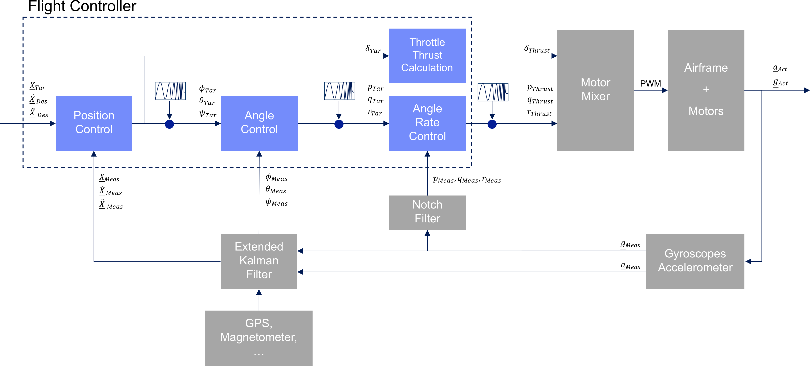
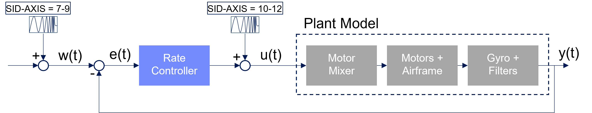
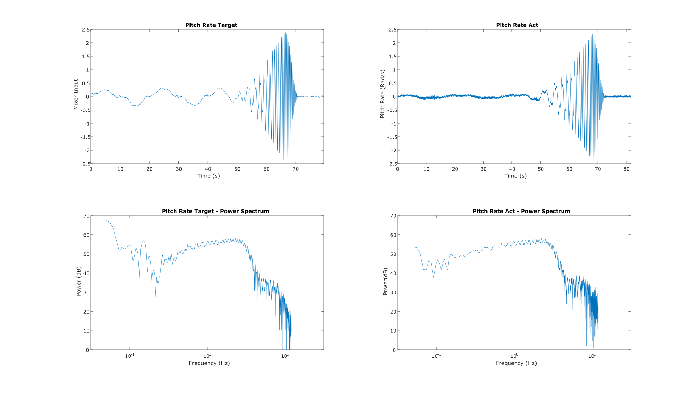
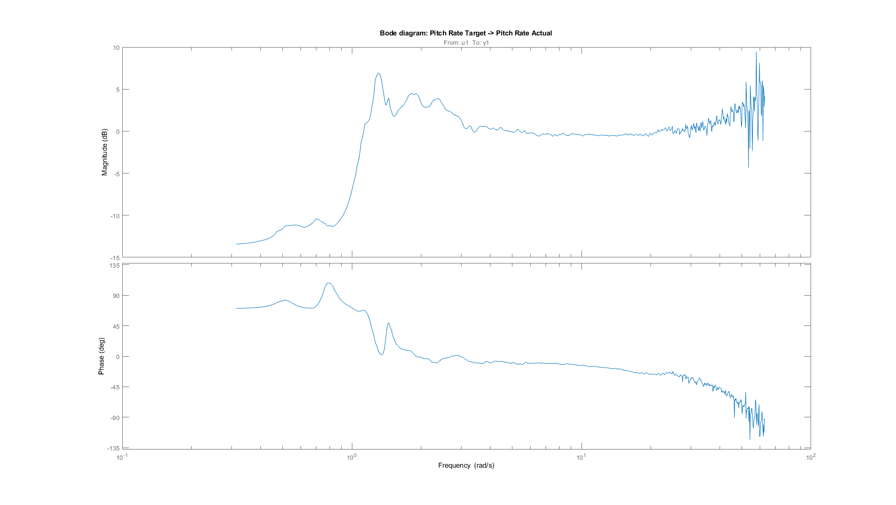
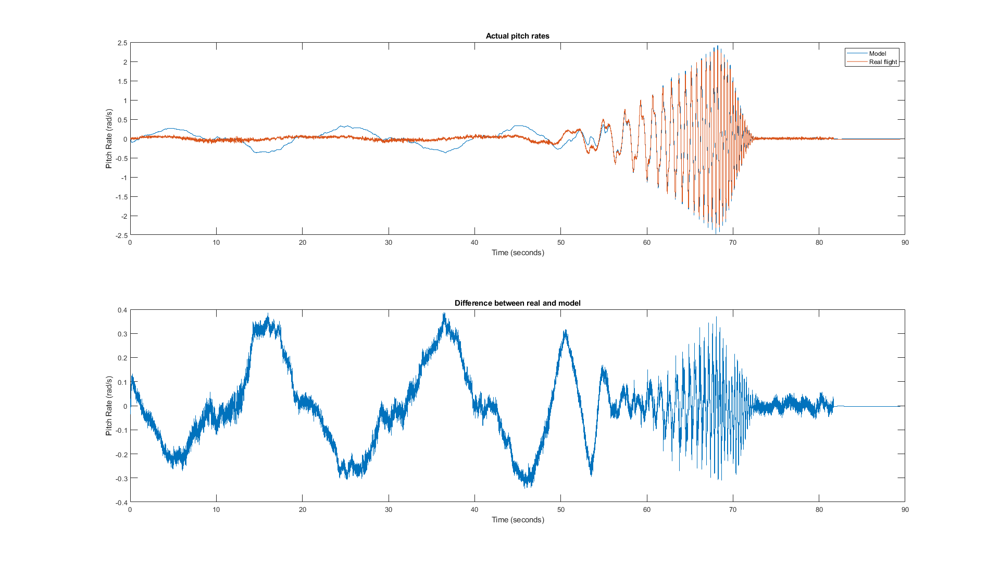

.. _systemid-mode-operation:

System ID Mode Operation
========================

System Identification Mode (SYSID mode)provides a rapid means to develop highly accurate flight
dynamics models using flight test data. These models generated by actual vehicle data can then be used for math-model validation and improvement (if one is already available), or they can replace the existing model entirely. Tuning of the control laws including simulation of the closed loop vehicle response can also be done.

Further, the models and associated control law analysis are invaluable to demonstrating
required stability metrics as part of airworthiness certifications.

This flight mode produces a data set of stimulus signals and measured responses that are recorded in the data flash log. These signals are injected and collected at specific parts of the autopilot depending on the purpose of the model being created. The injected signal ("chirp") propagates through the autopilot control structures until they are output to physical actuators that cause the vehicle to react to the injected signals. The frequency sweep and amplitude of the "chirp" can be set by parameters, as well as the injection point.

The vehicle's electrical/mechanical reactions are then monitored by the internal sensors of
the autopilot and logged. By recording the output of these sensors and comparing them to the stimulus
(injected "chirp" signals) the engineer can gain insight to the electrical/mechanical properties and
interactions of the aircraft.

Data Collection
===============

The data collection is initiated by switching to the System ID mode. Each time the mode is changed
to the System ID flight mode a new data collection is initiated. To change the amplitude of the
excitation the :ref:`SID_MAGNITUDE<SID_MAGNITUDE>` parameter can be tuned using the :ref:`Ch6 tuning knob<TUNE>` during the data collection.

The System ID mode provides these capabilities:

- Ensures there are effective safety measures to prevent the aircraft from entering an unsafe flight state due to the injected signals
- Provides a mechanism to choose where the excitation signal will be injected
- Activating the system identification process
- Implementation of a chirp-based stimulus signal that would include:

  - Amplitude
  - Start frequency
  - Stop frequency
  - Recording time
  - Fade in time
  - Fade out time

- Adjustment of the stimulus amplitude using the tuning knob
- Recording the data generated including:

  - Mixer input data
  - IMU output data

- Adjusting the sub sampling rate.

Logging
=======

System ID logging has been added to provide the required reference and IMU data. All system
identification data from each time loop is recorded at the same time and place in the data flash log
to ensure data is time synchronized. The new System ID gyro and acceleration measurement logs have been added to the SID log
message. These messages are the average gyro and acceleration measurements, since the lasts loop
time, taken directly from IMU without any additional filtering. These have been derived from the delta angles and delta velocities that feed into the EKF. The IMU chosen for this log is the same IMU
used to generate the attitude prediction in the angle control loops.

Parameters
==========

:ref:`SID_AXIS<SID_AXIS>` : Controls which axis and control loop injection point are being excited

Values: 0:None (prevents entry into mode and display of other mode parameters), 1:Input Roll Angle, 2:Input Pitch Angle, 3:Input Yaw Angle, 4:Recovery Roll Angle,
5:Recovery Pitch Angle, 6:Recovery Yaw Angle, 7:Rate Roll, 8:Rate Pitch, 9:Rate Yaw, 10:Mixer Roll,
11:Mixer Pitch, 12:Mixer Yaw, 13:Mixer Thrust

:ref:`SID_MAGNITUDE<SID_MAGNITUDE>` : System identification Chirp Magnitude. Depending on injection point, units will be in either deg, deg/s ,or 0-1 for mixer outputs. The magnitude can be changed in flight easily using the :ref:`tuning knob<TUNE>` using the 58 option.

:ref:`SID_F_START_HZ<SID_F_START_HZ>` : System identification Start Frequency. Range: 0.01-100 Hz

:ref:`SID_F_STOP_HZ<SID_F_STOP_HZ>` : Frequency at the end of the sweep. Range: 0.01-100 Hz

:ref:`SID_T_FADE_IN<SID_T_FADE_IN>` : Time to reach maximum amplitude of sweep. Range: 0-20 s

:ref:`SID_T_REC<SID_T_REC>` : System identification total sweep length. Range: 0-255 s

:ref:`SID_T_FADE_OUT<SID_T_FADE_OUT>` : Time to reach zero amplitude at the end of the sweep. Range: 0 to 5 s

.. image:: ../images/chirp.jpg

The logging rate is set by the ATTITUDE_FAST and ATTITUDE_MEDIUM bits in the :ref:`LOG_BITMASK<LOG_BITMASK>` . The rate of the logging is the
main loop frequency divided by a sub-sample factor.

+--------------+--------------+---------------+
|ATTITUDE_FAST | ATTITUDE_MED | RATE DIVIDER  |
+--------------+--------------+---------------+
| 1            |    1         | 1             |
+--------------+--------------+---------------+
| 1            |    0         | 2             |
+--------------+--------------+---------------+
| 0            |    1         | 4             |
+--------------+--------------+---------------+
| 0            |    0         | 8             |
+--------------+--------------+---------------+

Identification of a Multicopter
===============================
Description of the Approach
---------------------------

The Parameter :ref:`SID_AXIS<SID_AXIS>` of the system identification mode feeds in the frequency-sweep at different spots inside Ardupilot's controlers.
The locations of these injection points are shown in the following :ref:`figure<fig-ctrl-sys-ardupilot>` as small chirp symbols.
At each injection point, the sweep can be added to either the roll, pitch or yaw axis. 

:name: fig-ctrl-sys-ardupilot

For the purpose of obtaining a dynamic model of only the copter itself (aka plant model), it is first necessary to calculate a transfer function(s) between the control inputs of the copter and its measurable dynamic response.
In this case, the angular rate controller outputs (:math:`p_{Thrust}`, :math:`q_{Thrust}` and :math:`r_{Thrust}`) represent the control inputs of the copter whereas the gyroscope's measured angular rates represent the system response.
Since a common application of the created system model consists in optimizing the control parameters, the filtered gyroscope signals are used instead of the raw gyroscope data, as these are the direct inputs to the angular rate controller.
Thereby, the separate modelling of the filters becomes redundant, which makes it possible to directly connect a model of the angular rate controller to the plant model without any further effort.

:name: fig-rate-ctrl

The generation of flight data for the system identification is conducted during hovering flight.
Therefore, the three axes (namely roll, pitch and yaw) are considered as decoupled.
According to the :ref:`figure<fig-rate-ctrl>` shown above, which illustrates the general structure of the rate control loop independent of any specific control axis, it is possible to construct a transfer function for each axis:

.. math::

G_{Roll}(s) &= \frac{Y(s)_{Roll}}{U(s)_{Roll}} = p_{Meas}/p_{Thrust} \\
G_{Pitch}(s) &= \frac{Y(s)_{Pitch}}{U(s)_{Pitch}} = q_{Meas}/q_{Thrust} \\
G_{Yaw}(s) &= \frac{Y(s)_{Yaw}}{U(s)_{Yaw}} = r_{Meas}/r_{Thrust} \\

As the figure shows, the transfer function of each axis models the system consisting of the motor mixer, the motors, the airframe of the copter and the gyroscopes together with the filters.
Initially, the frequency-sweeps of :ref:`SID_AXIS<SID_AXIS>` 7-9 are used to inject the test signal at the input of the angular rate controller.
This enables the analysis of the closed-loop behaviour of the respective axis as well as the identification of the axis dynamic behaviour by using the PID controller output as excitation signal of the system.
The next section discusses the results of the presented approach.

Results for the Pitch Axis
-----------------------------------------

The approach described above has been performed for the pitch axis of a multicopter and the results are presented bellow.
The system identification flight was performed with the following settings:

+--------------------------------------+------------------+
| Parameter                            | Value            |
+--------------------------------------+------------------+
| :ref:`SID_AXIS<SID_AXIS>`            | 8                |
+--------------------------------------+------------------+
|:ref:`SID_MAGNITUDE<SID_MAGNITUDE>`   | 130 (deg/s)      |
+--------------------------------------+------------------+
|:ref:`SID_F_START_HZ<SID_F_START_HZ>` | 0.05 Hz          |
+--------------------------------------+------------------+
|:ref:`SID_F_START_HZ<SID_F_STOP_HZ>`  | 5 Hz             |
+--------------------------------------+------------------+
|:ref:`SID_T_FADE_OUT<SID_T_FADE_OUT>` | 0 s              |
+--------------------------------------+------------------+
|:ref:`SID_T_FADE_IN<SID_T_FADE_IN>`   | 5 s              |
+--------------------------------------+------------------+
| :ref:`SID_T_REC<SID_T_REC>`          | 70 s             |
+--------------------------------------+------------------+

The next :ref:`figure<fig-io-signals-axis8>` shows the recorded input (pitch rate target) and output (measured pitch rate) signals over time.
Below that, the power spectral densities of both signals are depicted, indicating how the power of the signal is distributed over the tested frequency range.
Examining the first 45 seconds of the test flight, it can clearly be observed that there is not much of a response on the pitch axis, as its rate stays almost constant around 0 rad/s.
Note that the initial frequency of the sweep (0.05 Hz) is hold for 40 seconds at the beginning of the test flight in order to run two full cycles with a low frequency.
With the increase of the frequency afterwards, the magnitude of the resulting pitch rate also rises.

:name: fig-io-signals-axis8

By estimating the :ref:`frequency-response<fig-freq-resp>` of the system and plotting the Bode diagram, the described behaviour above becomes clear.
For lower frequencies, the system response reacts with low amplitudes (magnitude decreases).
Normally, one would expect a (nearly) constant gain around 1 (0 dB) of the closed-loop transfer function for low frequency excitations and a decreasing magnitude for high frequences (which does not show in the diagram because the highest frequency of the frequency-sweep was 5 Hz).
It is probable that there is a systemic cause for this (undesirable) response of the closed-loop system, which could be a nonlinearity in the system or a high-pass filter that is applied to the gyro measurements and therefore attentuates pitch rates of low frequencies?

:name: fig-freq-resp-axis8

The next :ref:`figure<fig-io-signals-axis11>` shows the signals that were used for the system identification, consisting of the actual pitch rate as system output and the motor mixer input of the pitch axis (aka pitch rate pid output) as system input.
It is again observable that the system is merely reacting to an excitation at low frequencies.
Therefore, the supressing of amplitudes at low frequencies is probably not located in the PID controller, but in the system to be identified.

.. image:: ../images/PitchRateAxis11IdentificationIOSignals.png
:name: fig-io-signals-axis11

The actual identification was carried out in MATLAB with the help of the System Identification Toolbox.
The generation of the mentioned linear transfer function model was conducted in the frequency-domain, meaning that the frequency-response of the model was fitted to an estimated frequency-response of the system generated from the real-flight.
Afterwards, the generated transfer function was integrated in a Simulink model together with the PID controller of the pitch axis.
The simulation result is shown below.

:name: fig-comparison-model-realflight

Comparing the system response measured in the real flight and the output of the identified pitch axis model in :ref:`figure<fig-io-signals-axis11>` illustrates that the system behaviour can only be consistenly approximated at higher frequencies.
The differences between t=55s and t=80s are mainly caused by shifted phases, the amplitude is nearly the same.
At lower frequencies, the model output actually follows the target pitch rate shown :ref:`above´fig-io-signals-axis8>`, while the system response measured during the test flight does not alter in large amplitudes and mainly consists of noise.
It is important to note that the input and output signals had to be truncated in order to generate a model that leads to acceptable results.
To be precise, only the data from 55s till the end was used for the identification.
Therefore, the system response at frequencies that appeared ealier is the extrapolation of the frequency-response that was identified with the used data.
This indicates that there is some component or effect in the system, that has to be considered in the identification process in order to generate a linear model that is capable to reproduce the complete behaviour of the real system.
