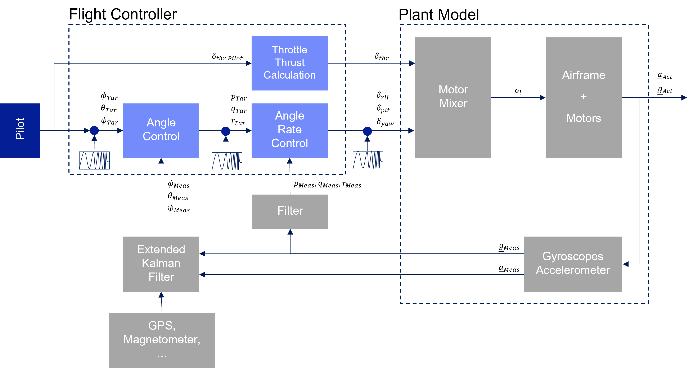
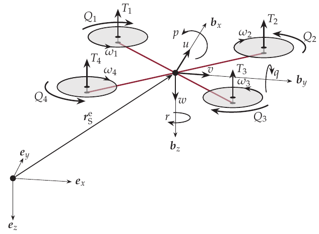
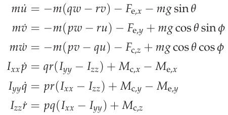
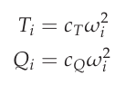
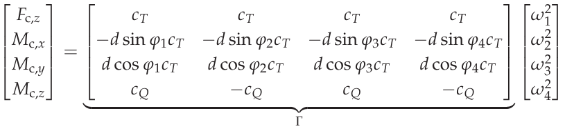
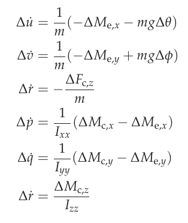
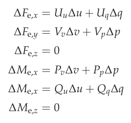
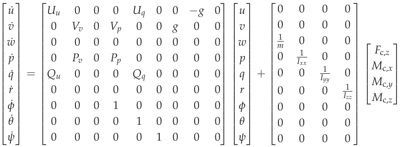
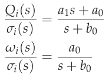
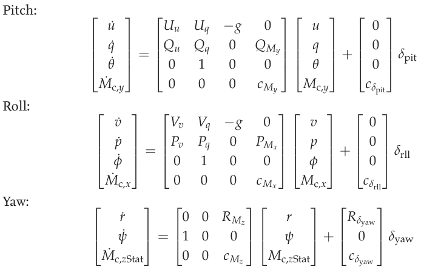

.. _systemid-mode-operation:

System ID Mode Operation
========================

System Identification Mode (SYSID mode)provides a rapid means to develop highly accurate flight
dynamics models using flight test data. These models generated by actual vehicle data can then be used for math-model validation and improvement (if one is already available), or they can replace the existing model entirely. Tuning of the control laws including simulation of the closed loop vehicle response can also be done.

Further, the models and associated control law analysis are invaluable to demonstrating
required stability metrics as part of airworthiness certifications.

This flight mode produces a data set of stimulus signals and measured responses that are recorded in the data flash log. These signals are injected and collected at specific parts of the autopilot depending on the purpose of the model being created. The injected signal ("chirp") propagates through the autopilot control structures until they are output to physical actuators that cause the vehicle to react to the injected signals. The frequency sweep and amplitude of the "chirp" can be set by parameters, as well as the injection point.

The vehicle's electrical/mechanical reactions are then monitored by the internal sensors of
the autopilot and logged. By recording the output of these sensors and comparing them to the stimulus
(injected "chirp" signals) the engineer can gain insight to the electrical/mechanical properties and
interactions of the aircraft.

Data Collection
===============

The data collection is initiated by switching to the System ID mode. Each time the mode is changed
to the System ID flight mode a new data collection is initiated. To change the amplitude of the
excitation the :ref:`SID_MAGNITUDE<SID_MAGNITUDE>` parameter can be tuned using the :ref:`Ch6 tuning knob<TUNE>` during the data collection.

The System ID mode provides these capabilities:

- Ensures there are effective safety measures to prevent the aircraft from entering an unsafe flight state due to the injected signals
- Provides a mechanism to choose where the excitation signal will be injected
- Activating the system identification process
- Implementation of a chirp-based stimulus signal that would include:

  - Amplitude
  - Start frequency
  - Stop frequency
  - Recording time
  - Fade in time
  - Fade out time

- Adjustment of the stimulus amplitude using the tuning knob
- Recording the data generated including:

  - Mixer input data
  - IMU output data

- Adjusting the sub sampling rate.

Logging
=======

System ID logging has been added to provide the required reference and IMU data. All system
identification data from each time loop is recorded at the same time and place in the data flash log
to ensure data is time synchronized. The new System ID gyro and acceleration measurement logs have been added to the SID log
message. These messages are the average gyro and acceleration measurements, since the lasts loop
time, taken directly from IMU without any additional filtering. These have been derived from the delta angles and delta velocities that feed into the EKF. The IMU chosen for this log is the same IMU
used to generate the attitude prediction in the angle control loops.

Parameters
==========

:ref:`SID_AXIS<SID_AXIS>` : Controls which axis and control loop injection point are being excited

Values: 0:None (prevents entry into mode and display of other mode parameters), 1:Input Roll Angle, 2:Input Pitch Angle, 3:Input Yaw Angle, 4:Recovery Roll Angle,
5:Recovery Pitch Angle, 6:Recovery Yaw Angle, 7:Rate Roll, 8:Rate Pitch, 9:Rate Yaw, 10:Mixer Roll,
11:Mixer Pitch, 12:Mixer Yaw, 13:Mixer Thrust

:ref:`SID_MAGNITUDE<SID_MAGNITUDE>` : System identification Chirp Magnitude. Depending on injection point, units will be in either deg, deg/s ,or 0-1 for mixer outputs. The magnitude can be changed in flight easily using the :ref:`tuning knob<TUNE>` using the 58 option.

:ref:`SID_F_START_HZ<SID_F_START_HZ>` : System identification Start Frequency. Range: 0.01-100 Hz

:ref:`SID_F_STOP_HZ<SID_F_STOP_HZ>` : Frequency at the end of the sweep. Range: 0.01-100 Hz

:ref:`SID_T_FADE_IN<SID_T_FADE_IN>` : Time to reach maximum amplitude of sweep. Range: 0-20 s

:ref:`SID_T_REC<SID_T_REC>` : System identification total sweep length. Range: 0-255 s

:ref:`SID_T_FADE_OUT<SID_T_FADE_OUT>` : Time to reach zero amplitude at the end of the sweep. Range: 0 to 5 s

.. image:: ../images/chirp.jpg

The logging rate is set by the ATTITUDE_FAST and ATTITUDE_MEDIUM bits in the :ref:`LOG_BITMASK<LOG_BITMASK>` . The rate of the logging is the
main loop frequency divided by a sub-sample factor.

+--------------+--------------+---------------+
|ATTITUDE_FAST | ATTITUDE_MED | RATE DIVIDER  |
+--------------+--------------+---------------+
| 1            |    1         | 1             |
+--------------+--------------+---------------+
| 1            |    0         | 2             |
+--------------+--------------+---------------+
| 0            |    1         | 4             |
+--------------+--------------+---------------+
| 0            |    0         | 8             |
+--------------+--------------+---------------+

Identification of a Multicopter
===============================
Model Scope
-------------------------------

The system and its components, that are included in the mathmatical model to be identified is shown in the following block diagram. It covers the motor mixer, the 
motors and ESCs as well as the airframe of the copter, the gyroscopes and their lowpass filters. 
The frequency sweep inputs 10-12 are used for the identification, since they provide a direct input to the regarded system. Because of this, the input signal is not 
directly influenced by the controllers compared to the other chirp inputs, thereby making it independent from the parameterization of the controller.

:name: fig-ctrl-sys-ardupilot

Model Structure
------------------------------

:name: fig-body-diagram

The Quadcopter model is based on its equations of motion. Looking at the Quadcopter as a rigid body, it has 6 degrees of freedom, consisting of three translational 
and three rotational motion. The :ref:`figure<fig-body-diagram>` above shows
a sketched Quadcopter during flight within the inertial, earth-fixed coordinate frame made up of the vectors (:math:`e_{x}`, :math:`e_{y}`, :math:`e_{z}`). The 
Quadcopter has its own coordinate system attached to its center of gravity, 
which is called body-fixed coordinate frame. Its axes are represented by the vectors (:math:`b_{x}`, :math:`b_{y}`, :math:`b_{z}`). The equations of motion within 
the body-fixed frame can be expressed as

:name: fig-eq-motion

where :math:`u`, :math:`v` and :math:`w` are the veolcities in :math:`b_{x}`, :math:`b_{y}`, :math:`b_{z}` direction respectively whereas :math:`p`, :math:`q`, 
:math:`r` represent the angular velocities about the :math:`x`, 
:math:`y` and :math:`z` axis of the body-frame respectively. :math:`F_{c}` and :math:`M_{c}` stand for the forces and torques acting on the airframe generated by 
the thrust :math:`T_i` and reaction torque :math:`Q_i` of the propellers. :math:`\phi` and :math:`\theta` represent the Euler angles, that describe the orientation 
of the copter within the earth-frame. Thrust and reaction torque can be calculated by the following equations

:name: fig-eq-thrust-torque

with :math:`\omega_i` being the propellers angular velocity and :math:`k_T` as well as :math:`k_Q` standing for constants dependant on the propeller geometry. 
Based on these two quantities, the created forces and torques by the propulsion system acting on the copter's airframe for a X-configuration can be written as

:name: fig-eq-force-torque-prop

where :math:`d` represents the arm length between the respecetive propeller and the airframe's center of gravity, while :math:`\varphi_i` stands for the angle of 
the propeller's arm in regard to the :math:`b_x` axis of the copter. :math:`\Gamma` is called the allocation matrix.
The other forces :math:`F_{e}` and torques :math:`M_{e}` represent external effects on the airframe which is mainly drag due to translational flight. Estimating 
their influence on the states of the system poses a highly relevant target for the identification.

Most of control system analysis are based linear systems. Because auf this, the equation of motion are linearized around the hover state by looking at small 
disturbances of the state variables and inputs from a stationary condition. 
As an example, the lateral velocity :math:`u` can then be expressed by its stationary condition :math:`u_0` and its perturbation :math:`\Delta u`

:name: fig-eq-small-pert-u

While hovering, the stationary condition of every state and input quantity is considered to be 0, since there is no translational or rotational motion of the 
copter. The equations of motion can then be simplified to

:name: fig-eq-motion-lin

Because of the linearization, the connections between the pitch, roll and yaw motions of the copter vanished, thereby yielding three decoupled systems. 
Next, the perturbations in each force and torque is modeled to obtain the influences of these system inputs on the state variables. By using a Taylor series 
expansion, the forces and torques can be described as a linear function of the disturbances in the state variables that they depend on. The coefficient of each 
state variable are the so-called stability or control derivatives of the respective force and torque.

:name: fig-eq-pert-forces-torques

By inserting these descriptions of forces and torques, the linearized equations of motion can be rewritten in a state-space represenation, with the control forces 
and torques generated by the propellers being the model input. Since only perturbed quantities are contained in the equations, the :math:`\Delta` indicating the 
small perturbations is left out.

:name: fig-eq-motion-lin

The actual control inputs of the system are the rate controller outputs as shown in the :ref:`control diagram<fig-ctrl-sys-ardupilot>`. Therefore, it is necessary 
to model the motors, thereby describing the transfer from controller outputs to control forces and torques that are acting on the airframe. Due to the motor mixer, 
the controller outputs are converted to thrust demands for each motor. The motors are not able to instantly realize this demand. Instead, they have their
own dynamic which need to be modelled. For this purpose, it is assumed that the relation between thrust demand and provided voltage to the motors by the ESC is 
proportional. The transfer from motor voltage to angular motor speed is modelled by a first-order system. Apart from that, it is necessary to model the relation 
between voltage and motor torque that equals the reaction torque of the propulsion unit :math:`Q_i`. The equation for :math:`Q_i` in this :ref:`equation<fig-eq-
thrust-torque>` only shows the stationary reaction torque of the propeller. The acceleration or deceleration of the motor leads to an additional, dynamic reaction 
torque due to the inertia of the motor. The transfer function can then be written as 

:name: fig-eq-motor-model

Next, it is assumed that the thrust demands of the motors are calculated from the controller outputs by inverting the :ref:`allocation matrix<fig-eq-force-
torque-prop>`

:name: fig-eq-ctrlout-thrstCmds

As a conseqence, the inverted matrix above and the :ref:`allocation matrix<fig-eq-force-torque-prop>` cancel each other out, 
thereby leaving the following four separated control paths: heave, roll, pitch and yaw. The motor dynamics are incorporated in these models by using the 
:ref:`transfer functions<fig-eq-motor-model>` as a relation between the controller outputs and the generated force or torque acting on 
the respective axis. To model this in a state-space representation, this adds the control forces and torques to the states of the systems. The state-sapce models 
for the roll, pitch and yaw axis can be formulated as

:name: fig-eq-axis-models

The used transfer function models of each axis can now be derived from the state-space models above through Laplace-Transformation and by solving for the angular 
velocities :math:`p`, :math:`q` and :math:`r` as the outputs of each model. For simplicity, generic coefficients
are used. Also, dead time terms are added to account for delays, that were not regarded in the modelling. These three transfer function represent the model 
structures used in the identification for the pitch, roll and yaw axes.

:name: fig-eq-axis-models-Tf

Identification Process
-----------------------------------------

To gather identification data, separate sysid test flights were conducted for the pitch, roll and yaw axis. Default parameters were used for the angle and rate 
controller. To prevent the rate controllers from compensating too much of the frequency-sweep signal, the integrator gain of each axis was set to zero. Apart from
that, the feedforward of the angle controller is disabled. The following table contains the settings of the system identification mode for each axis:

+--------------------------------------+--------------------------------------------------------+
| Parameter                            | Value                                                  |
|                                      +------------------+------------------+------------------+                                   
|                                      | Roll             | Pitch            | Yaw              |
+--------------------------------------+------------------+------------------+------------------+
| :ref:`SID_AXIS<SID_AXIS>`            | 10               | 11               | 12               |
+--------------------------------------+------------------+------------------+------------------+
|:ref:`SID_MAGNITUDE<SID_MAGNITUDE>`   | 0.15             | 0.15             | 0.55             |
+--------------------------------------+------------------+------------------+------------------+
|:ref:`SID_F_START_HZ<SID_F_START_HZ>` | 0.05 Hz          | 0.05 Hz          | 0.05 Hz          |
+--------------------------------------+------------------+------------------+------------------+
|:ref:`SID_F_START_HZ<SID_F_STOP_HZ>`  | 5 Hz             | 5 Hz             | 5 Hz             |
+--------------------------------------+------------------+------------------+------------------+
|:ref:`SID_T_FADE_OUT<SID_T_FADE_OUT>` | 5 s              | 5 s              | 5 s              |
+--------------------------------------+------------------+------------------+------------------+
|:ref:`SID_T_FADE_IN<SID_T_FADE_IN>`   | 5 s              | 5 s              | 5 s              |
+--------------------------------------+------------------+------------------+------------------+
| :ref:`SID_T_REC<SID_T_REC>`          | 130 s            | 130 s            | 130 s            |
+--------------------------------------+------------------+------------------+------------------+
