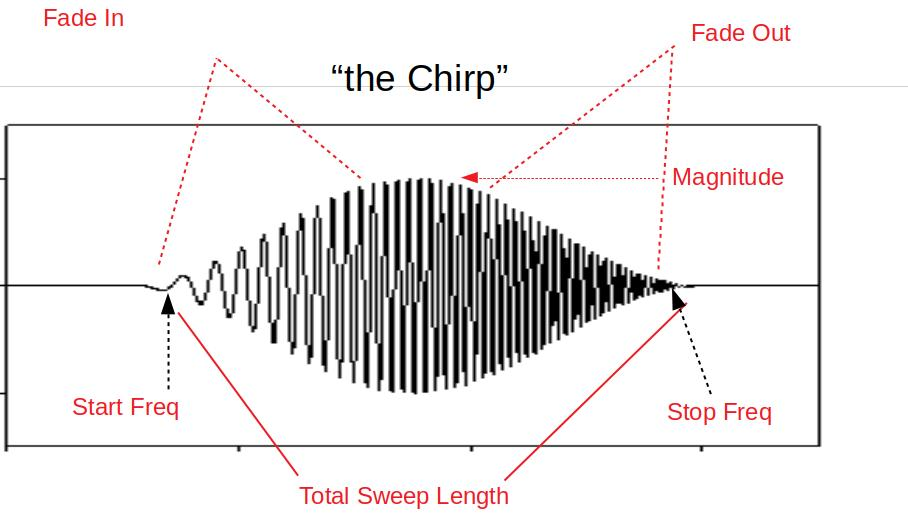

.. _systemid-mode-operation:

System ID Mode Operation
========================

System Identification Mode (SYSID mode)provides a rapid means to develop highly accurate flight
dynamics models using flight test data. These models generated by actual vehicle data can then be used for math-model validation and improvement (if one is already available), or they can replace the existing model entirely. Tuning of the control laws including simulation of the closed loop vehicle response can also be done.

Further, the models and associated control law analysis are invaluable to demonstrating
required stability metrics as part of airworthiness certifications.

This flight mode produces a data set of stimulus signals and measured responses that are recorded in the data flash log. These signals are injected and collected at specific parts of the autopilot depending on the purpose of the model being created. The injected signal ("chirp") propagates through the autopilot control structures until they are output to physical actuators that cause the vehicle to react to the injected signals. The frequency sweep and amplitude of the "chirp" can be set by parameters, as well as the injection point.

The vehicle's electrical/mechanical reactions are then monitored by the internal sensors of
the autopilot and logged. By recording the output of these sensors and comparing them to the stimulus
(injected "chirp" signals) the engineer can gain insight to the electrical/mechanical properties and
interactions of the aircraft.

Data Collection
===============

The data collection is initiated by switching to the System ID mode. Each time the mode is changed
to the System ID flight mode a new data collection is initiated. To change the amplitude of the
excitation the :ref:`SID_MAGNITUDE<SID_MAGNITUDE>` parameter can be tuned using the :ref:`Ch6 tuning knob<TUNE>` during the data collection.

The System ID mode provides these capabilities:

- Ensures there are effective safety measures to prevent the aircraft from entering an unsafe flight state due to the injected signals
- Provides a mechanism to choose where the excitation signal will be injected
- Activating the system identification process
- Implementation of a chirp-based stimulus signal that would include:

  - Amplitude
  - Start frequency
  - Stop frequency
  - Recording time
  - Fade in time
  - Fade out time

- Adjustment of the stimulus amplitude using the tuning knob
- Recording the data generated including:

  - Mixer input data
  - IMU output data

- Adjusting the sub sampling rate.

Logging
=======

System ID logging has been added to provide the required reference and IMU data. All system
identification data from each time loop is recorded at the same time and place in the data flash log
to ensure data is time synchronized. The new System ID gyro and acceleration measurement logs have been added to the SID log
message. These messages are the average gyro and acceleration measurements, since the lasts loop
time, taken directly from IMU without any additional filtering. These have been derived from the delta angles and delta velocities that feed into the EKF. The IMU chosen for this log is the same IMU
used to generate the attitude prediction in the angle control loops.

Parameters
==========

:ref:`SID_AXIS<SID_AXIS>` : Controls which axis and controll loop injection point are being excited

Values: 0:None (prevents entry into mode and display of other mode parameters), 1:Input Roll Angle, 2:Input Pitch Angle, 3:Input Yaw Angle, 4:Recovery Roll Angle,
5:Recovery Pitch Angle, 6:Recovery Yaw Angle, 7:Rate Roll, 8:Rate Pitch, 9:Rate Yaw, 10:Mixer Roll,
11:Mixer Pitch, 12:Mixer Yaw, 13:Mixer Thrust

:ref:`SID_MAGNITUDE<SID_MAGNITUDE>` : System identification Chirp Magnitude. Depending on injection point, units will be in either deg, deg/s ,or 0-1 for mixer outputs. The magnitude can be changed in flight easily using the :ref:`tuning knob<TUNE>` using the 58 option.

:ref:`SID_F_START_HZ<SID_F_START_HZ>` : System identification Start Frequency. Range: 0.01-100 Hz

:ref:`SID_F_STOP_HZ<SID_F_STOP_HZ>` : Frequency at the end of the sweep. Range: 0.01-100 Hz

:ref:`SID_T_FADE_IN<SID_T_FADE_IN>` : Time to reach maximum amplitude of sweep. Range: 0-20 s

:ref:`SID_T_REC<SID_T_REC>` : System identification total sweep length. Range: 0-255 s

:ref:`SID_T_FADE_OUT<SID_T_FADE_OUT>` : Time to reach zero amplitude at the end of the sweep. Range: 0 to 5 s

The logging rate is set by the ATTITUDE_FAST and ATTITUDE_MEDIUM bits in the :ref:`LOG_BITMASK<LOG_BITMASK>` . The rate of the logging is the
main loop frequency divided by a sub-sample factor.

+--------------+--------------+---------------+
|ATTITUDE_FAST | ATTITUDE_MED | RATE DIVIDER  |
+--------------+--------------+---------------+
| 1            |    1         | 1             |
+--------------+--------------+---------------+
| 1            |    0         | 2             |
+--------------+--------------+---------------+
| 0            |    1         | 4             |
+--------------+--------------+---------------+
| 0            |    0         | 8             |
+--------------+--------------+---------------+

