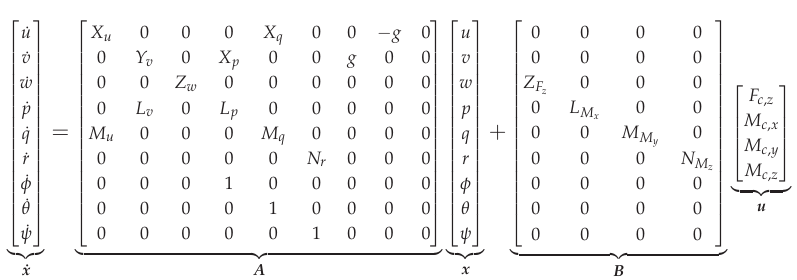

.. _systemid-mode-operation:

.. contents::

System ID Mode Operation
========================

System Identification Mode (SYSID mode) provides a rapid means to develop highly accurate flight dynamics models (also known as Digital Twin) using flight test data.
These models generated by actual vehicle data can then be used for math-model validation and improvement (if one is already available), or they can replace the existing model entirely.
Tuning of the control laws including simulation of the closed-loop vehicle response can also be done.

The models and associated control law analysis are invaluable in demonstrating
required stability metrics as part of airworthiness certifications.

This flight mode produces a data set of stimulus (excitation) signals and measured responses that are recorded in the data flash log.
These signals are injected and collected at specific parts of the autopilot depending on the purpose of the model being created.
The injected signal ("chirp") propagates through the autopilot control structures until they are output to physical actuators that cause the vehicle to react to the injected signals.
The frequency sweep and amplitude of the "chirp" can be set by parameters, as well as the injection point.

The vehicle's electrical/mechanical reactions are then monitored by the internal sensors of the autopilot and logged.
By recording the output of these sensors and comparing them to the stimulus (injected "chirp" signals)
the engineer can gain insight into the electrical/mechanical properties and interactions of the aircraft.

Data Collection
===============

The data collection is initiated by switching to the System ID mode.
Each time the mode is changed to the System ID flight mode a new data collection is initiated.
To change the amplitude of the excitation the :ref:`SID_MAGNITUDE<SID_MAGNITUDE>` parameter can be tuned using the :ref:`Ch6 tuning knob<TUNE>` during the data collection.

The System ID mode provides these capabilities:

- Ensures there are effective safety measures to prevent the aircraft from entering an unsafe flight state due to the injected signals
- Provides a mechanism to choose where the excitation signal will be injected
- Activating the system identification process
- Implementation of a chirp-based stimulus signal that would include:

  - Amplitude
  - Start frequency
  - Stop frequency
  - Recording time
  - Fade in time
  - Fade out time

- Adjustment of the stimulus amplitude using the tuning knob
- Recording the data generated including:

  - Mixer input data
  - IMU output data

- Adjusting the sub sampling rate.

Logging
=======

System ID data logging provides the required reference and IMU data.
All system identification data from each time loop is recorded at the same time and placed in the data flash log to ensure data is time synchronized.
The new System ID gyro and acceleration measurement logs have been added to the SID log message.
These messages are the average gyro and acceleration measurements since the last loop time, taken directly from IMU without any additional filtering.
These have been derived from the delta angles and delta velocities that feed into the EKF.
The IMU chosen for this log is the same IMU used to generate the attitude prediction in the angle control loops.

Parameters
==========

:ref:`SID_AXIS<SID_AXIS>`: Controls which axis and control loop injection point are being excited

Values: 0:None (prevents entry into mode and display of other mode parameters), 1:Input Roll Angle, 2:Input Pitch Angle, 3:Input Yaw Angle, 4:Recovery Roll Angle,
5:Recovery Pitch Angle, 6:Recovery Yaw Angle, 7:Rate Roll, 8:Rate Pitch, 9:Rate Yaw, 10:Mixer Roll,
11:Mixer Pitch, 12:Mixer Yaw, 13:Mixer Thrust

:ref:`SID_MAGNITUDE<SID_MAGNITUDE>`: System identification Chirp Magnitude. Depending on the injection point, units will be in either deg, deg/s, or 0-1 for mixer outputs. The magnitude can be changed in flight easily using the :ref:`tuning knob<TUNE>` using the 58 option.

:ref:`SID_F_START_HZ<SID_F_START_HZ>`: System identification Start Frequency. Range: 0.01-100 Hz

:ref:`SID_F_STOP_HZ<SID_F_STOP_HZ>`: Frequency at the end of the sweep. Range: 0.01-100 Hz

:ref:`SID_T_FADE_IN<SID_T_FADE_IN>`: Time to reach the maximum amplitude of sweep. Range: 0-20 s

:ref:`SID_T_REC<SID_T_REC>`: System identification total sweep length. Range: 0-255 s

:ref:`SID_T_FADE_OUT<SID_T_FADE_OUT>`: Time to reach zero amplitude at the end of the sweep. Range: 0 to 5 s

.. figure:: ../images/chirp.jpg

The logging rate is set by the ATTITUDE_FAST and ATTITUDE_MEDIUM bits in the :ref:`LOG_BITMASK<LOG_BITMASK>`. The rate of logging is the
main loop frequency divided by a sub-sample factor.

+--------------+--------------+---------------+
|ATTITUDE_FAST | ATTITUDE_MED | RATE DIVIDER  |
+--------------+--------------+---------------+
| 1            |    1         | 1             |
+--------------+--------------+---------------+
| 1            |    0         | 2             |
+--------------+--------------+---------------+
| 0            |    1         | 4             |
+--------------+--------------+---------------+
| 0            |    0         | 8             |
+--------------+--------------+---------------+

The next figure depicts the :ref:`SID_AXIS<SID_AXIS>` injection points in yellow and some details of the most inner PID loops when :ref:`ATC_RATE_FF_ENAB<ATC_RATE_FF_ENAB>` == 0.

ArduCopter control loops with ATC_RATE_FF_ENAB=0

The next figure depicts the :ref:`SID_AXIS<SID_AXIS>` injection points in yellow and some details of the most inner PID loops when :ref:`ATC_RATE_FF_ENAB<ATC_RATE_FF_ENAB>` == 1.

ArduCopter control loops with ATC_RATE_FF_ENAB=1

Identification of a Multicopter
===============================

Model Scope
-----------

The following block diagram depicts the complete vehicle control system and its components.
System identification will create a mathematical model of the motor mixer, the motors and the electronic speed controllers (ESCs) as well as the airframe of the copter.
This mathematical model is known as the plant model in control literature.
The frequency sweep inputs :ref:`SID_AXIS<SID_AXIS>` [10, 11, 12] are used for the identification since they provide direct input to the regarded system by superimposing the Mixer inputs :math:`\delta_{rll}`, :math:`\delta_{pit}` and :math:`\delta_{yaw}` with the stimulus signal.
These inputs are less modified by the controllers when compared to the other chirp inputs.
The input control signal of the plant must be persistently excited, which means that the chirp is not canceled out by the controller.
The magnitude of the chirp signal must be chosen accordingly.
This ensures that the waveforms at the inputs of the plant model are mostly chirp-like.
With the default controller parameters, which are quite low, the magnitude of the rate controller outputs is relatively low.

.. _control_system_diagram:

ArduPilot Control System

Model Structure
---------------

Quad Body Diagram

The quadcopter model is based on its equations of motion.
Looking at the quadcopter as a rigid body, it has 6 degrees of freedom, consisting of three translational and three rotational motions.
The image above shows a sketched quadcopter during flight within the inertial, earth-fixed coordinate frame made up of the vectors (:math:`e_{x}`, :math:`e_{y}`, :math:`e_{z}`).
The Quadcopter has its own coordinate system attached to its center of gravity, which is called the body-fixed coordinate frame.
Its axes are represented by the vectors (:math:`b_{x}`, :math:`b_{y}`, :math:`b_{z}`). [#f1]_
The equations of motion within the body-fixed frame can be expressed as

Equations of motion

where :math:`u`, :math:`v` and :math:`w` are the velocities in :math:`b_{x}`, :math:`b_{y}`, :math:`b_{z}` direction respectively, whereas :math:`p`, :math:`q`,
:math:`r` represent the angular velocities about the :math:`x`, :math:`y` and :math:`z` axis of the body-frame.
The variables :math:`X`, :math:`Y`, :math:`Z` and :math:`L`, :math:`M`, :math:`N` represent forces and torques acting on the airframe due to thrust :math:`T_i` and reaction torque :math:`Q_i` generated by the propellers as well as external forces and moments caused by air resistance and wind. [#f2]_
:math:`\phi` and :math:`\theta` are the Euler angles, that describe the orientation of the copter within the earth-frame. Thrust and reaction torque can be calculated by the following equations

.. _fig_eq_thrust_torque:

Thrust reaction torque equations

with :math:`\omega_i` being the propeller's angular velocity and :math:`C_T` as well as :math:`C_Q` standing for constants dependent on the propeller geometry.
Based on these two quantities, the created forces and torques by the propulsion system acting on the copter's airframe for an X-configuration can be written as

.. _fig-eq-force-torque-prop:

Force torque allocation matrix

where :math:`d` represents the arm length between the respective propeller and the airframe's center of gravity, while :math:`\varphi_i` stands for the angle of the propeller's arm in regard to the :math:`b_x` axis of the copter. [#f3]_
:math:`\Gamma` is called the allocation matrix.

These equations are non-linear, interdependent and hard to use.
Most control system analysis and tools are based on simpler linear or linearized systems.
Because of this, the equations of motion are linearized around the stationary hover state by looking at small disturbances of the state variables and inputs.
This assumes that the parameter :ref:`MOT_THST_EXPO<MOT_THST_EXPO>` has been :ref:`set correctly<motor-thrust-scaling>`.

As an example, the lateral velocity :math:`u` can then be expressed by its stationary condition :math:`u_0` and its perturbation :math:`\Delta u`

Small perturbation equation

While hovering, the stationary condition of every state and input quantity is 0, since there is no translational or rotational motion of the vehicle. [#f4]_
The equations of motion can then be simplified to

Linearized motion equations

This linearization removes the interdependencies between the pitch, roll and yaw motions of the copter, thereby yielding three decoupled systems.
Next, the perturbations in each force and torque are modeled to obtain the influences of these system inputs on the state variables.
By using a Taylor series expansion, the forces and torques are described as a linear function of the disturbances in the state and input variables that they depend on.
The coefficients of each state variable are the so-called stability or control derivatives of the respective force and torque. [#f4]_ [#f5]_

Perturbed forces torque equations

By inserting these descriptions of forces and torques, the linearized equations of motion are rewritten in a state-space representation,
with the control forces :math:`F_{c}` and torques :math:`M_{c}` generated by the propellers being the model inputs.
Since only perturbed quantities are contained in the equations, the :math:`\Delta` indicating the small perturbations is left out.

The actual control inputs of the system are the rate controller outputs as shown in the :ref:`Control System Diagram<control_system_diagram>`.
The motor mixer converts the controller outputs to thrust demands for each motor.
The motor model describes the transfer function from mixer outputs to control forces and torques that are acting on the airframe.
The motors are not able to instantly realize the mixer demands.
Instead, they have their own dynamic which needs to be modeled.
For this purpose, it is assumed that the relation between thrust demand and provided voltage to the motors by the ESC is proportional.
The transfer from motor voltage to angular motor speed is modeled by a first-order system. [#f2]_
Apart from that, it is necessary to model the relation between voltage and motor torque that equals the reaction torque of the propulsion unit :math:`Q_i`.
The equation for :math:`Q_i` in the :ref:`Thrust reaction torque equations<fig_eq_thrust_torque>` only models the stationary reaction torque of the propeller.
The acceleration or deceleration of the motor leads to an additional, dynamic reaction torque due to the inertia of the motor. [#f3]_
The transfer function can then be written as

.. _fig-eq-motor-model:

Motor model transfer functions

The thrust demands of the motors are calculated from the controller outputs by inverting the :ref:`allocation matrix<fig-eq-force-torque-prop>` [#f9]_

Control outputs to thrust commands

As a consequence, the inverted matrix above and the :ref:`allocation matrix<fig-eq-force-torque-prop>` cancel each other out,
thereby leaving the following four separate control paths: heave, roll, pitch and yaw.
The motor dynamics are incorporated in these models by using the :ref:`transfer functions<fig-eq-motor-model>` as a relation between
the controller outputs and the generated force or torque acting on the respective axis.
To model this in a state-space representation, control forces and torques are added to the states of the system. [#f6]_
The state-space models for the roll, pitch and yaw axis are formulated as

Axis models

The used transfer function model of each axis is derived from the state-space models above through Laplace-Transformation and
by solving for the angular velocities :math:`p`, :math:`q` and :math:`r` as the outputs of each model.
For simplicity, generic coefficients are used.
Also, dead time terms are added to account for delays, that were not regarded in the modeling. [#f6]_
These three transfer functions represent the model structures used in the identification of the pitch, roll and yaw axes.

.. _fig-eq-axis-models-tf:

Axis models transfer function equations

Example of Identification Process
---------------------------------

To gather identification data, separate sysid test flights are to be conducted for the pitch, roll and yaw axis.
This process is mostly independent of the vehicle PID tuning and can be performed in an un-tuned vehicle.
But the tune must be stable enough to fly the vehicle safely.
So the :ref:`Tuning Process Instructions<tuning-process-instructions>` must be first followed step-by-step but the autotune step can be skipped.
In the example presented in this section default parameters were used for the angle and rate controller.
To prevent the rate controllers from compensating too much of the frequency-sweep signal,
the integrator gain of each axis must be set to zero and the feed-forward of the angle controller disabled:

+---------------------------------------------------------------+------------------------------+
| Parameter                                                     | Value                        |
+---------------------------------------------------------------+------------------------------+
| :ref:`ATC_RAT_RLL_I<ATC_RAT_RLL_I__AC_AttitudeControl_Multi>` | 0                            |
+---------------------------------------------------------------+------------------------------+
| :ref:`ATC_RAT_PIT_I<ATC_RAT_PIT_I__AC_AttitudeControl_Multi>` | 0                            |
+---------------------------------------------------------------+------------------------------+
| :ref:`ATC_RAT_YAW_I<ATC_RAT_YAW_I__AC_AttitudeControl_Multi>` | 0                            |
+---------------------------------------------------------------+------------------------------+
| :ref:`ATC_RATE_FF_ENAB<ATC_RATE_FF_ENAB>`                     | 0                            |
+---------------------------------------------------------------+------------------------------+

Please make sure that the vehicle is stable after performing these changes, and selectively revert them if not.

In this section, the results for a relatively small quadcopter are presented.
It weighs 1.5 kg, has an arm length of 22 cm and is equipped with 9-inch propellers.
The following table contains the settings of the system identification mode for each axis:

+--------------------------------------+--------------------------------------------------------+
| Parameter                            | Value                                                  |
|                                      +------------------+------------------+------------------+
|                                      | Roll             | Pitch            | Yaw              |
+--------------------------------------+------------------+------------------+------------------+
|:ref:`SID_AXIS<SID_AXIS>`             | 10               | 11               | 12               |
+--------------------------------------+------------------+------------------+------------------+
|:ref:`SID_MAGNITUDE<SID_MAGNITUDE>`   | 0.15             | 0.15             | 0.55             |
+--------------------------------------+------------------+------------------+------------------+
|:ref:`SID_F_START_HZ<SID_F_START_HZ>` | 0.05 Hz          | 0.05 Hz          | 0.05 Hz          |
+--------------------------------------+------------------+------------------+------------------+
|:ref:`SID_F_STOP_HZ<SID_F_STOP_HZ>`   | 5 Hz             | 5 Hz             | 5 Hz             |
+--------------------------------------+------------------+------------------+------------------+
|:ref:`SID_T_FADE_IN<SID_T_FADE_IN>`   | 5 s              | 5 s              | 5 s              |
+--------------------------------------+------------------+------------------+------------------+
|:ref:`SID_T_FADE_OUT<SID_T_FADE_OUT>` | 5 s              | 5 s              | 5 s              |
+--------------------------------------+------------------+------------------+------------------+
| :ref:`SID_T_REC<SID_T_REC>`          | 130 s            | 130 s            | 130 s            |
+--------------------------------------+------------------+------------------+------------------+

Change these values according to the dynamic of your own vehicle.
The frequency range was chosen based on literature [#f6]_ [#f10]_ and flight tests.
If using a heavier and/or larger system, it may be necessary to use lower frequencies to excite the desired dynamics.
If using a lighter and/or smaller system, it may be necessary to use higher frequencies.

Dataflash logs are used to obtain the flight data.
For the rate controller outputs the signals ``RATE.ROut``, ``RATE.POut`` and ``RATE.YOut`` are used.
The signals ``SIDD.Gx``, ``SIDD.Gy`` and ``SIDD.Gz`` correspond to the measured angular rates of the copter.

The following figures show the injected frequency-sweep and the resulting control input of the plant, which is the sum of the sweep and the rate controller output.
The plots for the roll and pitch axis show a reduction of the system excitation especially in the range of medium frequency.
The reason for the sweep attenuation is the amplified controller output due to the larger magnitude of the system response (see :ref:`roll response<fig-bode-data-rll>` and :ref:`pitch response<fig-bode-data-pit>`).
Although attenuated, the system excitation is still large enough to obtain a reliable frequency response with a sufficiently high coherence as shown below.

Roll sweep plant input

Pitch sweep plant input

Yaw sweep plant input

The frequency response of each axis is obtained through spectral analysis of the flight data.
Only test flights with sufficient coherence between input and output are used for the system identification.
To increase the accuracy of the resulting plant model and to compensate for process errors, multiple flights for each axis are performed and an averaged frequency response is computed.
The following diagrams show the data-based frequency responses of all three axes.
The bottom plot shows the coherence between input and output which quantifies the linearity between input and output.

.. _fig-bode-data-rll:

Roll Bode plot

.. _fig-bode-data-pit:

Pitch Bode plot

Yaw Bode plot

The composite frequency responses are used to determine the parameters of the :ref:`transfer function models<fig-eq-axis-models-Tf>`.
The parameters of the plant model transfer functions are optimized to maximize their fit to the collected real-world data frequency responses.
The result is shown in the following three figures.

Roll transfer function

Pitch transfer function

.. figure:: ../images/bode_tf_yaw.png

Yaw transfer function

The derived transfer function models are as follows:

Axis models transfer functions

Example of Identification Results and Model Verification
--------------------------------------------------------

The system of a quadcopter is inherently unstable.
Slight modeling errors or unconsidered external inputs of the real system lead to divergence of the axis models [#f7]_.
Since a model does never fully reproduce the behavior of the real system, the model validation is conducted in closed-loop with the same stabilize controller used during the test flights.
For the validation test runs, the closed-loop model is given the same input signals that were given to the real system, which are the references for the stabilize controller (desired angle or rate in case of the yaw axis).
The outputs of the models, namely the angular rates, are then compared to the measured system outputs during real flight.
First, it is examined if the models reproduce the test signals, i.e. the frequency-sweeps.
The desired angles of the stabilize controller are set to zero and the sweeps are directly added to the output of the rate controllers.

In this chapter, the results for a relatively small quadcopter are presented.
It weighs 1.5 kg, has an arm length of 22 cm and is equipped with 9-inch propellers.
As seen in the following three figures, each model is capable of reproducing the measured angular rates.

Roll axis model validation sweep

Pitch axis model validation sweep

Yaw axis model validation sweep

Since the frequency-sweeps are used for the identification, it is important to test the models against another test signal to check for their robustness.
A widely recommended verification signal is the so-called doublet maneuver which is a double step [#f8]_.
For time-domain validation, a similar signal is used as the input of the stabilize controller.
As shown in the following figure, it consists of two consecutive doublet maneuvers.

Model validation doublet

The next three figures contain the angular rates of the axis models compared to the measured ones during the validation flights.
Due to the high fitting between model outputs and measured angular rates, the fidelity of the models is seen as satisfactory.

Roll axis model validation angle rates

Pitch axis model validation angle rates

Yaw axis model validation angle rates

How to optimize the PIDs once a vehicle model is available
----------------------------------------------------------

In the sections above an analytical mathematical model of a multicopter was derived and validated.
That model can be used to optimize ArduCopter's PID parameters.
One example of such an optimization process is shown in `this ArduPilot blog post <https://discuss.ardupilot.org/t/analytical-multicopter-flight-controller-pid-optimization/109759>`__.

.. rubric:: References
.. [#f1] Teodor Tomic: "Model-Based Control of Flying Robots for Robust Interaction under Wind Influence", Hannover: Gottfried Wilhelm Leibniz Universität Hannover, 2018.
.. [#f2] Gabriele Perozzi et al.: "Trajectory Tracking for a quadrotor under wind perturbations: sliding mode control with state-dependent gains", 2018.
.. [#f3] Quan Quan: "Introduction to Multicopter Design and Control", Singapore: Springer Singapore, 2017.
.. [#f4] Wei Wei: "Development of an Effective System Identification and Control Capability for Quadcopter UAVs", Cincinnati: University of Cincinnati, 2015.
.. [#f5] Brijesh Raghavan and N. Ananthkrishnan: "Small-Perturbation Analysis of Airplane Dynamics with Dynamic Stability Derivatives Redefined", Blacksburg: Virginia Polytechnic Institute and State University, 2005.
.. [#f6] Sung H. Cho et al.: "System Identification and Controller Optimization of a Coaxial Quadrotor UAV in Hover", AIAA Scitech Forum, 2019.
.. [#f7] Philipp Niermeyer, Thomas Raffler and Florian Holzapfel: "Open-Loop Quadcopter Flight Dynamics Identification in Frequency Domain via Closed-Loop Flight Testing", München: Technische Universität München, 2015.
.. [#f8] Mark B. Tischler, Robert K. Remple: "Aircraft and Rotorcraft System Identification", 2006.
.. [#f9] Robert Mahony, Vijay Kumar and Peter Corke: "Multirotor Aerial Vehicles: Modeling, Estimation, and Control of Quadrotor", IEEE Robotics & Automation Magazine, 2012.
.. [#f10] Yuksek, B., Saldiran, E., Cetin, A., Yeniceri, R. & Inalhan, G.: „System Identification and Model-Based Flight Control System Design for an Agile Maneuvering Quadrotor Platform“. In: AIAA SciTech 2020 Forum, S. 1835., 2020.
