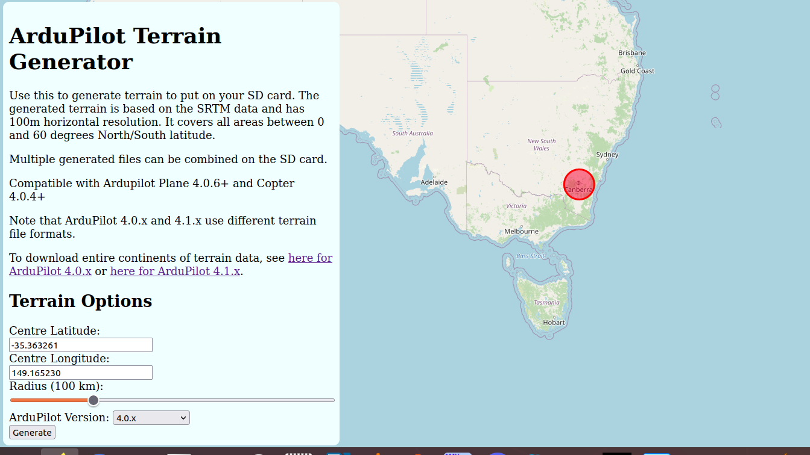

.. _terrain-following:

========================================
Terrain Following (in Auto, Guided, etc)
========================================

Copter 3.4 (and higher) support "terrain following" in nearly all modes including autonomous modes like :ref:`AUTO <auto-mode>`, :ref:`Guided <ac2_guidedmode>`, :ref:`RTL <rtl-mode>` and :ref:`Land <land-mode>`.  This feature allows the vehicle to climb or descend to maintain a specified distance above the terrain using either a :ref:`downward facing Lidar or Sonar <common-rangefinder-landingpage>` or from `SRTM <https://en.wikipedia.org/wiki/Shuttle_Radar_Topography_Mission>`__ data (aka terrain altitude data) provided by the ground station using a mapping service such as Google maps.  Details of how the SRTM data is used can be found on the :ref:`plane terrain following page <plane:common-terrain-following>`

..  youtube:: mT67QOAxuG8
    :width: 100%
    
See :ref:`common-understanding-altitude` for altitude definitions.    

.. note::

   :ref:`Loiter <loiter-mode>`, :ref:`PosHold <poshold-mode>` and :ref:`AltHold <altholdmode>` modes also support low altitude terrain following, called Surface Tracking.  Please refer to the :ref:`Surface Tracking <terrain-following-manual-modes>` wiki page.

Setting up a Mission to use Terrain data
========================================
-  If relying on a :ref:`downward facing LIDAR ensure it is setup as described here <common-rangefinder-landingpage>`
-  If using GCS provided terrain data set the :ref:`TERRAIN_ENABLE <TERRAIN_ENABLE>` parameter to 1
-  Using a recent version of Mission Planner (or other GCS that supports terrain following) on the Flight Plan screen, set the altitude type to "Terrain".  Once set all mission commands that include an "Alt" fields will be interpreted as altitudes-above-terrain.
-  Upload the mission to the vehicle and execute the mission as you normally would in :ref:`AUTO <auto-mode>`

   .. image:: ../images/terrain_mission.png
       :target: ../_images/terrain_mission.png
       :width: 500px

.. warning::

    Do not set the :ref:`EK2_ALT_SOURCE <EK2_ALT_SOURCE>` or ``EK3_ALT_SOURCE`` parameters.  These parameters should be left at "0" (barometer).

    Do not set the :ref:`EK2_RNG_USE_HGT <EK2_RNG_USE_HGT>`  or :ref:`EK3_RNG_USE_HGT <EK3_RNG_USE_HGT>` parameters.  These parameters should be left at "-1".

Sources of Terrain Data
=======================

The ground station is normally responsible for providing the raw terrain data which is sent to the aircraft via MAVLink. Right now only Mission Planner and MAVProxy support the required TERRAIN_DATA and TERRAIN_REQUEST MAVLink messages needed for terrain following download support. If you are using a different ground station , in order to download terrain data you will need to connect using one of those two ground stations in order to allow ArduPilot to load terrain data onto your board on the ground or in flight.  Once it is loaded, it is saved permanently on the microSD card.

Both MissionPlanner and MAVProxy support the global SRTM database for terrain data. The ArduPilot SRTM server used by MAVProxy and Mission Planner has 100m grid spacing. Unless the ground control station uses a server with closer spacing, setting the :ref:`TERRAIN_SPACING <TERRAIN_SPACING>` parameter lower than 100m provides no better resolution, and only consumes more space on the SD card. 

Terrain Data is downloaded any time you save or connect with a loaded mission with these ground stations, or, if flying, the autopilot will request data if its flying into an area not already downloaded. Assuming the ground station can provide it. Usually an internet connection is required by the ground station.

Alternatively, you can download a set of terrain data tiles for any anticipated flight area using this `web utility <https://terrain.ardupilot.org/>`__.

It will create tiles for the specified radius around a geographic location. Then you can download them, unzip and write in the APM/TERRAIN folder of the SD card.

You can also download .zip files for entire continents, or individual tiles from `here <https://terrain.ardupilot.org/data/>`__.

.. warning:: A long standing bug in the downloaded terrain data files, which occasionally caused terrain data to be missing, even though supposedly downloaded, was fixed in Plane 4.0.6, Copter 4.0.4, and Rover 4.1. It will automatically be re-downloaded when connected to a compatible GCS. However, if you are relying on SD terrain data for an area and don't plan on being connected to a GCS when flying over it, or its not part of a mission, you should download the area data using the utility above, or from the linked tiles data repository and place on your SD card in the Terrain directory.

Using Terrain Altitude during RTL and Land
==========================================
Set the :ref:`TERRAIN_FOLLOW <TERRAIN_FOLLOW>` parameter to 1 to enable using terrain data in :ref:`RTL <rtl-mode>` and :ref:`Land <land-mode>` flight modes.  If set the vehicle will interpret the :ref:`RTL_ALT <RTL_ALT>` as an altitude-above-terrain meaning it will generally climb over hills on it's return path to home.  Similarly Land will slow to the :ref:`LAND_SPEED <LAND_SPEED>` (normally 50cm/s) when it is 10m above the terrain (instead of 10m above home).
Currently setting this parameter is not recommended because of the edge case mentioned below involving the somewhat unlikely situation in which the vehicle is unable to retrieve terrain data during the :ref:`RTL <rtl-mode>`.  In these cases the :ref:`RTL_ALT <RTL_ALT>` will be interpreted as an alt-above home. 

Failsafe in case of no Terrain data
===================================
If the vehicle is executing a mission command that requires terrain data but it is unable to retrieve terrain data for two seconds (normally because the range finder fails, goes out of range or the Ground Station is unable to provide terrain data) the vehicle will switch to RTL mode (if it is flying) or disarm (if it is landed).

Note that because it does not immediately have access to terrain data in this situation it will perform a normal RTL interpreting the :ref:`RTL_ALT <RTL_ALT>` as an altitude-above-home regardless of whether :ref:`TERRAIN_FOLLOW <TERRAIN_FOLLOW>` has been set to "1" or not.

One common problem reported by users is the vehicle immediately disarms when the user switches to AUTO mode to start a mission while the vehicle is on the ground.  The cause is the altitude reported by the range finder (which can be checked from the MP's Flight Data screen's Status tab's sonar_range field) is shorter than the RNGFNDx_MIN_CM (for example :ref:`RNGFND1_MIN_CM <RNGFND1_MIN_CM>`)parameter which means the range finder reports "unhealthy" when on the ground.  The solution is to reduce the RNGFNDx_MIN_CM value (to perhaps "5").

Terrain Spacing and Accuracy
============================

The :ref:`TERRAIN_SPACING <TERRAIN_SPACING>` parameter controls the size of the grid used when requesting terrain altitude from the Ground Station (it is not used if using a Lidar). This is 100m by default but reducing to 30 may provide better accuracy at the expense of more telemetry traffic between the GCS and autopilot, and 9x more file storage space on the SD card, but only if the ground station uses a server with that resolution. MavProxy and Mission Planner currently do not. Also, if the vehicle is moving very fast, the autopilot may not be able to retrieve and cache the data quickly enough for the increased resolution to be actually used.  It is therefore recommended that you use a :ref:`TERRAIN_SPACING <TERRAIN_SPACING>` of 100 meters.

If the ground station does not have terrain data available at the resolution requested by the aircraft then the ground station will interpolate as necessary to provide the requested grid size.

Terrain Accuracy
================

The accuracy of the SRTM database varies over the surface of the earth.  Typical accuracy is around 10m but one developer noticed an inaccuracy of 35m at the peak of a ski hill.  This makes terrain following suitable for aircraft that are flying at altitudes of 60 meters or more.  For very accurate terrain following at lower altitudes it is recommended to use a :ref:`downward facing Lidar or Sonar <common-rangefinder-landingpage>`.

Warning
=======

When planning missions containing commands with different altitudes-above-terrain keep in mind that the vehicle's altitude-above-terrain will gradually change between the waypoints.  I.e. it will not immediately climb or descend to the new target altitude-above-terrain as it starts towards the next waypoint.

In practice it is best to set the initial take-off command's altitude high enough to clear obstacles.

   .. image:: ../images/terrain-warning-diagram.png
       :target: ../_images/terrain-warning-diagram.png
       :width: 500px

Example mission at 2m using Lidar
---------------------------------

..  youtube:: r4RBP0_LQ5Y
    :width: 100%
