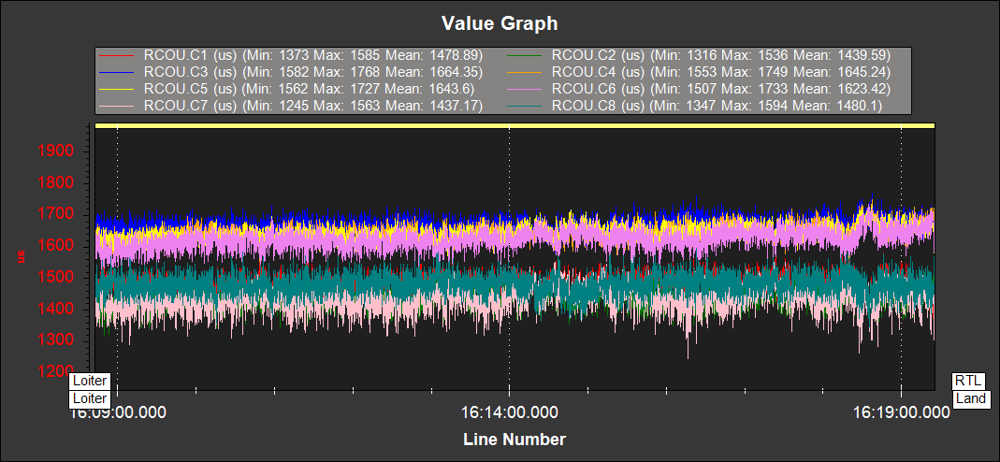

.. _thrust_loss_yaw_imbalance:

======================================
Thrust Loss and Yaw Imbalance Warnings
======================================

If you see thrust loss or yaw imbalance warnings this page outlines some checks and modifications that should be done to resolve the issue. In the majority of cases these warnings are the result of incorrect hardware selection or setup.

These warnings are designed to detect hardware failures in the propulsion system, if they begin to occur on a vehicle that has been flying without warnings the propulsion system should be checked.
Warning are more likely to happen with larger payloads and in strong/gusty winds.

Potential Thrust Loss
=====================

If potential thrust loss messages are seen on the GCS or in the data-flash logs investigation should be done to find the cause and remedy. The warning will give a motor number, for example:

```Potential Thrust Loss (3)```

These warnings are the result of a motor or motors saturating at 100% throttle. Because of this saturation ArduCopter can no longer achieve the requested roll, pitch, yaw and throttle output.
If this continues for a prolonged period of time the vehicle will have reduced altitude and attitude control and may crash.

If these messages are seen in hover or relaxed flight, the problem must be fixed in hardware. The vehicle's thrust to weight ratio should be increased, either by a change in propulsion or reduction in mass.

If only seen in climbing and aggressive maneuvers it may be sufficient to lower the requested accelerations and speeds. Again the vehicle's thrust to weight ratio can be increased to allow higher accelerations and speeds.

Yaw Imbalance
=============

The yaw imbalance warning is a measure of how hard the vehicle is working to yaw, the warning will trigger before the yaw output is saturated. If the yaw output becomes saturated the vehicle's
ability to maintain yaw will be compromised. And, in the worst case, this will result in the vehicle rapidly spinning. The warning message gives a percentage of maximum yaw output. At 100% it is saturated. For example:

```Yaw Imbalance 87%```

If seen in hover, the issue should be resolved in hardware. If the value is increasing with no pilot yaw input, the vehicle should be landed immediately. Yaw imbalance can be recognized in dataflash logs by comparing the PWM outputs between pars of opposing motors.
It will present as a large throttle level difference between the clockwise and counter clockwise motors, as shown below:



This should be fixed in hardware. The most common cause is the motors not being vertical on a circular arm. If the imbalance still persists
the motors can be tilted slightly such that the thrust angle assists the yaw for its rotation direction. Some vehicles can be extremely sensitive to motors thrust vector.

If the warning is only seen in aggressive yaw maneuvers, the warning threshold can be increased by raising :ref:`ATC_RAT_YAW_IMAX<ATC_RAT_YAW_IMAX__AC_AttitudeControl_Multi>`.  However, it may also be worth revisiting the yaw tune.

.. note::
    Both the thrust loss and yaw imbalance warnings can be disabled with the :ref:`FLIGHT_OPTIONS<FLIGHT_OPTIONS>` parameter.
    This should only be done after extensive log review and testing to verify the warnings are not picking up genuine issues.
