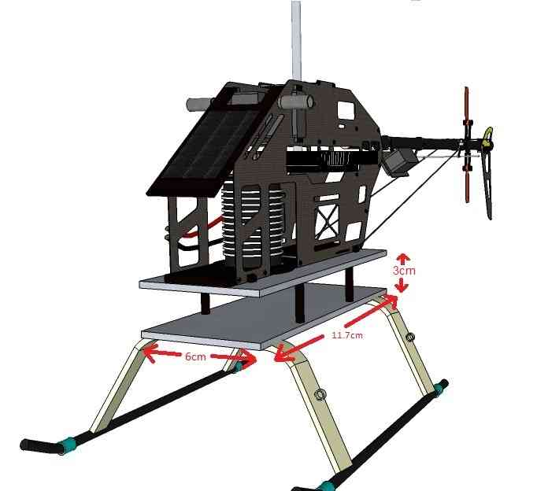

.. _trad-heli-mounting:

====================================================================
Traditional Helicopter – Mounting the Flight Controller to the Frame
====================================================================

On larger helicopters of approximately 550-class or larger the APM, Pixhawk or
Cube has been mounted in various locations such as on the FBL unit tray, on
top of the tail drive case, or even on the side of the frame (very popular).

Below is a possible method to mount a full-size flight controller on a smaller sized
helicopter. The Pixracer is popular on smaller frames that have less mounting options.

-  Separate the helicopter's main body from it's landing gear
-  Attach one carbon fibre plate to the body, the other to the landing
   gear
-  Drill holes in the upper and lower mounting plates so that the plates
   can be attached with four strong 3cm or 4cm stand-offs
-  Mount the flight controller to the bottom mounting plate using vibration
   dampening foam (see :ref:`Vibration Dampening wiki page <common-vibration-damping>` for ideas on mounting methods to
   isolate the flight controller from vibrations)

