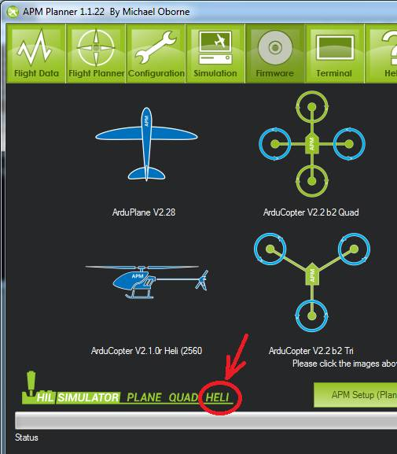
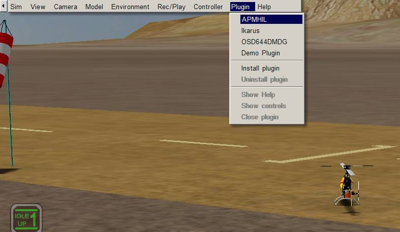

.. _tradhelihil:

=======================================================
Archived:Traditional Helicopter Simulator - TradHeliHIL
=======================================================

.. warning::

   **ARCHIVED ARTICLE**

   This Simulator does not currently work (16 Feb
   2015).

This article explains how to setup the TradHelicopter in the mission
planner.

What you need
~~~~~~~~~~~~~

1. AeroSIM-RC 3.7 http://www.aerosimrc.com/j/index.php/en/downloads.
   Note: As of Feb 20th 2012, you need to use the beta version of 3.83
   which can be found `here <http://www.aerosimrc.com/downloads/AeroSIMRC_3.83-3.81.exe>`__.

2. `AP Mission Planner v 1.0.84+ <https://code.google.com/archive/p/ardupilot-mega/downloads>`__

3. In your AP Mission Planner installation directory you will find a
   file called AeroSIMRCAPMHIL.zip. Extract this to your AeroSIM-RC
   plug-ins directory (i.e. C:Program Files (x86)AeroSIM-RCplugin)

How to make it work
~~~~~~~~~~~~~~~~~~~

Upload the Copter firmware using the Mission Planner.

On the AP Mission Planner you can find the Heli button on the bottom
left of the firmware upload screen.

If you use Arduino be sure to set the following definitions in
APM_Config.h:\*

::

    #define HIL_MODE     HIL_MODE_ATTITUDE #define FRAME_CONFIG HELI_FRAME

2. Start the AP Mission Planner and perform the following set-up:

-  select Simulation from the Menu
-  check AeroSimRC
-  check Heli
-  check Reverse Rudder and Display All
-  set Roll gain = 4500
-  set Pitch gain = 4500
-  set Throttle gain = 4500
-  set Rudder gain = 300
-  select Save Settings so that you don't need to this next time
-  connect your APM to you PC through the USB port
-  ensure the COM port and baud is correct in the APMissionPlanner and
   push the Connect button
-  push SimLink Start/Stop button, you should see "Sim Link Started"

3. Start AeroSIM-RC and perform the following setup

-  select SIM, Select Model, Heli 30 from the menu
-  select plug-ins, APM from the menu
-  you should find the engines in the RC helicopter immediately start
   and that you are able to control the RC heli much like the real
   helicopter

