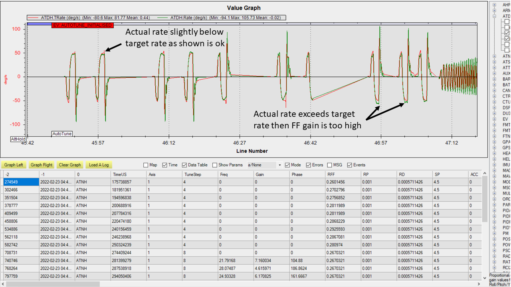
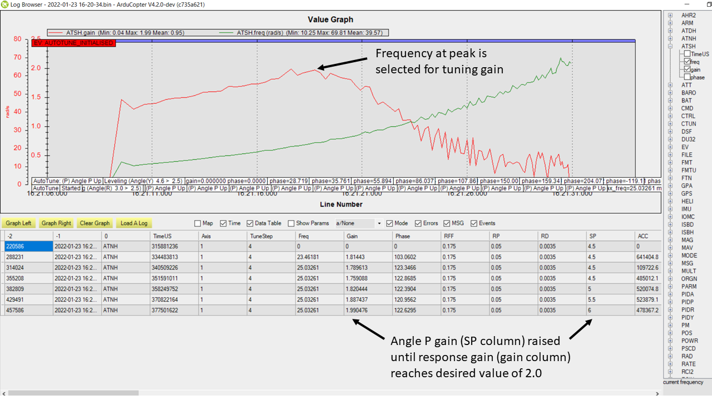

.. _traditional-helicopter-autotune:

========
AutoTune
========
The AutoTune for tradheli is completely different from multicopter AutoTune.  It can tune any combination of feedforward (``ATC_RAT_xxx_FF``), 
the rate gains (``ATC_RAT_xxx_P`` and ``ATC_RAT_xxx_D``), or angle P gain (``ATC_ANG_xxx_P``).  The tuning for rate gains begins with finding the maximum allowable value for the rate gains and then tunes them.  Knowing the maximum value enables the AutoTune feature to keep from creating an instability.

Before you start AutoTune, you must:

#. Reduce the vibrations in the control signals as low as possible
#. On a calm day, the heli will maintain a near driftless hover (< 1 m/s)

This will greatly improve your chances at a successful AutoTune.

The following video covers the steps described in this wiki page.

..  youtube:: 5960K8EV13A

Parameter Descriptions
======================
:ref:`Tune Sequence Bitmask<AUTOTUNE_SEQ>`
------------------------------------------

User can specify the tuning desired using the :ref:`AUTOTUNE_SEQ<AUTOTUNE_SEQ>` parameter.  Individual gain tuning or combination of tuning several gains can be specified using the bitmask.  Rate P and Rate D are conducted together and always preceded with determining max gains allowable.

+-----------------------------------------------------+-----------------------------------------------------+
| Bits                                                | Values                                              |
+=====================================================+=====================================================+
| +-------+------------------------------------------+| +---------+----------------------------------------+|
| | Bits  | Tune Type                                || | Values  | Tune Type                              ||
| +=======+==========================================+| +=========+========================================+|
| | 0     | ``ATC_RAT_xxx_FF``                       || | 1       | ``ATC_RAT_xxx_FF``                     ||
| +-------+------------------------------------------+| +---------+----------------------------------------+|
| | 1     | ``ATC_RAT_xxx_D`` & ``ATC_RAT_xxx_P`` ** || | 2       | ``ATC_RAT_xxx_D`` & ``ATC_RAT_xxx_P``  ||
| +-------+------------------------------------------+| +---------+----------------------------------------+|
| | 2     | ``ATC_ANG_xxx_P``                        || | 3       | ``ATC_RAT_xxx_FF``, ``ATC_RAT_xxx_D``, ||
| +-------+------------------------------------------+| |         |  & ``ATC_RAT_xxx_P``                   ||
| | 3     | Max Gain Determination                   || +---------+----------------------------------------+|
| +-------+------------------------------------------+| | 4       | ``ATC_ANG_xxx_P``                      ||
| | 4     | Tune Check                               || +---------+----------------------------------------+|
| +-------+------------------------------------------+| | 5       | ``ATC_RAT_xxx_FF`` & ``ATC_ANG_xxx_P`` ||
|                                                     | +---------+----------------------------------------+|
|                                                     | | 6       | ``ATC_RAT_xxx_D``, ``ATC_RAT_xxx_P``,  ||
|                                                     | |         | & ``ATC_ANG_xxx_P``                    ||
|                                                     | +---------+----------------------------------------+|
|                                                     | | 7       | ``ATC_RAT_xxx_FF``, ``ATC_RAT_xxx_D``, ||
|                                                     | |         | ``ATC_RAT_xxx_P``, & ``ATC_ANG_xxx_P`` ||
|                                                     | +---------+----------------------------------------+|
|                                                     | | 8       | Max Gain Determination                 ||
|                                                     | +---------+----------------------------------------+|
|                                                     | | 16      | Tune Check                             ||
|                                                     | +---------+----------------------------------------+|
+-----------------------------------------------------+-----------------------------------------------------+

** Max gain determination is always done before tuning Rate D and Rate P gains. This test determines the maximum allow values of ``ATC_RAT_xxx_D`` & ``ATC_RAT_xxx_P`` so that the helicopter never experiences servere oscillations due to raising these gains too high.  Since the maximum allowable values of ``ATC_RAT_xxx_D`` & ``ATC_RAT_xxx_P`` are found, tuning is done by incrementing these gains by 5% of their maximum allowable value.

:ref:`Axes Bitmask<AUTOTUNE_AXES__AC_AutoTune_Heli>`
-----------------------------------------------------------

The :ref:`AUTOTUNE_AXES<AUTOTUNE_AXES__AC_AutoTune_Heli>` parameter specifies one or more axes to be tuned.

+----------------------+---------------------------------+
| Bits                 | Values                          |
+======================+=================================+
| +-------+----------+ | +---------+-------------------+ |
| | Bits  | Axis     | | | Values  | Axes tested       | |
| +=======+==========+ | +=========+===================+ |
| | 0     | Roll     | | | 1       | Roll              | |
| +-------+----------+ | +---------+-------------------+ |
| | 1     | Pitch    | | | 2       | Pitch             | |
| +-------+----------+ | +---------+-------------------+ |
| | 2     | Yaw      | | | 3       | Roll & Pitch      | |
| +-------+----------+ | +---------+-------------------+ |
|                      | | 4       | Yaw               | |
|                      | +---------+-------------------+ |
|                      | | 5       | Roll & Yaw        | |
|                      | +---------+-------------------+ |
|                      | | 6       | Pitch & Yaw       | |
|                      | +---------+-------------------+ |
|                      | | 7       | Roll, Pitch & Yaw | |
|                      | +---------+-------------------+ |
+----------------------+---------------------------------+

:ref:`Maximum Response Gain<AUTOTUNE_GN_MAX>`
---------------------------------------------

The :ref:`AUTOTUNE_GN_MAX<AUTOTUNE_GN_MAX>` parameter specifies the maximum response gain to be used to tune the Rate D, Rate P and Angle P gains.  The response gain is the output of the response divided by the input.  It is recommended that 1.8 to 2.0 be used for pitch and roll axes as these axes are typically more lightly damped.  It is recommended that 1.0 to 1.4 be used for the yaw axis.

:ref:`Minimum Test Frequency<AUTOTUNE_FRQ_MIN>`
-----------------------------------------------

The :ref:`AUTOTUNE_FRQ_MIN<AUTOTUNE_FRQ_MIN>` parameter specifies the minimum frequency in radians per second used during the dwell or frequency sweeps.  For frequency sweeps, this will be the starting frequency.  The default value is good for helicopters with rotor diameters less than 1.4 meters.

:ref:`Maximum Test Frequency<AUTOTUNE_FRQ_MAX>`
-----------------------------------------------

The :ref:`AUTOTUNE_FRQ_MAX<AUTOTUNE_FRQ_MAX>` parameter specifies the maximum frequency in radians per second used during the dwell or frequency sweeps.  For frequency sweeps, this will be the ending frequency.  The default value is fine for helicopters with rotor diameters greater than 1.2 meters.  Consider raising to 100 radians/sec for helicopters with rotor diameters less then 1.2 meters.

:ref:`Velocity P Gain<AUTOTUNE_VELXY_P>`
----------------------------------------

The :ref:`AUTOTUNE_VELXY_P<AUTOTUNE_VELXY_P>` parameter specifies P gain for velocity feedback.  This aids the AutoTune in maintaining aircraft position during the frequency sweeps and dwells.  It does not apply to ``ATC_RAT_xxx_FF`` tuning.  Keep this at 0.1 unless the aircraft is drifting more than 10 meters during the dwell and frequency sweeps.  It only affects position holding while the aircraft is oscillating during these tests.  If it does drift more than 10 meters during the dwell adn frequency sweep tests then increase this parameter but don't increase much beyond 0.2. In between the oscillations, it may drift if the aircraft wasn't properly trimmed for hover.  This gain will not help with that.  

Preparing for AutoTune
======================

Ensure you complete all of the items in the :ref:`Preparing for Tuning<traditional-helicopter-tuning-preparing>` wiki page.

Transmitter Setup
-----------------

Be sure to put the AutoTune flight mode as one of the flight modes on your transmitter flight mode switch.  You don’t want to be reaching for the GCS to switch out of the AutoTune if your heli is not behaving properly.  You want to be able to switch modes instantly.

AutoTune Flights
================
Suggested Tuning Sequence
-------------------------

In any axis, it is recommended to conduct the feedforward gain tuning first, then the Rate D and Rate P gain tuning, and lastly the Angle P tuning.  Don't try to tune every axis in one flight, it could take up to 10-15 min to tune one axis.  Here is a suggested flights and tuning sequence. Conventional helicopters do not need Yaw feedforward tuning, therefore the gain can be set to zero.  Dual helicopters may require Yaw feedforward tuning.

+--------+-------------------------------------------------------------+-----------------------+
| Flight | Parameter                                                   | Value                 |
+========+=============================================================+=======================+
|    1   | :ref:`AUTOTUNE_AXES<AUTOTUNE_AXES__AC_AutoTune_Heli>`       | 3 (Roll and Pitch)    |
|        +-------------------------------------------------------------+-----------------------+
|        | :ref:`AUTOTUNE_SEQ<AUTOTUNE_SEQ>`                           | 1 (feedforward)       |
+--------+-------------------------------------------------------------+-----------------------+
|    2   | :ref:`AUTOTUNE_AXES<AUTOTUNE_AXES__AC_AutoTune_Heli>`       | 2 (Pitch)             |
|        +-------------------------------------------------------------+-----------------------+
|        | :ref:`AUTOTUNE_SEQ<AUTOTUNE_SEQ>`                           | 2 (Rate D and Rate P) |
|        +-------------------------------------------------------------+-----------------------+
|        | :ref:`AUTOTUNE_GN_MAX<AUTOTUNE_GN_MAX>`                     | 1.8                   |
+--------+-------------------------------------------------------------+-----------------------+
|    3   | :ref:`AUTOTUNE_AXES<AUTOTUNE_AXES__AC_AutoTune_Heli>`       | 1 (Roll)              |
|        +-------------------------------------------------------------+-----------------------+
|        | :ref:`AUTOTUNE_SEQ<AUTOTUNE_SEQ>`                           | 2 (Rate D and Rate P) |
|        +-------------------------------------------------------------+-----------------------+
|        | :ref:`AUTOTUNE_GN_MAX<AUTOTUNE_GN_MAX>`                     | 1.8                   |
+--------+-------------------------------------------------------------+-----------------------+
|    4   | :ref:`AUTOTUNE_AXES<AUTOTUNE_AXES__AC_AutoTune_Heli>`       | 3 (Roll and Pitch)    |
|        +-------------------------------------------------------------+-----------------------+
|        | :ref:`AUTOTUNE_SEQ<AUTOTUNE_SEQ>`                           | 4 (Angle P)           |
|        +-------------------------------------------------------------+-----------------------+
|        | :ref:`AUTOTUNE_GN_MAX<AUTOTUNE_GN_MAX>`                     | 1.8                   |
+--------+-------------------------------------------------------------+-----------------------+
|    5   | :ref:`AUTOTUNE_AXES<AUTOTUNE_AXES__AC_AutoTune_Heli>`       | 4 (Yaw)               |
|        +-------------------------------------------------------------+-----------------------+
|        | :ref:`AUTOTUNE_SEQ<AUTOTUNE_SEQ>`                           | 2 (Rate D and Rate P) |
|        +-------------------------------------------------------------+-----------------------+
|        | :ref:`AUTOTUNE_GN_MAX<AUTOTUNE_GN_MAX>`                     | 1.0                   |
+--------+-------------------------------------------------------------+-----------------------+
|    6   | :ref:`AUTOTUNE_AXES<AUTOTUNE_AXES__AC_AutoTune_Heli>`       | 4 (Yaw)               |
|        +-------------------------------------------------------------+-----------------------+
|        | :ref:`AUTOTUNE_SEQ<AUTOTUNE_SEQ>`                           | 4 (Angle P)           |
|        +-------------------------------------------------------------+-----------------------+
|        | :ref:`AUTOTUNE_GN_MAX<AUTOTUNE_GN_MAX>`                     | 1.8                   |
+--------+-------------------------------------------------------------+-----------------------+

Tuning Flight Procedures
------------------------

When conducting an AutoTune flight, be sure to have at least at 50 meter by 50 meter area to fly. The aircraft will move during the autotuning process.  Do not let the aircraft get too far away.

.. caution::  During the feedforward test, the aircraft may travel 5-10 meters, and perhaps even further with larger helicopters. You may have to bring it back after each iteration of the tuning test.  

#. Power up the controller.
#. Set the flight mode to either stabilize or AltHold (Althold recommended).
#. Enable motor interlock and allow rotors to complete runup.
#. Lift off and establish stable hover approximately 3-5 meters above the ground.
#. Switch into AutoTune and center all sticks.
#. AutoTune will start conducting the maneuvers.

.. note::  If you don’t see anything happening, verify your sticks are centered.

7. After the tuning is complete, a message will appear in the GCS saying "AutoTune complete".
8. To test the settings, switch out of AutoTune and then back to AutoTune and you will be 
   able to test the settings that were tuned.
9. Once you are finished testing, descend and land in AutoTune.  Once the aircraft has landed, the 
   engine will shutdown on its own.  At that point flip your motor interlock switch to disabled
   and disarm the aircraft.

.. note::  Aircraft must be disarmed in the AutoTune flight mode to save the gain settings.

Tuning Maneuver Descriptions
----------------------------

``ATC_RAT_xxx_FF`` Tuning
+++++++++++++++++++++++++

        The ``ATC_RAT_xxx_FF`` tuning is accomplished by achieving a constant angular rate of 50 deg/s and determining the steady state command required to maintain the 50 deg/s.  The maneuver to achieve the constant angular rate consists of changing attitude by 15 deg in one direction then reversing direction to achieve a constant rate of 50 deg/s before reaching 15 deg in the opposite direction.  Finally it returns to the starting attitude.   During ``ATC_RAT_xxx_FF`` tuning there is no position holding logic and the aircraft may drift, reposition the aircraft between maneuvers as needed to keep it from drifting.  Making any inputs during this test will stop the tuning and won’t begin again unless the sticks are centered.  The following video demonstrates the ``ATC_RAT_xxx_FF`` tuning.

..  youtube:: 2XLBIycPiq0

``ATC_RAT_xxx_D`` and ``ATC_RAT_xxx_P`` Tuning
++++++++++++++++++++++++++++++++++++++++++++++

        ``ATC_RAT_xxx_D`` and ``ATC_RAT_xxx_P`` tuning starts with determining the maximum ``ATC_RAT_xxx_D`` and ``ATC_RAT_xxx_P`` gains that can be safely tuned.  A frequency sweep is conducted from the :ref:`AUTOTUNE_FRQ_MIN<AUTOTUNE_FRQ_MIN>` to :ref:`AUTOTUNE_FRQ_MAX<AUTOTUNE_FRQ_MAX>`.  This determines the approximate frequency required for calculating the maximum allowable gains.  A series of dwells (oscillations at one frequency) are completed to more accurately determine the data required to calculate the maximum allowable ``ATC_RAT_xxx_D`` and ``ATC_RAT_xxx_P`` gains. Next another frequency sweep is conducted to approximate the frequency for tuning ``ATC_RAT_xxx_D`` gain.  Then the ``ATC_RAT_xxx_D`` gain is raised until the response gain stops decreasing. Next the ``ATC_RAT_xxx_P`` gain is increased until the response gain exceeds the :ref:`AUTOTUNE_GN_MAX<AUTOTUNE_GN_MAX>`.  During this tuning, you can’t make any inputs to hold position during the tuning however the logic includes position holding during the test maneuver but not between manuevers.  If you make any inputs, then it will stop the tuning and wait until you center the sticks before it begins again.  The aircraft will drift very little during the maneuver.  If it is drifting more than 10 meters during the maneuver then the :ref:`Velocity P Gain<AUTOTUNE_VELXY_P>` can be increased to minimize drifting.  In between the oscillation maneuvers, it may drift if the aircraft wasn't properly trimmed for hover.  The  :ref:`Velocity P Gain<AUTOTUNE_VELXY_P>` gain will not help with that. The tuning sweeps are 23 seconds in duration.  The following video demonstrates the ``ATC_RAT_xxx_D`` and ``ATC_RAT_xxx_P`` tuning.

..  youtube:: IOOIG_z1Cwc

``ATC_ANG_xxx_P`` Tuning
++++++++++++++++++++++++

        ``ATC_ANG_xxx_P`` tuning starts with conducting a frequency sweep from from the :ref:`AUTOTUNE_FRQ_MIN<AUTOTUNE_FRQ_MIN>` to :ref:`AUTOTUNE_FRQ_MAX<AUTOTUNE_FRQ_MAX>`.  This determines the approximate frequency for the maximum response gain.  Then dwells (oscillations at one frequency) are conducted to tune the ``ATC_ANG_xxx_P`` gain. The gain is raised or lowered to determine the ``ATC_ANG_xxx_P`` gain that corresponds to a response gain (output angle/input angle request) that matches :ref:`AUTOTUNE_GN_MAX<AUTOTUNE_GN_MAX>`. During this tuning, you can’t make any inputs to hold position during the tuning however the logic includes position holding during the test maneuver but not between manuevers.   If you make any inputs, then it will stop the tuning and wait until you center the sticks before it begins again. If it is drifting more than 10 meters during the maneuver then the :ref:`Velocity P Gain<AUTOTUNE_VELXY_P>` can be increased to minimize drifting. In between the oscillation maneuvers, it may drift if the aircraft wasn't properly trimmed for hover. The  :ref:`Velocity P Gain<AUTOTUNE_VELXY_P>` gain will not help with that. The tuning sweeps are 23 seconds in duration.  

..  youtube:: aI-uJuQAh-0

Max Gain Determination
++++++++++++++++++++++

        This test determines the maximum ``ATC_RAT_xxx_D`` and ``ATC_RAT_xxx_P`` gains that can be safely tuned.  A frequency sweep is conducted from the :ref:`AUTOTUNE_FRQ_MIN<AUTOTUNE_FRQ_MIN>` to :ref:`AUTOTUNE_FRQ_MAX<AUTOTUNE_FRQ_MAX>`.  This determines the approximate frequency required for calculating the maximum allowable gains.  A series of dwells (oscillations at one frequency) are completed to more accurately determine the data required to calculate the maximum allowable ``ATC_RAT_xxx_D`` and ``ATC_RAT_xxx_P`` gains. The maximum allowable gains are provided in a GCS message.  Although these are termed maximum allowable gains, it is not recommended that these gains be used without any buildup as they would most likely cause feedback oscillations.  Experience has shown that ``ATC_RAT_xxx_D`` gains up to 25-35% of the maximum allowable value can be used safely and ``ATC_RAT_xxx_P`` gains of up to 50% of the maximum allowable gain can be used safely.  If you make any inputs, then it will stop the gain determination test and wait until you center the sticks before it begins again.  The aircraft will drift very little during the maneuver.  If it is drifting more than 10 meters during the maneuver then the :ref:`Velocity P Gain<AUTOTUNE_VELXY_P>` can be increased to minimize drifting.  In between the oscillation maneuvers, it may drift if the aircraft wasn't properly trimmed for hover.  The  :ref:`Velocity P Gain<AUTOTUNE_VELXY_P>` gain will not help with that. The frequency sweeps are 23 seconds in duration.

Tune Check
++++++++++

        This test allows the user to look at the final tune in the frequency domain.  It consists of one frequency sweep to obtain the frequency domain data that can be viewed in the log file.  If you make any inputs during the frequency sweep, then it will stop the tune check test and wait until you center the sticks before it begins again, starting the sweep over.  The aircraft will drift very little during the maneuver.  If it is drifting more than 10 meters during the maneuver then the :ref:`Velocity P Gain<AUTOTUNE_VELXY_P>` can be increased to minimize drifting. The frequency sweeps are 23 seconds in duration.

Log Analysis
============

``ATC_RAT_xxx_FF`` Tuning
-------------------------
After completing the ``ATC_RAT_xxx_FF`` tuning, the log should be reviewed to ensure the code determined the value of ``ATC_RAT_xxx_FF`` gain correctly.  Unless head speed is very low, this gain should not be above 0.3. The graph below shows a time history of the target and actual rates for a FF tuning test.

In the time history, an example of a good capture of the FF gain is shown the pitch up part of the tuning.  The actual rate is slightly below the target as it reaches the steady state.  Next the pitch down FF tuning is conducted and it can be seen that the rate appears to drop off before achieving steady state.  The FF gain is increased but it can be seen that the actual rate exceeds the target which results in the FF gain being too high.  If you see behavior like this, it is best to take the FF gain found where the rate is slightly below the target rate and manually enter it for the ``ATC_RAT_xxx_FF`` gain.

  The video discusses what to look for in the log.

.. youtube:: qtmEm1rs1Y0

``ATC_RAT_xxx_D`` and ``ATC_RAT_xxx_P`` Tuning
----------------------------------------------
After completing the ``ATC_RAT_xxx_D`` and ``ATC_RAT_xxx_P`` tuning, the log should be reviewed to ensure the gains were determined correctly.  If the ``ATC_RAT_xxx_D`` gain is zero after tuning, it can be adjusted manually by finding the max allowable gain provided in the GCS messages found in the bin log file.  Use 10% of the gain provided as rate_d given at the end of the max gain test. The messages look like this

 AutoTune: Max rate P freq=23.62473 gain=6.239318
 AutoTune: ph=161.0000 rate_p=0.121300
 AutoTune: Max Rate D freq=41.98507 gain=1.493140
 AutoTune: ph=251.0000 rate_d=0.012072

Therefore in this case, a value for ``ATC_RAT_xxx_D`` of 0.0012 could be manually entered and also manually change ``ATC_RAT_xxx_P`` to zero.  Then run the autotune test again.  If ``ATC_RAT_xxx_D`` gain has not changed from the value manually entered accept the tuned values and move on to ``ATC_ANG_xxx_P`` tuning.

The most common problem that may be experienced with the ``ATC_RAT_xxx_P`` tuning is the :ref:`Maximum Response Gain<AUTOTUNE_GN_MAX>` may be set too low.  It may require viewing the log to determine the highest response gain.  Then set the :ref:`Maximum Response Gain<AUTOTUNE_GN_MAX>` higher but don't exceed 2.2 as the response could have larger overshoots when capturing an attitude.

  The video discusses what to look for in the log.

.. youtube:: YytbRB-KzSE

``ATC_ANG_xxx_P`` Tuning
------------------------
After completing the ``ATC_ANG_xxx_P`` tuning, the log should be reviewed to ensure the gains were determined correctly. Be sure to set the :ref:`Maximum Response Gain<AUTOTUNE_GN_MAX>` slightly higher than the value used for the ``ATC_RAT_xxx_D`` and ``ATC_RAT_xxx_P`` tuning, maybe 10% higher.  In this tuning, the frequency where the max response gain occurs is determined in the frequency response.  Then the  ``ATC_ANG_xxx_P`` gain is raised or lowered to achieve the desired response gain at the frequency where the maximum response gain occurs.  Below is an example of the frequency sweep from the ``ATC_ANG_xxx_P`` tuning.

In this example, the response gain (ATSH.gain) has a peak shown in the graph.  The table below shows the dwells completed after the frequency sweep where the ``ATC_ANG_xxx_P`` was raised until the response gain met the :ref:`Maximum Response Gain<AUTOTUNE_GN_MAX>` value which was 2.0 in this case.  It is important to ensure that the correct frequency was found.  In cases like tuning the yaw axis, the response gain may not have a peak and a low frequency may be chosen which will not result in a proper tuning of the gain.  In this case, the ``ATC_ANG_xxx_P`` gain may be manually set higher by 1. So if the starting value was 4.5 then manually set it to 5.5 and run the ``ATC_ANG_xxx_P`` tuning again.
