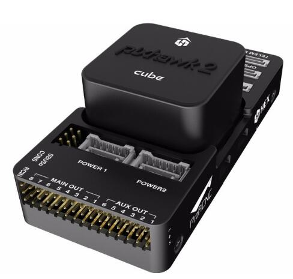
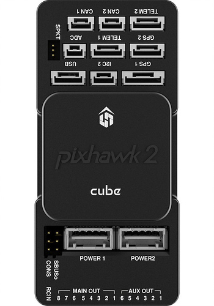

.. _traditional-helicopter-connecting-apm:

==============================================================
Traditional Helicopter — Connecting and Calibrating the System
==============================================================

Pixhawk2 Info
=============

The Pixhawk2.1 is the latest controller that runs the ArduPilot flight stack. It
is highly recommended for helicopters. It has much better internal damping of
the IMU's for vibration, triple redundant heated IMU's, redundant barometers and
compasses. Experience has shown the tuning, handling and stability performance
of your helicopter will be greatly improved over the first generation Pixhawk.

Before you begin connecting the system it is recommended to review the docs for
the Pixhawk 2.1 available `here  <http://www.proficnc.com/index.php?controller=attachment&id_attachment=8>`_

Overview of servo, and RX connection
====================================

The RC input to the Pixhawk is either PPM SUM, which will give you 8 channels.
Or S.Bus, which will give you up to 18 channels. If you have a receiver that
outputs only PWM, you will need a PPM encoder to connect it to Pixhawk.

The default RC input and SERVO output mapping is as follows:

+--------------+-------------+
| RC Channel   | SERVO output|
+--------------+-------------+
| 1            | Aileron     |
+--------------+-------------+
| 2            | Elevator    |
+--------------+-------------+
| 3            | Collective  |
+--------------+-------------+
| 4            | Rudder      |
+--------------+-------------+
| 5            | Flight Modes|
+--------------+-------------+
| 6            | Tuning      |
+--------------+-------------+
| 7            | Aux         |
+--------------+-------------+
| 8            | Throttle    |
+--------------+-------------+

The output pins on the Pixhawk for SERVO's 1 thru 8 are labled Main Out:

Motor 1, which is normally the left front servo on your helicopter goes to pin 1
on the Pixhawk. Motor 2, which is normally the right front servo goes to pin 2.
Motor 3, which is normally the rear (elevator) servo goes to pin 3. Tail servo
goes to pin 4.

If you are using a DDVP (Direct Drive Variable Pitch) tail rotor, the tail motor
ESC connects to pin 7. The throttle servo or ESC for the main rotor motor
connects to pin 8.

You must supply power to the servo rail to power your servos at their appropriate
rated voltage. The Pixhawk does not supply power to the servo rail.

Connect telemetry radios, GPS/compass module, power to the Pixhawk itself, and
any other peripherals as per the instructions in the owners manual for the unit.

RC Calibration
--------------

.. warning::

   Before powering the Pixhawk and servo rail, on all helicopters disconnect the
   rudder linkage from the tail servo or bellcrank on the tail gearbox. If you have
   a piston engine helicopter, also disconnect the throttle servo linkage.

The RC MUST be calibrated before proceeding once the Pixhawk is powered up. RC
calibration is identical to all other vehicles. With helicopters using the
ArduPilot system there can be no mixes in the RC radio. All the outputs must be
"pure", i.e. use either airplane mode in your radio, or helicopter mode with H1
or "straight" swash.
:ref:`See this topic <common-radio-control-calibration>`.

Compass Calibration
-------------------

It is recommended to calibrate the compasses at this time as well. This is the
same as all other vehicles.
:ref:`See this topic <common-compass-calibration-in-mission-planner>`.

Accelerometer Calibration
-------------------------
If the accelerometers were not calibrated on the bench prior to installation it
must be calibrated before proceeding.
:ref:`See this topic <common-accelerometer-calibration>`.
