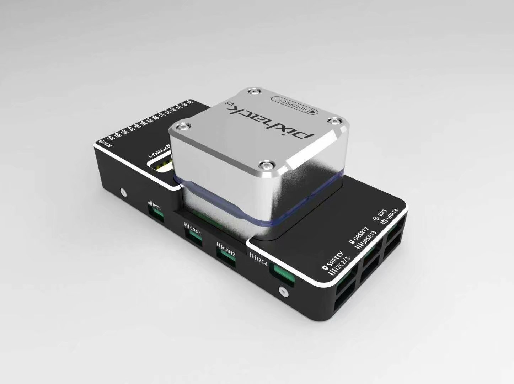

.. _traditional-helicopter-connecting-apm:

=====================================================================
Traditional Helicopter — Configuring Servo, Motor, and RC Connections
=====================================================================

This page covers how to make the physical connections between the autopilot, RC receiver, ESC and servos as well as calibrating the RC transmitter, Compass, Accelerometer, and ESC.  The following video covers making the connections and setting up the transmitter to work with the autopilot.

.. youtube:: JagHOc0_mNQ

Autopilot Info
==============

A autopilot with internally damped IMU's is highly recommended for helicopters. Experience has shown the tuning, handling and stability performance of your helicopter will be greatly improved over the first generation autopilots, like the Pixhawk.

Before you begin connecting the system it is recommended to review the docs for the autopilot you select.

Overview of servo, and RX connection
====================================

The RC input for many ardupilot compatible autopilots is either PPM SUM (8 channels) or S.Bus (up to 18 channels).  Some controllers also accept Spektrum satellite receivers.  For receivers that only output PWM, a PPM encoder is required to connect to the autopilot, however this is not recommended for applications requiring minimum possible latency.  For all helicopter frames, an RC radio that has at least 6 channels is required.  For autopilots, traditional helicopter and quadheli frames require one that has at least 5 output channels. The dual helicopter frame requires the autopilot have at least 7 output channels. 

The default receiver channel to ArduCopter RC input function mapping is as follows:

+--------------+--------------------+
| RC Receiver  | ArduPilot RC       |
| Channel      | Input Function     |
+--------------+--------------------+
| 1 (Aileron)  | Roll (note1)       |
+--------------+--------------------+
| 2 (Elevator) | Pitch (note1)      |
+--------------+--------------------+
| 3 (Throttle) | Collective(note1)  |
+--------------+--------------------+
| 4 (Rudder)   | Yaw (note1)        |
+--------------+--------------------+
| 5 (Gear)     | Flight Mode (note2)|
+--------------+--------------------+
| 6 (Aux 1)    | Tuning             |
+--------------+--------------------+
| 7 (Aux 2)    | Aux                |
+--------------+--------------------+
| 8 (Aux 3)    | Motor Interlock    |
|              | (throttle) (note3) |
+--------------+--------------------+

Note1: These functions are mapped by the  default values of ``RCMAP_x`` parameters as shown,but can changed as desired.

Note2: The :ref:`FLTMODE_CH<FLTMODE_CH>` defaults to RC Channel 5.

Note3: The :ref:`RC8_OPTION<RC8_OPTION>` defaults to the Motor Interlock function.

The output on most controllers for SERVO's 1 thru 8 are labeled Main Out:

.. image:: ../images/PH21_2.jpg
    :target: ../_images/PH21_2.jpg

The :ref:`autopilot output functions wiki <common-rcoutput-mapping>` shows the complete list of servo output functions.  The default swashplate is H3-120 where Motor 1 (servo function 33) left front servo, goes to output 1; Motor 2 (output function 34), right front servo goes to output 2; and Motor 3 (output function 35), rear (elevator) servo goes to output 3. See the :ref:`swashplate setup wiki <traditional-helicopter-swashplate-setup>` for more details.

Tail Servo/Control
------------------

See :ref:`traditional-helicopter-tailrotor-setup`

Motor Control
-------------
The throttle servo or ESC for the main rotor motor is defaulted to output 8.  This is automatically configured as Heli RSC (servo function 31) for the servo 8 function. See the :ref:`rotor speed control setup wiki <traditional-helicopter-rsc-setup>` for more details on RSC setup.  All traditional helicopter frames are required to use Motor Interlock.  This feature adds an extra layer of safety when working with helicopters.  Motor interlock enables the motor to drive the rotor/tailrotor.  This is similar to throttle hold in RC helicopters.  Motor interlock enabled (throttle hold off) means the motor is allowed to drive the rotor/tailrotor and the rotor speed control handles the rotor runup/shutdown.  Motor interlock disabled (throttle hold on) means the motor is not allowed to drive the rotor/tailrotor.  In order to arm the helicopter, the motor interlock must be disabled (throttle hold on). In ArduCopter 3.6 and earlier, the motor interlock and RC passthrough mode is tied to RC channel 8 only.  The RC transmitter channel 8 must have the PWM within 10 pwm of the RC8_MIN for motor interlock disabled (throttle hold on).  All other PWM values will set motor interlock enabled (throttle hold off).  In ArduCopter 4.0, the RCn_Option parameter can be set to motor interlock for a user selectable channel.  The transmitter channel on which the motor interlock is set requires the PWM to be low (<1200 PWM) for motor interlock disabled (throttle hold on) and above 1200 PWM for motor interlock enabled (throttle hold off).  

Check the docs for your selected autopilot but most require a separate power supply to the servo rail to power your servos at their appropriate rated voltage. 

Connect telemetry radios, GPS/compass module, power to autopilot itself, and any other peripherals as per the instructions in the owners manual for the unit.
