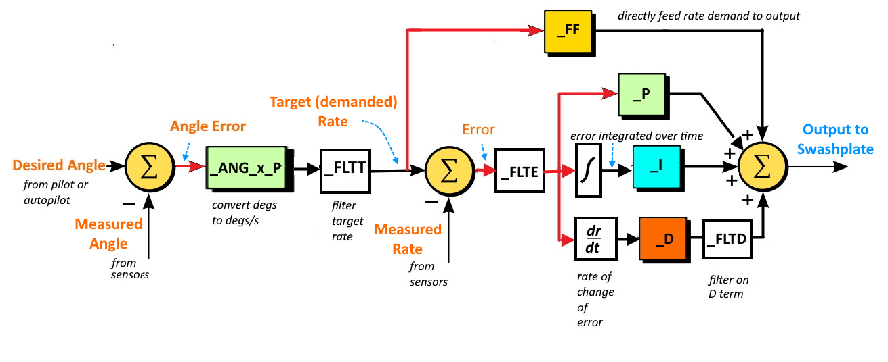

.. _traditional-helicopter-control-system:

==================================================
General ArduCopter Attitude Controller Description
==================================================

Users should generally understand the flight control laws before tuning. At
a high level, the ArduCopter control laws are designed as a model following
architecture where the software converts the pilot or autopilot's input into a demanded
attitude (Stabilized Modes) or a pilot demanded axial rate (Acro mode) and controls the
aircraft to achieve that demanded value.

It has two controllers (attitude and rate) that work together to ensure the actual aircraft
is following the demanded pitch and roll rates and attitudes.
 
The pilot’s commands are limited by the amount of acceleration that can be
commanded through the :ref:`ATC_ACCEL_P_MAX<ATC_ACCEL_P_MAX>` for pitch and :ref:`ATC_ACCEL_R_MAX<ATC_ACCEL_R_MAX>` for roll.

The initial responsiveness (crispness/sluggishness) of the aircraft to the pilot
input can be adjusted through the :ref:`ATC_INPUT_TC<ATC_INPUT_TC>` parameter. The pilot input and these parameters are used to determine the rate required to achieve the demanded response
that is fed to the rate controller.
 
The attitude controller is used to ensure the actual attitude of the aircraft
matches the demanded attitude of the autopilot. It uses the
:ref:`ATC_ANG_PIT_P<ATC_ANG_PIT_P>` in pitch and the :ref:`ATC_ANG_RLL_P<ATC_ANG_RLL_P>` in roll to determine a rate proportional to the difference between demanded and current attitude that is
fed to the rate controller to drive the aircraft to the demanded attitude. 

The rate controller receives the demanded rate resulting
from the pilot input and/or the rate from the attitude controller and determines
the swashplate commands required to achieve that rate. The rate controller
uses a PID control algorithm with a feed forward path to control the aircraft and
achieve the demanded rate.

The feed forward path uses the input rate and applies
the :ref:`ATC_RAT_PIT_FF<ATC_RAT_PIT_FF__AC_AttitudeControl_Heli>` gain for pitch and 
:ref:`ATC_RAT_RLL_FF<ATC_RAT_RLL_FF__AC_AttitudeControl_Heli>` gain for roll to
determine its portion of the swashplate command. The PID algorithm uses the
error between the measured rate and input demanded rate to determine its portion of the
swashplate command. These are summed and sent to the mixing unit where the servo
positions are determined.

So this tuning method uses the FF gain initially to ensure the requested rates
match the actual rates.  However the rates can vary from the requested due to
disturbances and inaccuracies. The P, I, and D gains (``ATC_RAT_x_P/I/D``) are then used to correct any disturbances that cause the actual rates to deviate from the requested rates. 

Error between demanded and measured rates is multiplied by the P term. The D term determines the rate of error change and adds a correction based on that, providing faster response to quickly occurring errors and providing dampening to control overshoots, like shock absorbers on a car.

Since there may be systemic offsets (like CG errors or mechanical trim imperfections) resulting in some long term errors to achieving the demanded rates, an integrator accumulates all errors over time, and provides an additional correction via the I gain. I gain is multiplied by the integrator and summed with the other outputs of the rate controller to form the input to the swashplate. 

The integrator maximum I path contribution is limited by the :ref:`ATC_RAT_RLL_IMAX<ATC_RAT_RLL_IMAX__AC_AttitudeControl_Heli>` in roll and
:ref:`ATC_RAT_PIT_IMAX<ATC_RAT_PIT_IMAX__AC_AttitudeControl_Heli>` in pitch. 
