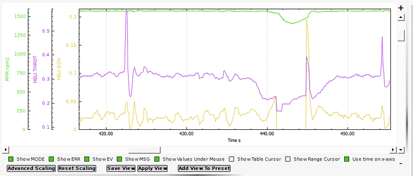

.. _traditional-helicopter-internal-rsc-governor:

=====================
Internal RSC Governor
=====================

ArduPilot provides an internal RSC governor (:ref:`H_RSC_MODE<H_RSC_MODE>` =4) for those applications which do not have one externally to assure constant rotor head speed. This mode requires the setup of the ``H_RSC_THRCRV_x`` and ``H_RSC_GOV_x`` parameters and the use of an :ref:`RPM sensor<common-rpm>` for the rotor head speed.  The governor maintains desired rotor speed through a proportional controller adjusted through the droop compensator and a feedforward controller that uses the throttle curve to help respond to sudden loading and unloading of the rotor system. The governor is designed to handle changes in environmental conditions and even changes in the desired RPM from the nominal settings for which the throttle curve was originally tuned.  This is accomplished through the torque compensator which adjusts the reference from the throttle curve to maintain the desired rotor speed.  The governor is designed to maintain the desired RPM within the governor range.  If the RPM falls outside this range for more than 0.5 seconds, the governor will declare the appropriate overspeed or underspeed fault and the throttle output is reverted back to the throttle curve.  The motor interlock has to be disabled to reset the governor.  

Improvements to rotor spool up were also made.  The governor uses a torque limiter to adjust the rise of torque during rotor spool up to smoothly engage the governor.  :ref:`H_RSC_GOV_TORQUE<H_RSC_GOV_TORQUE>` will determine how fast the rotor speed will ramp up when rotor speed reaches 50% of the rotor RPM setting (:ref:`H_RSC_GOV_RPM<H_RSC_GOV_RPM>`). The sequence of events engaging the governor is as follows: Throttle is increased from idle according to the :ref:`H_RSC_RAMP_TIME<H_RSC_RAMP_TIME>` causing the helicopter clutch to engage and start the main rotor turning. The collective should be at flat pitch and the throttle curve set to provide at least 50% of normal RPM at flat pitch. The autothrottle torque limiter will automatically activate and start accelerating the main rotor.  The spool up completes once the governor engages.  

 .. Note:: The declaration of Runup Complete is still based upon the :ref:`H_RSC_RUNUP_TIME<H_RSC_RUNUP_TIME>`.  Be sure this parameter is set to allow time for the governor to engage otherwise the autopilot will attempt an autonomous takeoff before the governor is engaged.

The governor settings are:

**Versions 4.1 and Earlier:**

- ``H_RSC_GOV_DISGAG``:The disengage point: recommended setting 2% above your flight idle power setting (first point on the throttle curve). The default value is that the governor disengages at 20% throttle.
- ``H_RSC_GOV_DROOP``:Droop Response setting: 0-100%. This sets how aggressive the governor is. A droop response setting too high in relation to how your prime mover reacts to throttle can cause the governor to surge or over-react to load change. Around 85% should work good for most piston engines. A little higher for turbines. A lot lower for electrics.
- ``H_RSC_GOV_RANGE``:RPM range above or below ``H_RSC_GOV_SETPNT`` setting where governor is operational. If speed sensor fails, or rpm falls outside of this range, the governor will disengage and return to throttle curve. Recommended range is 100 rpm.
- ``H_RSC_GOV_SETPNT``:RPM setpoint - set to desired headspeed in RPM
- ``H_RSC_GOV_TCGAIN``:Throttle Curve Gain - set to provide feedforward from the throttle curve for sudden change in load. If it over-runs on a sudden punchout, reduce the TC gain, etc… Can be set from 50-100%

**Versions 4.2 and Later:**

- :ref:`H_RSC_GOV_COMP<H_RSC_GOV_COMP>`: Governor Torque Compensator - Determines how fast the governor will adjust the base torque reference to compensate for changes in density altitude.
- :ref:`H_RSC_GOV_DROOP<H_RSC_GOV_DROOP>`: Governor Droop Compensator - Proportional gain to compensate for error in rotor speed from the desired rotor speed.
- :ref:`H_RSC_GOV_FF<H_RSC_GOV_FF>`: Governor Feedforward - Feedforward governor gain to throttle response during sudden loading/unloading of the rotor system.
- :ref:`H_RSC_GOV_RANGE<H_RSC_GOV_RANGE>`: Governor Operational Range - RPM range above or below :ref:`H_RSC_GOV_RPM<H_RSC_GOV_RPM>` setting where governor is operational.
- :ref:`H_RSC_GOV_RPM<H_RSC_GOV_RPM>`: Main Rotor RPM - Main rotor RPM that governor maintains when engaged.
- :ref:`H_RSC_GOV_TORQUE<H_RSC_GOV_TORQUE>`: Governor Torque Limiter - Adjusts the engine's percentage of torque rise during ramp-up to governor speed.

Setup
=====

You must first set your throttle curve and properly tune it. If the sensor fails, control fails over to the throttle curve. Without a properly tuned curve, your helicopter will crash. When tuning your throttle curve, tune it for an rpm that the aircraft can be easily flown. It doesn't have to be perfectly tuned, but it should be “close enough” to fly the heli with no surprises. You can tune your curve with :ref:`H_RSC_MODE<H_RSC_MODE>` =3. 

For ICE and turbine powered helicopters, :ref:`H_RSC_IDLE<H_RSC_IDLE>` is set so the engine can be started and run without engaging the clutch or turning the main rotor.  Arming the autopilot before engaging motor interlock will set the RSC output to the idle position.  Dis-engaging the motor interlock in ArduPilot will set the RSC output for motor throttle to :ref:`H_RSC_IDLE<H_RSC_IDLE>`.  With auto landings or the LAND mode, upon detecting landing, the system will disable motor interlock which will disengage the governor and set the RSC output to idle (:ref:`H_RSC_IDLE<H_RSC_IDLE>`). Once the spool down is complete, it will auto-disarm and shutdown the engine. 

Once the throttle curve is tuned, set :ref:`H_RSC_MODE<H_RSC_MODE>` = 4 to have the RSC use the governor. Initially it is recommended that the governor be tuned for the RPM that the throttle curve was tuned.  This will minimize the need for the governor torque compensator to be used and allow tuning to be concentrated on the droop compensator and feedforward settings.  The feedforward setting adjusts the amount of the throttle curve is used in the governor.  The feedforward may need adjusting if the rotor speed droops significantly when loading the rotor system using the collective.  The droop compensator ensures the desired rotor speed is maintained very precisely.  Higher value is quicker response to large speed changes due to load but may cause surging. Adjust this to be as aggressive as possible without getting surging or RPM over-run when the governor responds to large load changes on the rotor system.

To investigate the effect of the torque compensator, set the desired rotor speed 100-200 RPM from the rotor speed the throttle curve was tuned.  The governor torque compensator (:ref:`H_RSC_GOV_COMP<H_RSC_GOV_COMP>`) should slowly adjust the reference output to aid the droop compensator in maintaining the desired RPM.  If RPM is low or high by more than 2-5 RPM, increase this setting by 1% at a time until the governor speed matches your RPM setting. Setting the compensator too high can result in surging and throttle "hunting". Do not make large adjustments at one time.  

The torque limiter (:ref:`H_RSC_GOV_TORQUE<H_RSC_GOV_TORQUE>`) should not need to be adjusted unless desired rotor speeds are set above the rotor speed tuned for the throttle curve. The governor failing to engage on spool up is an indication that the torque limiter is too low.  Raise this be 5% until the governor reliably engages.  It is possible to have this too high which would be indicated by immediately getting a governor overspeed fault (message on GCS) on spool up and RSC will revert to throttle curve.

Governor Logging
================

There are logging items for helicopter throttle output and the governor output (HELI.x log messages) when in modes using the throttle curve or internal governor (:ref:`H_RSC_MODE<H_RSC_MODE>` =3 or 4). Below is an example log graph of the governor in operation. The graph shows a spool up. The governor torque limiter starts at 50% rotor speed until the governor engages.  The HELI.Gov signal is just the governor output.  The HELI.Throt is the throttle output which includes the throttle curve and the governor.  The collective shows when a sharp collective input was made at approximately 25 seconds.  There was about a 50 RPM droop which quickly recovered.  After landing, the governor disengages (governor output goes to zero) when the motor interlock is disabled.

