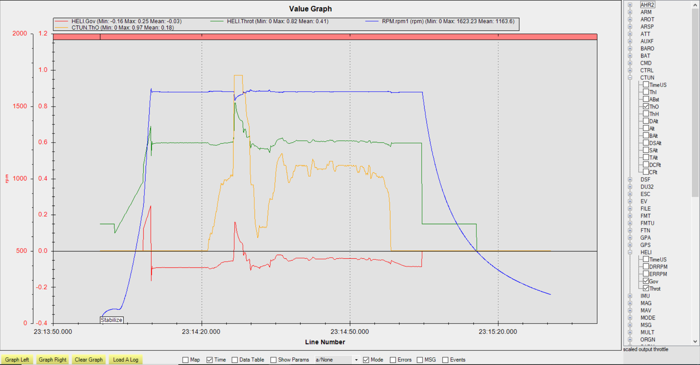

.. _traditional-helicopter-internal-rsc-governor:

=====================
Internal RSC Governor
=====================

ArduPilot provides an internal RSC governor (:ref:`H_RSC_MODE<H_RSC_MODE>` =4) for those applications which do not have one externally to assure constant rotor head speed. This mode requires the setup of the ``H_RSC_THRCRV_x`` and ``H_RSC_GOV_x`` parameters and the use of an :ref:`RPM sensor<common-rpm>` for the rotor head speed.

The new governor settings are:

- :ref:`H_RSC_GOV_DISGAG<H_RSC_GOV_DISGAG>`:The disengage point: recommended setting 2% above your flight idle power setting (first point on the throttle curve). The default value is that the governor disengages at 20% throttle.
- :ref:`H_RSC_GOV_DROOP<H_RSC_GOV_DROOP>`:Droop Response setting: 0-100%. This sets how aggressive the governor is. A droop response setting too high in relation to how your prime mover reacts to throttle can cause the governor to surge or over-react to load change. Around 85% should work good for most piston engines. A little higher for turbines. A lot lower for electrics.
- :ref:`H_RSC_GOV_RANGE<H_RSC_GOV_RANGE>` :RPM range above or below :ref:`H_RSC_GOV_SETPNT<H_RSC_GOV_SETPNT>` setting where governor is operational. If speed sensor fails, or rpm falls outside of this range, the governor will disengage and return to throttle curve. Recommended range is 100 rpm.
- :ref:`H_RSC_GOV_SETPNT<H_RSC_GOV_SETPNT>`:RPM setpoint - set to desired headspeed in RPM
- :ref:`H_RSC_GOV_TCGAIN<H_RSC_GOV_TCGAIN>`:Throttle Curve Gain - set to provide feedforward from the throttle curve for sudden change in load. If it over-runs on a sudden punchout, reduce the TC gain, etc… Can be set from 50-100%

Setup
=====

You must first set your throttle curve and properly tune it. If the sensor fails, control fails over to the throttle curve. Without a properly tuned curve, your helicopter will crash. For UAV operation it is recommended to set your throttle curve with a flight idle position (the throttle curve 0 point). This allows you to idle your ICE or Turbine engine down by pulling the collective to the bottom. Dis-engaging the motor interlock in ArduPilot will also set the RSC output for motor throttle to :ref:`H_RSC_IDLE<H_RSC_IDLE>`.

When tuning your throttle curve, tune it aggressively so it runs higher rpm than you normally fly at. This ensures adequate power available if the sensor fails. You don’t have to have a perfectly tuned throttle curve, but it should be “close enough” to fly the heli with no surprises. You can tune your curve with :ref:`H_RSC_MODE<H_RSC_MODE>` =3. Or tune it with :ref:`H_RSC_MODE<H_RSC_MODE>` =4,but with the :ref:`H_RSC_GOV_TCGAIN<H_RSC_GOV_TCGAIN>` set to 100 and :ref:`H_RSC_GOV_DROOP<H_RSC_GOV_DROOP>` set to 0. Either way works.

With auto landings or the LAND mode, upon detecting landing, the system will pull the engine's throttle down to flight idle power (:ref:`H_RSC_IDLE<H_RSC_IDLE>`), disengaging the governor before auto-disarm and engine shutdown. This reduces the chances of a dynamic rollover vs governors that hold full headspeed while the system is on the ground.

If you desire the governor to never disengage once it engages, set the :ref:`H_RSC_GOV_DISGAG<H_RSC_GOV_DISGAG>` to zero and it won’t reduce the throttle no matter what you do, unless Motor Interlock is disengaged.

You can refer to the :ref:`ArduPilot Helicopter Ground School videos<traditional-helicopter-configuration>` if you want to take a refresher on setting throttle curves. Video 4 covers throttle curves, piston and turbine engines:

Typical Governor Operation Example
==================================

There are logging items for helicopter throttle output and the governor output (HELI.x log messages) when in modes using the throttle curve or internal governor (:ref:`H_RSC_MODE<H_RSC_MODE>` =3 or 4). Below is an example log graph of the governor in operation. On the left side of the graph of flight with a 'punch-out" followed by landing disengaging the governor by pulling the collective/throttle down once on the ground, and then lifting off. You can see the governor output went to zero.

Then the governor was  re-engaged by gradually increasing the throttle (via the collective throttle curve) above :ref:`H_RSC_GOV_DISGAG<H_RSC_GOV_DISGAG>`. The governor came on (the sudden spike in governor output and throttle), then went to steady state control back to governed headspeed (:ref:`H_RSC_GOV_SETPNT<H_RSC_GOV_SETPNT>`) as throttle stick was raised to increase pitch for liftoff.

The governor “bites” hard when it engages, rather than soft-starts for three reasons:

-  If Motor Interlock is accidentally disengaged and re-engaged in flight, the engine supplies power immediately. 
-  To allow autorotation practice with power-on recovery.
-  The fast-start will not affect auto takeoffs.

