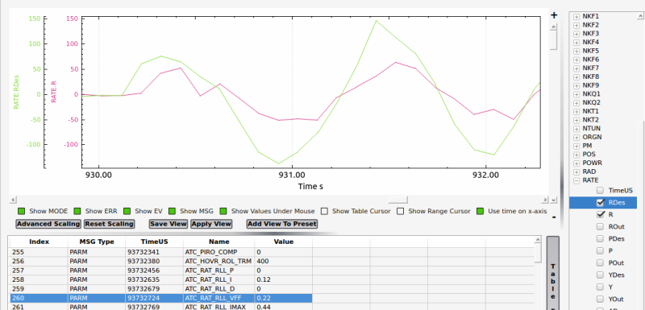

.. _traditional-helicopter-manual-tuning:

==========================
Manual Tuning Instructions
==========================

Pitch and Roll Axes
===================
Setting ``ATC_RAT_xxx_FF`` and ``ATC_ACCEL_x_MAX`` Parameters for Desired Pitch and Roll Response
-------------------------------------------------------------------------------------------------

In both pitch and roll axes, the ``ATC_RAT_xxx_FF`` gain is set so that the actual aircraft
rate matches the desired rate. To do this, the RATE message in the log is
required to compare the RATE.PDes and RATE.P log data for pitch and the RATE.RDes and RATE.R
log data for roll.

With the ``ATC_RAT_xxx_FF`` gains set to 0.15, takeoff and establish a hover
in Stabilize flight mode, then make some sharp stick inputs in both pitch and
roll. Land and pull the log from the microSD card and look at the signals in
a log reviewing software. If the actual rate is more than the desired rate
then you'll want to decrease ``ATC_RAT_xxx_FF``. If it is less, increase ``ATC_RAT_xxx_FF``.

**(to be added...FF calculation directly from log data)**

If the desired and actual rates are offset by some amount, it means that your swash was not 
properly leveled in the setup. In this case, just make sure the change in rate is similar in 
amplitude between desired and actual.  If you get the rates to match and they feel like they 
are too fast, then reduce the ``ATC_ACCEL_x_MAX`` parameter and repeat the process above to 
match the desired and actual rates. 

If while tuning the ``ATC_RAT_xxx_FF`` gain the aircraft starts to oscillate, reduce the 
``ATC_ANG_xxx_P`` gain for that axis until the oscillations stop.  However for most 
helicopters the suggested values above should not cause this problem.

Tuning the ``ATC_RAT_xxx_D`` and ``ATC_RAT_xxx_P`` gain
-------------------------------------------------------

Once you have the heli responding nicely with the ``ATC_RAT_xxx_FF`` gain, now tune the
PID gains. The rate PID controller provides stability to reject disturbances and
keep the actual aircraft following the software demanded rates.  
 
Start with the ``ATC_RAT_xxx_D`` gain.  Use the :ref:`Transmitter based tuning<common-transmitter-tuning>` feature of ArduCopter.  
Make the following parameter changes:

+--------------------------------------------+---------+
| :ref:`TUNE<TUNE>`                          | 21      |
+--------------------------------------------+---------+
| :ref:`TUNE_MIN<TUNE_MIN>`                  | 0       |
+--------------------------------------------+---------+
| :ref:`TUNE_MAX<TUNE_MAX>`                  | 0.030*  |
+--------------------------------------------+---------+

*for futaba radios this equates to one increment in the knob to 0.001*

Adjust the tuning knob until the :ref:`ATC_RAT_RLL_D<ATC_RAT_RLL_D__AC_AttitudeControl_Heli>` and :ref:`ATC_RAT_PIT_D<ATC_RAT_PIT_D__AC_AttitudeControl_Heli>` gains are
0.001. Lift into a hover and make some sharp stick inputs in roll.  Most
helicopters will see roll oscillations before they see pitch oscillations.
That is why roll inputs are suggested.  If it doesn't shake, increase the gain
by 0.001 and try it again. At the value where you get rapid shaking, cut
that value in half and enter it as the final tuning value for :ref:`ATC_RAT_RLL_D<ATC_RAT_RLL_D__AC_AttitudeControl_Heli>` and
:ref:`ATC_RAT_PIT_D<ATC_RAT_PIT_D__AC_AttitudeControl_Heli>`.  Test hover the heli and make some rapid stick movements in both
pitch and roll to make sure it's stable.

Now tune the ``ATC_RAT_xxx_P`` gains.  Make the following tuning parameter changes:

+--------------------------------------------+---------+
| :ref:`TUNE<TUNE>`                          | 4       |
+--------------------------------------------+---------+
| :ref:`TUNE_MIN<TUNE_MIN>`                  | 0       |
+--------------------------------------------+---------+
| :ref:`TUNE_MAX<TUNE_MAX>`                  | 0.3*    |
+--------------------------------------------+---------+

*for futaba radios this equates to one increment in the knob to 0.01*

Adjust the tuning knob until the :ref:`ATC_RAT_RLL_P<ATC_RAT_RLL_P__AC_AttitudeControl_Heli>` and :ref:`ATC_RAT_PIT_P<ATC_RAT_PIT_P__AC_AttitudeControl_Heli>`  gains are
0.05. Lift into a hover and roll aggressively from side to side.  If it doesn't
shake, increase the gain by 0.01 and try it again. At the value where you get 
rapid shaking, cut that value in half and enter it as the final tuning value
for :ref:`ATC_RAT_RLL_P<ATC_RAT_RLL_P__AC_AttitudeControl_Heli>` and :ref:`ATC_RAT_PIT_P<ATC_RAT_PIT_P__AC_AttitudeControl_Heli>`.  
Test hover the heli and make some rapid stick movements in both pitch and roll to make sure it's stable.  

After tuning the ``ATC_RAT_xxx_D`` and ``ATC_RAT_xxx_P`` gains the aircraft should feel much smoother. Tune quality can be also checked by viewing the ATT.DesP vs ATT.P and ATT.DesR vs ATT.R log plots:

.. image:: ../../../images/roll_tune.jpg
    :target: ../_images/roll_tune.jpg

Setting the :ref:`ATC_RAT_RLL_I<ATC_RAT_RLL_I__AC_AttitudeControl_Heli>` and :ref:`ATC_RAT_PIT_I<ATC_RAT_PIT_I__AC_AttitudeControl_Heli>`
-----------------------------------------------------------------------------------------------------------------------------------------

It is recommended to set the :ref:`ATC_RAT_PIT_I<ATC_RAT_PIT_I__AC_AttitudeControl_Heli>` gain equal to the :ref:`ATC_RAT_PIT_FF<ATC_RAT_PIT_FF__AC_AttitudeControl_Heli>` gain and the :ref:`ATC_RAT_RLL_I<ATC_RAT_RLL_I__AC_AttitudeControl_Heli>` gain equal to the :ref:`ATC_RAT_RLL_FF<ATC_RAT_RLL_FF__AC_AttitudeControl_Heli>` gain.  

Yaw Axis
========

Setting :ref:`ATC_RAT_YAW_FF<ATC_RAT_YAW_FF__AC_AttitudeControl_Heli>`
----------------------------------------------------------------------

In most cases, the feedforward required for the yaw axis could be very small or even zero.  To check the feedforward required, hover the helicopter and perform a constant rate 90 deg turn.  Pull the log data and look at the RATE.Yout signal.  Determine the average RATE.Yout during the time the yaw rate (RATE.Y signal) was constant.  Feedforward gain is determined by dividing the average RATE.Yout by the average RATE.Y in rad/s.  

Tuning :ref:`ATC_RAT_YAW_D<ATC_RAT_YAW_D__AC_AttitudeControl_Heli>` and :ref:`ATC_RAT_YAW_P<ATC_RAT_YAW_P__AC_AttitudeControl_Heli>`
------------------------------------------------------------------------------------------------------------------------------------
Spool up the heli and hover it no more than .25 meters above ground in Stabilize flight mode and test the
starting tail settings. If the tail seems "loose" and doesn't want to hold
increase the :ref:`ATC_RAT_YAW_P<ATC_RAT_YAW_P__AC_AttitudeControl_Heli>`. If the tail slowly wags back and forth, the :ref:`ATC_RAT_YAW_P<ATC_RAT_YAW_P__AC_AttitudeControl_Heli>` may be too high. If the tail rapidly shakes side to side reduce the
:ref:`ATC_ANG_YAW_P<ATC_ANG_YAW_P>`.

In all cases it is not recommended to adjust :ref:`ATC_ANG_YAW_P<ATC_ANG_YAW_P>` below 3.5 or
:ref:`ATC_RAT_YAW_P<ATC_RAT_YAW_P__AC_AttitudeControl_Heli>` above 0.38. If your helicopter cannot seem to achieve a solid tail
within those limits you likely have a mechanical problem with the tail - either
excessive "slop" or play in the linkage, binding of the linkage or a servo
problem. Correct the problem before proceeding with roll and pitch tuning.

The tune quality can be checked by examining the logs for ATT.DesYaw vs ATT.Yaw as shown below for an imperfect but flyable tune:

.. image:: ../../../images/yaw_tune.jpg
    :target: ../_images/yaw_tune.jpg

Note that there is a little overshoot and neutral ringing indicating that the FF or P gain is a little high or there is not enough D and could be improved a bit.

Tuning a Flybar Equipped Head
=============================

The setup of a helicopter with flybar equipped head does not require the 
:ref:`H_FLYBAR_MODE<H_FLYBAR_MODE>` set to flybar mode.  This parameter only affects
the ACRO flight mode.  Unless there is a reason passthrough provided by the flybar 
setting in ACRO mode is needed, then it is recommended that :ref:`H_FLYBAR_MODE<H_FLYBAR_MODE>` is 
left at its default of no flybar.  If you choose to use the flybar mode then the FF gain 
is set as described below.  Otherwise the FF is tuned just like an flybarless head.

.. Note:: For flybar heads, the flybar is a mechanical version of the rate PID loop. So flybar is tuned using only FF in pitch and roll. The rate D and P gains are left set to zero for flybar. I-gain, IMAX, and ILMI are tuned just like FBL. 

With a flybar head, where the linkage rate is normally lower, it is recommended
to start with 0.22 FF for both pitch and roll and you will likely have to go
higher with FF. But for a flybarless head, FF shouldn't be more than 0.22 
unless you have really really slow servos or slow linkage rate. With all 
helicopters, the FF gain compensates for differences in servo and linkage
speed.

Below is a plot of beginning a tune on a flybar helicopter using the starting
setting of :ref:`ATC_RAT_RLL_FF<ATC_RAT_RLL_FF__AC_AttitudeControl_Heli>` = 0.22. The graph shows the aircraft's response to
the rate request of the attitude controller is low, meaning the FF value must
be increased to achieve proper rate response. 

