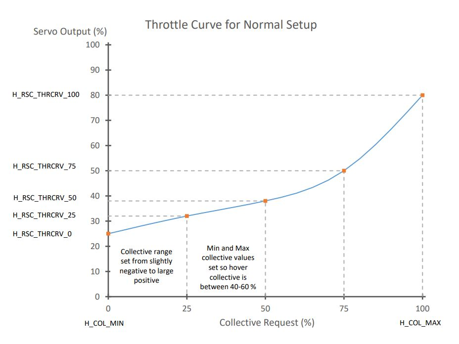
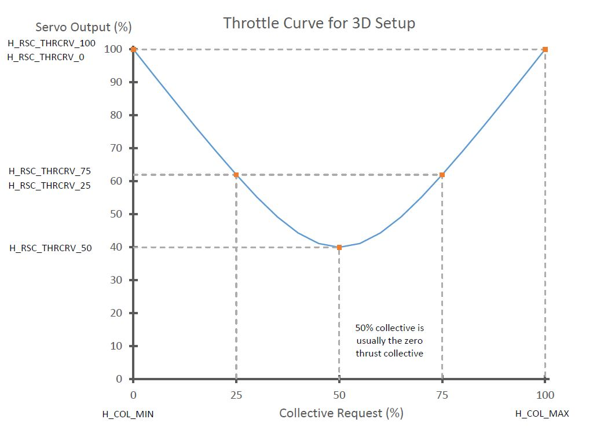

.. _traditional-helicopter-rsc-setup:

=========================
Rotor Speed Control Setup
=========================

Unlike other vehicles, more specifically multicopters, the throttle RC input channel does not directly control the throttle in any mode, even in modes designated in Multicopter as "non altitude controlled modes" or "non throttle controlled modes", like STABILIZE or ACRO. Instead it only directly controls the Collective for the helicopter in non altitude controlled modes.

.. note:: the exception to this is the RC Passthrough RSC mode. This is NOT recommended usually.

This means that some method must be used to control the throttle or esc for maintaining constant rotor speed through out the flight envelope.

The Rotor Speed Control (RSC) uses the heliRSC output (``SERVOx_FUNCTION`` = 31) to the engine throttle or speed control/governor to control rotor speed. This can be derived in a few different ways:

-  Through an open loop control via either an RC transmitter passthrough or an internal throttle curve which takes collective demand and creates a corresponding throttle demand.
-  Using a set point signal to an external governor, or electronic speed controller
-  Using a closed loop governor in the ArduPilot firmware.

.. note:: When Motor Interlock is disengaged,the state is sometimes called Throttle Hold and throttle is driven to :ref:`H_RSC_IDLE <H_RSC_IDLE>`

The RSC also controls the heliRSC output for ground idle, rotor run up and shut down. This wiki covers the set up of each of the parameters in the RSC.

RSC mode
========

First, set the RSC Mode parameter (:ref:`H_RSC_MODE <H_RSC_MODE>`). The RSC modes are listed below with a short description. 

#. RC Passthrough (:ref:`H_RSC_MODE <H_RSC_MODE>` = 1) - this mode passes through the RC channel input on which the Motor Interlock (``RCx_OPTION`` =32) is assigned. The channel must be over 1200us in order for the heliRSC output to follow the RC input. Otherwise, heliRSC will be :ref:`H_RSC_IDLE <H_RSC_IDLE>`.
#. RSC setpoint (:ref:`H_RSC_MODE <H_RSC_MODE>` = 2) - this mode is used for helicopters utilizing either an electronic speed controller or an external governor for internal combustion engines. The PWM passed to the HeliRSC output is determined from the External Motor Governor Setpoint (:ref:`H_RSC_SETPOINT <H_RSC_SETPOINT>`) parameter. The output PWM is calculated by the following equation: PWM output = ``RSC_SETPOINT`` * 0.01 * (``SERVOx_MAX`` - ``SERVOx_MIN``) + ``SERVOx_MIN`` where SERVOx is the output assigned to Throttle
#. Throttle curve (:ref:`H_RSC_MODE <H_RSC_MODE>` = 3) - This mode is an open loop control of the HeliRSC servo output. Users will need to fine-tune the throttle curve to maintain the desired rotor speed throughout the flight envelope. The throttle curve is a five point spline curve fit set by the ``H_RSC_THRCRV_x`` parameters. It is used to determine the HeliRSC servo output based on the collective (throttle stick) on the RC transmitter.
#. Governor (:ref:`H_RSC_MODE <H_RSC_MODE>` = 4) - The governor is designed to maintain a user specified rotor speed using the throttle curve as the feedforward control. This feature requires a rotor speed sensor. The ``H_RSC_GOV_x``. The parameters needed to set  the Throttle Curve mode above, also should be set correctly for this mode since it uses them as a basis for feed-forward control in the Governor.

.. warning::
    Setting the RSC mode to RC Passthrough requires configuring the RC receiver to hold last value for the Motor Interlock channel (default is channel 8). If the receiver loses connection to the transmitter and receiver is not configured correctly, the motor will shutdown and the helicopter will crash! It also means that the pilot has to be in control of throttle during any altitude holding or autonomous modes. This can be very difficult, can lead to a crash, and is strongly discouraged. This mode is provided only for some very specialized, advanced users.

- :ref:`H_RSC_MODE <H_RSC_MODE>` =2 will be the most commonly used mode for electric helis having an ESC with governor mode built in.
- :ref:`H_RSC_MODE <H_RSC_MODE>` =3 can be used for open loop control of the heli motor, providing no constant head speed feedback control, but is usually used to setup the feed-forward throttle curve baseline for the Governor mode below. Having a RSC governor is highly desirable in order to maintain a steady tune point for the stabilization parameters.
- :ref:`H_RSC_MODE <H_RSC_MODE>` =4 can be used if no external RSC governor is present. Primarily for ICE and Turbine engines.

Typical Throttle Curves for :ref:`H_RSC_MODE<H_RSC_MODE>` = 3
-------------------------------------------------------------

These are also used in :ref:`H_RSC_MODE<H_RSC_MODE>` = 4 as a basis for its feedforward.

If the collective range is set for conventional (non-aerobatic) setups, ie ~-2deg to +12deg, then the ``H_RSC_THRCRV_X`` parameters would be set to drive the Throttle Servo similarly to:

If setup with an aerobatic, symmetrical collective range, ie ~ -12deg to +12deg, then they should be set drive the Throttle Servo similarly to this:

.. note:: ArduPilot will spline curve fit between the ``H_RSC_THRCRV_X`` setpoints to produce smooth throttle servo output versus collective points.

Rotor Speed Ramp and Idle Settings
==================================

The rotor speed control features an idle setting and start up and shut down logic for throttle control. The throttle output at :ref:`H_RSC_IDLE <H_RSC_IDLE>` parameter determines the output to heliRSC servo output after the aircraft is armed, but before the motor interlock is enabled. 

When the motor interlock is enabled the rotor speed control will ramp the throttle from the idle setting (:ref:`H_RSC_IDLE <H_RSC_IDLE>`) to flight setting (this depends on the :ref:`H_RSC_MODE <H_RSC_MODE>` chosen) based on the :ref:`H_RSC_RAMP_TIME <H_RSC_RAMP_TIME>` parameter . The RSC will prevent take off in non-manual throttle modes and auto mode until the timer has reached :ref:`H_RSC_RUNUP_TIME <H_RSC_RUNUP_TIME>`. It is very important to set :ref:`H_RSC_RUNUP_TIME <H_RSC_RUNUP_TIME>` to the amount of time it takes for the rotor to spin up to the flight rotor speed.  This parameter has to be equal to or greater than the Throttle Ramp Time parameter (:ref:`H_RSC_RAMP_TIME <H_RSC_RAMP_TIME>`). 

When the motor interlock is disabled with the rotor at flight rotor speed, the rotor speed control will count down the same amount of time as specified by the :ref:`H_RSC_RUNUP_TIME <H_RSC_RUNUP_TIME>`. The RSC will declare rotor speed below critical based on the Critical Rotor Speed parameter (:ref:`H_RSC_CRITICAL <H_RSC_CRITICAL>`) and will reset the runup complete flag. It is best to set the Critical Rotor Speed parameter (:ref:`H_RSC_CRITICAL <H_RSC_CRITICAL>`) for a percentage of the runup timer that equates to about three seconds. For example if you had a 10 second runup timer, setting the Critical Rotor Speed parameter (:ref:`H_RSC_CRITICAL <H_RSC_CRITICAL>`) to 70% will cause the RSC to declare rotor speed below critical three seconds from when Motor interlock is disabled.  For versions 4.0 and earlier, the autopilot is able to disarm the aicraft during auto landings after the RSC declares the rotor speed below critical.  For versions 4.1 and later, the autopilot waits the length of time of the :ref:`H_RSC_RUNUP_TIME <H_RSC_RUNUP_TIME>` to disarm the aircraft during auto landings.

ArduPilot Internal Governor Setup
=================================

ArduPilot provides an internal rotor speed control primarily for use with ICE or Turbine engines without a speed governor, but can also be used with electric ESCs that do not provide a governor mode. This mode requires that the 
``H_RSC_THRCRV_x`` parameters be set such that the helicopter can be flown in :ref:`H_RSC_MODE <H_RSC_MODE>` =3 safely, since they are used as the baseline control curve for the RSC governor, providing the feed-forward portion of the control loop.

See :ref:`traditional-helicopter-internal-rsc-governor` for setup details.

Turbine Engine Start
====================

A special RC Auxiliary Function ("159") is implemented to provide the start signal RC switch for turbine engines. When armed and RSC is idle, the high position signals the helicopter rotor speed governor to ramp the throttle to full and back to idle, which signals the turbine engine ECU to initiate the start sequence. The switch must be set back low and aircraft has to be disarmed to re-enable this feature.

Practice (Manual) Autorotation Setup
====================================

In versions 4.4 and later, the ability to conduct power re-engagement from an autorotation has been added.  This feature will work with ESC's when using their internal governor, the ArduPilot throttle curve or the ArduPilot built-in RSC governor.

See :ref:`traditional-helicopter-autorotation` page.