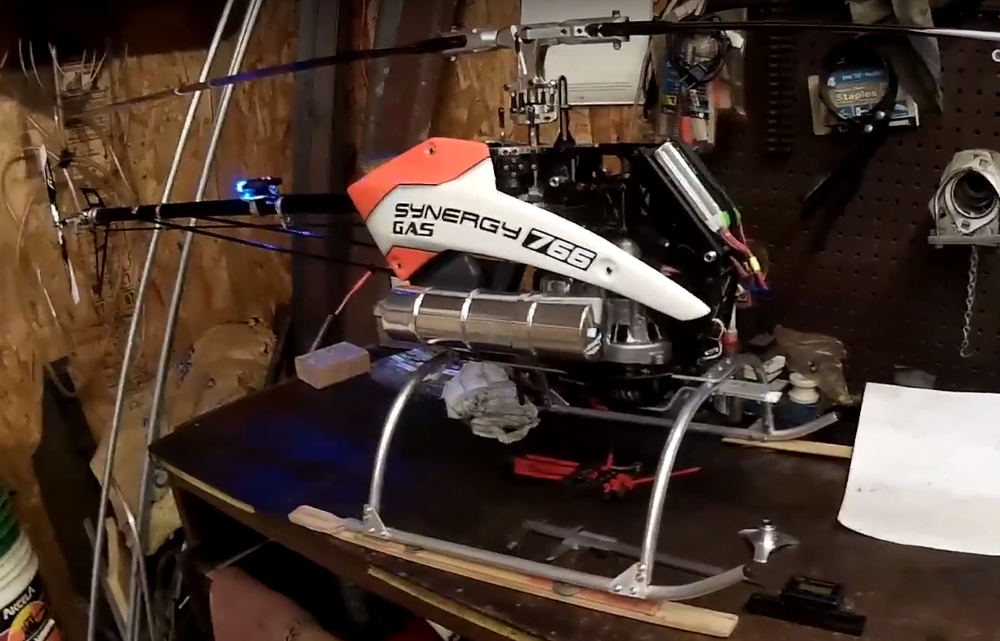
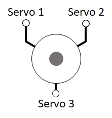
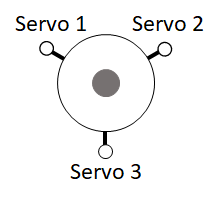
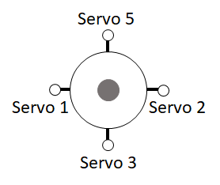
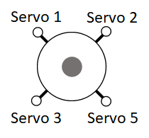
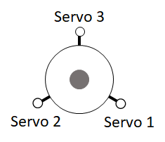
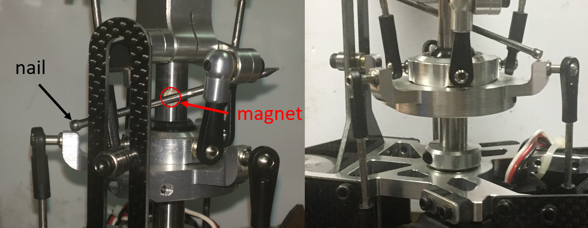
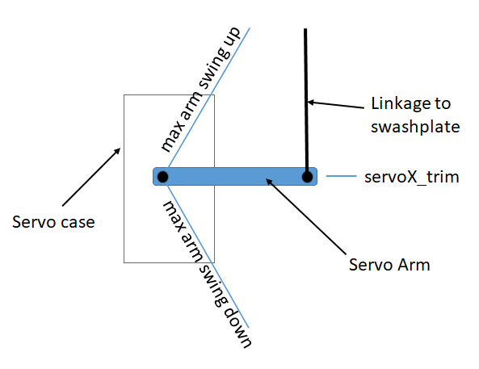
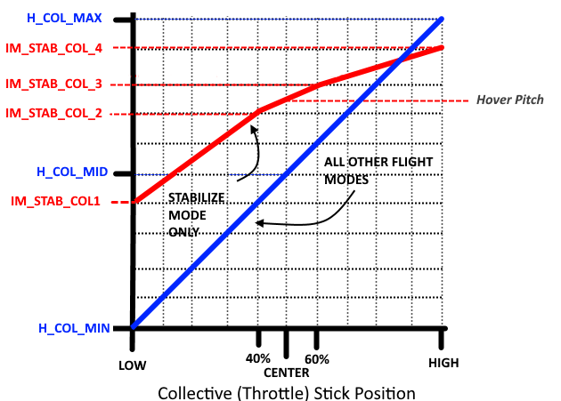

.. _traditional-helicopter-swashplate-setup:

=========================================
Traditional Helicopter – Swashplate Setup
=========================================

The swashplate is designed to take the servo inputs that are based on the pilot’s 
pitch, roll, and collective commands and translate them to individual blade pitch 
inputs. There are many different servo arrangements for both three and four servo 
swashplates. The swashplate library covers all of the popular configurations for 
both three and four servo swashplates. If you have a unique swashplate, you can 
also use the generic three servo swashplate. 

Linearize Servo is a feature that you can use for both three and four servo swashplates. However, it is optional for the 
three servo swashplates as there is no chance for binding. It will most likely 
always be required for four servo swashplates because of the potential for binding 
in a four point attachment. 

The following video covers the swashplate setup and leveling the swashplate.

.. youtube:: oA-9FFYC6Ek

This video covers setting up the min collective, max collective, zero thrust collective, max cyclic and stabilize collective curve.

.. youtube:: qfOuZc_7J4g

Before You Begin
================

Prior to beginning the swashplate set up, be sure that your helicopter control 
linkages are set up in accordance with the assembly instructions. In order to make 
accurate blade pitch measurements, make the rotor shaft perpendicular to the ground 
by using shims underneath the landing gear as shown in the picture below.

Lastly, it is possible if you haven’t adjusted your tail rotor linkage, or your throttle
linkage in the case of a gas engine, you could have binding occur while doing the 
swashplate set up. This is due to the :ref:`H_SV_MAN <H_SV_MAN>` feature providing manual servo settings 
that drive the servos to the min and max values. This includes the tail rotor servo 
and the throttle servo due to throttle curve settings.

Select Swashplate Type
======================

Below are the swashplate type selections using the :ref:`H_SW_TYPE<H_SW_TYPE__AP_MotorsHeli_Single>` parameter.  The diagrams
shown label the servo attach positions as Servo 1, Servo 2 and Servo 3 for the three servo swashplate types.  These also correspond to the default output functions for servo outputs 1 thru 3 on the autopilot for the servos used with these swashplate types.

For single heli, the servo function assigned to Servo 1
is motor 33, Servo 2 is motor 34, and Servo 3 is motor 35.  These assignments are the same 
for swashplate 1 for a dual heli frame.  Swashplate 2 for a dual heli defaults to 
servo outputs 4, 5, and 6 with motors 36, 37 and 38 assigned respectively.

For four servo swashplates,
the fourth servo (Servo 5) on the single heli frame defaults to servo output 5 and is assigned motor 37. 
For the dual heli frame, the fourth servo (Servo 7) on swashplate 1 defaults to servo output 7 and is assigned motor 39. The fourth servo (Servo 8) on swashplate 2 defaults to servo output 8 and is assigned motor 40 function. 

.. note:: In the case of dual heli frame with four servo swashplates, the RSCHeli output function (Motor 31) will need to be assigned to another servo output than its normal default of servo output 8.

Swashplate Types
================

- H3 Generic - Allows servo positions and phase angle to be set by user.  Assumes all swashplate ball links are the same distance from the main shaft.

- H1 non-CCPM - Servo1 is aileron, Servo 2 is elevator and Servo 3 is collective

- H3-140

- H3-120

- H4-90

- H4-45

Other swashplates types that can be supported

- H3R-140 - Use H3-140. May require :ref:`H_SW_COL_DIR<H_SW_COL_DIR__AP_MotorsHeli_Single>` to be reversed.

.. image:: ../images/TradHeli_Swashplate_H3R-140.png
    :target: ../_images/TradHeli_Swashplate_H3R-140.png

- H3R-120 - Use H3-120. May require :ref:`H_SW_COL_DIR<H_SW_COL_DIR__AP_MotorsHeli_Single>` to be reversed.

- H3-90 - Use H4-90.  Don't use one of the servo outputs.

Check Proper Swashplate Movement
================================

Use your transmitter to check for proper swashplate response to cyclic and collective inputs:

-  Push forward on the elevator stick and swashplate tilts forward; pull back on the elevator stick and swashplate tilts aft.
-  Push right on the aileron stick and the swashplate tilts right; Push left on the aileron stick and the swashplate tilts left.
-  Push up on the throttle stick (collective) and the swashplate will rise; pull down on the throttle stick (collective) and the swashplate will lower.

Set the :ref:`SERVO1_REVERSED <SERVO1_REVERSED>`, :ref:`SERVO2_REVERSED <SERVO2_REVERSED>`, :ref:`SERVO3_REVERSED <SERVO3_REVERSED>`, and :ref:`H_SW_COL_DIR <H_SW_COL_DIR__AP_MotorsHeli_Single>` parameters so that your swashplate responds correctly (as described above) to your collective and cyclic inputs.

Leveling your Swashplate
========================

The swashplate can be leveled using either a tool specially designed to keep the swashplate 
perpendicular to the shaft or, a less expensive way, using a magnet and nail (shown below). 
Using the magnet and nail won’t require you to remove your rotor head to level your swashplate. 
Rotate the shaft so the nail passes over the swashplate arm.  Adjusts swashplate using one of 
methods below so the nail touches the top of each swashplate arm.

Leveling swashplate without using Linearize Servo Feature
=========================================================

If you aren’t using the Linearize Servo feature, then you will use the servo trim parameters 
to level your swashplate. Set the :ref:`H_SV_MAN <H_SV_MAN>` parameter to 1.  Adjust the transmitter throttle 
stick (collective) until the servos are nearly perpendicular to the shaft.  Adjust :ref:`SERVO1_TRIM <SERVO1_TRIM>`, 
:ref:`SERVO2_TRIM <SERVO2_TRIM>`, and :ref:`SERVO3_TRIM <SERVO3_TRIM>` until the swashplate is level.

Leveling swashplate using Linearize Servo Feature
=================================================

If you intend to use Linearize Servo feature then you will have to level your swashplate using 
the pitch links that connects swashplate to the servo. First though, you will set your servo so that
at the midpoint of the servo travel, the arm is perpendicular to the pitch link which in most cases
will be perpendicular to the shaft as well. If the spline on the servo control horn is not allowing
you to get the servo arm perpendicular to the shaft, then you can use the servo trim parameters 
to make them perpendicular to the shaft. You want the trim as close to 1500 as you can get. Now you
can adjust your pitch links to make the swashplate level. 

Collective Pitch Settings
=========================

Use the servo manual setting (:ref:`H_SV_MAN <H_SV_MAN>` ) to move the swashplate between min and max positions.
At each position use the blade pitch gauge to set the desired blade pitch.  A typical collective 
blade pitch range is -2° to +12°. Fully aerobatic setups would use -12° to +12°. For initial tests and normal autonomous operation, the narrower range is recommended. See :ref:`traditional-helicopter-aerobatic-setup` for more information about aerobatic setup.

Set :ref:`H_SV_MAN <H_SV_MAN>` to 2 to have swashplate move to maximum position.  Adjust :ref:`H_COL_MAX <H_COL_MAX>` until blade pitch 
angle measures the desired maximum collective blade pitch.

Set :ref:`H_SV_MAN <H_SV_MAN>` to 4 to have swashplate move to minimum position.  Adjust :ref:`H_COL_MIN <H_COL_MIN>` until blade pitch
angle measures the desired minimum collective blade pitch.

.. note:: Overall collective measurements must be made using the :ref:`H_SV_MAN <H_SV_MAN>` parameter since these would be impacted and inaccurate if the autopilot stabilization was active.

Version 4.2 and later
---------------------
Minimum and Maximum Collective Blade Pitch Angle
++++++++++++++++++++++++++++++++++++++++++++++++

For :ref:`H_COL_ANG_MAX <H_COL_ANG_MAX>`, enter the maximum collective blade pitch angle in degrees that corresponds to :ref:`H_COL_MAX <H_COL_MAX>`.  For :ref:`H_COL_ANG_MIN <H_COL_ANG_MIN>`, enter the minimum collective blade pitch angle in degrees that corresponds to :ref:`H_COL_MIN <H_COL_MIN>`.

Zero Thrust Point
+++++++++++++++++

:ref:`H_COL_ZERO_THRST <H_COL_ZERO_THRST>` is the collective blade pitch angle in degrees for zero thrust.  The collective blade pitch that corresponds to zero thrust is used to set the mixing of collective to yaw.  This will be zero degrees collective blade pitch angle for symmetric blades. Set the servo manual setting :ref:`H_SV_MAN <H_SV_MAN>` to 3 to have swashplate move to zero thrust position and verify the collective blade pitch corresponds the pitch angle set for :ref:`H_COL_ZERO_THRST <H_COL_ZERO_THRST>`.

Minimum Landed Collective
+++++++++++++++++++++++++

The :ref:`H_COL_LAND_MIN <H_COL_LAND_MIN>` parameter is used as the lower collective pitch limit in degrees for modes that use altitude hold in the vertical axis.  This keeps the autopilot from driving collective too low resulting in ground resonance and is also used to detect landing in these modes. The default angle for :ref:`H_COL_LAND_MIN <H_COL_LAND_MIN>` parameter is set to -2 degrees collective blade pitch angle and would allow symmetrical blade equipped vehicles to descend at a reasonable rate, yet avoid being too negative on the ground.  If you have non-symmetrical blades, then set it to a blade pitch that is lower by the amount used as the zero thrust pitch angle.  For example, if the :ref:`H_COL_ZERO_THRST <H_COL_ZERO_THRST>` is determined to be -3 deg then :ref:`H_COL_LAND_MIN <H_COL_LAND_MIN>` should be set to -5 degrees.

.. note:: The default value for this parameter should be low enough to protect most helicopters from in-flight disarm during autonomous flight due to false landing detections.  This most likely will occur in conditions where the aircraft experiences updrafts in hover or during landing phases of flight which causes the collective to decrease below this parameter value.  Acrobatic helicopter setups or heli's using non-symmetric blades should consider lowering this value.

Version 4.1 and earlier
-----------------------
Zero Thrust Point
+++++++++++++++++

The ``H_COL_MID`` parameter is used used as the lower collective pitch limit for modes that use altitude hold in the vertical axis.  This keeps the autopilot from driving collective to low resulting in ground resonance. The ``H_COL_MID`` parameter is set to zero 
thrust point which is normally zero degrees for symmetrical blades. If you have non-symmetrical blades, then set it to the negative blade pitch that produces zero thrust.

.. warning:: This setting is also used in position/altitude holding modes, like LOITER, to determine if a landing has occurred in order to disable inputs which might tip over the vehicle on the ground. If not set at the zero thrust point, updrafts and/or wind could cause false landing decisions. If the pitch range between the hover point and zero thrust is very small, as is some aggressive 3D aerobatic designs with high head speeds, this is more likely to happen. Setting ``H_COL_MID`` to a -1 deg pitch might provide some safety margin if the vehicle can tolerate operating on the ground at that pitch and full head speed, in those cases.

Set :ref:`H_SV_MAN <H_SV_MAN>` to 3 to have the swashplate move to the mid position.  Adjust ``H_COL_MID`` until the blade
pitch angle measures the desired collective blade pitch that corresponds to zero thrust.

STABILIZED Collective Curve
===========================

ArduPilot provides a programmable curve for STABILIZE mode to allow "softening" of the curve to provide smoother pilot control. This curve is set by the ``IM_STB_COL_x`` parameters as shown in the graph below. All other modes use the collective extremes and a straight line curve that were setup above.

By default, these settings mirror the full straight line curve, and are satisfactory if the -2° to +12° range is setup. This will give the following values:

==============      =====
Throttle Stick      Pitch
==============      =====
Low                 -2°
Center              +3° (close to hover, which is usually 4°)
High                +12°
==============      =====

Setting Maximum Cyclic Pitch
============================

The parameter :ref:`H_CYC_MAX <H_CYC_MAX>` sets the maximum cyclic blade pitch.
Checking the maximum cyclic blade pitch requires positioning the blades 90 deg to the axis that is being measured.
Therefore if the longitudinal maximum blade cyclic pitch is being measured then rotate the blades until they are perpendicular to the fuselage
of the aircraft (sticking out the left and right side).  Measure the blade pitch with the elevator and aileron stick centered and then deflect
the elevator stick full forward or aft and measure the blade pitch.  The difference between the two measurements would be the maximum cyclic 
blade pitch corresponding to the :ref:`H_CYC_MAX <H_CYC_MAX>`.  The cyclic blade pitch is the same for the pitch (elevator) and roll (aileron) axes.

.. toctree::
    :hidden:

    traditional-helicopter-aerobatic-setup
