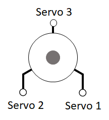

.. _traditional-helicopter-swashplate-setup:

=========================================
Traditional Helicopter – Swashplate Setup
=========================================

The swashplate is designed to take the servo inputs that are based on the pilot’s 
pitch, roll, and collective commands and translate them to individual blade pitch 
inputs. There are many different servo arrangements for both three and four servo 
swashplates. The swashplate library covers all of the popular configurations for 
both three and four servo swashplates. If you have a unique swashplate, you can 
also use the generic three servo swashplate. Linearize servo is a feature that you 
can use for both three and four servo swashplates however it is optional for the 
three servo swashplates as there is no chance for binding. It will most likely 
always be required for four servo swashplates because of the potential for binding 
in a four point attachment. 

Before You Begin
================

Prior to beginning the swashplate set up, be sure that your helicopter control 
linkages are set up in accordance with the assembly instructions. In order to make 
accurate blade pitch measurements, make the rotor shaft perpendicular to the ground 
by using shims underneath the landing gear as shown in the picture below.

Lastly it is possible if you haven’t adjusted your tail rotor linkage or your throttle
linkage in the case of a gas engine that you could have binding occur while doing the 
swashplate set up. This is due to the :ref:`H_SV_MAN <H_SV_MAN>` feature provides manual servo settings 
that drive the servos to the min and max values which includes the tail rotor servo 
and the throttle servo due to throttle curve settings.

Select Swashplate Type
======================

Below are the swashplate type selections using the :ref:`H_SW_TYPE<H_SW_TYPE__AP_MotorsHeli_Single>` parameter.  The diagrams
shown list the servo 1, servo 2 or servo 3 for the three servo swashplate types.  These
correspond to the respective servo outputs in the parameters list and are the default 
servos for these swashplate types.  For single heli, the servo function assigned to servo 1
is motor 33, servo 2 is motor 34, and servo 3 is motor 35.  These assignments are the same 
for swashplate 1 for a dual heli frame.  Swashplate 2 for a dual heli defaults to 
servos 4, 5, and 6 with motors 36, 37 and 38 assigned respectively.  For four servo swashplates,
the fourth servo on the single heli frame defaults to servo 5 and is assigned motor 37. 
For the dual heli frame, the fourth servo on swashplate 1 defaults to servo 7 and is assigned 
motor 39. The fourth servo on swashplate 2 defaults to servo 8 and is assigned motor 40. 
In the case of dual heli frame with four servo swashplates, the RSCHeli function (motor 31) will 
need to be moved to one of the aux servo outputs (9-16).

- H3 Generic - Allows servo positions and phase angle to be set by user.  Assumes all swashplate ball links are the same distance from the main shaft.
- H1 non-CCPM - Servo1 is aileron, Servo 2 is elevator and Servo 3 is collective
- H3-140

- H3-120

- H4-90

- H4-45

Other swashplates types that can be supported

- H3R-140 - Use H3-140. May require :ref:`H_SW_COL_DIR<H_SW_COL_DIR__AP_MotorsHeli_Single>` to be reversed.

- H3R-120 - Use H3-120. May require :ref:`H_SW_COL_DIR<H_SW_COL_DIR__AP_MotorsHeli_Single>` to be reversed.

- H3-90 - Use H4-90.  Don't use one of the servo outputs.

Check Proper Swashplate Movement
================================

Use your transmitter to check for proper swashplate response to cyclic and collective inputs.  
Push forward on the elevator stick and swashplate tilts forward; pull back on the elevator 
stick and swashplate tilts aft.  Push right on the aileron stick and the swashplate tilts 
right; Push left on the aileron stick and the swashplate tilts left.  Push up on the throttle 
stick (collective) and the swashplate will rise; pull down on the throttle stick (collective) 
and the swashplate will lower. Set the :ref:`SERVO1_REVERSED <SERVO1_REVERSED>`, :ref:`SERVO2_REVERSED <SERVO2_REVERSED>`, :ref:`SERVO3_REVERSED <SERVO3_REVERSED>`, and :ref:`H_SW_COL_DIR <H_SW_COL_DIR__AP_MotorsHeli_Single>` parameters so that your swashplate responds correctly (as described above) to 
your collective and cyclic inputs.

Leveling your Swashplate
========================

The swashplate can be leveled using either a tool specially designed to keep the swashplate 
perpendicular to the shaft or, a less expensive way, using a magnet and nail (shown below). 
Using the magnet and nail won’t require you to remove your rotor head to level your swashplate. 
Rotate the shaft so the nail passes over the swashplate arm.  Adjusts swashplate using one of 
methods below so the nail touches the top of each swashplate arm.

**Leveling swashplate without using linear servo**

If you aren’t using the linearize servo feature, then you will use the servo trim parameters 
to level your swashplate. Set the :ref:`H_SV_MAN <H_SV_MAN>` parameter to 1.  Adjust the transmitter throttle 
stick (collective) until the servos are nearly perpendicular to the shaft.  Adjust :ref:`SERVO1_TRIM <SERVO1_TRIM>` , 
:ref:`SERVO2_TRIM <SERVO2_TRIM>`, and :ref:`SERVO3_TRIM <SERVO3_TRIM>` until the swashplate is level.

**Leveling swashplate using linear servo**

If you intend to use linearize servo feature then you will have to level your swashplate using 
pitch links that connects swashplate to the servo. First though, you will set your servo so that
at the midpoint of the servo travel, the arm is perpendicular to the pitch link which in most cases
will be perpendicular to the shaft as well. If the spline on the servo control horn is not allowing
you to get the servo arm perpendicular to the shaft, then you can use the servo trim parameters 
to make them perpendicular to the shaft. You want the trim as close to 1500 as you can get. Now you
can adjust your pitch links to make the swashplate level. 

Setting Collective Pitch Range and Zero Thrust Point
====================================================

Use the servo manual setting (:ref:`H_SV_MAN <H_SV_MAN>` ) to move the swashplate between min, mid and max positions.
At each position use the blade pitch gauge to set the desired blade pitch.  A typical collective 
blade pitch range is -2° to +10°.  

Set :ref:`H_SV_MAN <H_SV_MAN>` to 2 to have swashplate move to maximum position.  Adjust :ref:`H_COL_MAX <H_COL_MAX>` until blade pitch 
angle mesures the desired maximum collective blade pitch.  

Set :ref:`H_SV_MAN <H_SV_MAN>` to 4 to have swashplate move to minimum position.  Adjust :ref:`H_COL_MIN <H_COL_MIN>` until blade pitch
angle measures the desired minimum collective blade pitch.

The :ref:`H_COL_MID <H_COL_MID>` parameter is used for the collective to yaw mixing.  It is also used as the lower 
collective pitch limit for modes that use altitude hold in the vertical axis.  This keeps the autopilot
from driving collective to low resulting in ground resonance. The :ref:`H_COL_MID <H_COL_MID>` parameter is set to zero 
degree collective blade pitch or, if you have non-symmetrical blades, then set it to the blade pitch 
that produces zero thrust. In Copter 3.6 and ealier, the minimum collective pitch that the autopilot 
could command was done with the parameter ``H_COL_LAND_MIN``. 

Set :ref:`H_SV_MAN <H_SV_MAN>` to 3 to have the swashplate move to the mid position.  Adjust :ref:`H_COL_MID <H_COL_MID>` until the blade
pitch angle measures the desired collective blade pitch that corresponds to zero thrust.  

Setting Maximum Cyclic Pitch
============================

The parameter :ref:`H_CYC_MAX <H_CYC_MAX>` sets the maximum cyclic blade pitch.
Checking the maximum cyclic blade pitch requires positioning the blades 90 deg to the axis that is being measured.
Therefore if the longitudinal maximum blade cyclic pitch is being measured then rotate the blades until they are perpendicular to the fuselage
of the aircraft (sticking out the left and right side).  Measure the blade pitch with the elevator and aileron stick centered and then deflect
the elevator stick full forward or aft and measure the blade pitch.  The difference between the two measurements would be the maximum cyclic 
blade pitch corresponding to the :ref:`H_CYC_MAX <H_CYC_MAX>` .  The cyclic blade pitch is the same for the pitch (elevator) and roll (aileron) axes.
