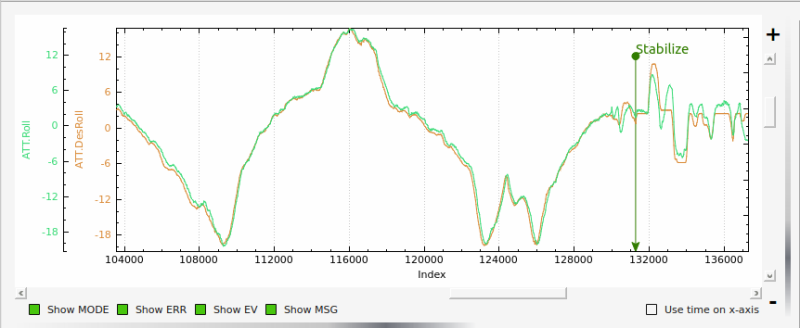

.. _traditional-helicopter-tuning-other-topics:

========================
Additional Tuning Topics
========================

Hover Trim
==========

Trimming the helicopter in pitch and roll axes is an important step to keep the
aircraft from drifting in modes like Stabilize and Althold.  The trim attitude 
in the roll axis is affected by the tail rotor thrust.  All conventional single-
rotor helicopters with a torque-compensating tail rotor hover either right skid 
low or left skid low, depending on which way the main rotor turns. The 
ArduCopter software has a parameter, :ref:`ATC_HOVR_ROL_TRM<ATC_HOVR_ROL_TRM>`, to compensate for this phenomenon. Longitudinal CG location will affect the trim attitude in the pitch
axis.  There is no parameter to tell the autopilot what pitch attitude 
the aircraft hovers with no drift. It always targets zero deg pitch as measured
by the autopilot. Therefore the actual pitch attitude the aircraft 
hovers may be 5 deg nose high but the autopilot AHRS Trim value is set
to make it think the attitude is zero deg. 

In order to trim the aircraft, set the :ref:`ATC_HOVR_ROL_TRM<ATC_HOVR_ROL_TRM>` parameter to zero. 
During the initial setup of the autopilot, the ``AHRS_TRIM_x`` values are set 
during the accelerometer calibration on the last step that has you level the 
aircraft. For that step you should have made certain that the shaft was 
perfectly straight up in pitch and roll. For this trim procedure, it is 
recommended that you check it and using the method below.

Measure the actual frame angle (on a portion of the frame that is perpendicular
to the mainshaft) in pitch and roll with your digital pitch gauge. Connected to
your ground station software with MavLink, note the pitch and roll angle the
autopilot is "seeing". Adjust the :ref:`AHRS_TRIM_X<AHRS_TRIM_X>` and :ref:`AHRS_TRIM_Y<AHRS_TRIM_Y>` values so the autopilot "sees" the identical frame angle you measured with the digital pitch gauge. You can use the Level Horizon function in your ground station to level the horizon with the helicopter at actual level. That function will
make the adjustments to the AHRS_TRIM's for you.

The above is necessary so we can accurately measure the roll angle to set the
:ref:`ATC_HOVR_ROL_TRM<ATC_HOVR_ROL_TRM>`. The autopilot now "knows" when the mainshaft is
perfectly vertical.

Load the helicopter with its normal payload, and hover the helicopter
in no-wind conditions in Stabilize flight mode. Land it and pull the log, noting
the roll angle that you had to hold with the stick to keep the helicopter from
drifting. Enter this value in the :ref:`ATC_HOVR_ROL_TRM<ATC_HOVR_ROL_TRM>` parameter in centidegrees.
For a CW turning main rotor if it took 3.5 degrees of right roll to compensate,
enter 350. Negative values are for a CCW turning main rotor that requires left
roll to compensate.

..  warning:: Do not use the radio trims at all. Make sure they are at the same position as when the :ref:`common-radio-control-calibration` was done. 

After setting the :ref:`ATC_HOVR_ROL_TRM<ATC_HOVR_ROL_TRM>` now hover the helicopter again. If it still
drifts make small adjustments to the :ref:`SERVO1_TRIM<SERVO1_TRIM>` , :ref:`SERVO2_TRIM<SERVO2_TRIM>` and :ref:`SERVO3_TRIM<SERVO3_TRIM>` .
The chances of getting the swashplate perfectly level during bench setup is very
low and this dynamic tuning is needed to trim the helicopter. If it requires
large deviation from your original ``SERVOx_TRIM`` values it is likely you have a CG
problem, or your initial setup when leveling the swashplate was not very
accurate.

Your helicopter is now trimmed properly. This trimming procedure makes the
difference between a helicopter that is difficult to handle vs one that flies
with true scale quality and handling. 

Tuning ACCEL MAX and Feel
=========================

The final setting for ``ATC_ACCEL_x_MAX`` parameters will depend on the size of the
helicopter.  Large 800-900 class machines will typically be in the 36000-52000 
range; smaller 450-500 class machines will typically be in the 90000-110000 
range. You may want to experiment with the :ref:`ATC_INPUT_TC<ATC_INPUT_TC>` parameter as well to get
the initial aircraft response the way you like it.  It is recommended to keep the
:ref:`ATC_INPUT_TC<ATC_INPUT_TC>` parameter between 0.15 and 0.25 (for ``RC_FEEL`` with AC 3.5 or earlier,
the recommended range was 25 to 50).  Once this process is complete, the aircraft
should have the desired feel in snappiness and rate.

Below is a graph showing an example of Rate Roll Desired vs actual Rate Roll.
The peak corresponds to a rapid stick input and the amplitude (height) of the
peaks should be approximately the same with no more than 100 milliseconds 
offset.

.. image:: ../images/TradHeli_tuning_example1_1.png
    :target: ../_images/TradHeli_tuning_example1_1.png

Setting IMAX and ILMI
=====================
The IMAX value limits amount of integrator error that can be stored to counter large
disturbances in attitude.  In the pitch axis this is set by the integrator error
required to hold the aircraft attitude at high forward speeds.  The starting
value is 0.4.  To check this set the value to IMAX = 1, fly the aircraft at the
maximum desired speed.  Pull the log and look at what the maximum I value is in
the PIDP message.  Set IMAX for 0.1 above the maximum value.  You could do the
same for the roll axis but typically 0.4 should be sufficient.  ILMI is set for
the maximum amount of integrator that you want to retain in a hover to help
maintain attitude.  It is recommended that this value is no larger than 0.1

Below is a graph of desired roll attitude vs actual roll attitude for a
helicopter in high-speed autonomous flight with the ILMI parameters set to zero.
The effect of the I-gain and IMAX parameters, properly set, will make the
helicopter track the desired attitude very closely at speed exceeding 5m/s for
more than 2 seconds (what we call “dynamic flight”). It should be within 1-2
degrees of desired in dynamic flight. Towards the right side of the graph the
helicopter came to a stop in hover and the pilot switched to Stabilize flight
mode. You will notice a discrepancy between the actual and desired roll attitude
at that point. This is the effect of having ILMI set to zero. The ILMI can be
considered to be a sort of “auto trim” for hover that will reduce the
discrepancy between desired and actual pitch and roll attitude when the
helicopter is not in dynamic flight.

Adjusting I-gains For High-Speed Autonomous Flight
==================================================

Prepare a mission with your ground station software that will fly the 
helicopter, preferably in a figure-8 pattern to make both right and left turns,
at a speed of 6 m/s. Fly the helicopter on this mission, pull the logs from the
microSD card and look at the AHRS desired vs actual pitch, roll and yaw
attitudes in dynamic flight. They should track within 1-2 degrees. If they do
not, increase the ``ATC_RAT_xxx_I`` value for that axis until they do.

Now, fly the same mission, but at higher speed of 9-10 m/s, and analyze the logs
the same way. Make further adjustments to the I-gains and IMAX values as
required. It is not clear what I-gain values will be required as no two
helicopters are the same. But I-gain values from 0.25 - 0.38 are common in pitch
and roll, and 0.18 - 0.30 in yaw. IMAX values of 0.40 - 0.45 are common, however
refer to the 'Setting IMAX, and ILMI' section on how to determine
what the IMAX value should be.

Preventing I term Build Up
==========================

A downside of the I term is that it can build if the vehicle is constrained in its movement, so as not to be able to respond and reduce any long term errors, as when still on the ground. The I term can build to its maximum value and could possibly tip over the vehicle. Two methods are provided to avoid this.

The first is by restricting by providing a "leak" mechanism (constantly reduced at a specified rate) when on the ground or hover(actually when moving with a GPS speed of less than 5m/s). To prevent the I term from completely disappearing at low speeds or hover, the parameters :ref:`ATC_RAT_RLL_ILMI<ATC_RAT_RLL_ILMI>` and :ref:`ATC_RAT_PIT_ILMI <ATC_RAT_PIT_ILMI>`, only lets it leak off so much. So the integrator leak along with the leak minimum parameter keep 
enough of the integrator to make it effective in keeping the attitudes matching
but not so powerful to cause the aircraft to roll over.

The second is to use ArduPilot's landing and takeoff detection algorithms to zero the I terms when on the ground, and allow it to operate normally after takeoff.

Which method is used is determined by the :ref:`H_OPTIONS<H_OPTIONS>` bitmask. Setting bit 0 (ie "1" for the parameter value) will use the first method with a leaky integrator. Since this was the only method used in versions prior to 4.1, it is the default method to avoid changes in behavior upon upgrading to version 4.1. But clearing that bit (value = "0"), will use the second method, which is now usually preferred.
