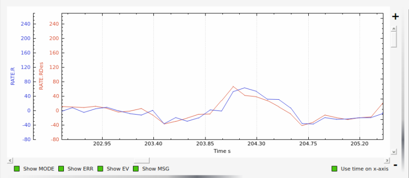
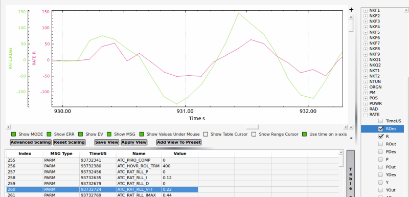
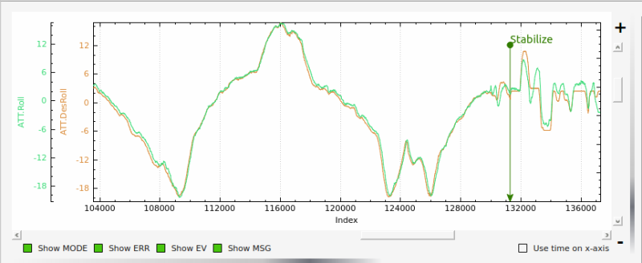

.. _traditional-helicopter-tuning:

===============================
Traditional Helicopter – Tuning
===============================

This tuning guide is applicable to current versions of ArduCopter for traditional
helicopters. See the :ref:`old tuning guide which is archived here <traditional-helicopter-archived-tuning>` for old versions.

For making setting changes to traditional helicopters, users are reminded to 
use only the Full or Complete Parameter List in your ground station software. 
**Do not use the Basic, Extended or Advanced Tuning pages that are designed for
multi-rotor aircraft.** These pages will make unwanted setting changes to 
traditional helicopters. And remember to write the changes to the flight 
controller after making them or they won't be saved!

General ArduCopter Flight Control Law Description
=================================================
Users should generally understand the flight control laws before tuning. At
a high level, the arducopter control laws are designed as a model following
architecture where the software converts the pilot input into a commanded
attitude (Stabilize Mode) or commanded rate (Acro mode) and controls the
aircraft to achieve that commanded value. In the background, the software keeps
track of, or predicts, where the aircraft should be in space (i.e. pitch and
roll attitude) based on the inputs of the pilot or autopilot. It has two
controllers (attitude and rate) that work together to ensure the actual aircraft
is following the software’s predicted pitch and roll rates and attitudes.
 
The pilot’s commands are limited by the amount of acceleration that can be
commanded through the :ref:`ATC_ACCEL_P_MAX<ATC_ACCEL_P_MAX>` for pitch and :ref:`ATC_ACCEL_R_MAX<ATC_ACCEL_R_MAX>` for roll.
The initial responsiveness (crispness/sluggishness) of the aircraft to the pilot
input can be adjusted through the :ref:`ATC_INPUT_TC<ATC_INPUT_TC>` parameter (in AC 3.5 or earlier,
this parameter was called RC_FEEL). The pilot input and these parameters are
used to determine the requested rate required to achieve the desired response
that is fed to the rate controller.
 
The attitude controller is used to ensure the actual attitude of the aircraft
matches the predicted attitude of the autopilot. It uses the
:ref:`ATC_ANG_PIT_P<ATC_ANG_PIT_P>` in pitch and the :ref:`ATC_ANG_RLL_P<ATC_ANG_RLL_P>` in roll to determine a rate that is
fed to the rate controller that will drive the aircraft to the predicted
attitude. 

The rate controller receives the sum of the requested rate resulting
from the pilot input and the rate from the attitude controller and determines
the swashplate commands required to achieve the input rate. The rate controller
uses a PID control algorithm and a feed forward path to control the aircraft and
achieve the input rate. The feed forward path uses the input rate and applies
the :ref:`ATC_RAT_PIT_VFF<ATC_RAT_PIT_VFF>` gain for pitch and :ref:`ATC_RAT_RLL_VFF<ATC_RAT_RLL_VFF>` gain for roll to
determine its portion of the swashplate command. The PID algorithm uses the
error between the actual rate and input rate to determine its portion of the
swashplate command. These are summed and sent to the mixing unit where the servo
positions are determined.

So this tuning method uses the FF gain initially to ensure the requested rates
match the actual rates.  However the rates can vary from the requested due to
disturbances. The P and D gains are then used to guard against disturbances
that cause the actual rates to deviate from the requested rates. So the P and D
gain may not be able to keep the actual rates exactly matching the requested
rates.  Since the software is tracking where the orientation of the aircraft
should be, then any error between the requested and actual rates will result in
attitude error. So there is a feature called the integrator that continually
sums the rate errors which effectively calculates the error in attitude.  The
I gain is multiplied by the integrator and summed with the other outputs of the
rate controller.  The integrator is limited by the :ref:`ATC_RAT_RLL_IMAX<ATC_RAT_RLL_IMAX__AC_AttitudeControl_Heli>` in roll and
:ref:`ATC_RAT_PIT_IMAX<ATC_RAT_PIT_IMAX__AC_AttitudeControl_Heli>` in pitch.  When ground speed is less than 5 m/s, the
integrator is leaked off (reduced at a specified rate) and another parameter, 
:ref:`ATC_RAT_RLL_ILMI<ATC_RAT_RLL_ILMI>` and :ref:`ATC_RAT_PIT_ILMI <ATC_RAT_PIT_ILMI>`, only lets it leak off so much.  If the 
ILMI, or integrator leak minimum, is zero then the integrator will not be 
allowed to grow and the attitude will not be driven to exactly match the 
software’s predicted attitude.  However, if this is non zero or large enough for
attitude errors that may be encountered at low speeds and in a hover, then the 
actual attitude will track the predicted attitude. The reason for the leak and 
ILMI parameter is that a larger amount of integrator is needed for forward 
flight. However, in a hover and in particular during air ground transition, 
allowing large amounts of integrator can cause the aircraft to flip itself on
its side.  So the integrator leak along with the leak minimum parameter keep 
enough of the integrator to make it effective in keeping the attitudes matching
but not so powerful to cause the aircraft to roll over.

Initial Setup of Pitch and Roll Tuning Parameters
=================================================
Below are the initial parameters values that should be used to start the tuning
of your helicopter. Use the suggested parameters in the yaw section below for
the tail. The helicopter will be easily controllable with just the FF set to
0.15 on pitch and roll in the event that you need to modify the tail settings
from the defaults.  

+----------------------------------------------------------------------+---------+
| :ref:`ATC_ACCEL_P_MAX<ATC_ACCEL_P_MAX>`                              | 110000  |
+----------------------------------------------------------------------+---------+
| :ref:`ATC_ACCEL_R_MAX<ATC_ACCEL_R_MAX>`                              | 110000  |
+----------------------------------------------------------------------+---------+
| :ref:`ATC_ANG_PIT_P<ATC_ANG_PIT_P>`                                  | 4.5     |
+----------------------------------------------------------------------+---------+
| :ref:`ATC_ANG_RLL_P<ATC_ANG_RLL_P>`                                  | 4.5     |
+----------------------------------------------------------------------+---------+
| :ref:`ATC_RAT_PIT_D<ATC_RAT_PIT_D__AC_AttitudeControl_Heli>`         | 0       |
+----------------------------------------------------------------------+---------+
| ATC_RAT_PIT_FILT/                                                    | 20      |
| :ref:`ATC_RAT_PIT_FLTE<ATC_RAT_PIT_FLTE__AC_AttitudeControl_Heli>` **|         |
+----------------------------------------------------------------------+---------+
| :ref:`ATC_RAT_PIT_I<ATC_RAT_PIT_I__AC_AttitudeControl_Heli>`         | 0       |
+----------------------------------------------------------------------+---------+
| :ref:`ATC_RAT_PIT_ILMI<ATC_RAT_PIT_ILMI>`                            | 0       |
+----------------------------------------------------------------------+---------+
| :ref:`ATC_RAT_PIT_IMAX<ATC_RAT_PIT_IMAX__AC_AttitudeControl_Heli>`   | 0.40    |
+----------------------------------------------------------------------+---------+
| :ref:`ATC_RAT_PIT_P<ATC_RAT_PIT_P__AC_AttitudeControl_Heli>`         | 0       |
+----------------------------------------------------------------------+---------+
| :ref:`ATC_RAT_PIT_VFF<ATC_RAT_PIT_VFF>`                              | 0.15    |
+----------------------------------------------------------------------+---------+
| :ref:`ATC_RAT_RLL_D<ATC_RAT_RLL_D__AC_AttitudeControl_Heli>`         | 0       |
+----------------------------------------------------------------------+---------+
| ATC_RAT_RLL_FILT/                                                    | 20      |
| :ref:`ATC_RAT_RLL_FLTE<ATC_RAT_RLL_FLTE__AC_AttitudeControl_Heli>` **|         |
+----------------------------------------------------------------------+---------+
| :ref:`ATC_RAT_RLL_I<ATC_RAT_RLL_I__AC_AttitudeControl_Heli>`         | 0       |
++---------------------------------------------------------------------+---------+
| :ref:`ATC_RAT_RLL_ILMI<ATC_RAT_RLL_ILMI>`                            | 0       |
+----------------------------------------------------------------------+---------+
| :ref:`ATC_RAT_RLL_IMAX<ATC_RAT_RLL_IMAX__AC_AttitudeControl_Heli>`   | 0.40    |
+----------------------------------------------------------------------+---------+
| :ref:`ATC_RAT_RLL_P<ATC_RAT_RLL_P__AC_AttitudeControl_Heli>`         | 0       |
+----------------------------------------------------------------------+---------+
| :ref:`ATC_RAT_RLL_VFF<ATC_RAT_RLL_VFF>`                              | 0.15    |
+----------------------------------------------------------------------+---------+
| :ref:`ATC_INPUT_TC<ATC_INPUT_TC>`                                    | 0.15    |
+----------------------------------------------------------------------+---------+

** This param name changed in ArduPilot 4.0 and later.

Tuning the Yaw Axis (Rudder)
============================
It is recommended to make sure the tail functions properly before proceeding
with tuning pitch and roll.

**Important Note** - UAV helicopters, as opposed to sport helicopters, will
usually be running low headspeed and higher disc loading. With a mechanically
driven tail this also means lower than normal tail speed and reduced tail
authority. If your helicopter meets this description, it is recommended to set
:ref:`ATC_RAT_YAW_VFF<ATC_RAT_YAW_VFF>` to 0.05 before the first test hover.

Below are the current default settings for yaw. Spool up the heli and hover it
no more than .25 meters above ground in Stabilize flight mode and test the
starting tail settings. If the tail seems "loose" and doesn't want to hold
increase the :ref:`ATC_RAT_YAW_P<ATC_RAT_YAW_P__AC_AttitudeControl_Heli>`. If the tail rapidly shakes side to side reduce the
:ref:`ATC_ANG_YAW_P<ATC_ANG_YAW_P>`.

In all cases it is not recommended to adjust :ref:`ATC_ANG_YAW_P<ATC_ANG_YAW_P>` below 3.5 or
:ref:`ATC_RAT_YAW_P<ATC_RAT_YAW_P__AC_AttitudeControl_Heli>` above 0.38. If your helicopter cannot seem to achieve a solid tail
within those limits you likely have a mechanical problem with the tail - either
excessive "slop" or play in the linkage, binding of the linkage or a servo
problem. Correct the problem before proceeding with roll and pitch tuning.

+---------------------------------------------------------------------+----------+
| :ref:`ATC_ACCEL_Y_MAX<ATC_ACCEL_Y_MAX>`                             | 27000    |
+---------------------------------------------------------------------+----------+
| :ref:`ATC_ANG_YAW_P<ATC_ANG_YAW_P>`                                 |  4.5     |
+---------------------------------------------------------------------+----------+
| :ref:`ATC_RAT_YAW_D<ATC_RAT_YAW_D__AC_AttitudeControl_Heli>`        | 0.003    |
+---------------------------------------------------------------------+----------+
| ATC_RAT_YAW_FILT/                                                   |  20      |
| :ref:`ATC_RAT_YAW_FLTE<ATC_RAT_YAW_FLTE__AC_AttitudeControl_Heli>` *|          |
+---------------------------------------------------------------------+----------+
| :ref:`ATC_RAT_YAW_I<ATC_RAT_YAW_I__AC_AttitudeControl_Heli>`        | 0.12     |
+---------------------------------------------------------------------+----------+
| :ref:`ATC_RAT_YAW_ILMI<ATC_RAT_YAW_ILMI>`                           | 0        |
+---------------------------------------------------------------------+----------+
| :ref:`ATC_RAT_YAW_IMAX<ATC_RAT_YAW_IMAX__AC_AttitudeControl_Heli>`  | 0.33     |
+---------------------------------------------------------------------+----------+
| :ref:`ATC_RAT_YAW_P<ATC_RAT_YAW_P__AC_AttitudeControl_Heli>`        | 0.18     |
+---------------------------------------------------------------------+----------+
| :ref:`ATC_RAT_YAW_VFF<ATC_RAT_YAW_VFF>`                             | 0.024    |
+---------------------------------------------------------------------+----------+

* This param name changed in ArduPilot 4.0 and later.

Setting _FF and ACCEL_x_MAX Parameters for Desired Pitch and Roll Response
==========================================================================
In both pitch and roll axes, the FF gain is set so that the actual aircraft
rate matches the desired rate. To do this, the RATE message in the log is
required to compare the P.des and P signals for pitch and the R.des and R
signals for roll. With the FF gains set to 0.15, takeoff and establish a hover
in Stabilize flight mode, then make some sharp stick inputs in both pitch and
roll. Land and pull the log from the microSD card and look at the signals in
your ground station software. If the actual rate is more than the desired rate
then you'll want to decrease FF. If it is less, increase FF. If the desired
and actual rates are offset by some amount it means that your swash was not
properly leveled in the setup or the CG is not right.  In this case, just make
sure the change in rate is similar between desired and actual.  If you get the
rates to match and they feel like they are too fast, then reduce the
``ATC_ACCEL_x_MAX`` parameter and repeat the process above to match the desired and
actual rates. 

If while tuning the FF gain the aircraft starts to oscillate, reduce the 
ATC_ANG_xxx_P gain for that axis until the oscillations stop.  However for most 
helicopters the suggested values above should not cause this problem.

With a flybar head, where the linkage rate is normally lower, it is recommended
to start with 0.22 FF for both pitch and roll and you will likely have to go
higher with FF. But for a flybarless head, FF shouldn't be more than 0.22 
unless you have really really slow servos or slow linkage rate. With all 
helicopters, the FF gain compensates for differences in servo and linkage
speed. 

The final setting for ``ATC_ACCEL_x_MAX`` parameters will depend on the size of the
helicopter.  Large 800-900 class machines will typically be in the 36000-52000 
range; smaller 450-500 class machines will typically be in the 90000-110000 
range. You may want to experiment with the :ref:`ATC_INPUT_TC<ATC_INPUT_TC>` parameter as well to get
the initial aircraft response the way you like it.  It is recommended to keep the
:ref:`ATC_INPUT_TC<ATC_INPUT_TC>` parameter between 0.15 and 0.25 (for ``RC_FEEL`` with AC 3.5 or earlier,
the recommended range was 25 to 50).  Once this process is complete, the aircraft
should have the desired feel in snappiness and rate.

Below is a graph showing an example of Rate Roll Desired vs actual Rate Roll.
The peak corresponds to a rapid stick input and the amplitude (height) of the
peaks should be approximately the same with no more than 100 milliseconds 
offset.

**Note on Tuning Flybar Helicopers** - for flybar heads the flybar is a
mechanical version of the rate PID loop. So flybar is tuned using only FF in
pitch and roll. The rate D and P gains mentioned in the next topic below are
left set to zero for flybar. I-gain, IMAX, and ILMI are tuned just like FBL.
Below is a plot of beginning a tune on a flybar helicopter using the starting
setting of :ref:`ATC_RAT_RLL_VFF<ATC_RAT_RLL_VFF>` = 0.22. The graph shows the aircraft's response to
the rate request of the attitude controller is low, meaning the FF value must
be increased to achieve proper rate response. For all flybar helicopters be sure
to set :ref:`H_FLYBAR_MODE<H_FLYBAR_MODE>` = 1

Tuning the D and P gain
=======================
Once you have the heli responding nicely with the rate FF gain, now tune the
PID gains. The rate PID controller provides stability to reject disturbances and
keep the actual aircraft following the software predicted rates.
 
Start with the D gain.  Use the :ref:`Transmitter based tuning<common-transmitter-tuning>` feature of ArduCopter.  Make the following parameter changes:

+--------------------------------------------+---------+
| :ref:`TUNE<TUNE>`                          | 21      |
+--------------------------------------------+---------+
| ``TUNE_LOW`` (prior to 4.0)                | 0       |
+--------------------------------------------+---------+
| :ref:`TUNE_MIN<TUNE_MIN>` (4.0 and later)  | 0       |
+--------------------------------------------+---------+
| ``TUNE_HIGH`` (prior to 4.0)               | 30      |
+--------------------------------------------+---------+
| :ref:`TUNE_MAX<TUNE_MAX>` (4.0 and later)  | 0.030*  |
+--------------------------------------------+---------+

*for futaba radios this equates to one increment in the knob to 0.001*

Adjust the tuning knob until the :ref:`ATC_RAT_RLL_D<ATC_RAT_RLL_D__AC_AttitudeControl_Heli>` and :ref:`ATC_RAT_PIT_D<ATC_RAT_PIT_D__AC_AttitudeControl_Heli>` gains are
0.001. Lift into a hover and make some sharp stick inputs in roll.  Most
helicopters will see roll oscillations before they see pitch oscillations.
That is why roll inputs are suggested.  If it doesn't shake, increase the gain
by 0.001 and try it again. At the value where you get the rapid shaking, cut
that value in half and enter it as the final tuning value for :ref:`ATC_RAT_RLL_D<ATC_RAT_RLL_D__AC_AttitudeControl_Heli>` and
:ref:`ATC_RAT_PIT_D<ATC_RAT_PIT_D__AC_AttitudeControl_Heli>`.  Test hover the heli and make some rapid stick movements in both
pitch and roll to make sure it's stable.

Now tune the P gains.  Make the following tuning parameter changes:

+--------------------------------------------+---------+
| :ref:`TUNE<TUNE>`                          | 4       |
+--------------------------------------------+---------+
| ``TUNE_LOW`` (prior to 4.0)                | 0       |
+--------------------------------------------+---------+
| :ref:`TUNE_MIN<TUNE_MIN>` (4.0 and later)  | 0       |
+--------------------------------------------+---------+
| ``TUNE_HIGH`` (prior to 4.0)               | 300     |
+--------------------------------------------+---------+
| :ref:`TUNE_MAX<TUNE_MAX>` (4.0 and later)  | 0.3*    |
+--------------------------------------------+---------+

*for futaba radios this equates to one increment in the knob to 0.01*

Adjust the tuning knob until the :ref:`ATC_RAT_RLL_P<ATC_RAT_RLL_P__AC_AttitudeControl_Heli>` and :ref:`ATC_RAT_PIT_P<ATC_RAT_PIT_P__AC_AttitudeControl_Heli>`  gains are
0.05. Lift into a hover and roll aggressively from side to side.  If it doesn't
shake, increase the gain by 0.01 and try it again. At the value where you get
the rapid shaking, cut that value in half and enter it as the final tuning value
for :ref:`ATC_RAT_RLL_P<ATC_RAT_RLL_P__AC_AttitudeControl_Heli>` and :ref:`ATC_RAT_PIT_P<ATC_RAT_PIT_P__AC_AttitudeControl_Heli>`.  Test hover the heli and make some rapid
stick movements in both pitch and roll to make sure it's stable.  

After tuning the P and D gain the aircraft should feel much smoother.

Setting the I gain, IMAX, and ILMI
==================================
It is recommended to set the :ref:`ATC_RAT_PIT_I<ATC_RAT_PIT_I__AC_AttitudeControl_Heli>` gain equal to the :ref:`ATC_RAT_PIT_VFF<ATC_RAT_PIT_VFF>`
gain and the :ref:`ATC_RAT_RLL_I<ATC_RAT_RLL_I__AC_AttitudeControl_Heli>` gain equal to the :ref:`ATC_RAT_RLL_VFF<ATC_RAT_RLL_VFF>` gain.  The IMAX
value limits amount of integrator error that can be stored to counter large
disturbances in attitude.  In the pitch axis this is set by the integrator error
required to hold the aircraft attitude at high forward speeds.  The starting
value is 0.4.  To check this set the value to IMAX = 1, fly the aircraft at the
maximum desired speed.  Pull the log and look at what the maximum I value is in
the PIDP message.  Set IMAX for 0.1 above the maximum value.  You could do the
same for the roll axis but typically 0.4 should be sufficient.  ILMI is set for
the maximum amount of integrator that you want to retain in a hover to help
maintain attitude.  It is recommended that this value is no larger than 0.1

Below is a graph of desired roll attitude vs actual roll attitude for a
helicopter in high-speed autonomous flight with the ILMI parameters set to zero.
The effect of the I-gain and IMAX parameters, properly set, will make the
helicopter track the desired attitude very closely at speed exceeding 5m/s for
more than 2 seconds (what we call “dynamic flight”). It should be within 1-2
degrees of desired in dynamic flight. Towards the right side of the graph the
helicopter came to a stop in hover and the pilot switched to Stabilize flight
mode. You will notice a discrepancy between the actual and desired roll attitude
at that point. This is the effect of having ILMI set to zero. The ILMI can be
considered to be a sort of “auto trim” for hover that will reduce the
discrepancy between desired and actual pitch and roll attitude when the
helicopter is not in dynamic flight.

======================================================================
Advanced Tuning for Hover Trim, Loiter Flight Mode and Waypoint Flying
======================================================================
At this point you should have a helicopter that is responsive and yet stable.
But we need to trim the helicopter so it hovers pretty much hands-off in
Stabilize flight mode. And adjust the I-gains for Auto flight mode so it tracks
attitude properly under full autopilot control.

Hover Trim
==========
Trimming the helicopter in pitch and roll axes is an important step to keep the
aircraft from drifting in modes like Stabilize and Althold.  The trim attitude 
in the roll axis is affected by the tail rotor thrust.  All conventional single-
rotor helicopters with a torque-compensating tail rotor hover either right skid 
low or left skid low, depending on which way the main rotor turns. The 
ArduCopter software has a parameter, :ref:`ATC_HOVR_ROL_TRM<ATC_HOVR_ROL_TRM>`, to compensate for this 
phenomenon. Longitudinal CG location will affect the trim attitude in the pitch
axis.  There is no parameter to tell the autopilot what pitch attitude 
the aircraft hovers with no drift. It always targets zero deg pitch as measured
by the autopilot. Therefore the actual pitch attitude the aircraft 
hovers may be 5 deg nose high but the autopilot AHRS Trim value is set
to make it think the attitude is zero deg. 

In order to trim the aircraft, set the :ref:`ATC_HOVR_ROL_TRM<ATC_HOVR_ROL_TRM>` parameter to zero. 
During the initial setup of the autopilot, the ``AHRS_TRIM_x`` values are set 
during the accelerometer calibration on the last step that has you level the 
aircraft. For that step you should have made certain that the shaft was 
perfectly straight up in pitch and roll. For this trim procedure, it is 
recommended that you check it and using the method below.

Measure the actual frame angle (on a portion of the frame that is perpendicular
to the mainshaft) in pitch and roll with your digital pitch gauge. Connected to
your ground station software with MavLink, note the pitch and roll angle the
autopilot is "seeing". Adjust the :ref:`AHRS_TRIM_X<AHRS_TRIM_X>` and :ref:`AHRS_TRIM_Y<AHRS_TRIM_Y>` values so
the autopilot "sees" the identical frame angle you measured with the
digital pitch gauge. You can use the Level Horizon function in your ground station
to level the horizon with the helicopter at actual level. That function will
make the adjustments to the AHRS_TRIM's for you.

The above is necessary so we can accurately measure the roll angle to set the
:ref:`ATC_HOVR_ROL_TRM<ATC_HOVR_ROL_TRM>`. The autopilot now "knows" when the mainshaft is
perfectly vertical.

Load the helicopter with its normal payload, and hover the helicopter
in no-wind conditions in Stabilize flight mode. Land it and pull the log, noting
the roll angle that you had to hold with the stick to keep the helicopter from
drifting. Enter this value in the :ref:`ATC_HOVR_ROL_TRM<ATC_HOVR_ROL_TRM>` parameter in centidegrees.
For a CW turning main rotor if it took 3.5 degrees of right roll to compensate,
enter 350. Negative values are for a CCW turning main rotor that requires left
roll to compensate.

**Important Note** - do not use the radio trims at all. Make sure they are
centered. 

After setting the :ref:`ATC_HOVR_ROL_TRM<ATC_HOVR_ROL_TRM>` now hover the helicopter again. If it still
drifts make small adjustments to the :ref:`SERVO1_TRIM<SERVO1_TRIM>` , :ref:`SERVO2_TRIM<SERVO2_TRIM>` and :ref:`SERVO3_TRIM<SERVO3_TRIM>` .
The chances of getting the swashplate perfectly level during bench setup is very
low and this dynamic tuning is needed to trim the helicopter. If it requires
large deviation from your original ``SERVOx_TRIM`` values it is likely you have a CG
problem, or your initial setup when leveling the swashplate was not very
accurate.

Your helicopter is now trimmed properly. This trimming procedure makes the
difference between a helicopter that is difficult to handle vs one that flies
with true scale quality and handling. 

Adjusting I-gains For High-Speed Autonomous Flight
==================================================
Prepare a mission with your ground station software that will fly the 
helicopter, preferably in a figure-8 pattern to make both right and left turns,
at a speed of 6 m/s. Fly the helicopter on this mission, pull the logs from the
microSD card and look at the AHRS desired vs actual pitch, roll and yaw
attitudes in dynamic flight. They should track within 1-2 degrees. If they do
not, increase the ``ATC_RAT_xxx_I`` value for that axis until they do.

Now, fly the same mission, but at higher speed of 9-10 m/s, and analyze the logs
the same way. Make further adjustments to the I-gains and IMAX values as
required. It is not clear what I-gain values will be required as no two
helicopters are the same. But I-gain values from 0.25 - 0.38 are common in pitch
and roll, and 0.18 - 0.30 in yaw. IMAX values of 0.40 - 0.45 are common, however
refer to the 'Setting the I gain, IMAX, and ILMI' section on how to determine
what the IMAX value should be.
