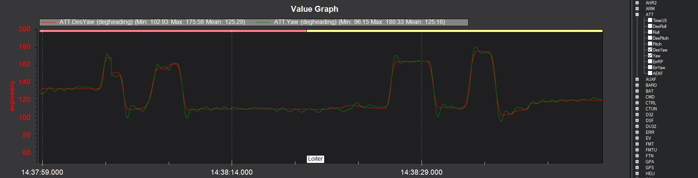
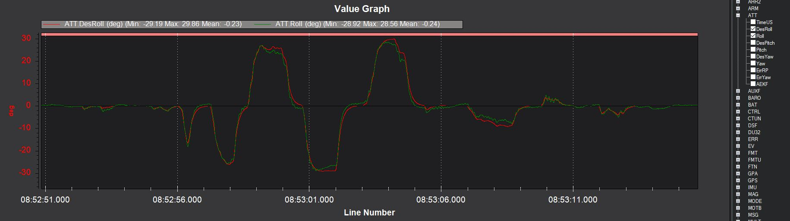

.. _traditional-helicopter-tuning:

===============================
Traditional Helicopter – Tuning
===============================

This tuning guide is applicable to current versions of ArduCopter for traditional
helicopters. See the :ref:`old tuning guide which is archived here <traditional-helicopter-archived-tuning>` for old versions.

.. warning:: For making setting changes to traditional helicopters, users are reminded to use only the Full or Complete Parameter List, or the Heli SETUP page in your ground station software. **Do not use the Basic, Extended or Advanced Tuning pages that are designed for multi-rotor aircraft in Mission Planner.** These pages will make unwanted setting changes to traditional helicopters. And remember to write the changes to the flight controller after making them or they won't be saved!

.. note:: If the reader is unfamiliar with PID control systems then reading :ref:`traditional-helicopter-control-system` is recommended.

Initial Setup of Pitch and Roll Tuning Parameters
=================================================

Below are the initial parameters values that should be used to start the tuning
of your helicopter. Use the suggested parameters in the yaw section below for
the tail. The helicopter will be easily controllable with just the FF set to
0.15 on pitch and roll in the event that you need to modify the tail settings
from the defaults.  

+----------------------------------------------------------------------+---------+
| :ref:`ATC_ACCEL_P_MAX<ATC_ACCEL_P_MAX>`                              | 110000  |
+----------------------------------------------------------------------+---------+
| :ref:`ATC_ACCEL_R_MAX<ATC_ACCEL_R_MAX>`                              | 110000  |
+----------------------------------------------------------------------+---------+
| :ref:`ATC_ANG_PIT_P<ATC_ANG_PIT_P>`                                  | 4.5     |
+----------------------------------------------------------------------+---------+
| :ref:`ATC_ANG_RLL_P<ATC_ANG_RLL_P>`                                  | 4.5     |
+----------------------------------------------------------------------+---------+
| :ref:`ATC_RAT_PIT_D<ATC_RAT_PIT_D__AC_AttitudeControl_Heli>`         | 0       |
+----------------------------------------------------------------------+---------+
| :ref:`ATC_RAT_PIT_FLTD<ATC_RAT_PIT_FLTD__AC_AttitudeControl_Heli>`   | 0       |
+----------------------------------------------------------------------+---------+
| ATC_RAT_PIT_FILT/                                                    | 20      |
| :ref:`ATC_RAT_PIT_FLTE<ATC_RAT_PIT_FLTE__AC_AttitudeControl_Heli>` **|         |
+----------------------------------------------------------------------+---------+
| :ref:`ATC_RAT_PIT_FLTT<ATC_RAT_PIT_FLTT__AC_AttitudeControl_Heli>`   | 20      |
+----------------------------------------------------------------------+---------+
| :ref:`ATC_RAT_PIT_I<ATC_RAT_PIT_I__AC_AttitudeControl_Heli>`         | 0       |
+----------------------------------------------------------------------+---------+
| :ref:`ATC_RAT_PIT_ILMI<ATC_RAT_PIT_ILMI>`                            | 0.05    |
+----------------------------------------------------------------------+---------+
| :ref:`ATC_RAT_PIT_IMAX<ATC_RAT_PIT_IMAX__AC_AttitudeControl_Heli>`   | 0.40    |
+----------------------------------------------------------------------+---------+
| :ref:`ATC_RAT_PIT_P<ATC_RAT_PIT_P__AC_AttitudeControl_Heli>`         | 0       |
+----------------------------------------------------------------------+---------+
| :ref:`ATC_RAT_PIT_VFF<ATC_RAT_PIT_VFF>`                              | 0.15    |
+----------------------------------------------------------------------+---------+
| :ref:`ATC_RAT_RLL_D<ATC_RAT_RLL_D__AC_AttitudeControl_Heli>`         | 0       |
+----------------------------------------------------------------------+---------+
| :ref:`ATC_RAT_RLL_FLTD<ATC_RAT_RLL_FLTD__AC_AttitudeControl_Heli>`   | 0       |
+----------------------------------------------------------------------+---------+
| ATC_RAT_RLL_FILT/                                                    | 20      |
| :ref:`ATC_RAT_RLL_FLTE<ATC_RAT_RLL_FLTE__AC_AttitudeControl_Heli>` **|         |
+----------------------------------------------------------------------+---------+
| :ref:`ATC_RAT_RLL_FLTT<ATC_RAT_RLL_FLTT__AC_AttitudeControl_Heli>`   | 20      |
+----------------------------------------------------------------------+---------+
| :ref:`ATC_RAT_RLL_I<ATC_RAT_RLL_I__AC_AttitudeControl_Heli>`         | 0       |
+----------------------------------------------------------------------+---------+
| :ref:`ATC_RAT_RLL_ILMI<ATC_RAT_RLL_ILMI>`                            | 0.05    |
+----------------------------------------------------------------------+---------+
| :ref:`ATC_RAT_RLL_IMAX<ATC_RAT_RLL_IMAX__AC_AttitudeControl_Heli>`   | 0.40    |
+----------------------------------------------------------------------+---------+
| :ref:`ATC_RAT_RLL_P<ATC_RAT_RLL_P__AC_AttitudeControl_Heli>`         | 0       |
+----------------------------------------------------------------------+---------+
| :ref:`ATC_RAT_RLL_VFF<ATC_RAT_RLL_VFF>`                              | 0.15    |
+----------------------------------------------------------------------+---------+
| :ref:`ATC_INPUT_TC<ATC_INPUT_TC>`                                    | 0.15    |
+----------------------------------------------------------------------+---------+

** This param name changed in ArduPilot 4.0 and later.

.. note:: before tuning, it is recommended that notch filtering (see :ref:`common-imu-notch-filtering`) be setup and that high frequency vibrations are not causing the "leans" (see :ref:`traditional-helicopter-tips`)

Tuning the Yaw Axis (Rudder)
============================

It is recommended to make sure the tail functions properly before proceeding
with tuning pitch and roll.

**Important Note** - UAV helicopters, as opposed to sport helicopters, will
usually be running low headspeed and higher disc loading. With a mechanically
driven tail this also means lower than normal tail speed and reduced tail
authority. If your helicopter meets this description, it is recommended to set
:ref:`ATC_RAT_YAW_VFF<ATC_RAT_YAW_VFF>` to 0.05 before the first test hover.

Below are the current default settings for yaw. 

+----------------------------------------------------------------------+----------+
| :ref:`ATC_ACCEL_Y_MAX<ATC_ACCEL_Y_MAX>`                              | 27000    |
+----------------------------------------------------------------------+----------+
| :ref:`ATC_ANG_YAW_P<ATC_ANG_YAW_P>`                                  | 4.5      |
+----------------------------------------------------------------------+----------+
| :ref:`ATC_RAT_YAW_D<ATC_RAT_YAW_D__AC_AttitudeControl_Heli>`         | 0.003    |
+----------------------------------------------------------------------+----------+
| :ref:`ATC_RAT_YAW_FLTD<ATC_RAT_YAW_FLTD__AC_AttitudeControl_Heli>`   | 0        |
+----------------------------------------------------------------------+----------+
| ATC_RAT_PIT_FILT/                                                    | 20       |
| :ref:`ATC_RAT_YAW_FLTE<ATC_RAT_YAW_FLTE__AC_AttitudeControl_Heli>` **|          |
+----------------------------------------------------------------------+----------+
| :ref:`ATC_RAT_YAW_FLTT<ATC_RAT_YAW_FLTT__AC_AttitudeControl_Heli>`   | 20       |
+----------------------------------------------------------------------+----------+
| :ref:`ATC_RAT_YAW_I<ATC_RAT_YAW_I__AC_AttitudeControl_Heli>`         | 0.12     |
+----------------------------------------------------------------------+----------+
| :ref:`ATC_RAT_YAW_ILMI<ATC_RAT_YAW_ILMI>`                            | 0.0      |
+----------------------------------------------------------------------+----------+
| :ref:`ATC_RAT_YAW_IMAX<ATC_RAT_YAW_IMAX__AC_AttitudeControl_Heli>`   | 0.33     |
+----------------------------------------------------------------------+----------+
| :ref:`ATC_RAT_YAW_P<ATC_RAT_YAW_P__AC_AttitudeControl_Heli>`         | 0.18     |
+----------------------------------------------------------------------+----------+
| :ref:`ATC_RAT_YAW_VFF<ATC_RAT_YAW_VFF>`                              | 0.024    |
+----------------------------------------------------------------------+----------+

** This param name changed in ArduPilot 4.0 and later.

Spool up the heli and hover it
no more than .25 meters above ground in Stabilize flight mode and test the
starting tail settings. If the tail seems "loose" and doesn't want to hold
increase the :ref:`ATC_RAT_YAW_P<ATC_RAT_YAW_P__AC_AttitudeControl_Heli>`. If the tail slowly wags back and forth, the :ref:`ATC_RAT_YAW_P<ATC_RAT_YAW_P__AC_AttitudeControl_Heli>` may be too high. If the tail rapidly shakes side to side reduce the
:ref:`ATC_ANG_YAW_P<ATC_ANG_YAW_P>`.

In all cases it is not recommended to adjust :ref:`ATC_ANG_YAW_P<ATC_ANG_YAW_P>` below 3.5 or
:ref:`ATC_RAT_YAW_P<ATC_RAT_YAW_P__AC_AttitudeControl_Heli>` above 0.38. If your helicopter cannot seem to achieve a solid tail
within those limits you likely have a mechanical problem with the tail - either
excessive "slop" or play in the linkage, binding of the linkage or a servo
problem. Correct the problem before proceeding with roll and pitch tuning.

The tune quality can be checked by examining the logs for ATT.DesYaw vs ATT.Yaw as shown below for an imperfect but flyable tune:

Note that there is a little overshoot and neutral ringing indicating that the FF or P gain is a little high or there is not enough D and could be improved a bit.

Setting _FF and ACCEL_x_MAX Parameters for Desired Pitch and Roll Response
==========================================================================

In both pitch and roll axes, the FF gain is set so that the actual aircraft
rate matches the desired rate. To do this, the RATE message in the log is
required to compare the RATE.PDes and RATE.P log data for pitch and the RATE.RDes and RATE.R
log data for roll.

With the FF gains set to 0.15, takeoff and establish a hover
in Stabilize flight mode, then make some sharp stick inputs in both pitch and
roll. Land and pull the log from the microSD card and look at the signals in
your ground station software. If the actual rate is more than the desired rate
then you'll want to decrease FF. If it is less, increase FF.

**(to be added...FF calculation directly from log data)**

If the desired and actual rates are offset by some amount it means that your swash was not
properly leveled in the setup and/or the CG is not right.  In this case, just make
sure the change in rate is similar in amplitude between desired and actual.  If you get the
rates to match and they feel like they are too fast, then reduce the
``ATC_ACCEL_x_MAX`` parameter and repeat the process above to match the desired and
actual rates. 

If while tuning the FF gain the aircraft starts to oscillate, reduce the 
ATC_ANG_xxx_P gain for that axis until the oscillations stop.  However for most 
helicopters the suggested values above should not cause this problem.

Tuning ACCEL MAX and Feel
=========================

The final setting for ``ATC_ACCEL_x_MAX`` parameters will depend on the size of the
helicopter.  Large 800-900 class machines will typically be in the 36000-52000 
range; smaller 450-500 class machines will typically be in the 90000-110000 
range. You may want to experiment with the :ref:`ATC_INPUT_TC<ATC_INPUT_TC>` parameter as well to get
the initial aircraft response the way you like it.  It is recommended to keep the
:ref:`ATC_INPUT_TC<ATC_INPUT_TC>` parameter between 0.15 and 0.25 (for ``RC_FEEL`` with AC 3.5 or earlier,
the recommended range was 25 to 50).  Once this process is complete, the aircraft
should have the desired feel in snappiness and rate.

Below is a graph showing an example of Rate Roll Desired vs actual Rate Roll.
The peak corresponds to a rapid stick input and the amplitude (height) of the
peaks should be approximately the same with no more than 100 milliseconds 
offset.

.. image:: ../images/TradHeli_tuning_example1_1.png
    :target: ../_images/TradHeli_tuning_example1_1.png

Tuning the D and P gain
=======================

Once you have the heli responding nicely with the rate FF gain, now tune the
PID gains. The rate PID controller provides stability to reject disturbances and
keep the actual aircraft following the software demanded rates.
 
Start with the D gain.  Use the :ref:`Transmitter based tuning<common-transmitter-tuning>` feature of ArduCopter.  Make the following parameter changes:

+--------------------------------------------+---------+
| :ref:`TUNE<TUNE>`                          | 21      |
+--------------------------------------------+---------+
| ``TUNE_LOW`` (prior to 4.0)                | 0       |
+--------------------------------------------+---------+
| :ref:`TUNE_MIN<TUNE_MIN>` (4.0 and later)  | 0       |
+--------------------------------------------+---------+
| ``TUNE_HIGH`` (prior to 4.0)               | 30      |
+--------------------------------------------+---------+
| :ref:`TUNE_MAX<TUNE_MAX>` (4.0 and later)  | 0.030*  |
+--------------------------------------------+---------+

*for futaba radios this equates to one increment in the knob to 0.001*

Adjust the tuning knob until the :ref:`ATC_RAT_RLL_D<ATC_RAT_RLL_D__AC_AttitudeControl_Heli>` and :ref:`ATC_RAT_PIT_D<ATC_RAT_PIT_D__AC_AttitudeControl_Heli>` gains are
0.001. Lift into a hover and make some sharp stick inputs in roll.  Most
helicopters will see roll oscillations before they see pitch oscillations.
That is why roll inputs are suggested.  If it doesn't shake, increase the gain
by 0.001 and try it again. At the value where you get the rapid shaking, cut
that value in half and enter it as the final tuning value for :ref:`ATC_RAT_RLL_D<ATC_RAT_RLL_D__AC_AttitudeControl_Heli>` and
:ref:`ATC_RAT_PIT_D<ATC_RAT_PIT_D__AC_AttitudeControl_Heli>`.  Test hover the heli and make some rapid stick movements in both
pitch and roll to make sure it's stable.

Now tune the P gains.  Make the following tuning parameter changes:

+--------------------------------------------+---------+
| :ref:`TUNE<TUNE>`                          | 4       |
+--------------------------------------------+---------+
| ``TUNE_LOW`` (prior to 4.0)                | 0       |
+--------------------------------------------+---------+
| :ref:`TUNE_MIN<TUNE_MIN>` (4.0 and later)  | 0       |
+--------------------------------------------+---------+
| ``TUNE_HIGH`` (prior to 4.0)               | 300     |
+--------------------------------------------+---------+
| :ref:`TUNE_MAX<TUNE_MAX>` (4.0 and later)  | 0.3*    |
+--------------------------------------------+---------+

*for futaba radios this equates to one increment in the knob to 0.01*

Adjust the tuning knob until the :ref:`ATC_RAT_RLL_P<ATC_RAT_RLL_P__AC_AttitudeControl_Heli>` and :ref:`ATC_RAT_PIT_P<ATC_RAT_PIT_P__AC_AttitudeControl_Heli>`  gains are
0.05. Lift into a hover and roll aggressively from side to side.  If it doesn't
shake, increase the gain by 0.01 and try it again. At the value where you get
the rapid shaking, cut that value in half and enter it as the final tuning value
for :ref:`ATC_RAT_RLL_P<ATC_RAT_RLL_P__AC_AttitudeControl_Heli>` and :ref:`ATC_RAT_PIT_P<ATC_RAT_PIT_P__AC_AttitudeControl_Heli>`.  
Test hover the heli and make some rapid stick movements in both pitch and roll to make sure it's stable.  

After tuning the P and D gain the aircraft should feel much smoother. Tune quality can be also checked by viewing the ATT.DesP vs ATT.P and ATT.DesR vs ATT.R log plots:

Setting the I gain, IMAX, and ILMI
==================================

It is recommended to set the :ref:`ATC_RAT_PIT_I<ATC_RAT_PIT_I__AC_AttitudeControl_Heli>` gain equal to the :ref:`ATC_RAT_PIT_VFF<ATC_RAT_PIT_VFF>`
gain and the :ref:`ATC_RAT_RLL_I<ATC_RAT_RLL_I__AC_AttitudeControl_Heli>` gain equal to the :ref:`ATC_RAT_RLL_VFF<ATC_RAT_RLL_VFF>` gain.  The IMAX
value limits amount of integrator error that can be stored to counter large
disturbances in attitude.  In the pitch axis this is set by the integrator error
required to hold the aircraft attitude at high forward speeds.  The starting
value is 0.4.  To check this set the value to IMAX = 1, fly the aircraft at the
maximum desired speed.  Pull the log and look at what the maximum I value is in
the PIDP message.  Set IMAX for 0.1 above the maximum value.  You could do the
same for the roll axis but typically 0.4 should be sufficient.  ILMI is set for
the maximum amount of integrator that you want to retain in a hover to help
maintain attitude.  It is recommended that this value is no larger than 0.1

Below is a graph of desired roll attitude vs actual roll attitude for a
helicopter in high-speed autonomous flight with the ILMI parameters set to zero.
The effect of the I-gain and IMAX parameters, properly set, will make the
helicopter track the desired attitude very closely at speed exceeding 5m/s for
more than 2 seconds (what we call “dynamic flight”). It should be within 1-2
degrees of desired in dynamic flight. Towards the right side of the graph the
helicopter came to a stop in hover and the pilot switched to Stabilize flight
mode. You will notice a discrepancy between the actual and desired roll attitude
at that point. This is the effect of having ILMI set to zero. The ILMI can be
considered to be a sort of “auto trim” for hover that will reduce the
discrepancy between desired and actual pitch and roll attitude when the
helicopter is not in dynamic flight.

.. image:: ../images/TradHeli_tuning_example2_1.png
    :target: ../_images/TradHeli_tuning_example2_1.png

Tuning a Flybar Equipped Head
=============================

The setup of a helicopter with flybar equipped head does not require the 
:ref:`H_FLYBAR_MODE<H_FLYBAR_MODE>` set to flybar mode.  This parameter only affects
the ACRO flight mode.  Unless there is a reason passthrough provided by the flybar 
setting in ACRO mode is needed, then it is recommended that :ref:`H_FLYBAR_MODE<H_FLYBAR_MODE>` is 
left at its default of no flybar.  If you choose to use the flybar mode then the FF gain 
is set as described below.  Otherwise the FF is tuned just like an flybarless head.

.. Note:: For flybar heads, the flybar is a mechanical version of the rate PID loop. So flybar is tuned using only FF in pitch and roll. The rate D and P gains are left set to zero for flybar. I-gain, IMAX, and ILMI are tuned just like FBL. 

With a flybar head, where the linkage rate is normally lower, it is recommended
to start with 0.22 FF for both pitch and roll and you will likely have to go
higher with FF. But for a flybarless head, FF shouldn't be more than 0.22 
unless you have really really slow servos or slow linkage rate. With all 
helicopters, the FF gain compensates for differences in servo and linkage
speed.

Below is a plot of beginning a tune on a flybar helicopter using the starting
setting of :ref:`ATC_RAT_RLL_VFF<ATC_RAT_RLL_VFF>` = 0.22. The graph shows the aircraft's response to
the rate request of the attitude controller is low, meaning the FF value must
be increased to achieve proper rate response. 

.. image:: ../images/TradHeli_tuning_example3_1.png
   :target: ../_images/TradHeli_tuning_example3_1.png
