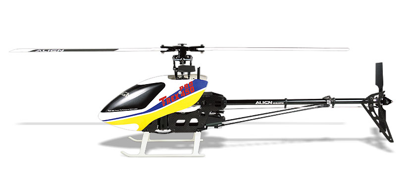

.. _traditional-helicopters:

=======================
Traditional Helicopters
=======================

Copter supports traditional single rotor, tandem rotor and collective pitch quad
rotor helicopters including all the same features as multicopters.  The majority
of the set-up is the same as for multicopters but please follow the links at the
bottom of the page, or in the sidebar, for helicopter specific information.

==============================================================================

Demonstration of a real-world commercial flight with a Trex 600 helicopter flown
with the ArduPilot system, including additional add-on RC telemetry and FPV.

..  youtube:: FWTb2-sdNW8

==============================================================================

Demonstration of a Gaui GX9 pre-flight and being flown with ArduPilot by the
Canberra Team in Australia.

..  youtube:: 2xvQvZl8eJc

==============================================================================

.. toctree::
    :maxdepth: 1

    First Time Setup <traditional-helicopter-first-time-setup>
    First Flights and Tuning <traditional-helicopter-first-flight>
    Autorotation <traditional-helicopter-autorotation>
    Dual Helicopters <dual-helicopter>
    HeliQuads <heliquads>
    Tips <traditional-helicopter-tips>
    ArduPilot Helicopter Ground School <traditional-helicopter-configuration>
