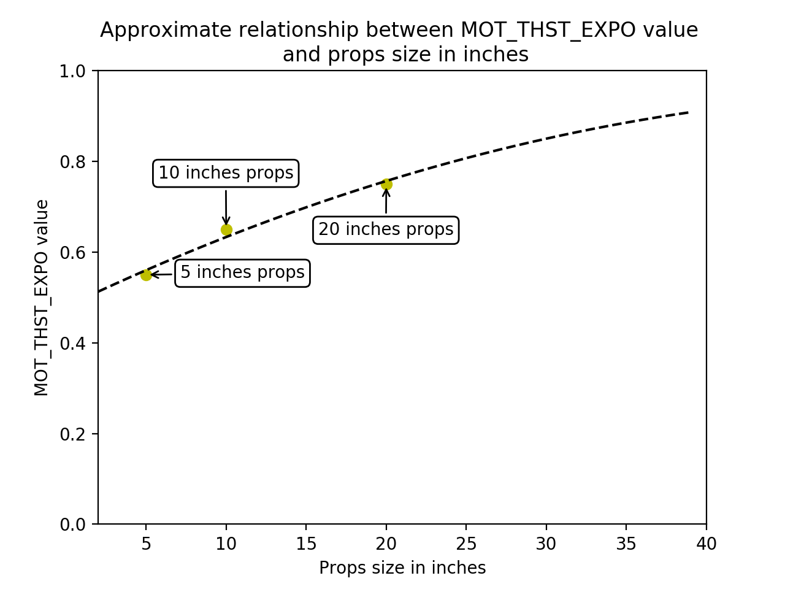
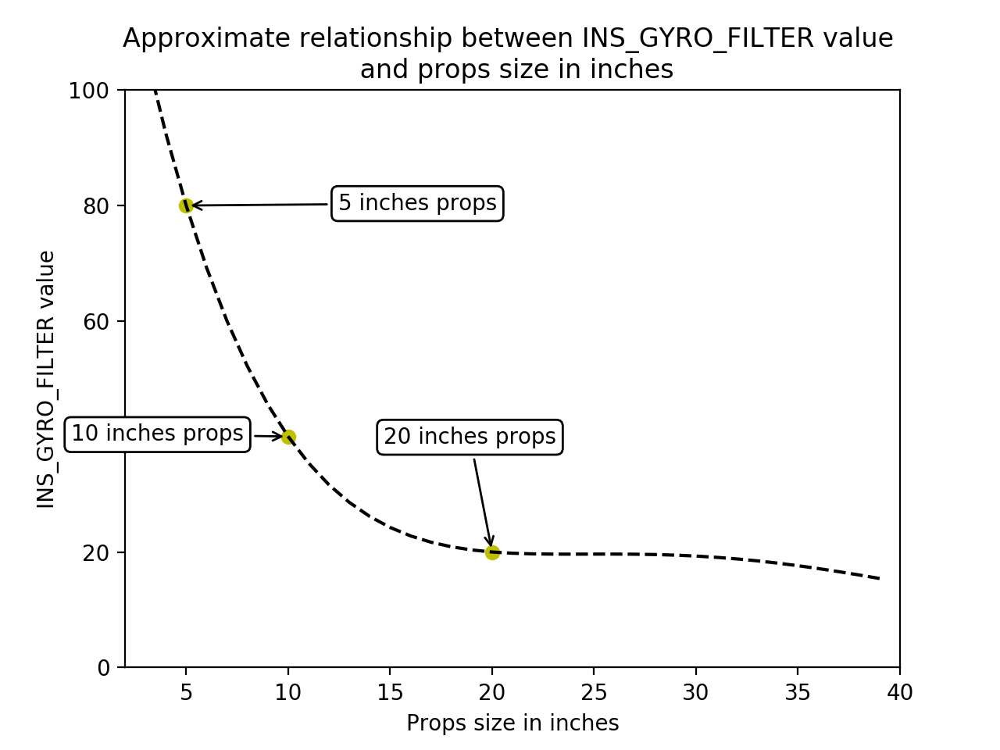
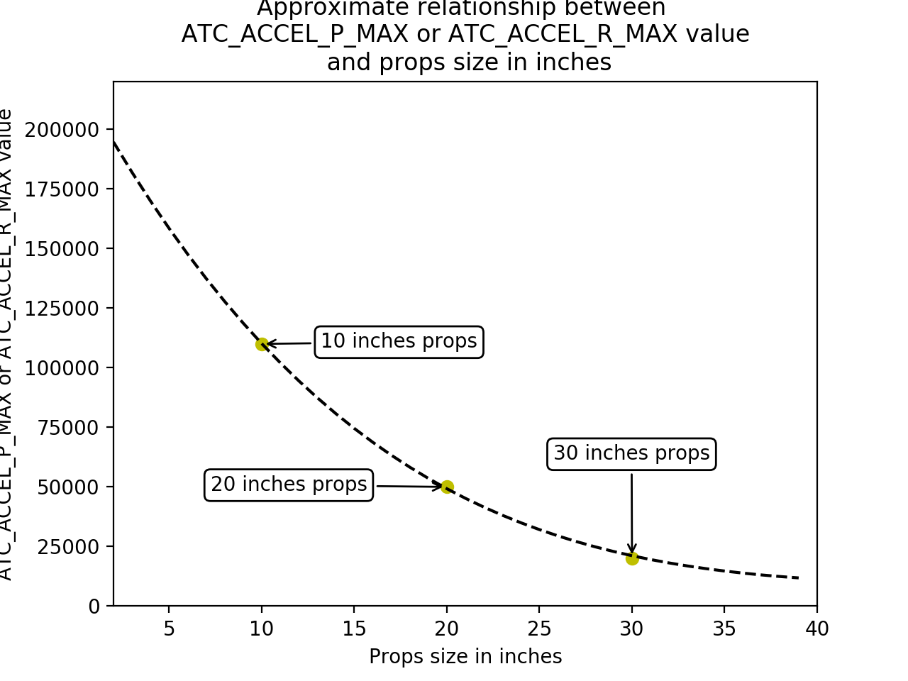
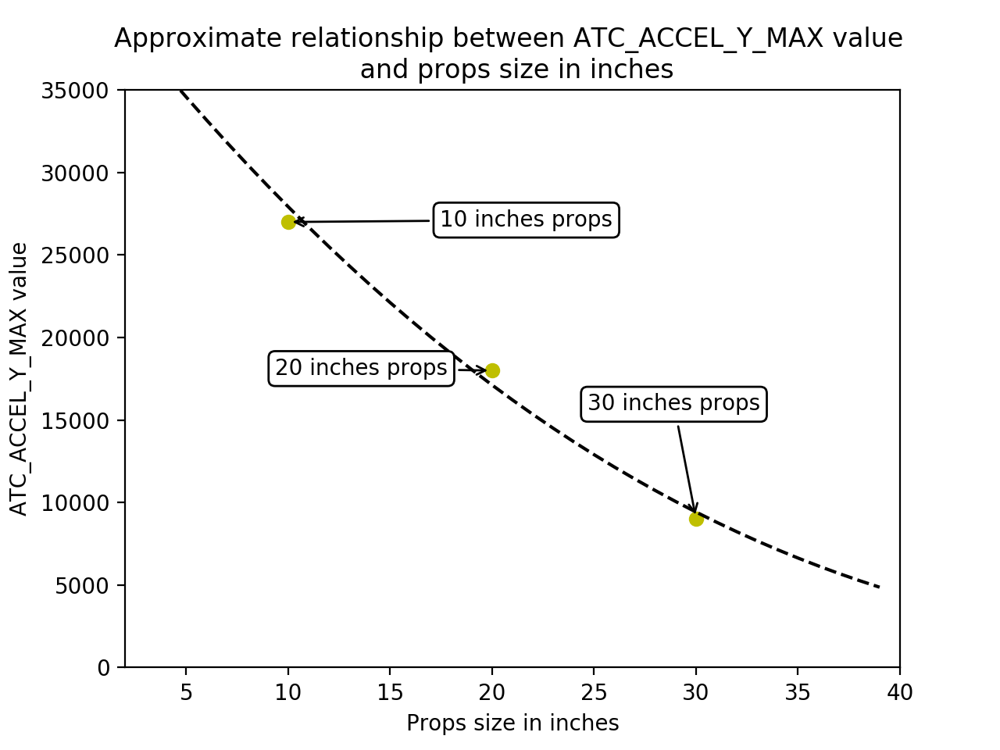

.. _tuning-process-instructions:

===========================
Tuning Process Instructions
===========================

Setting the aircraft up ready for tuning
----------------------------------------

The following parameters should be set correctly based on the specifications of your aircraft.

Battery setting
^^^^^^^^^^^^^^^
Parameters used to linearise your motor thrust curve.

- :ref:`MOT_BAT_VOLT_MAX <MOT_BAT_VOLT_MAX>` : 4.2v x No. Cells
- :ref:`MOT_BAT_VOLT_MIN <MOT_BAT_VOLT_MIN>` : 3.3v x No. Cells
- :ref:`MOT_THST_EXPO <MOT_THST_EXPO>` : 0.55 for 5 inch props, 0.65 for 10 inch props, 0.75 for 20 inch props. This parameter should be derived by thrust stand measurements for best results (don’t trust manufacturer data).

Motors setup
^^^^^^^^^^^^
Parameters used to define the output range sent to the ESC.

- :ref:`MOT_PWM_MAX <MOT_PWM_MAX>` : Check ESC manual for fixed range or 2000us
- :ref:`MOT_PWM_MIN <MOT_PWM_MIN>` : Check ESC manual for fixed range or 1000us
- :ref:`MOT_SPIN_ARM <MOT_SPIN_ARM>` : use the :ref:`motor test feature <connect-escs-and-motors_testing_motor_spin_directions>`
- :ref:`MOT_SPIN_MAX <MOT_SPIN_MAX>` : 0.95
- :ref:`MOT_SPIN_MIN <MOT_SPIN_MIN>` : use the :ref:`motor test feature <connect-escs-and-motors_testing_motor_spin_directions>`
- :ref:`MOT_THST_HOVER <MOT_THST_HOVER>` : 0.25 or below the expected hover thrust percentage (low is safe)

PID Controller Initial Setup
^^^^^^^^^^^^^^^^^^^^^^^^^^^^
- :ref:`INS_ACCEL_FILTER <INS_ACCEL_FILTER>` :  10Hz to 20Hz
- :ref:`INS_GYRO_FILTER <INS_GYRO_FILTER>` : 80Hz for 5 inch props, 40Hz for 10 inch props, 20Hz for 20 inch props
- :ref:`ATC_ACCEL_P_MAX <ATC_ACCEL_P_MAX>` : 110000 for 10 inch props, 50000 for 20 inch props, 20000 for 30 inch props
- :ref:`ATC_ACCEL_R_MAX <ATC_ACCEL_R_MAX>` : 110000 for 10 inch props, 50000 for 20 inch props, 20000 for 30 inch props
- :ref:`ATC_ACCEL_Y_MAX <ATC_ACCEL_Y_MAX>` : 27000 for 10 inch props, 18000 for 20 inch props, 9000 for 30 inch props
- :ref:`ACRO_YAW_P <ACRO_YAW_P>` : 0.5 x :ref:`ATC_ACCEL_Y_MAX <ATC_ACCEL_Y_MAX>` / 4500

For Copter-4.0 (and later):

- :ref:`ATC_RAT_PIT_FLTD <ATC_RAT_PIT_FLTD__AC_AttitudeControl_Multi>` : :ref:`INS_GYRO_FILTER <INS_GYRO_FILTER>` / 2
- :ref:`ATC_RAT_PIT_FLTT <ATC_RAT_PIT_FLTT__AC_AttitudeControl_Multi>` : :ref:`INS_GYRO_FILTER <INS_GYRO_FILTER>` / 2
- :ref:`ATC_RAT_RLL_FLTD <ATC_RAT_RLL_FLTD__AC_AttitudeControl_Multi>` : :ref:`INS_GYRO_FILTER <INS_GYRO_FILTER>` / 2
- :ref:`ATC_RAT_RLL_FLTT <ATC_RAT_RLL_FLTT__AC_AttitudeControl_Multi>` : :ref:`INS_GYRO_FILTER <INS_GYRO_FILTER>` / 2
- :ref:`ATC_RAT_YAW_FLTE <ATC_RAT_YAW_FLTE__AC_AttitudeControl_Multi>` : 2
- :ref:`ATC_RAT_YAW_FLTT <ATC_RAT_YAW_FLTT__AC_AttitudeControl_Multi>` : :ref:`INS_GYRO_FILTER <INS_GYRO_FILTER>` / 2

For Copter-3.6 (and earlier):

- ``ATC_RAT_PIT_FILT`` : :ref:`INS_GYRO_FILTER <INS_GYRO_FILTER>` / 2
- ``ATC_RAT_RLL_FILT`` : :ref:`INS_GYRO_FILTER <INS_GYRO_FILTER>` / 2
- ``ATC_RAT_YAW_FILT`` : 2

The initial tune of the aircraft should be done **in the aircrafts most agile configuration**. This generally means that the aircraft will be at its minimum take off weight with fully charged batteries.

Pilot's preparation for first flight
------------------------------------

The first takeoff of an untuned multirotor is the most dangerous seconds of the aircraft’s life. This is where the aircraft could be very unstable causing a sudden increase in power when then results in the aircraft jumping into the air, or it may be so poorly tuned that you have insufficient control over the aircraft once it is airborne. The pilot should be extremely diligent during the tuning flights to avoid a situation that could result in injury or damage.

There are several things that the pilot can do to minimise the risk during the early tuning process:

1. The pilot should conduct a motor number and orientation check (see :ref:`Checking the motor numbering with the Mission Planner Motor test <connect-escs-and-motors_testing_motor_spin_directions>`). Care should be taken to ensure that the correct frame type is selected. Incorrect frame type can result in a very fast yaw rotation or complete loss of control. Take note of the output percentage required to spin the propellers and ensure that:

- :ref:`MOT_SPIN_ARM <MOT_SPIN_ARM>` is set high enough to spin the motors cleanly.
- :ref:`MOT_SPIN_MIN <MOT_SPIN_MIN>` is set high enough to spin the motors win a minimal level of thrust.

2. All flights after a significant tuning change should be done in Stabilize. Stabilize provides the pilot with significantly more control over the aircraft in the event that the attitude controllers are unstable.
3. The pilot should not take off in AltHold until the altitude controller has been tested in flight. This should be done by taking off in Stabilize and switching to Alt Hold. While Alt Hold is rarely a problem unless the aircraft has a very low hover throttle.
4. For the initial flights the pilot should ensure that these parameters are set:

- :ref:`ATC_THR_MIX_MAN <ATC_THR_MIX_MAN>` to 0.1
- :ref:`MOT_THST_HOVER <MOT_THST_HOVER>` to 0.25 (or lower than the expected hover throttle)

5. Use a radio and calibrate the radio correctly (see :ref:`common-radio-control-calibration`).
6. Configure an Emergency Stop Motors switch and test it (see :ref:`Auxiliary Functions <common-auxiliary-functions>`).
7. Do tuning flights in low-wind condition and normal weather (no rain and between 15°C/59°F and 25°C/77°F).
8. Practice STABILIZE flight in simulator or on a low-end drone first, you should be confident to be able to takeoff and land with your untuned aircraft.

First Flight
------------

The first take off is the most dangerous time for any multirotor. Care must be taken to ensure the aircraft is not destroyed in the first seconds of flight and nobody is injured.

- **Ensure that all spectators are at a safe distance**.
- **Ensure the pilot is at a safe distance and position**.
- The pilot should refresh themselves on the method used to disarm the aircraft (using :ref:`Auxiliary Functions <common-auxiliary-functions>` for Motor Interlock or Arm/Disarm may be beneficial).

This flight will allow to setup your aircraft in a "flyable for tuning" state.

1. Ensure the aircraft is in STABILIZE mode
2. Arm the aircraft
3. Immediately disarm the aircraft to ensure your disarm procedure is correct
4. Arm the aircraft
5. Slowly increase the throttle looking for signs of oscillation. (long or flexible landing gear may cause some landing gear oscillation that will only go away after the aircraft leaves the ground)
6. As soon as the aircraft lifts off the ground immediately put the aircraft back down as gently as possible
7. Disarm the aircraft
8. Evaluate what you observed to decide if you need to make adjustments to the tuning parameters or if it is safe to take off again
9. Arm and increase the throttle to initiate a takeoff
10. Hover at approximately 1m altitude and apply small (5 degrees) control inputs into roll and pitch
11. Immediately land if any oscillation is observed

Next section will explain how to remove the oscillations.

Initial aircraft tune
---------------------

The first priority when tuning an multirotor aircraft is to establish a stable tune, free of oscillations, that can be used to do further tests.

1. Arm the aircraft in STABILIZE
2. Increase the throttle slowly until the aircraft leaves the ground
3. If the aircraft starts to oscillate immediately abort the takeoff and/or land the aircraft
4. Reduce all the following parameters by 50%

a. :ref:`ATC_RAT_PIT_P <ATC_RAT_PIT_P__AC_AttitudeControl_Multi>`
b. :ref:`ATC_RAT_PIT_I <ATC_RAT_PIT_I__AC_AttitudeControl_Multi>`
c. :ref:`ATC_RAT_PIT_D <ATC_RAT_PIT_D__AC_AttitudeControl_Multi>`
d. :ref:`ATC_RAT_RLL_P <ATC_RAT_RLL_P__AC_AttitudeControl_Multi>`
e. :ref:`ATC_RAT_RLL_I <ATC_RAT_RLL_I__AC_AttitudeControl_Multi>`
f. :ref:`ATC_RAT_RLL_D <ATC_RAT_RLL_D__AC_AttitudeControl_Multi>`

This process is repeated until the aircraft can hover without oscillations being detectable visually or audibly.

If the aircraft has very long or flexible landing gear then you may need to leave the ground before ground resonance stops.

Be aware that in this state the aircraft may be very slow to respond to large control inputs and disturbances. The pilot should be extremely careful to put minimal stick inputs into the aircraft to avoid the possibility of a crash.

Test AltHold
-------------

This test will allow to test the altitude controller and ensure the stability of your aircraft.

1. Check :ref:`MOT_HOVER_LEARN <MOT_HOVER_LEARN>` is set to 2. This will allow the controller to learn by itself the correct hover value when flying.

2. Take off in STABILIZE and increase altitude to 5m. Switch to AltHold and be ready to switch back to STABILIZE. If the aircraft is hovering at a very low hover throttle value you may hear a reasonably fast oscillation in the motors. Ensure the aircraft has spent at least 30 seconds in hover to let the hover throttle parameter converge to the correct value. Land and disarm the aircraft.

3. Set these parameters on ground and preferably disarm  (A confident pilot could set them in flight with GCS or CH6 tuning knob):

  - :ref:`PSC_ACCZ_I <PSC_ACCZ_I>` to 2 x :ref:`MOT_THST_HOVER <MOT_THST_HOVER>`
  - :ref:`PSC_ACCZ_P <PSC_ACCZ_P>` to :ref:`MOT_THST_HOVER <MOT_THST_HOVER>`

AltHold starts to move up and down the position and velocity controllers may need to be reduced by 50%. These values are: :ref:`PSC_POSZ_P <PSC_POSZ_P>` and :ref:`PSC_VELZ_P <PSC_VELZ_P>`.

.. _evaluating-the-aircraft-tune:

Evaluating the aircraft tune
----------------------------

Most pilots will look to move to Autotune as quickly as possible once their aircraft can hover safely in AltHold. Before Autotune is run the pilot should ensure that the current tune is good enough to recover from the repeated tests run by Autotune. To test the current state of tune:

1. Take off in AltHold or STABILIZE
2. Apply small roll and pitch inputs. Start with 5 degree inputs and releasing the stick to centre, pitch, left, right, roll forward back, then all 4 points on the diagonal
3. Increase inputs gradually to full stick deflection
4. Go to full stick deflection and letting the sticks spring back to centre

If the aircraft begins to overshoot significantly or oscillate after the stick input, halt the tests before the situation begins to endanger the aircraft. The aircraft may require manual tuning (:ref:`see next section <ac_rollpitchtuning>`) before autotune can be run.

To test the stabilization loops independent of the input shaping, set the parameter: :ref:`ATC_RATE_FF_ENAB <ATC_RATE_FF_ENAB>` to 0.

1. Take off in AltHold or STABILIZE
2. Hold a roll or pitch input
3. Release the stick and observe the overshoot as the aircraft levels itself
4. Gradually increase the stick deflection to 100%

Halt the tests if the aircraft overshoots level significantly or if the aircraft oscillates, the aircraft may require manual tuning (:ref:`see next section <ac_rollpitchtuning>`) before autotune can be run.

Set :ref:`ATC_RATE_FF_ENAB <ATC_RATE_FF_ENAB>` to 1 after the tests are complete.

Manual tuning of Roll and Pitch
-------------------------------

Manual tuning may be required to provide a stable tune before Autotune is run, or if Autotune does not produce an acceptable tune. The process below can be done on roll and pitch at the same time for a quick manual tune provided the aircraft is symmetrical. If the aircraft is not symmetrical then the process should be repeated for both roll and pitch individually.

The pilot should be especially careful to ensure that :ref:`ATC_THR_MIX_MAN <ATC_THR_MIX_MAN>` and :ref:`MOT_THST_HOVER <MOT_THST_HOVER>` are set correctly before manual tuning is started.

When oscillations start do not make large or sudden stick inputs. Reduce the throttle smoothly to land the aircraft while using very slow and small roll and pitch inputs to control the aircraft position.

1. Increase the D term in steps of 50% until oscillation is observed
2. Reduce the D term in steps of 10% until the oscillation disappears
3. Reduce the D term by a further 25%
4. Increase the P term in steps of 50% until oscillation is observed
5. Reduce the P term in steps of 10% until the oscillation disappears
6. Reduce the P term by a further 25%

Each time the P term is changed set the I term equal to the P term. Those parameters can be changed on ground and preferably disarmed. A confident pilot could set them in flight with GCS or transmitter tuning knob (see :ref:`Transmitter based tuning<common-transmitter-tuning>` section).

If using :ref:`Transmitter based tuning<common-transmitter-tuning>` , set the minimum value of the tuning range to the current safe value and the upper range to approximately 4 times the current value. Be careful not to move the slider before the parameter list is refreshed to recover the set value. Ensure the transmitter tuning is switched off before setting the parameter value or the tuning may immediately overwrite it.

Autotune
--------

If the aircraft appears stable enough to attempt autotune follow the instructions in the autotune page.

There a number of problems that can prevent Autotune from providing a good tune. Some of the reasons Autotune can fail are:

- High levels of gyro noise.
- Incorrect value of :ref:`MOT_THST_EXPO <MOT_THST_EXPO>`.
- Flexible frame or payload mount.
- Overly flexible vibration isolation mount.
- Non-linear ESC response.
- Very low setting for :ref:`MOT_SPIN_MIN <MOT_SPIN_MIN>`.
- Overloaded propellers or motors.

If Autotune has failed you will need to do a manual tune.

Some signs that Autotune has been successful are:

- An increase in the values of :ref:`ATC_ANG_PIT_P <ATC_ANG_PIT_P>` and :ref:`ATC_ANG_RLL_P <ATC_ANG_RLL_P>`.
- :ref:`ATC_RAT_PIT_D <ATC_RAT_PIT_D__AC_AttitudeControl_Multi>` and :ref:`ATC_RAT_RLL_D <ATC_RAT_RLL_D__AC_AttitudeControl_Multi>` are larger than :ref:`AUTOTUNE_MIN_D <AUTOTUNE_MIN_D>`.

Autotune will attempt to tune each axis as tight as the aircraft can tolerate. In some aircraft this can be unnecessarily responsive. A guide for most aircraft:

- :ref:`ATC_ANG_PIT_P <ATC_ANG_PIT_P>` should be reduced from 10 to 6
- :ref:`ATC_ANG_RLL_P <ATC_ANG_RLL_P>` should be reduced from 10 to 6
- :ref:`ATC_ANG_YAW_P <ATC_ANG_YAW_P>` should be reduced from 10 to 6
- :ref:`ATC_RAT_YAW_P <ATC_RAT_YAW_P__AC_AttitudeControl_Multi>` should be reduced from 1 to 0.5
- :ref:`ATC_RAT_YAW_I <ATC_RAT_YAW_I__AC_AttitudeControl_Multi>` : :ref:`ATC_RAT_YAW_P <ATC_RAT_YAW_P__AC_AttitudeControl_Multi>` x 0.1

These values should only be changed if Autotune produces higher values. Small aerobatic aircraft may prefer to keep these values as high as possible.

Setting the input shaping parameters
------------------------------------

Arducopter has a set of parameters that define the way the aircraft feels to fly. This allows the aircraft to be set up with a very aggressive tune but still feel like a very docile and friendly aircraft to fly.

The most important of these parameters is:

- :ref:`ACRO_YAW_P <ACRO_YAW_P>` : yaw rate x 45 degrees/s
- :ref:`ANGLE_MAX <ANGLE_MAX>` :  maximum lean angle
- :ref:`ATC_ACCEL_P_MAX <ATC_ACCEL_P_MAX>` : Pitch rate acceleration
- :ref:`ATC_ACCEL_R_MAX <ATC_ACCEL_R_MAX>` : Roll rate acceleration
- :ref:`ATC_ACCEL_Y_MAX <ATC_ACCEL_Y_MAX>` : Yaw rate acceleration
- :ref:`ATC_ANG_LIM_TC <ATC_ANG_LIM_TC>` : Aircraft smoothing time

Autotune will set the :ref:`ATC_ACCEL_P_MAX <ATC_ACCEL_P_MAX>`, :ref:`ATC_ACCEL_R_MAX <ATC_ACCEL_R_MAX>` and :ref:`ATC_ACCEL_Y_MAX <ATC_ACCEL_Y_MAX>` parameters to their maximum based on measurements done during the Autotune tests. These values should not be increased beyond what Autotune suggests without careful testing. In most cases pilots will want to reduce these values significantly.

For aircraft designed to carry large directly mounted payloads, the maximum values of :ref:`ATC_ACCEL_P_MAX <ATC_ACCEL_P_MAX>`, :ref:`ATC_ACCEL_R_MAX <ATC_ACCEL_R_MAX>` and :ref:`ATC_ACCEL_Y_MAX <ATC_ACCEL_Y_MAX>` should be reduced based on the minimum and maximum takeoff weight (TOW):

- :ref:`ATC_ACCEL_P_MAX <ATC_ACCEL_P_MAX>`  x (min_TOW / max_TOW)
- :ref:`ATC_ACCEL_R_MAX <ATC_ACCEL_R_MAX>`  x (min_TOW / max_TOW)
- :ref:`ATC_ACCEL_Y_MAX <ATC_ACCEL_Y_MAX>`  x (min_TOW / max_TOW)

:ref:`ACRO_YAW_P <ACRO_YAW_P>` should be set to be approximately 0.5 x :ref:`ATC_ACCEL_Y_MAX <ATC_ACCEL_Y_MAX>` / 4500 to ensure that the aircraft can achieve full yaw rate in approximately half a second.

:ref:`ATC_ANG_LIM_TC <ATC_ANG_LIM_TC>` may be increased to provide a very smooth feeling on the sticks at the expense of a slower reaction time.

Aerobatic aircraft should keep the :ref:`ATC_ACCEL_P_MAX <ATC_ACCEL_P_MAX>`, :ref:`ATC_ACCEL_R_MAX <ATC_ACCEL_R_MAX>` and :ref:`ATC_ACCEL_Y_MAX <ATC_ACCEL_Y_MAX>` provided by autotune and reduce :ref:`ATC_ANG_LIM_TC <ATC_ANG_LIM_TC>` to achieve the stick feel desired by the pilot. For pilots wanting to fly ACRO the following input shaping parameters can be used to tune the feel of ACRO:

- :ref:`ACRO_BAL_PITCH <ACRO_BAL_PITCH>`
- :ref:`ACRO_BAL_ROLL <ACRO_BAL_ROLL>`
- :ref:`ACRO_RP_EXPO <ACRO_RP_EXPO>`
- :ref:`ACRO_RP_P <ACRO_RP_P>`
- :ref:`ACRO_THR_MID <ACRO_THR_MID>`
- :ref:`ACRO_TRAINER <ACRO_TRAINER>`
- :ref:`ACRO_Y_EXPO <ACRO_Y_EXPO>`
- :ref:`ACRO_YAW_P <ACRO_YAW_P>`

The full list of input shaping parameters are:

- :ref:`ACRO_BAL_PITCH <ACRO_BAL_PITCH>`
- :ref:`ACRO_BAL_ROLL <ACRO_BAL_ROLL>`
- :ref:`ACRO_RP_EXPO <ACRO_RP_EXPO>`
- :ref:`ACRO_RP_P <ACRO_RP_P>`
- :ref:`ACRO_THR_MID <ACRO_THR_MID>`
- :ref:`ACRO_TRAINER <ACRO_TRAINER>`
- :ref:`ACRO_Y_EXPO <ACRO_Y_EXPO>`
- :ref:`ACRO_YAW_P <ACRO_YAW_P>`
- :ref:`ANGLE_MAX <ANGLE_MAX>`
- :ref:`ATC_ACCEL_P_MAX <ATC_ACCEL_P_MAX>`
- :ref:`ATC_ACCEL_R_MAX <ATC_ACCEL_R_MAX>`
- :ref:`ATC_ACCEL_Y_MAX <ATC_ACCEL_Y_MAX>`
- :ref:`ATC_ANG_LIM_TC <ATC_ANG_LIM_TC>`
- :ref:`ATC_RATE_P_MAX <ATC_RATE_P_MAX>`
- :ref:`ATC_RATE_R_MAX <ATC_RATE_R_MAX>`
- :ref:`ATC_RATE_Y_MAX <ATC_RATE_Y_MAX>`
- :ref:`ATC_SLEW_YAW <ATC_SLEW_YAW>`
- :ref:`PILOT_ACCEL_Z <PILOT_ACCEL_Z>`
- :ref:`PILOT_SPEED_DN <PILOT_SPEED_DN>`
- :ref:`PILOT_SPEED_UP <PILOT_SPEED_UP>`
- :ref:`PILOT_THR_BHV <PILOT_THR_BHV>`
- :ref:`PILOT_THR_FILT <PILOT_THR_FILT>`
- :ref:`PILOT_TKOFF_ALT <PILOT_TKOFF_ALT>`
- :ref:`LOIT_ACC_MAX <LOIT_ACC_MAX>`
- :ref:`LOIT_ANG_MAX <LOIT_ANG_MAX>`
- :ref:`LOIT_BRK_ACCEL <LOIT_BRK_ACCEL>`
- :ref:`LOIT_BRK_DELAY <LOIT_BRK_DELAY>`
- :ref:`LOIT_BRK_JERK <LOIT_BRK_JERK>`
- :ref:`LOIT_SPEED <LOIT_SPEED>`

Advanced Tuning
---------------

Arducopter has an extremely flexible controller design that can been used with great results on aircraft from 100g to 500 kg. There are a number of difficult control problems that provide a greater depth of understanding that can be provided here. Some of these issues include:

- High gyro noise levels
- Flexible airframes
- Soft vibration dampers
- Large payloads on flexible or loose mounts
- Rate limited actuators
- Non-Linear actuators
- Extremely aggressive or dynamic flight
