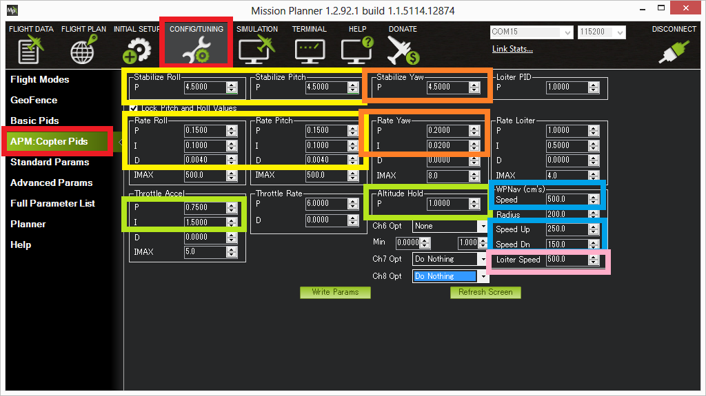

.. _tuning:

===============
Advanced Tuning
===============

This article provides an overview of how to tune various Copter parameters.

Overview
========

The default `PID gains <https://en.wikipedia.org/wiki/PID_controller>`__ are meant for
the 3DR IRIS although they work on a wide variety of frames.  Still, to get optimal
performance you may need to adjust them which can be done through the
*Mission Planner*'s **Config/Tuning \| Copter Pids** screen.  The screen
shot below shows the most important parameters for Roll/Pitch (yellow),
Yaw (orange), :ref:`Altitude hold <altholdmode>` (green),
:ref:`Loiter <loiter-mode>` (pink) and
:ref:`Waypoint navigation <auto-mode>`
(blue).

The most important parameter to get right is the Rate Roll P (and by
default Rate Pitch P is locked to the same value) as discussed
:ref:`here <ac_rollpitchtuning>`.

Normally it's best to start by tuning the Rate Roll/Pitch P in Stabilize
mode then move onto tuning altitude hold in AltHold mode, then Loiter
(which often needs no tuning) and finally the waypoint navigation
performance in Auto mode.

.. note::

   `Dave C's AC2.8.1 tuning guide <https://diydrones.com/forum/topics/arducopter-tuning-guide>`__
   has good information for tuning for rate roll and pitch but altitude hold,
   Loiter and navigation has changed dramatically since AC2.8.1 so those
   sections are no longer valid.

Roll/Pitch tuning
=================

The Stabilize Roll/Pitch and Rate Roll/Pitch parameters, highlighted in
yellow in the screen shot above control the roll pitch response.

The Rate parameters which convert the desired rotation rate into a motor
output are the most important.  The :ref:`Rate Roll and Pitch P tuning page <ac_rollpitchtuning>` has the
most information on tuning them.

The Stabilize Roll/Pitch P converts the desired angle into a desired
rotation rate which is then fed to the Rate controller.

-  A higher value will make the copter more responsive to roll/pitch
   inputs, a lower value will make it smoother
-  If set too high, the copter will oscillate on the roll and/or pitch
   axis
-  If set too low the copter will become sluggish to inputs

More information on tuning the roll and pitch can be found on the
:ref:`Stabilize mode page's Tuning section <stabilize-mode_tuning>`.

An objective view of the overall Roll and Pitch performance can be seen
by graphing the :ref:`dataflash log's <common-downloading-and-analyzing-data-logs-in-mission-planner>`
ATT message's Roll-In vs Roll and Pitch-In vs Pitch. The "Roll" (i.e.
actual roll) should closely follow the "Roll-In" while in Stabilize or
AltHold modes. Pitch should similarly closely follow Pitch-In.

Alternatively you may wish to try tuning both the rate and stabilize
(i.e. angular) parameters using the :ref:`AutoTune feature <autotune>`.

Yaw tuning
==========

The Stabilize Yaw and Rate Yaw parameters, highlighted in orange in the
screen shot above control the yaw response. It's rare that the yaw
requires much tuning.

Similar to roll and pitch if either Stabilize Yaw P or Rate Yaw P is too
high the copter's heading will oscillate. If they are too low the copter
may be unable to maintain its heading.

As mentioned on the :ref:`Stabilize mode's tuning section <stabilize-mode_tuning>`,
the ACRO_YAW_P parameter controls how quickly copter rotates based on
a pilot’s yaw input.  The default of 4.5 commands a 200 deg/sec rate of
rotation when the yaw stick is held fully left or right.  Higher values
will make it rotate more quickly.

Altitude Tuning
===============

The Altitude hold related tuning parameters are highlighted in green in
the screen shot above.

The Altitude Hold P is used to convert the altitude error (the
difference between the desired altitude and the actual altitude) to a
desired climb or descent rate.  A higher rate will make it more
aggressively attempt to maintain its altitude but if set too high leads
to a jerky throttle response.

The Throttle Rate (which normally requires no tuning) converts the
desired climb or descent rate into a desired acceleration up or down.

The Throttle Accel PID gains convert the acceleration error (i.e the
difference between the desired acceleration and the actual acceleration)
into a motor output.  The 1:2 ratio of P to I (i.e. I is twice the size
of P) should be maintained if you modify these parameters.  These values
should never be increased but for very powerful copters you may get
better response by reducing both by 50% (i.e P to 0.5, I to 1.0).

See the :ref:`Altitude Hold flight mode page <altholdmode>` for more information.

Loiter Tuning
=============

Generally if Roll and Pitch are tuned correctly,  the
:ref:`GPS <common-diagnosing-problems-using-logs_gps_glitches>`
and :ref:`compass <common-diagnosing-problems-using-logs_compass_interference>`
are set-up and performing well and :ref:`vibration levels <common-diagnosing-problems-using-logs_vibrations>`
are acceptable, Loiter does not require much tuning but please see the
:ref:`Loiter Mode <loiter-mode_tuning>` page for more details on tunable
parameters including the horizontal speed.

In-flight tuning
================

See the :ref:`Transmitter based tuning<common-transmitter-tuning>` page for details.

Filter tuning
=============

Copters are often affected by vibration and tuning the various software filters available is critical to achieving an overall tune.
A guide on tuning the various notch filters available can be found on the :ref:`Notch Filtering wiki page <common-imu-notch-filtering>`.

Video introduction to PIDs
==========================

PIDs (Proportional - Integral - Derivative) are the method used by our
firmware to continuously stabilize the vehicle

-  Proportional = Immediate Correction: The further off you are the
   bigger the correction you make.
-  Integral = Over time or steady state correction: If we are failing to
   make progress add additional correction.
-  Derivative = Take it Easy correction: Is the correction going to
   fast? if it is slow it down (dampen) it a bit to avoid overshoot.

..  youtube:: l03SioQ9ySg
    :width: 100%

..  youtube:: sDd4VOpOnnA
    :width: 100%

-----

.. image:: ../../../images/banner-freespace.png
   :target: https://freespace.solutions/
