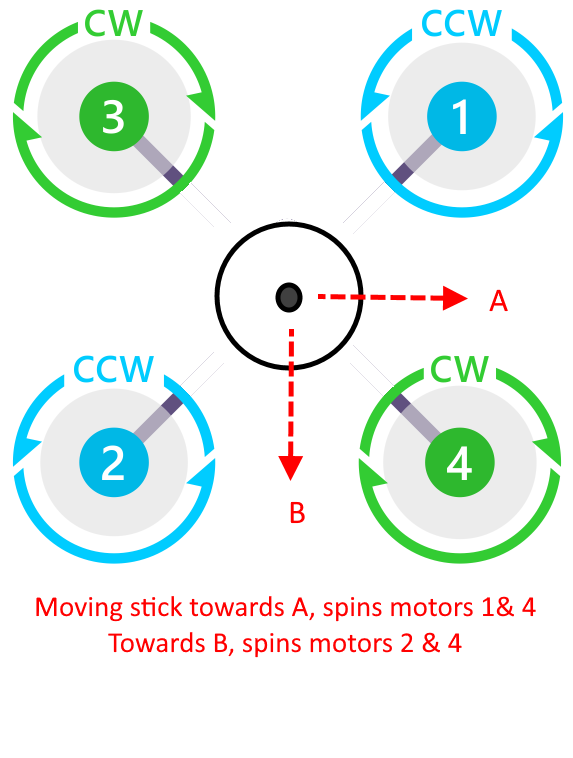

.. _turtle-mode:

===========
Turtle Mode
===========

Turtle Mode is a special mode that can be invoked either as a :ref:`flight mode <flight-modes>` via the flight mode switch or as an :ref:`Auxilary function <common-auxiliary-functions>` assigned to an RC switch (channel). Turtle mode allows a user to attempt to flip the Copter upright, if inverted, by reversing the direction of adjacent pairs of motors and producing thrust to un-invert the vehicle after a crash.

.. note::

    This flight mode is available for multirotors only. 

DShot capable ESCs are required for this mode to function, allowing the DShot reverse command to be sent to the ESCs. :ref:`SERVO_DSHOT_ESC<SERVO_DSHOT_ESC>` must be set to a non-zero value and :ref:`MOT_PWM_TYPE<MOT_PWM_TYPE>` to a DSHOT value also, to allow DShot commands to be sent to the ESC.

Once in this mode, moving the roll and/or pitch stick of the transmitter away from center will reverse and spin up the designated pair of motors, increasing thrust to maximum at full stick throw.

The user can quickly jab the transmitter stick to attempt to flip the vehicle upright. Which pair of motors is temporarily reversed and spun up is determined by the direction away from center the stick is moved, as shown below:

Once flipped upright, exit the mode for normal operation to resume.

.. note:: continuous operation of motors in the reversed mode may cause either ESC or motor overheating in some cases.

-  Turtle mode cannot be entered unless throttle is zero
-  Upon entry to turtle mode the motors stay disarmed, but the notfiy LEDs flash
-  Raising the throttle, the motors arm, and motors spin. Lowering throttle to zero disarms the motors
-  Motors spin only when throttle is raised