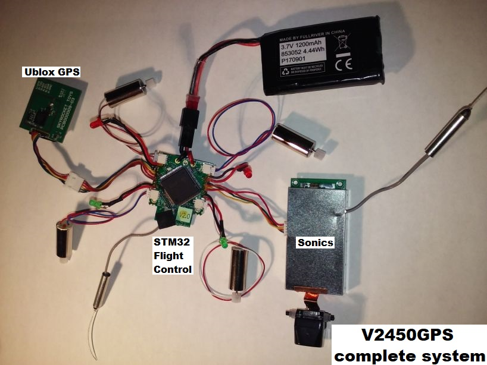
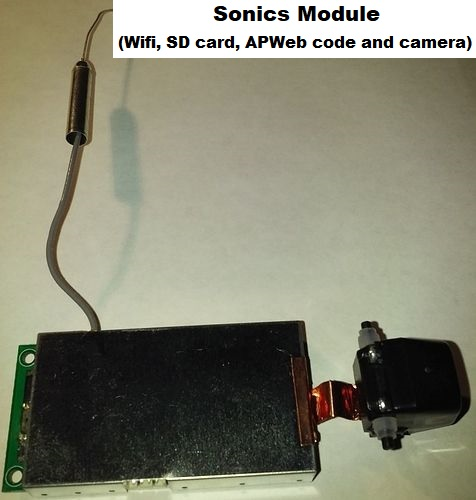
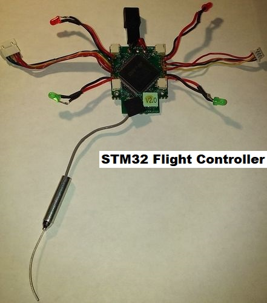
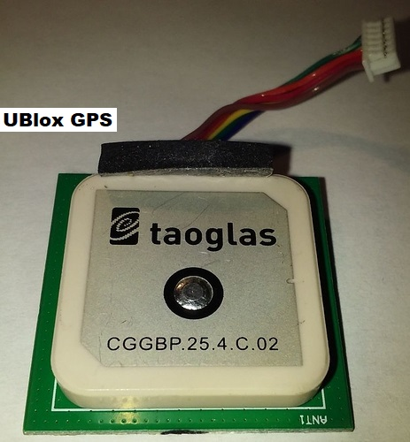

.. _v2450gps-hardware:

==================
Skyviper V2450 GPS Hardware
==================

Hardware
--------

- STM32 CPU
- 5x serial ports
- 1x I2C
- 1x SPI
- ICM20789 IMU including 3-axis accelerometer, gyro and barometer
- Ublox M8 GPS
- 1S battery (4.2V max, replacement batteries are readily available on Amazon and other places)
- brushed motors; 8.5x20mm with a kV between 16,000 and 17,000 as measured. 
- The small pinion is 13T and the larger one is 73T, which provides a gear ratio of approximately 5.6
- the camera can be manually adjusted to point forward, down or anywhere in between
- 2.4Ghz wifi for telemetry and video
- 145g
- flight time of about 11min
- top speed of between 8m/s ~ 10m/s
- video streaming uses a Sonix board with ARM CPU running FreeRTOS and OmniVision OV9732 chip

.. image:: ../../../images/skyrocket-flight-controller.png
    :target: ../_images/skyrocket-flight-controller.png

Skyviper Teardown Pictures
--------------------------

 

    

    

    
