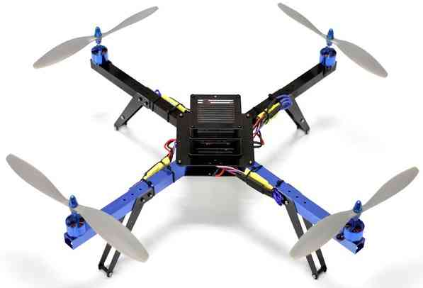

.. _what-is-a-multicopter-and-how-does-it-work:

===========================================
What is a MultiCopter and How Does it Work?
===========================================

A multicopter is a mechanically simple aerial vehicle whose motion is
controlled by speeding or slowing multiple downward thrusting
motor/propeller units.

Overview
========

MultiCopters are aerodynamically unstable and absolutely require an
on-board computer (aka autopilot) for stable flight.  As a
result, they are "Fly by Wire" systems and if the computer isn't
working, you aren't flying.  The autopilot combines data from
small on-board MEMs gyroscopes, accelerometers (the same as those found
in smart phones) to maintain an accurate estimate of its orientation
and position.

The quadcopter shown above is the simplest type of multicopter, with
each motor/propeller spinning in the opposite direction from the two
motors on either side of it (i.e. motors on opposite corners of the
frame spin in the same direction).

A quadcopter can control its roll and pitch rotation by speeding up
two motors on one side and slowing down the other two.  So for example
if the quadcopter wanted to roll left it would speed up motors on the
right side of the frame and slow down the two on the left.  Similarly if
it wants to rotate forward it speeds up the back two motors and slows
down the front two.

The copter can turn (aka "yaw") left or right by speeding up two motors
that are diagonally across from each other, and slowing down the other
two.

Horizontal motion is accomplished by temporarily speeding up/slowing
down some motors so that the vehicle is leaning in the direction of
desired travel and increasing the overall thrust of all motors so the
vehicle shoots forward.  Generally the more the vehicle leans, the
faster it travels.

Altitude is controlled by speeding up or slowing down all motors at the
same time.

What is the difference between a MultiCopter and a UAV/Drone?
=============================================================

A multicopter becomes a UAV or Drone when it is capable of autonomous
flight.  Normally this means taking the accelerometer and gyro
information and combining it with barometer and GPS data so the flight
controller understands not only its orientation but also its position.

MultiCopter Demo illustrating Manual and Automatic Control
==========================================================

..  youtube:: GyPqHeg2v0Y
    :width: 100%

The demo begins in :ref:`Stabilize Mode <stabilize-mode>` which
provides inertial stabilization and permits manual flight control.

In :ref:`Loiter Mode <loiter-mode>` the
Copter automatically maintains position and altitude but permits manual
override.

:ref:`Simple Mode <simpleandsuper-simple-modes>`
enables the copter to be flown without regard to the copters orientation
(the direction it is facing).

"Auto Land" causes the copter to descend and disarm its motors when it
has landed.

High wind demonstration
=======================

..  youtube:: f8nAF6s-dwY
    :width: 100%

A video by Robert Lefebvre showing how well our firmware can allow a
multicopter to operate even in 60 to 90 kmh gusting winds.  This video
illustrates operation under conditions near the physical limits of the
copter and should not be attempted by non-experts.
