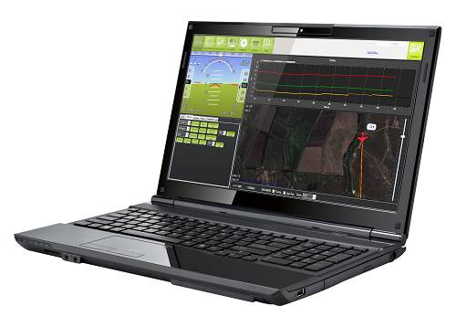

.. _what-you-need:

====================================
What You Need to Build a MultiCopter
====================================

This article provides an overview of the main components you will need
when building a Copter-based multicopter.

Multicopter frame including motors, ESCs and propellers
=======================================================

There are numerous frames, ESCs and motors available. Some components
you might consider are discussed in 
:ref:`Choosing a Multicopter Frame <choosing-a-frame>` and the 
:ref:`Detailed Vehicle Builds <common-common-airframe-builds>`.

Many other designs and configurations including Traditional Helicopters
are also supported.

6+ channel RC transmitter and receiver
======================================

You'll need a radio control transmitter to manually control your Copter
and to activate its flight modes. You can use any RC
transmitter/receiver system with at least six channels. Some of the
options are discussed in the topic :ref:`Compatible RC Transmitter and Receiver Systems <common-rc-systems>`.

.. image:: ../../../images/spektrum-dx8.jpg
    :target: ../_images/spektrum-dx8.jpg

Autopilot (Autopilot hardware)
==============================

Copter's autopilot board determines its capabilities for autonomous
flight. At time of writing (December 2015)
:ref:`Pixhawk <common-pixhawk-overview>` is highly recommended for general
use.

Developers creating UAV vision applications should consider using a
separate Companion Computer, or a Linux based autopilot board.

For more options, see the topic :ref:`Choosing an Autopilot <common-choosing-a-flight-controller>`.

GPS module
==========

Your Copter will *require* a GPS module. The recommended module is :ref:`3DR UBlox GPS + Compass Module <common-installing-3dr-ublox-gps-compass-module>` which also
includes an a compass. You can check out :ref:`other GPS solutions here <common-positioning-landing-page>`.

.. image:: ../../../images/GPS_TopAndSide.jpg
    :target: ../_images/GPS_TopAndSide.jpg

LiPo batteries and charger
==========================

Copter requires a rechargeable lithium polymer (LiPo) battery. 
A good rule of thumb is to use 1,000 mAH (milliamp hours) per motor. 
For a Quad copter, a `4000 mAH LiPo like this one <https://hobbyking.com/en_us/turnigy-4000mah-3s-20c-lipo-pack.html?___store=en_us>`__ would work well. 
While your copter can use only one battery at a time, we recommend having at least two batteries in stock; more batteries means more flight time. 
You'll also need a `charging station for your batteries such as this one <https://hobbyking.com/en_us/turnigy-2s-3s-balance-charger-direct-110-240v-input.html?___store=en_us>`__.

Ground Control Station
======================

The (free and open source) :ref:`Mission Planner <planner:home>` is required if you're going
to be loading new versions of Copter onto the autopilot, and for
first-flight tuning and calibration. It runs on a PC and can also be
used for planning missions.

Once your Copter is configured, you may find it more convenient to
choose a different ground station - running on the tablet, phone or
computer of your choice. The main options are discussed in the topic
:ref:`Choosing a Ground Station <common-choosing-a-ground-station>`.

Telemetry Radio
===============

A telemetry radio allows your Copter to communicate with your ground
station from the air using the MAVLink protocol. This allows you to
interact with your missions in real time and receive streaming data from
your copter's cameras and other components. This adds considerable
convenience to your missions!

We recommend the telemetry radio solutions linked from the 
:ref:`Telemetry Landing Page <common-telemetry-landingpage>`. Remember that if using
the :ref:`SIK Radio <common-sik-telemetry-radio>` you will need the version
at the permitted frequency for your country - 915 MHz (Americas) and 433
MHz (Europe).

.. image:: ../../../images/Telemetry_store.jpg
    :target: ../_images/Telemetry_store.jpg
