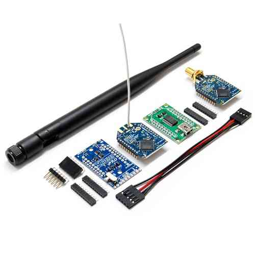
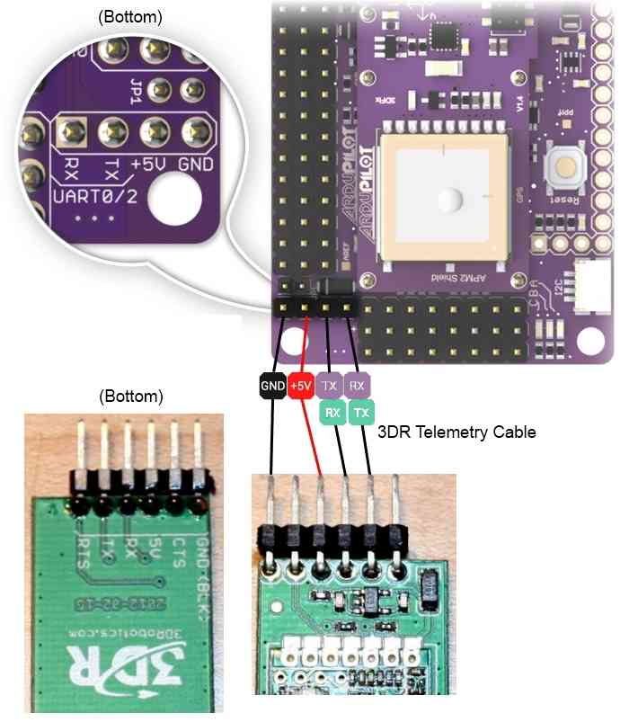
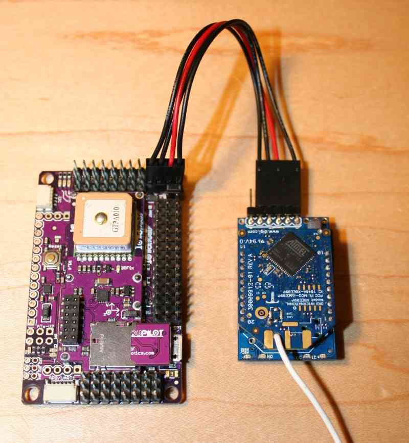
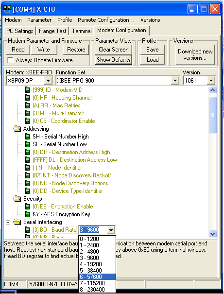

.. _xbee-radios:

=================================================
Archived:Using Xbee radios for telemetry with APM
=================================================

.. warning::

   **ARCHIVED ARTICLE**

   The correct topic to use is
   :ref:`Telemetry-XBee <common-telemetry-xbee>`

Hooking up your Xbee wireless modules
-------------------------------------

Adding wireless telemetry is not difficult and can extend the
capabilities of your UAV immensely. We recommend 
`900Mhz Xbees <https://www.sparkfun.com/categories/222.html>`__. If you are in
Europe, where 900Mhz is not allowed, you can use a 2.4Ghz Xbee kit instead. 

.. warning::

   On APM 2, you cannot use the Xbee while your APM board is
   connected to the USB port.

   That's because the Xbee and USB share the same serial port, with some clever multiplexing to detect if the USB cable is plugged in and switching output to the USB if so. 
   Although that has the huge win of freeing up a serial port for some other use (e.g. 
   connect an Android phone), 
   it does mean that you need to disconnect the board from the USB cable and power it some other way when testing wireless telemetry on your bench.

Wiring it up
------------

APM 2.0
~~~~~~~

Connect the XtremeBee adapter (with the Xbee plugged in) to APM 2 as
shown above. Your adapter should be in "Master" mode. ("Master" and
"Slave" just reverse the TX and RX pins).

We recommend the 3DR four-wire Xbee cable, which comes with the official
Wireless Telemetry kit shown above. It is designed to connect the
XtreamBee adapter to APM, as it will provide the neatest and safest
connection.

APM 2.5
~~~~~~~

On APM 2.5, use the dedicated telemetry port and supplied cable, as
shown:

.. image:: ../images/xbee_amp2.5_telemetry_port_connection.jpg
    :target: ../_images/xbee_amp2.5_telemetry_port_connection.jpg

On the ground side
------------------

If you're using a USB adapter, simply connect it via a USB cable as shown:

.. image:: ../../../images/xbee_usb_connection.jpg
    :target: ../_images/xbee_usb_connection.jpg

If you're using an XtreamBee adapter on the ground side, connect it to a
FTDI cable as shown below and plug that into your USB port. The adapter
should also be in Master mode.

.. figure:: ../../../images/XtreemBee.jpg
   :target: ../_images/XtreemBee.jpg

   XBee with XtreemBee Adapter

Now you're done! Remember to select the right Xbee port (you can see
which one has been assigned to the Xbee in the Windows Control Panel
device manager) and a baud rate of 57k in the Mission Planner or other
GCS when you're connecting.

(Optional) Changing your telemetry to use UART2 (aka Serial3)
~~~~~~~~~~~~~~~~~~~~~~~~~~~~~~~~~~~~~~~~~~~~~~~~~~~~~~~~~~~~~

By default an Xbee connected to the APM2 will use UART0 (aka "Serial" in
Arduino) which is shared with the USB as mentioned above. If you wish to
instead use UART2 (aka "Serial3") for telemetry you can change the
"AutoMUX UART0" jumper on the bottom of the APM2.

Although difficult to see, by default there are two small jumpers
between the upper pads that must be cut with an X-Acto blade. Then a new
solder bridge must be made to join the bottom pads.

.. image:: ../../../images/BOTTOM_AutoMUX_UART02_small.jpg
    :target: ../_images/BOTTOM_AutoMUX_UART02_small.jpg

(Optional) Rolling your own Xbee telemetry setup
~~~~~~~~~~~~~~~~~~~~~~~~~~~~~~~~~~~~~~~~~~~~~~~~

You can make your own telemetry kit if you'd like. The first thing to
keep in mind is that you should use Xbee modules in a different
frequency range than your RC equipment.

In general, we recommend 900Mhz Xbee modules, but in some countries
900Mhz is not approved. In those cases you can use 2.4Ghz Xbee modules.
In that configuration, we use *Xbee Pro wireless modules*

Setup can be a little tricky, so please see the comments below in this
manual to see how other people have done it. In particular, we do not
recommend the DIY Drones XtreamBee adapter for those modules. Instead,
try the

`Sparkfun <https://www.sparkfun.com/categories/111>`__ adapters. Please
note that the DIY Drones team will only support the recommended 900Mhz
Xbee modules, so if you use something else please turn the community for
help, not the DIY Drones developers.

`Here is more discussion <https://diydrones.com/profiles/blogs/some-tips-on-picking-frequencies>`__
on how to pick the best frequencies for your setup.

All Xbee modules need adapters to work with APM. You have two choices:

-  A DIY Drones XtreamBee adapters on the aircraft side, and a *USB
   adapter board* on the ground/laptop side with a USB cable.
-  If you already have an FTDI cable, get two DIY Drones XtreamBee
   adapters.

Setting up the Xbee modules
---------------------------

If you have the DIY Drones Telemetry Kit, your Xbee modules are already
set up and ready to go. But if you're setting up your own, here are some
instructions:

The Xbee modules ship with a default of 9600bps, which you must change
to match the APM's serial speed of 57600 bps; set your Xbee modules to
match this speed. (If you want to use a different speed, you can change
that by entering the following line in the APM_Config.h file: ``#define :ref:`SERIAL3_BAUD<SERIAL3_BAUD>` [whatever baud rate you want]``)

Connect each one of the them to the USB adapter board, plug the USB
cable into your PC, and use Digi's X-CTU utility (Mac/Linux users see
section below on an alternative utility from motosenso) to select the
right serial port and communicate with them. Remember to initially set
the utility to 9600bps to contact the new Xbee modules, and than after
you've changed the speed, change the utility's serial speed accordingly.
You should also give the modules unique Network IDs (VIDs) so they will
be paired. Just use any 3-digit number, and just make sure you have set
it the same on both modules. (Note: If you will be flying near other UAV
planes make sure to verify the Network IDs are unique and not used by
others in your vicinity.)

This is what the setting should look like when you click "Read" in Modem
Configuration tab of X-CTU (we're using 999 as the VID here as an
example, and I've highlighted the correct baud rate):

Note: If you bought your Xbee modules from Sparkfun, rather than the
official DIY Drones kit, please note that they sometimes ship with the
wrong firmware. X-CTU may try to download new code, which will probably
fail (cancel it). If your Xbee module is reporting that it's an XBP09-DM
(rather than the correct XBP09-DP), do the following:

#. If you have the XBP09-DP modules, you must download XBP09-DP
   firmware. If you have downloaded XBP09-DM firmware, it will kind-of
   work, but will fail at the PID-config screen.
#. X-CTU will report the module as XBP09-DM. Ignore that. Go to the
   Modem Configuration tab and do the following:

   #. Select Modem as XBP09-DP, Function Set XBEE-PRO 900, Version 1002.
      It is important that you select 1002. Version 1061 does not work
      at first.
   #. Click the Show Defaults button under the Parameter View.
   #. Click the Write button under "Modem Parameters and Firmware".
   #. Go back to PC Settings, change Baud to 9600. Click Query. It will
      show XBP09-DM. Ignore that.
   #. Go back to Modem Configuration. Click Read. It should show
      XBP09-DP as the modem. Version 1002.
   #. Now select Version 1061.
   #. Click "Show Defaults"
   #. Click on the DD parameter and set it to 0. This step is important,
      otherwise the 1161 firmware download will fail.
   #. Click "Write". Now your firmware is XBP09-DP Version 1161.

#. Now change the baud rate and Modem VID, redownload and you should be
   good to go.

It will still show XBP09-DM in the PC Settings Query. Don't worry about
that.

For Non-PC users
----------------

MacOS, Linux or Windows users - there is a free cross-platform
alternative to X-CTU, called moltosenso Network Manager. 
Download the software 
`here <https://www.moltosenso.com/client/fe/browser.php?pc=/client/fe/download.php>`__.
The moltosenso Team collaborated with us writing a 
`special tutorial <https://forum.moltosenso.com/viewtopic.php?f=16&t=8#p9>`__
on the setup of Xbee radios for ArduPilot and Copter Telemetry using
their software. Enjoy!

Testing the connection
----------------------

If you open up a terminal program on your laptop (you can use the
Arduino IDE's serial monitor for this, too), select the correct serial
port, and set the baud rate to whatever you set the Xbee modules to
above (the default is 57600). Once you do this, you should see APM
telemetry coming in. Anytime there is a "Serial3.println" in the code,
that data will be sent through the Xbees to the ground. You can record
any data you want, and even datalog from the ground! You can also open
the Ground Station software, setting the right port and baud speed) and
it should begin to show APM data.

Additionally, if you want to test the range of your Xbee link, connect
the plane-side Xbee module's RX and TX pins together to create a
loopback circuit and use the X-CTU utility's range test function. For
the modules we are using you should get around a mile.

.. note::

    If you've got an Xbee attached to your APM, the USB cable will
    probably not provide enough power by itself to drive them both. Please
    also have an ESC and LiPo connected to the RC pins to provide additional
    power. (You can tell that you've got a low power ("brownout") condition
    if you just have the red C LED blinking dimly, or the APM board is
    otherwise intermittent.)

Test code
---------

ArduPilot Mega has four serial ports so all the usual Arduino serial
commands now take a specifier to say which port you want to read from or
write to. For example: ``Serial1.print()``, ``Serial2.print()``. The port
connected to the USB/FDTI connector is Serial0. The port connected to
the Telecom pins is Serial3.

#. Plug your Xbee into one USB port and your APM into another. Use Arduino
   to load the demo code, and then in the Arduino IDE set the serial port
   to the one assigned to your APM board. Then open the serial monitor,
   setting the baud rate to 115200. You should see "Port 0" repeated as
   follows, showing the output from the APM's USB port:

   .. image:: ../images/xbeetest2.png
       :target: ../_images/xbeetest2.png

#. Now switch the serial port to the one your Xbee is assigned to and
   reopen the serial monitor, setting the baud rate to 57600 (which is the
   speed your Xbees should already be programmed for). You should now see
   "Port 3" repeated, showing the output from APM's Xbee port.

Unbricking an Xbee
------------------

.. note:: 

    Sometimes Xbee modules get corrupted due to spurious
    signals. If you're finding that yours stops working (green LED on
    Adafruit adapter doesn't come on), instructions to reload the firmware
    follow:

Using the USB adapter board:

#. Take the module out of the interface board.
#. Connect the interface board to the computer.
#. Open X-CTU make sure Baud Rate is set to 9600
#. Go to "Modem Configuration"
#. Put a check in the "Always update firmware" box
#. Select proper modem from drop down menu (for the 900Mhz ones
   recommended above select "XBP09-DP"; for 2.4GHZ Xeebee Pro 2 select
   "XBP24-B")
#. Click on the "Write" button. After a few seconds of trying to read
   the modem, you will get an Info box that says Action Needed. At this
   point, CAREFULLY insert the module into the interface board. After a
   few seconds, this should trigger a reloading of the firmware.
#. You may get the info box again a short while after; if so just repeat
   the previous step a few times and it should work.
#. This will put the module back to 9600 baud. Set your X-CTU PC
   settings to that and test it. It should report back that it's
   recognized.
#. Once you've confirmed that it's working again, make you sure you
   reset its baud rate (typically 57k for APM) and VID number to match
   your other module.

(Thanks to Doug Barnett for these tips)
