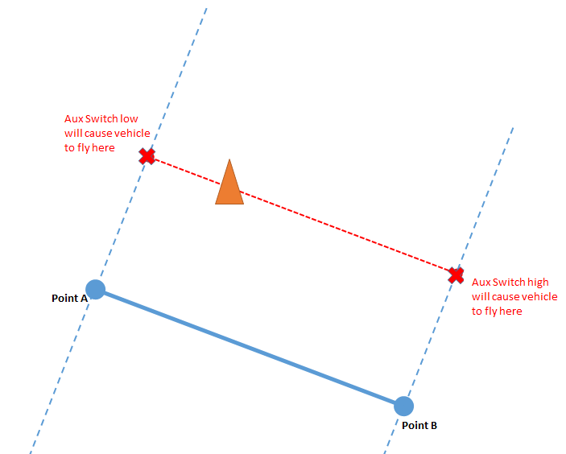
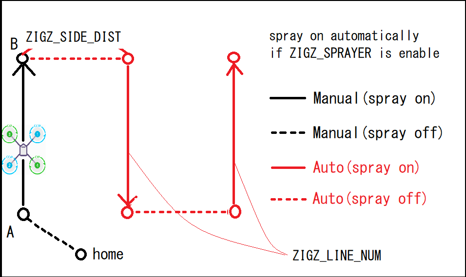

.. _zigzag-mode:

===========
ZigZag Mode
===========

ZigZag mode is a semi-autonomous mode designed to make it easier for a pilot to fly a vehicle back and forth across a field which can be useful for crop spraying

..  youtube:: _qNmLX4QmPU
    :width: 100%

.. note::

   ZigZag is available in Copter-4.0 (and higher)

The way it works is:

- A two or preferably three position :ref:`auxiliary switch <channel-7-and-8-options>` is set to "ZigZag SaveWP" (i.e. :ref:`RC7_OPTION <RC7_OPTION>` = 61)
- The pilot arms the vehicle in :ref:`Loiter <loiter-mode>` mode, takes off and then changes to ZigZag mode (in the future we may make it possible to arm and take-off in ZigZag mode)
- The vehicle is flown manually (it flies like :ref:`Loiter <loiter-mode>`) to one side of the field and then the auxiliary switch is moved to the highest or lowest position (it doesn't matter which) to record that side
- The vehicle is flown to the other side of the field and the switch is moved to the opposite position
- The switch can now be used to start the vehicle flying autonomously (at the current height) to either side of the field.  Once the vehicle reaches the other side it will revert to manual control.  The pilot can also regain manual control by moving the auxiliary switch to the middle position or by changing the flight mode.
- If a downward facing :ref:`range finder <common-rangefinder-landingpage>` is used, the vehicle will follow the terrain when flying.  If the range finder becomes unhealthy while traversing from one side to the other, the vehicle will revert to manual control and come to a stop.

When flown manually ZigZag uses :ref:`Loiter mode's <loiter-mode>`  parameters.  For example the top speed can be configured with :ref:`LOIT_SPEED <LOIT_SPEED>`.

When autonomously flying from one side of the field to the other, the :ref:`Auto mode <auto-mode>` parameters are used.  For example the top speed can be configured with :ref:`WPNAV_SPEED <WPNAV_SPEED>`..

.. _zigzag-auto:

Automatic Operation
===================

.. note:: This feature will be available in Copter-4.1.0

.. note:: this function must be enabled with :ref:`ZIGZ_AUTO_ENABLE<ZIGZ_AUTO_ENABLE>` = 1, and parameters reloaded, before any parameters are visible and the feature enabled.

After the field's side points are registered, if you have an RC switch configured with ``RCx_OPTION`` = 83 (ZigZag Auto Mode), you can automatically cover the field side to side at a programmable distance interval, also enabling a sprayer, if equipped.

To use:

- Fly to one side of the field and register the ZigZagWP A, as above, then fly to ZigZagWP B and set it.
- Then switch the ZigZag Auto Mode switch you had setup. The vehicle will proceed as shown in the diagram, automatically enabling a sprayer, if setup. See :ref:`sprayer` for instructions.
- Upon activation, the vehicle will move in :ref:`ZIGZ_DIRECTION<ZIGZ_DIRECTION>` with respect to its heading for :ref:`ZIGZ_SIDE_DIST<ZIGZ_SIDE_DIST>`, then proceed to cross the field until the opposite ZigZagWP is reached. It will then wait for :ref:`ZIGZ_WP_DELAY<ZIGZ_WP_DELAY>` to allow sprayer to fully stop and then move :ref:`ZIGZ_SIDE_DIST<ZIGZ_SIDE_DIST>` down the side of the field again to proceed back across the area. It will do this for :ref:`ZIGZ_LINE_NUM<ZIGZ_LINE_NUM>` times (-1 = infinite until switched out of this mode, =0 will only move to the first field crossing position, but not proceed further).

Moving the ZigZag Auto switch to the low position immediately stops this mode and returns to normal ZIGZAG mode.

