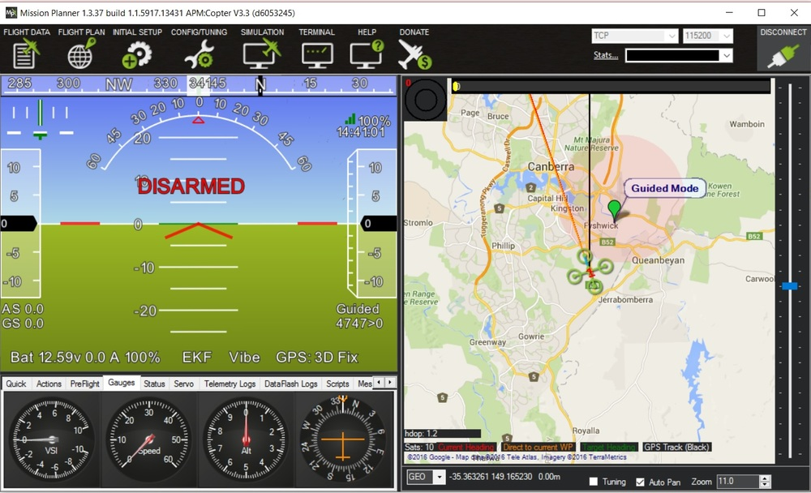

.. _home:

===========
Copter Home
===========

.. tip::

    Keep up with the latest ArduPilot related blogs on `ArduPilot.org! <https://ardupilot.org/>`__

.. image:: /images/home_copter.jpg
    :target: _images/home_copter.jpg

..  raw:: html

    <table>
    <tr>
    <td width="48%">

|TOP_COL_LEFT|

..  raw:: html

    </td>
    <td width="4%">
    </td>
    <td width="48%">
    

|TOP_COL_RIGHT|    

..  raw:: html

    </td>
    </tr>
    </table>
    
..  raw:: html

    <table>
    <tr>
    <td width="48%">

.. image:: ../../images/mission_planner_spline_waypoint.jpg
    :target: _images/mission_planner_spline_waypoint.jpg
    :width: 350px
           
..  raw:: html

    </td>
    <td width="4%">
    </td>
    <td width="48%">

..  raw:: html

    </td>
    </tr>
    </table>

--------------

System components
~~~~~~~~~~~~~~~~~

-  A Pixhawk or :ref:`other autopilot <common-autopilots>` 
   loaded with the latest version of
   the `Copter firmware <https://firmware.ardupilot.org/>`__.
-  :ref:`Mission Planner software <planner:home>` -- gives
   you an easy point-and-click setup/configuration, and a full-featured
   ground control interface.
-  This Copter Wiki provides all the information you need to set up and
   operate a multicopter or traditional helicopter. 
-  A suitable
   :ref:`MultiCopter <build-your-own-multicopter>` or
   :ref:`Helicopter <traditional-helicopters>` for your mission.
-  Plus many other useful options: e.g. data radios, which allow two-way
   wireless telemetry and control between the vehicle and your computer.

--------------

Rotor Craft types
~~~~~~~~~~~~~~~~~

..  raw:: html

    <table>
    <tr>
    <td width="48%">

.. image:: /images/helicopter_trex450.jpg
   :target: _images/helicopter_trex450.jpg 
   :width: 211px

..  raw:: html

    </td>
    <td width="4%">
    </td>
    <td width="48%">

.. image:: /images/3DR_arducopter_hexa_b_frame.jpg
   :target: _images/3DR_arducopter_hexa_b_frame.jpg
   :width: 211px

..  raw:: html

    </td>
    </tr>
    </table>

:ref:`Multicopters <what-is-a-multicopter-and-how-does-it-work>`:

-  Utilize differential thrust management of independent motor-prop
   units to provide lift and directional control
-  Benefit from mechanical simplicity and design flexibility
-  A capable payload lifter that's functional in strong wind conditions
-  Redundant lift sources can give increased margin of safety
-  Varied form factor allows convenient options for payload mounting.

:ref:`Helicopters <traditional-helicopters>`:

-  Typically use a single lifting rotor with two or more blades
-  Maintain directional control by varying blade pitch via
   servo-actuated mechanical linkage (many versions of these craft exist
   and it is beyond the scope of this manual to cover them all -- the
   mechanical systems used in helicopters warrant special study and
   consideration)
-  Strong, fast and efficient -- a proven-worker suitable to many missions.

Because of its open design, Copter also supports more unusual frame
types including the :ref:`Single and Coax-Copters <singlecopter-and-coaxcopter>`.  Put this together
with `Plane <https://ardupilot.org/plane/index.html>`__,
:ref:`Rover <rover:home>` and :ref:`Antenna Tracker <antennatracker:home>` and you have a system
of robotic vehicles that can be controlled through very similar
interfaces to accomplish a wide variety of tasks.

.. image:: ../../images/firmware_types.jpg
    :target: _images/firmware_types.jpg

--------------

Getting more info
~~~~~~~~~~~~~~~~~

-  Continue to the :ref:`Introduction section of this wiki <introduction>`.
-  Use the `ArduPilot Discuss Server Forums <https://discuss.ardupilot.org/c/arducopter>`__
   to ask support questions and advice.
-  To get involved with the development of the software platform, visit the `ArduPilot development guide <https://ardupilot.org/dev/index.html>`__.

.. tip::

    For a simplified chinese 简体中文 version abstract of this wiki please check `ArduPilot.org partner CUAV! <http://doc.cuav.net/tutorial/copter/>`__

.. toctree::
   :hidden:
   
   Introducing Copter <docs/introduction>
   AutoPilot Hardware Options <docs/common-autopilots>
   First Time Setup <docs/initial-setup>
   First Flight <docs/flying-arducopter>
   If A Problem Arises <docs/common-when-problems-arise>
   Advanced Configuration <docs/common-advanced-configuration>
   Mission Planning <docs/common-mission-planning>
   Logs <docs/common-logs>
   Peripheral Hardware <docs/common-optional-hardware>
   Traditional Helicopters <docs/traditional-helicopters>
   Tricopter <docs/tricopter>
   SingleCopter and CoaxCopter <docs/singlecopter-and-coaxcopter>
   HeliQuads <docs/heliquads>
   SkyRocket <docs/skyrocket>
   Solo <docs/solo_arducopter_upgrade>
   Reference Frames <docs/reference-frames>
   Use-Cases and Applications <docs/common-use-cases-and-applications>
   Antenna Tracking <docs/common-antenna-tracking>
   Simulation <docs/common-simulation>
   Appendix <docs/common-appendix>
   Full Table of Contents <docs/common-table-of-contents>

.. |TOP_COL_LEFT| replace:: This is the full-featured, :ref:`open-source <dev:license-gplv3>` 
   multicopter UAV controller that won the   
   `Sparkfun 2013 and 2014 Autonomous Vehicle Competition <https://avc.sparkfun.com/>`__ 
   (dominating with the top five spots). A team of developers 
   from around the globe are constantly improving and refining 
   the performance and capabilities of ArduCopter.
   
.. |TOP_COL_RIGHT| replace:: Copter is capable of the full range of flight requirements 
   from fast paced FPV racing to smooth aerial photography, and fully autonomous 
   complex missions which can be programmed through a number of compatible 
   software ground stations. The entire package is designed to be safe, feature rich, 
   open-ended for custom applications, and is increasingly easy to use even for the novice.

