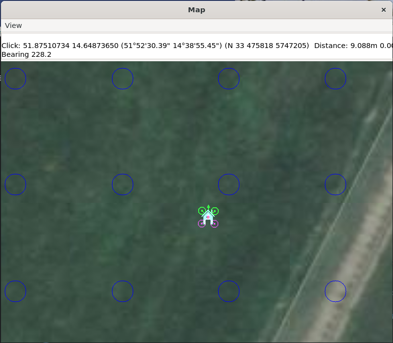

.. _adding_simulated_devices:

===========================================
Adding Simulated Peripherals to sim_vehicle
===========================================

Several devices can be simulated within SITL. These include Gimbals, Beacons, Rangefinders, VICON, RPM sensors,etc.

Starting with CAN based simulated peripherals
=============================================

When SITL is started, it has a standard set of peripherals (ie GPS, ESCs, Servos for flying surfaces, Power Monitors, etc.) simulated also. However, these can be simulated as DroneCAN devices instead to allow monitoring of CAN behavior, allow testing of new AP_Periph devices in the simulation, etc. To start SITL using these peripherals, instead of the normally connected ones:

::

   sim_vehicle.py -v <vehicle> --console --map --can-peripherals

Simulating On-Board OSD
=======================

When starting SITL, you can have it display a simulation of the integated OSD, if the autopilot includes one. Add the ``--osd`` option when starting SITL:

::

    sim_vehicle.py -v ArduPlane --console --map --osd

.. note:: the OSD emulation displays OSD panel items and locations, but it does not allow multiple screens, nor units other than metric

Simulating I2C devices
======================

.. toctree::
    :maxdepth: 1

    sitl-i2c-devices

Adding a Virtual Gimbal
=======================

SITL can simulate a virtual gimbal.

.. note::

   Gimbal simulation causes SITL to start sending
   `MOUNT_STATUS <https://mavlink.io/en/messages/ardupilotmega.html#MOUNT_STATUS>`__
   messages. These messages contain the orientation according to the last
   commands sent to the gimbal, not actual measured values. As a result, it
   is possible that the true gimbal position will not match - i.e. a
   command might be ignored or the gimbal might be moved manually. Changes
   are not visible in Mission Planner.

First start the simulator and use the following commands to set up the
gimbal mount:

::

    # Specify a servo-based mount:
    param set MNT1_TYPE 1

    # Set RC output 6 as pan servo:

    param set SERVO6_FUNCTION 6

    # Set RC output 8 as roll servo:
    param set SERVO7_FUNCTION 8

Then stop and re-launch SITL with the ``-M`` flag:

::

    sim_vehicle.py -M

Adding a Real Serial Gimbal
===========================

.. youtube:: jmqPJt7rnm0

Adding a Rangefinder
====================

SITL can simulate an analog rangefinder, which is very useful for
developing flight modes that can use a rangefinder. To set it up use the
following commands:

::

    param set SIM_SONAR_SCALE 10
    param set RNGFND1_TYPE 1
    param set RNGFND1_SCALING 10
    param set RNGFND1_PIN 0
    param set RNGFND1_MAX_CM 5000
    param set RNGFND1_MIN_CM 0

    # Enable rangefinder for landing (Plane only!)
    param set RNGFND_LANDING 1

The above commands will set up an analog rangefinder with a maximum range
of 50 meters (the 50m comes from an analog voltage range of 0 to 5V, and
a scaling of 10). After making the above changes you need to restart
SITL.

Then to test it try this:

::

    module load graph
    graph RANGEFINDER.distance

Then try a flight and see if the graph shows you the rangefinder
distance.

.. tip::

   You can also use the following commands to graph rangefinder
   information (defined as *MAVProxy* aliases):

   -  ``grangealt`` - graph rangefinder distance and relative altitude.
   -  ``grangev`` - rangefinder voltage
   -  ``grange`` - graph "rangefinder_roll"

Adding a 360deg lidar
=====================

SITL can simulate a 360 deg lidar (either RPLidarA2 or SF45b) which is useful for testing object avoidance. To set it up use the following commands:

::

    param set SERIAL5_PROTOCOL 11 (Proximity)
    param set PRX1_TYPE 5 (RPLidarA2)
      OR
    param set PRX1_TYPE 8 (SF45b)

Next start the simulator using one of the lines shown below.  This will start the vehicle in a location surrounded by virtual barriers

::

    ../Tools/autotest/sim_vehicle.py -A --serial5=sim:sf45b -l 51.8752066,14.6487840,54.15,0
    ../Tools/autotest/sim_vehicle.py -A --serial5=sim:rplidara2 -l 51.8752066,14.6487840,54.15,0
    
To display the barriers on the map run type the following into the terminal

::

    script /tmp/post-locations.scr

Adding an Optical Flow sensor
=============================

A virtual optical flow sensor can be added enabling a RangeFinder (see "Adding a Rangefinder" above) and then setting these parameters:

::

    param set SIM_FLOW_ENABLE 1
    param set FLOW_TYPE 10

Then restart SITL. After setting it up try this:

::

    module load graph
    graph OPTICAL_FLOW.flow_comp_m_x OPTICAL_FLOW.flow_comp_m_y

Go for a flight and see if you get reasonable data.

Adding an RPM sensor
====================

You can add an RPM sensor like this:

::

    param set RPM_TYPE 1

This allows to display and log your virtual motor's rotational speed.

Adding Wheel Encoders
=====================

You can test two virtual wheel encoders like this:

::

    param set EK3_SRC1_POSXY 0
    param set EK3_SRC1_VELXY 7
    param set EK3_SRC1_VELZ 0
    param set GPS_TYPE 0
    param set WENC_TYPE 10
    param fetch
    param set WENC_POS_Y 0.075
    param set WENC2_TYPE 10
    param set WENC2_POS_Y -0.075
    param set ARMING_CHECK 60918 (to disable GPS checks)

The restart SITL and right mouse button click on the map and select "Set Origin (with height)" and the vehicle should appear on the map.  It may also be useful to enter "map set showsimpos 1" to make the vehicle's actual position visible.

Adding Range Beacons
====================

You can test a virtual range beacons by setting the following parameters

::

    param set EK3_GPS_TYPE 3
    param set GPS_TYPE 0
    param set BCN_TYPE 10
    param fetch
    param set BCN_LATITUDE -35.363261
    param set BCN_LONGITUDE 149.165230
    param set BCN_ALT 584

The restart SITL and the vehicle should appear on the map.  After perhaps 30seconds it should shift to its normal starting position.

Testing Precision Landing
-------------------------

.. note::

   These instructions are written assuming ArduCopter

Enable Precision Landing, and set the precision landing backend type to SITL:

::

   param set PLND_ENABLED 1
   param fetch
   param set PLND_TYPE 4
   param set SIM_PLD_ENABLE 1
   param set SIM_PLD_LAT -35.3632
   param set SIM_PLD_LON 149.1652

A rangefinder is currently required for precision landing.  Enable a simulated rangefinder:

::

   param set RNGFND1_TYPE 1
   param set RNGFND1_MIN_CM 0
   param set RNGFND1_MAX_CM 4000
   param set RNGFND1_PIN 0
   param set RNGFND1_SCALING 12.12

Restart the simulation.
   
Takeoff and fly a bit, then switch into land:

::

   arm throttle
   rc 3 1800
   mode land
   rc 3 1500

Check the logs for precision landing messages:

::

   ls -lt logs

Choose the youngest, then:

::

   mavlogdump.py --type PL logs/<youngest>

Testing Vicon (aka Vision Positioning)
--------------------------------------

Start SITL, wiping parameters:

::

   ./Tools/autotest/sim_vehicle.py -v ArduCopter --gdb --debug -w

Enable EKF3, disable GPS and set Serial5 protocol to mavlink so as to accept vision-position-estimate and vision-speed-estimate messages:

::

    param set EK3_SRC1_POSXY 6
    param set EK3_SRC1_POSZ 6
    param set EK3_SRC1_VELXY 6
    param set EK3_SRC1_VELZ 6
    param set EK3_SRC1_YAW 6
    param set VISO_TYPE 2
    param set SERIAL5_PROTOCOL 2
    param set GPS_TYPE 0 (optional)
    param set ARMING_CHECK 388598 (optional, to disable GPS checks)
    param fetch

Restart the simulation, attaching a simulated Vicon system to ``SERIAL5``:

::

   ../Tools/autotest/sim_vehicle.py --map --console -A "--serial5=sim:vicon:"

The console should indicate no GPS is present:

::

   GPS: 0 (0)

Vision position estimates should now be being fed into ArduCopter:

::

   STABILIZE> status VICON_POSITION_ESTIMATE
   STABILIZE> 43371: VICON_POSITION_ESTIMATE {usec : 38380000, x : 0.0, y : 0.0, z : -0.0999755859375, roll : 0.0, pitch : 0.0, yaw : -0.122173137963}

You should also receive a startup message from the EKF:

::

   APM: EKF3 IMU0 is using external nav data
   APM: EKF3 IMU0 initial pos NED = 0.0,0.0,-0.1 (m)
   APM: EKF3 IMU1 is using external nav data
   APM: EKF3 IMU1 initial pos NED = 0.0,0.0,-0.1 (m)

Use MAVProxy's right-click context menu item to ``Set Origin (with alt)``

Arm in loiter, takeoff and fly somewhere:

::

   loiter
   arm throttle
   rc 3 1800
   rc 2 1400

Other SITL vicon settings are hel in SIM_VICON_xx parameters:

::

   param show SIM_VICON*

Simulating Multiple Flight Controllers on a Vehicle
---------------------------------------------------

The STANDBY Mode function (``RCx_OPTION`` = 76) allows an autopilot to be put into a soft standby mode so that a second autopilot or companion computer can take control, but allow the first to resume later. In order to help in the code development of such systems, you can simulate two flight controllers operating in the simulation at the same time. The "master" instance, which has the active outputs into the sim is started declaring that there will be a "slave" instance which will be monitoring the sensors and running its code in parallel, but whose outputs are not connected into the simulation physics:

::

   ./Tools/autotest/sim_vehicle.py -v ArduCopter --slave 1

then another sim is started for the "slave" autopilot using:

::

   ./Tools/autotest/sim_vehicle.py -v ArduCopter  -f json:0.0.0.0 -I1

you can then switch between whose outputs are being used by the simulation physics with the ``SIM_JSON_MASTER`` parameter  ie O or 1.

The second simulation could be running code from a different branch on the same computer.

Adding a Winch
==============

A virtual winch can be added to a copter by setting these parameters:

::

    param set WINCH_TYPE 1
    param set SERVO9_FUNCTION 88
    param set RC9_OPTION 45

Then restart SITL. After setting it up try this:

::

    module load graph
    graph SERVO_OUTPUT_RAW.servo9_raw
    rc 9 2000 (to release line)
    rc 9 1000 (to wind in line)
    rc 9 1500 (to stop winch from moving)

More instructions for controlling the winch using mavlink commands can be found on the :ref:`MAVLink Interface Winch Control page <mavlink-winch>`
