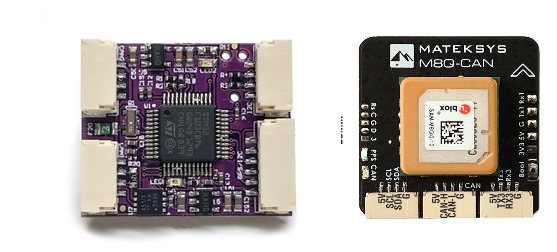

.. _ap-peripheral-landing-page:

=========
AP_Periph
=========

AP_Periph is an abbreviation for ArduPilot Peripheral, ie. an ArduPilot peripheral device based on the existing ArduPilot autopilot code. It takes peripheral device driver libraries of ArduPilot and adapts them to run on stand-alone peripheral devices, which communicate to the main autopilot via CAN, MSP, or other peripheral bus protocols.

The Peripheral device supports a wide range of STM32 processors,
including F103, F303, F4xx, F7xx, G4xx and H7. Both sensors (distance
sensor, GNSS, IMU, Barometer, battery, etc.) and output ports (I2C,
SPI, PWM, UART, ESC, LED, etc.) can be used to build new peripherals,
as well as providing bus expansion for CAN, MSP, I2C, SPI, etc.

The software uses the same build system as ArduPilot for autopilot boards. All the firmware build configuration for an AP_Periph board done using a single configuration file (hwdef.dat) defines the inputs/outputs of the device and what device drivers will be included, in the same manner as an autopilot board. This makes it possible, for example, to define an AP_Periph device for UAVCAN with only a micro-controller of the STM32F103 type and 128 KB of flash memory, although processors with larger memory will be required depending on the number of drivers.

.. images/ap-periph-block-diagram.png

Capabilities
============

- Bootloader update via serial or CAN port
- Firmware update
- Dynamic or static CAN node allocation
- Parameter storage in flash memory
- Self-diagnostic and security: watchdog, CRC, autotest, etc.
- Updates with MissionPlanner or DroneCAN tools like :ref:`common-uavcan-gui`

Examples of using generic AP_Periph nodes are shown here:

.. toctree::
   :maxdepth: 1

   DroneCAN Adapter Node Setup <common-ap-periph-usage-examples>

Existing Products
=================

Some (but not all) product examples using AP-Periph:

- :ref:`Mateksys M8Q<common-matek-m8q>`
- Hitec GNSS (`Septentrio Mosaic <https://hitecnology.com/drone-peripherals/hcs-positionpro-gnss-receiver>`__ )
- :ref:`mRo UAVCAN/DroneCAN Adapter node<common-mro-uavcan-adapter-node>`
- :ref:`Orange Cube<common-thecubeorange-overview>` (It is a flight controller, but it can also be used in AP_Periph. Similar node types to follow.)

See: :ref:`DroneCAN Peripherals <copter:common-uavcan-peripherals>` for more devices

Firmware
========

Firmware for existing device definitions are posted `here <https://firmware.ardupilot.org/AP_Periph/>`__. Their hardware definition files are in the ArduPilot Github repository, `here <https://github.com/ArduPilot/ardupilot/tree/master/libraries/AP_HAL_ChibiOS/hwdef>`__

To create firmware for a new design, follow the same instructions as for porting to a new autopilot board, as explained in the Wiki section :ref:`porting`.

Additional information is available in the AP_Periph readme `here <https://github.com/ArduPilot/ardupilot/blob/master/Tools/AP_Periph/README.md>`__

Parameters List
===============

With the exception of the following parameters, AP_Periph parameters are simply those of the included driver libraries for the peripheral firmware.

- :ref:`FORMAT_VERSION<FORMAT_VERSION>`
- :ref:`CAN_NODE<CAN_NODE>`
- :ref:`CAN_BAUDRATE<CAN_BAUDRATE>`
- :ref:`FLASH_BOOTLOADER<FLASH_BOOTLOADER>`
- :ref:`DEBUG<DEBUG>`
- :ref:`BRD_SERIAL_NUM<BRD_SERIAL_NUM>`

And, depending on the driver library included, several parameters are needed in addition to those included normally in those libraries:

- :ref:`BUZZER_VOLUME<BUZZER_VOLUME>`
- :ref:`BARO_ENABLE<BARO_ENABLE>`
- :ref:`LED_BRIGHTNESS<LED_BRIGHTNESS>`
- :ref:`RNGFND_BAUDRATE<RNGFND_BAUDRATE>`
- :ref:`RNGFND_PORT<RNGFND_PORT>`
- :ref:`ADSB_BAUDRATE<ADSB_BAUDRATE>`
- :ref:`ADSB_PORT<ADSB_PORT>`
- :ref:`HARDPOINT_ID<HARDPOINT_ID>`
- :ref:`HARDPOINT_RATE<HARDPOINT_RATE>`
- :ref:`ESC_NUMBER<ESC_NUMBER>`
- :ref:`ESC_PWM_TYPE<ESC_PWM_TYPE>`
- :ref:`MSP_PORT<MSP_PORT>`

List of all parameters for possible drivers which can be included:

.. toctree::
   :maxdepth: 1

    Full Parameter List <AP_Periph-Parameters>

