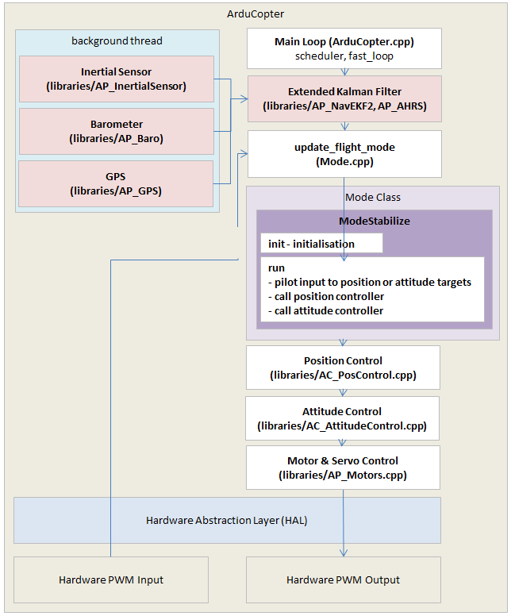

.. _apmcopter-adding-a-new-flight-mode:

==================================
Adding a New Flight Mode to Copter
==================================

This section covers the basics of how to create a new high level flight mode (i.e. equivalent of Stabilize, Loiter, etc)

As a reference the diagram below provides a high level view of Copter's architecture.

#. Pick a name for the new mode and add it to the ``Mode::Number`` enum in `mode.h <https://github.com/ArduPilot/ardupilot/blob/master/ArduCopter/mode.h>`__ just like "NEW_MODE" has been added below.
   Choose a number that is neither used nor reserved in the current source; do not change existing mode numbers. The example uses 99, but check that it is still available in your checkout and does not collide with any Lua modes you use. Lua modes registered with ``vehicle:register_custom_mode()`` are not listed in this enum. For example, `Flip_Mode.lua <https://github.com/ArduPilot/ardupilot/blob/master/libraries/AP_Scripting/examples/Flip_Mode.lua>`__ registers mode 100; assigning that number to a native mode would prevent the script from registering its mode.

   ::

    // Auto Pilot Modes enumeration
    enum class Number : uint8_t {
        STABILIZE =     0,  // manual airframe angle with manual throttle
        ACRO =          1,  // manual body-frame angular rate with manual throttle
        ALT_HOLD =      2,  // manual airframe angle with automatic throttle
        AUTO =          3,  // fully automatic waypoint control using mission commands
        GUIDED =        4,  // fully automatic fly to coordinate or fly at velocity/direction using GCS immediate commands
        LOITER =        5,  // automatic horizontal acceleration with automatic throttle
        RTL =           6,  // automatic return to launching point
        CIRCLE =        7,  // automatic circular flight with automatic throttle
        LAND =          9,  // automatic landing with horizontal position control
        DRIFT =        11,  // semi-autonomous position, yaw and throttle control
        SPORT =        13,  // manual earth-frame angular rate control with manual throttle
        FLIP =         14,  // automatically flip the vehicle on the roll axis
        AUTOTUNE =     15,  // automatically tune the vehicle's roll and pitch gains
        POSHOLD =      16,  // automatic position hold with manual override, with automatic throttle
        BRAKE =        17,  // full-brake using inertial/GPS system, no pilot input
        THROW =        18,  // throw to launch mode using inertial/GPS system, no pilot input
        AVOID_ADSB =   19,  // automatic avoidance of obstacles in the macro scale - e.g. full-sized aircraft
        GUIDED_NOGPS = 20,  // guided mode but only accepts attitude and altitude
        SMART_RTL =    21,  // SMART_RTL returns to home by retracing its steps
        FLOWHOLD  =    22,  // FLOWHOLD holds position with optical flow without rangefinder
        FOLLOW    =    23,  // follow attempts to follow another vehicle or ground station
        ZIGZAG    =    24,  // ZIGZAG mode is able to fly in a zigzag manner with predefined point A and point B
        SYSTEMID  =    25,  // System ID mode produces automated system identification signals in the controllers
        AUTOROTATE =   26,  // Autonomous autorotation
        AUTO_RTL =     27,  // Auto RTL, this is not a true mode, AUTO will report as this mode if entered to perform a DO_LAND_START Landing sequence
        TURTLE =       28,  // flip over after crash

        // Mode number 30 reserved for "offboard" for external/Lua control.
        // Mode number 127 reserved for the "drone show mode" in the Skybrush
        // fork at https://github.com/skybrush-io/ardupilot

        NEW_MODE =     99,  // your new flight mode (check that this number is available)
    };

#. Define a new class for the mode in `mode.h <https://github.com/ArduPilot/ardupilot/blob/master/ArduCopter/mode.h>`__.
   It is probably easiest to copy a similar existing mode's class definition and just change the class name (i.e. copy and rename "class ModeStabilize" to "class ModeNewMode").
   The new class should inherit from the Mode class and implement ``mode_number()``, ``run()``, ``name()``, ``name4()`` and the required capability methods shown below. Implement ``init()`` if the mode needs initialisation or entry checks.

    ::

        public:
           // inherit constructor
           using Mode::Mode;
           Number mode_number() const override { return Number::NEW_MODE; }
           bool init(bool ignore_checks) override;
           void run() override;

        protected:
           const char *name() const override { return "NEWMODE"; }
           const char *name4() const override { return "NEWM"; }

   The ``name()`` and ``name4()`` methods are for logging and display purposes.  ``init()`` will be called when the vehicle first switches into this new mode so it should implement any required initialisation.  ``run()`` will be called at 400hz and should implement any pilot input decoding and then set position and attitude targets (see below).

   Implement the following required capability methods to describe whether the mode needs a position estimate, uses manual throttle, allows arming, and controls the vehicle automatically:

    ::

        bool requires_position() const override { return false; }
        bool has_manual_throttle() const override { return true; }
        bool allows_arming(AP_Arming::Method method) const override { return true; }
        bool is_autopilot() const override { return false; }

#. Create a new mode_<new flight mode>.cpp file based on a similar mode such as
   `mode_stabilize.cpp <https://github.com/ArduPilot/ardupilot/blob/master/ArduCopter/mode_stabilize.cpp>`__
   or `mode_loiter.cpp <https://github.com/ArduPilot/ardupilot/blob/master/ArduCopter/mode_loiter.cpp>`__.
   This new file should probably implement the ``init()`` method which will be called when the vehicle first enters the mode.  This function should return true if it is OK for the vehicle to enter the mode, false if it cannot.
   Below is an excerpt from `mode_rtl.cpp <https://github.com/ArduPilot/ardupilot/blob/master/ArduCopter/mode_rtl.cpp>`__'s init method that shows how the vehicle cannot enter RTL mode unless the home position has been set. 

    ::

        // rtl_init - initialise rtl controller
        bool ModeRTL::init(bool ignore_checks)
        {
            if (!ignore_checks) {
                if (!AP::ahrs().home_is_set()) {
                    return false;
                }
            }
            // initialise waypoint and spline controller
            wp_nav->wp_and_spline_init_m(speed_ms.get());
            _state = SubMode::STARTING;
            _state_complete = true; // see run() method below
            terrain_following_allowed = !copter.failsafe.terrain;
            // land_repo_active and prec_land_active resets, and the conditional
            // precland state machine initialisation, omitted from this excerpt
            return true;
        }

   Below is an excerpt from `mode_stabilize.cpp <https://github.com/ArduPilot/ardupilot/blob/master/ArduCopter/mode_stabilize.cpp>`__'s run method (called 400 times per second) that decodes the user's input, then sends new targets to the attitude controller.

   ::

        void ModeStabilize::run()
        {
            // convert pilot input to lean angles
            float target_roll_rad, target_pitch_rad;
            get_pilot_desired_lean_angles_rad(target_roll_rad, target_pitch_rad, attitude_control->lean_angle_max_rad(), attitude_control->lean_angle_max_rad());

            // get pilot's desired yaw rate
            float target_yaw_rate_rads = get_pilot_desired_yaw_rate_rads();

            // motor spool state handling omitted from this excerpt

            // call attitude controller
            attitude_control->input_euler_angle_roll_pitch_euler_rate_yaw_rad(target_roll_rad, target_pitch_rad, target_yaw_rate_rads);

            // output pilot's throttle
            // throttle adjustment for the motor spool state omitted
            attitude_control->set_throttle_out(get_pilot_desired_throttle(), true, g.throttle_filt);
        }

   The attitude inputs in this excerpt are in radians and radians per second. It is not a complete mode implementation: copy the motor spool state and throttle handling from the current source when implementing your mode.

#. Instantiate the new mode class in `Copter.h <https://github.com/ArduPilot/ardupilot/blob/master/ArduCopter/Copter.h>`__ by searching for "ModeAcro" and then adding the new mode somewhere below.

   ::

        #if MODE_ACRO_ENABLED
        #if FRAME_CONFIG == HELI_FRAME
            ModeAcro_Heli mode_acro;
        #else
            ModeAcro mode_acro;
        #endif
        #endif
        #if MODE_ALTHOLD_ENABLED
            ModeAltHold mode_althold;
        #endif
            ModeNewMode mode_newmode;
        #if MODE_AUTO_ENABLED
            ModeAuto mode_auto;
        #endif
        #if AUTOTUNE_ENABLED
            ModeAutoTune mode_autotune;
        #endif

#. In `mode.cpp <https://github.com/ArduPilot/ardupilot/blob/master/ArduCopter/mode.cpp>`__ add the new mode to the ``mode_from_mode_num()`` function to create the mapping between the mode's number and the instance of the class.

   ::

        // return the static controller object corresponding to supplied mode
        Mode *Copter::mode_from_mode_num(const Mode::Number mode)
        {
            switch (mode) {
        #if MODE_ACRO_ENABLED
                case Mode::Number::ACRO:
                    return &mode_acro;
        #endif

                case Mode::Number::STABILIZE:
                    return &mode_stabilize;

                case Mode::Number::NEW_MODE:
                    return &mode_newmode;

                // Other existing mode cases omitted from this excerpt.
                default:
                    break;
            }

            // Existing Lua mode lookup omitted from this excerpt.
            return nullptr;
        }

#. Add the new flight mode to the ``modes[]`` array in ``GCS_MAVLINK_Copter::send_available_mode()`` in `GCS_MAVLink_Copter.cpp <https://github.com/ArduPilot/ardupilot/blob/master/ArduCopter/GCS_MAVLink_Copter.cpp>`__ so it is reported in the MAVLink ``AVAILABLE_MODES`` messages.
   Also add it to the ``modes[]`` array in ``Copter::get_available_mode_enabled_mask()`` in `mode.cpp <https://github.com/ArduPilot/ardupilot/blob/master/ArduCopter/mode.cpp>`__ so changes to its selectable state are tracked.
   Append the following entry to both arrays. Keep the first two AUTO entries in ``send_available_mode()`` in place because they receive special handling for AUTO RTL and AUTO. The enabled-mode mask supports at most 32 entries.

   ::

        &copter.mode_newmode,

   If the mode has a build option, use the same preprocessor condition for its instance, lookup case and entries in both arrays.

#. If users should be able to block selection of the mode from a ground station with ``FLTMODE_GCSBLOCK``, append its number to ``mode_list[]`` in ``Copter::gcs_mode_enabled()`` in `mode.cpp <https://github.com/ArduPilot/ardupilot/blob/master/ArduCopter/mode.cpp>`__:
   Add a comma after the existing last entry, ``TURTLE``, before appending the new entry. The end of the array should look like this:

   ::

        (uint8_t)Mode::Number::TURTLE,
        (uint8_t)Mode::Number::NEW_MODE,

   The array index is the parameter's bit number, not the flight mode number. Preserve the order of existing entries and add the corresponding ``@Bitmask{Copter}`` description for ``FLTMODE_GCSBLOCK`` in `AP_Vehicle.cpp <https://github.com/ArduPilot/ardupilot/blob/master/libraries/AP_Vehicle/AP_Vehicle.cpp>`__.
   GCS blocking prevents ground-station mode changes and marks the mode as not user selectable in ``AVAILABLE_MODES``; RC and failsafe mode changes remain possible.

#. Add the new flight mode to the list of valid ``@Values`` for the ``FLTMODE1 ~ FLTMODE6`` parameters in `Parameters.cpp <https://github.com/ArduPilot/ardupilot/blob/master/ArduCopter/Parameters.cpp>`__ (search for "FLTMODE1"). The current ``FLTMODE2`` through ``FLTMODE6`` definitions inherit the values with ``@CopyFieldsFrom: FLTMODE1``; update any separate values lists in your checkout as well.
   Note that even before being committed to master, a user can setup the new flight mode to be activated from the transmitter's flight mode switch by directly setting the FLTMODE1 (or FLTMODE2, etc) parameters to the number of the new mode.

   ::

        // @Param: FLTMODE1
        // @DisplayName: Flight Mode 1
        // @Description: Flight mode when pwm of Flightmode channel(FLTMODE_CH) is <= 1230
        // @Values: 0:Stabilize,1:Acro,2:AltHold,3:Auto,4:Guided,5:Loiter,6:RTL,7:Circle,9:Land,11:Drift,13:Sport,14:Flip,15:AutoTune,16:PosHold,17:Brake,18:Throw,19:Avoid_ADSB,20:Guided_NoGPS,21:Smart_RTL,22:FlowHold,23:Follow,24:ZigZag,25:SystemID,26:Heli_Autorotate,27:Auto RTL,28:Turtle,99:NewMode
        // @User: Standard
        GARRAY(flight_modes, 0, "FLTMODE1", (uint8_t)FLIGHT_MODE_1),

        // @Param: FLTMODE2
        // @CopyFieldsFrom: FLTMODE1
        // @DisplayName: Flight Mode 2
        // @Description: Flight mode when pwm of Flightmode channel(FLTMODE_CH) is >1230, <= 1360
        GARRAY(flight_modes, 1, "FLTMODE2", (uint8_t)FLIGHT_MODE_2),

#. Add the flight mode to the ``COPTER_MODE`` enum within `mavlink/ardupilotmega.xml <https://github.com/ArduPilot/mavlink/blob/master/message_definitions/v1.0/ardupilotmega.xml>`__ if ground-station support requires this definition. Some ground stations use it to interpret the mode number.
   For a new mode to be accepted into ArduPilot, also prepare PRs for MAVProxy, QGroundControl and Mission Planner so they display the mode and let users select it easily. Updating the firmware and parameter metadata alone does not complete ground-station support.
