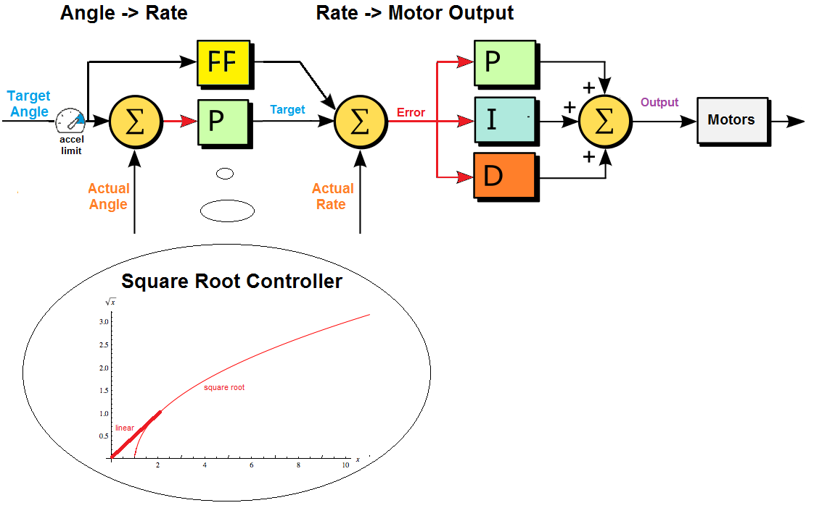
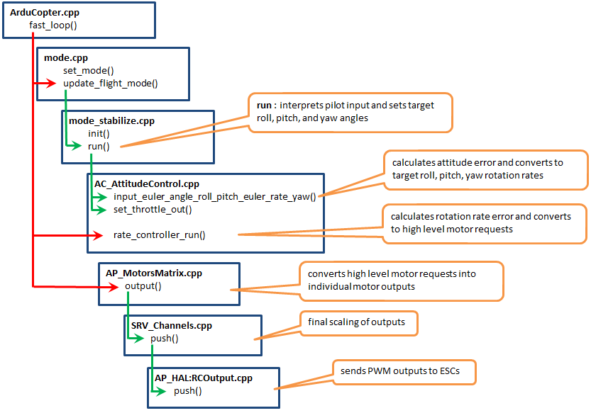

.. _apmcopter-programming-attitude-control-2:

=======================
Copter Attitude Control
=======================

Below is a high level diagram showing how the attitude control is done for each axis.
The control is done using a P controller to convert the angle error (the difference between the target angle and actual angle) into a desired rotation rate followed by a PID controller to convert the rotate rate error into a high level motor command. 
The "square root controller" portion of the diagram shows the curved used with the angle control's P controller.

The diagram below shows the code path followed from pilot input down to pwm output.

On every update (i.e. 400hz on Pixhawk, 100hz on APM2.x) the following
happens:

-  the top level flight-mode.cpp's "update_flight_mode()" function is
   called.  This function checks the vehicle's flight mode (ie.
   "control_mode" variable) and then calls the appropriate <flight mode>_run() function (i.e.
   `stabilize_run <https://github.com/ArduPilot/ardupilot/blob/master/ArduCopter/control_stabilize.cpp#L20>`__
   for stabilize mode,
   `rtl_run <https://github.com/ArduPilot/ardupilot/blob/master/ArduCopter/control_rtl.cpp#L23>`__
   for RTL mode, etc).  The <flight mode>_run() function can be found
   in the appropriately named control_<flight mode>.cpp file (i.e.
   `control_stabilize.cpp <https://github.com/ArduPilot/ardupilot/blob/master/ArduCopter/control_stabilize.cpp>`__,
   `control_rtl.cpp <https://github.com/ArduPilot/ardupilot/blob/master/ArduCopter/control_rtl.cpp>`__,
   etc).
-  the <flight mode>_run function is responsible for converting the
   user's input (found in g.rc_1.control_in, g.rc_2.control_in, etc)
   into a lean angle, rotation rate, climb rate, etc that is appropriate
   for this flight mode.  For example
   `AltHold <https://github.com/ArduPilot/ardupilot/blob/master/ArduCopter/control_althold.cpp#L22>`__
   converts the user's roll and pitch input into lean angles (in
   degrees), the yaw input is converted into a rotation rate (in degrees
   per second) and the throttle input is converted to a climb rate (in
   cm/s).
-  the last thing the <flight mode>_run function must do is pass these
   desired angles, rates etc into Attitude Control and/or Position
   Control libraries (these are both held in the
   `AC_AttitudeControl <https://github.com/ArduPilot/ardupilot/tree/master/libraries/AC_AttitudeControl>`__
   folder).
-  The `AC_AttitudeControl <https://github.com/ArduPilot/ardupilot/blob/master/libraries/AC_AttitudeControl/AC_AttitudeControl.h>`__
   library provides 5 possible ways to control the attitude of the
   vehicle, the most common 3 are described below.

   -  `angle_ef_roll_pitch_rate_ef_yaw() <https://github.com/ArduPilot/ardupilot/blob/master/libraries/AC_AttitudeControl/AC_AttitudeControl.h#L98>`__
      : this accepts an "earth frame" angle for roll and pitch, and an
      "earth frame" rate for yaw.  For example providing this function
      roll = -1000, pitch = -1500, yaw = 500 means lean the vehicle left
      to 10degrees, pitch forward to 15degrees and rotate right at
      5deg/second.
   -  `angle_ef_roll_pitch_yaw() <https://github.com/ArduPilot/ardupilot/blob/master/libraries/AC_AttitudeControl/AC_AttitudeControl.h#L102>`__
      : this accepts "earth frame" angles for roll, pitch and yaw. 
      similar to above except providing yaw of 500 means rotate the
      vehicle to 5 degrees east of north.
   -  `rate_bf_roll_pitch_yaw() <https://github.com/ArduPilot/ardupilot/blob/master/libraries/AC_AttitudeControl/AC_AttitudeControl.h#L108>`__
      : this accepts a "body frame" rate (in degrees/sec) for roll pitch
      and yaw.  For example providing this function roll = -1000, pitch
      = -1500, yaw = 500 would lead to the vehicle rolling left at
      10deg/sec, pitching forward at 15deg/sec and rotating about the
      vehicle's z axis at 5 deg/sec.

After any calls to these functions are made the
`AC_AttitudeControl::rate_controller_run() <https://github.com/ArduPilot/ardupilot/blob/master/libraries/AC_AttitudeControl/AC_AttitudeControl.h#L114>`__
is called.  This converts the output from the methods listed above into
roll, pitch and yaw inputs which are sent to the
`AP_Motors <https://github.com/ArduPilot/ardupilot/tree/master/libraries/AP_Motors>`__
library via it's `set_roll, set_pitch, set_yaw and set_throttle <https://github.com/ArduPilot/ardupilot/blob/master/libraries/AP_Motors/AP_Motors_Class.h#L99>`__
methods.

-  The `AC_PosControl <https://github.com/ArduPilot/ardupilot/blob/master/libraries/AC_AttitudeControl/AC_PosControl.h>`__
   library allows 3D position control of the vehicle.  Normally only the
   simpler Z-axis (i.e. altitude control) methods are used because more
   complicated 3D position flight modes (i.e.
   `Loiter <https://github.com/ArduPilot/ardupilot/blob/master/ArduCopter/control_loiter.cpp#L30>`__)
   make use of the
   `AC_WPNav <https://github.com/ArduPilot/ardupilot/blob/master/libraries/AC_WPNav/AC_WPNav.h>`__
   library.  In any case, some commonly used methods of this library
   include:

   -  `set_alt_target_from_climb_rate() <https://github.com/ArduPilot/ardupilot/blob/master/libraries/AC_AttitudeControl/AC_PosControl.h#L109>`__
      : this accepts a climb rate in cm/s and updates an absolute
      altitude target
   -  `set_pos_target() <https://github.com/ArduPilot/ardupilot/blob/master/libraries/AC_AttitudeControl/AC_PosControl.h#L171>`__
      : this accepts a 3D position vector which is an offset from home
      in cm

If any methods in AC_PosControl are called then the flight mode code
must also call the
`AC_PosControl::update_z\_controller() <https://github.com/ArduPilot/ardupilot/blob/master/libraries/AC_AttitudeControl/AC_PosControl.h#L134>`__
method.  This will run the z-axis position control PID loops and send
low-level throttle level to the
`AP_Motors <https://github.com/ArduPilot/ardupilot/tree/master/libraries/AP_Motors>`__
library.  If any xy-axis methods are called then
`AC_PosControl::update_xy_controller() <https://github.com/ArduPilot/ardupilot/blob/master/libraries/AC_AttitudeControl/AC_PosControl.h#L202>`__
must be called.

-  The AP_Motors library holds the "motor mixing" code.  This code is
   responsible for converting the roll, pitch, yaw and throttle values
   received from the AC_AttitudeControl and AC_PosControl libraries
   into absolute motor outputs (i.e. PWM values).  So the higher level
   libs would make use of these functions:

   -  `set_roll(), set_pitch(), set_yaw() <https://github.com/ArduPilot/ardupilot/blob/master/libraries/AP_Motors/AP_Motors_Class.h#L99>`__
      : accepts roll, pitch and yaw values in the range of -4500 ~
      4500.  These are not desired angles or even rates but rather just
      a value.  For example set_roll(-4500) would mean roll left as
      fast as possible.
   -  set_throttle() : accepts an absolute throttle value in the range
      of 0 ~ 1000.  0 = motors off, 1000 = full throttle.

-  There are different classes for each frame type (quad, Y6, traditional helicopter) but in each there is an "`output_armed <https://github.com/ArduPilot/ardupilot/blob/master/libraries/AP_Motors/AP_MotorsMatrix.cpp#L123>`__\ " function which is responsible for implementing the conversion of these roll, pitch, yaw and throttle values into pwm outputs.  This conversion often includes implementing a "stability patch" which handles prioritising one axis of control over another when the input requests are outside the physical limits of the frame (i.e. max throttle and max roll is not possible with a quad because some motors must be less than others to cause a roll).  At the bottom of the "output_armed" function there is a call to the hal.rcout->write() which passes the desired pwm values to the AP_HAL layer.

-  The `AP_HAL <https://github.com/ArduPilot/ardupilot/tree/master/libraries/AP_HAL>`__ libraries (hardware abstraction layer) provides a consistent interface for all boards.  In particular the hal.rc_out_write() function will cause the specified PWM received from the AP_Motors class to appear on the appropriate pwm pin out for the board.

Leonard Hall, Developer Un-Conference 2018
------------------------------------------

..  youtube:: -PC69jcMizA
    :width: 100%
