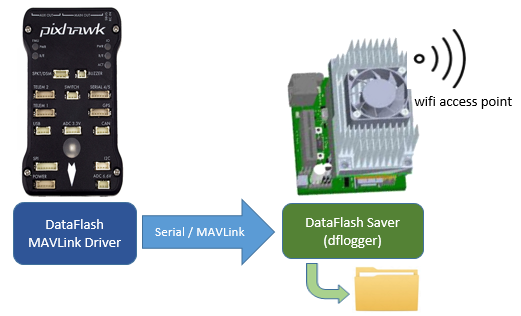
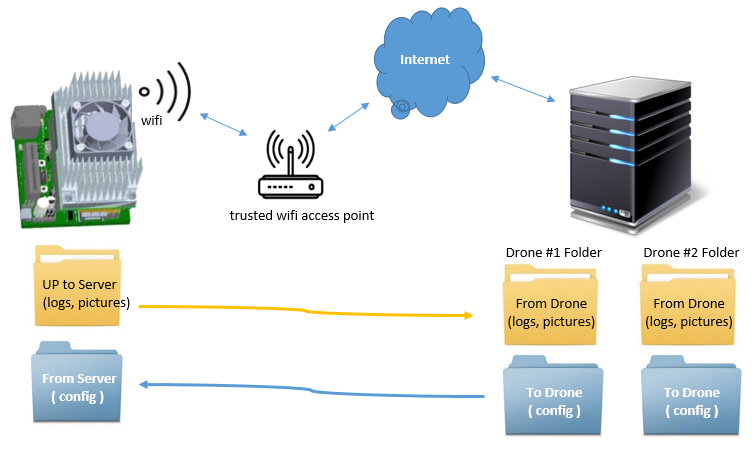
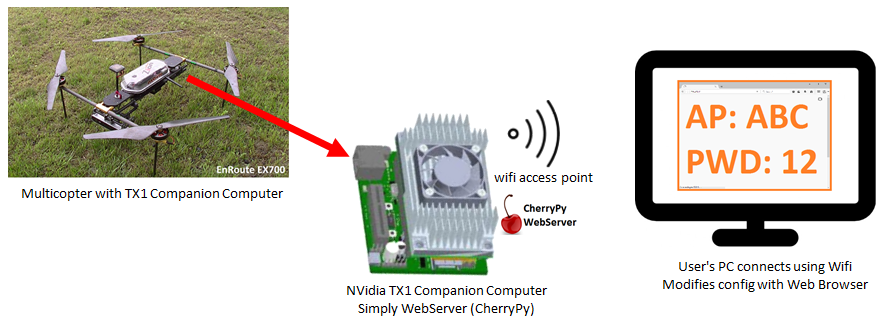
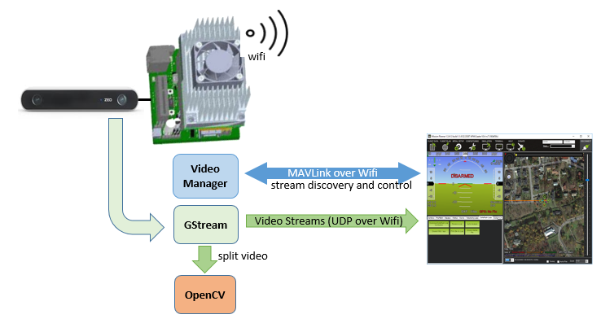

.. _apsync-intro:

======
APSync
======

APSync is a project sponsored by `eLab <http://elab.co.jp/>`__ which simplifies the setup of companion computers so that they can be used to provide additional functionality to ArduPilot and also to ease integration with internet services.

The current release automatically creates a Wifi Access Point on startup, allows DataFlash logging to the companion copmuter and "simple" real-time video streaming from a camera on the drone to the ground station.

The supported companion computers are the :ref:`RPi3 <raspberry-pi-via-mavlink>`, :ref:`NVidia TX1 <companion-computer-nvidia-tx1>`, :ref:`NVidia TX2 <companion-computer-nvidia-tx2>` and :ref:`Intel Edison <intel-edison>`.

.. note::

   Video streaming from the Intel Edison is not supported.

:ref:`Installation instructions <apsync-intro-installing-apsync>` are at the bottom of this page.

..  youtube:: 3bVFEF4MPdU
    :width: 100%

Please get involved by reporting issues in the `ArduPilot Forums <http://discuss.ardupilot.org/c/development-team>`__.  Deveopers can help improve APSync by submitting PRs to `ArduPilot/companion <https://github.com/ArduPilot/companion>`__ and/or discuss with others developers in `Gitter's ArduPilot/companion chat room <https://gitter.im/ArduPilot/companion>`__!

Wifi Access Point & DataFlash logging
=====================================

On start-up an access point is created with name "ardupilot".  The default password is also "ardupilot".

The user can connect to this access point and then easily connect to ardupilot running on the flight controller by setting their ground station (including Mission Planner) to connect using "UDP", port 14550.

Dataflash logs are streamed to the companion computer via mavlink and stored on the companion computer's filesystem (as well as on the pixhawk's dataflash).
Dataflash log files can then be quickly downloaded (over wifi) using a script (Windows users may use `apsync-download-logs <http://firmware.ardupilot.org/Companion/apsync/apsync-download-logs-latest.zip>`__) or you may pull the SD card out of the companion computer.

Data Syncronisation with Web server or Corporate server
=======================================================

The contents of a configurable list of directories will be automatically uploaded to a configurable web server address.

This should allow the pilot to simply bring the vehicle back in range of a trusted wifi access point, reboot the vehicle and have it automatically connect and upload all datafiles including logs, pictures, videos.

.. warning::

   This Data Syncronisation portion is not implemented (yet).

Simple Configuration Web page
=============================

A light weight webserver runs on the companion computer (using CherryPy).
The user can connect to the drone using a known URL (`http://10.0.1.128:8000 <http://10.0.1.128:8000>`__) and change configuration information including:

- wifi access point name and password
- list of trusted wifi access points
- list of log file directories and web server url (i.e. upload target)

.. warning::

   This Simple Configuration portion is partially implemented allows starting and stopping the simple video stream.

Flexible Video
==============

A video manager will run on the companion computer that informs the ground station of which video streams are available.  The live video is streamed from the vehicle to the ground station using UDP to a port specified by the ground station.
This allows more reliable and flexible streaming as the ground station can discover valid formats and control where the stream is sent.

.. warning::

   This Flexible Video portion is not implemented yet.  Currently a single video stream is sent to the IP address of the first ground station that requests telemetry data.

.. _apsync-intro-installing-apsync:

Installing APSync
=================

Images for the supported boards can be found in `firmware.ardupilot.org <http://firmware.ardupilot.org/Companion/apsync>`__.

Please follow the instructions for installing these images on the wiki page for each board (:ref:`RPi3 <raspberry-pi-via-mavlink>`, :ref:`NVidia TX1 <companion-computer-nvidia-tx1>` and :ref:`Intel Edison <intel-edison>`).

The flight controller (i.e. Pixhawk or similar) should be configured to communicate with the companion computer by setting the following parameters and then reboot the board:

- :ref:`SERIAL2_BAUD <copter:SERIAL2_BAUD>` 921 (for RPi3, TX1 and Edison) or 1500 (for TX2)
- :ref:`SERIAL2_PROTOCOL <copter:SERIAL2_PROTOCOL>` 1
- :ref:`LOG_BACKEND_TYPE <copter:LOG_BACKEND_TYPE>` 3

Connecting with SSH
===================

You can connect to the companion computer with a terminal emulator such as `Putty <http://www.putty.org/>`__ by connecting to the board's wifi access point and then ssh to 10.0.1.128 username: apsync, password: apsync

How flight controller data is routed to various programs
========================================================

By default APsync uses "mavlink-router" to allow multiple programs running on the companion computer to talk to the flight controller.  This programs configuration can is held in ~/start_mavlink-router/mavlink-router.conf and defines the following connections:

- /dev/ttyTHS1 at baud 1500000 to communicate with the flight controller (on TX1/TX2)
- UDP 127.0.0.1:14655 for MavProxy running on the companion computer
- UDP 127.0.0.1:14556 for dflogger (writes dataflash logs to companion computer)
- UDP 127.0.0.1:14755 for APweb (small configuration web service)
- UDP 127.0.0.1:14765 for OpenKai (vision processing program, similar to ROS)
- UDP 10.0.1.255:14765 for telemetry to Ground Station via wifi

If additional programs are run on the companion computer that also need data from the flight controller, new ports can be opened by adding new lines at the bottom of ~/start_mavlink-router/mavlink-router.conf and then reboot the board.

For example the following lines could be added to open up port 14855 for use by ROS running locally on the companion computer:

::

    [UdpEndpoint to_ros]
    Mode = Normal
    Address = 127.0.0.1
    Port = 14855
