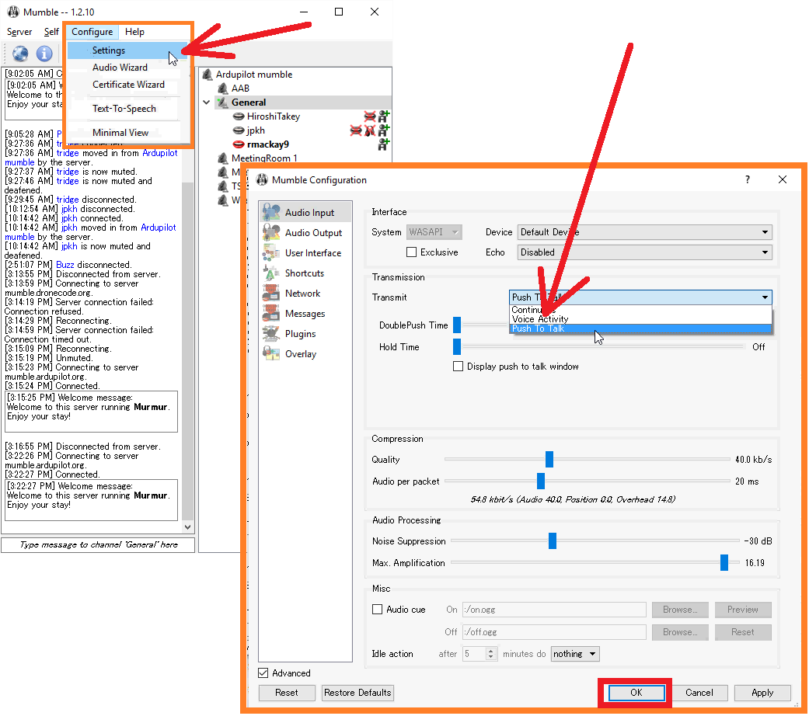

.. _ardupilot-mumble-server:

=======================
ArduPilot Mumble Server
=======================

The ArduPilot dev team uses a `mumble server <https://wiki.mumble.info/wiki/Main_Page>`__ for real-time voice chat.  We have a "General Discussion" channel for chatting about ArduPilot development at any time. How many developers are connected depends a lot on timezones.  Don't be shy about your English language ability, we have developers from all over the world.

.. note::

   The channel is for development discussions only. Please don't use it as a user help channel.
   We don't record the calls, and we would ask you not to record them yourself.

Installing and Connecting
-------------------------

-  Download the software from https://wiki.mumble.info/wiki/Main_Page (look for **Download Mumble** and pick the "Stable Release" for your operating system)
-  Install and open mumble
-  from the Server menu select Connect
-  server address: mumble.ardupilot.org
-  port: 65535

.. note::

    The port number is NOT the default mumble port number. If you find an empty server then please check your port number.

When you first join the server it will ask you to choose a username. Please choose something like *FirstnameLastname*. The user name must not have any spaces.

If it's your first time dialing into the call, on the mumble application's configuration section please select "Push to Talk" and/or use a headset to reduce noise on the call.

Weekly dev calls
----------------

The weekly development call is held on the mumble server in the "Weekly Dev Call" channel.
Time of the meeting is: 2300 UTC
A calendar with the meeting can be found at https://calendar.google.com/calendar/embed?src=rgdbom27tb1vlo62kjjnmt8va4%40group.calendar.google.com which will show the correct time for you timezone.

The agenda and minutes are normally sent to discuss.ardupilot.org.

Prefer Typing?
--------------

If you prefer text chat, please join us on `gitter <https://gitter.im/ArduPilot/ardupilot>`__
