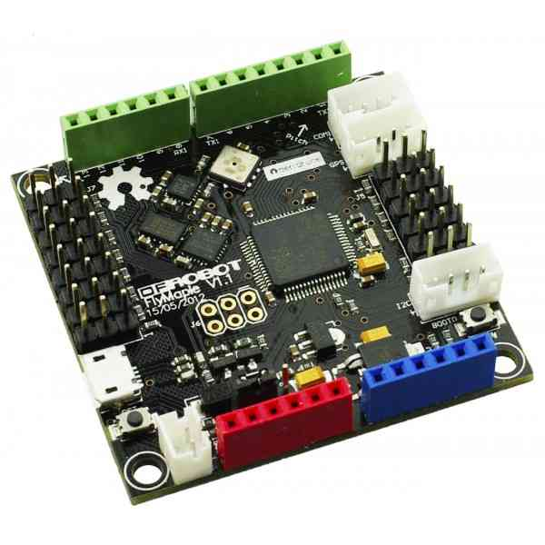
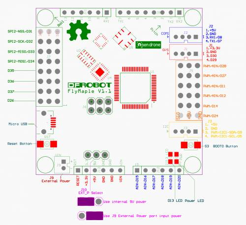

.. _building-apm-for-flymaple:

========================================
Building ArduPilot for Flymaple on Linux
========================================

.. note::

  Support for FlyMaple in ArduPilot was removed in May 2016. This
  documentation is for older versions
  
About Flymaple
==============

-  The APMPilot firmware has been ported to run on
   `Flymaple <http://www.dfrobot.com/wiki/index.php?title=Flymaple_V1.1(SKU:DFR0188)>`__
-  Flymaple is an inexpensive board based on a 75MHz ARM Cortex-M3
   processor.
-  It includes 10DOF sensors (accelerometer, gyroscope, magnetometer and
   barometer).

How to build APM for Flymaple on Linux.
=======================================

-  You need a number of additional resources to build ardupilot for Flymaple.
-  I have assumed that you will install them in your home directory.
-  But they can really go anywhere provided you make the appropriate
   changes to PATH and config.mk

::

    cd ~
    git clone https://github.com/mikemccauley/libmaple.git
    cd libmaple
    wget http ://static.leaflabs.com/pub/codesourcery/gcc-arm-none-eabi-latest-linux32.tar.gz
    tar xvzf gcc-arm-none-eabi-latest-linux32.tar.gz
    export PATH=$PATH:~/libmaple/arm/bin
    cp main.cpp.example main.cpp
    make

-  At this stage you can test your flymaple CPU and the upload process
   with 'make install'
-  This will upload a simple LED blinking program to your Flymaple
   board.
-  Now download ardupilot APM:

::

    cd ~
    git clone https://github.com/ArduPilot/ardupilot.git
    cd ardupilot

-  Now edit config.mk to be something like this:

::

     #config.mk START
     # Select maple_RET6 for Flymaple
     BOARD = maple_RET6
     # HAL_BOARD determines default HAL target.
     HAL_BOARD ?= HAL_BOARD_FLYMAPLE
     # The communication port used to communicate with the Flymaple
     PORT = /dev/ttyACM0
     # You must provide the path to the libmaple library directory:
     LIBMAPLE_PATH = $(HOME)/libmaple
     # Also, the ARM compiler tools MUST be in your current PATH like:
     # export PATH=$PATH:~/libmaple/arm/bin
     #config.mk END

-  Now build APM for, say a rover:

::

    cd APMrover2
     make flymaple
     make upload

Documentation on how to wire up and configure APM on Flymaple for a
buggy type rover are at:
