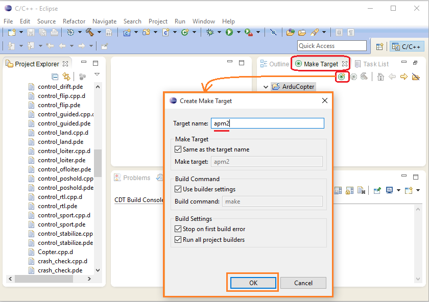
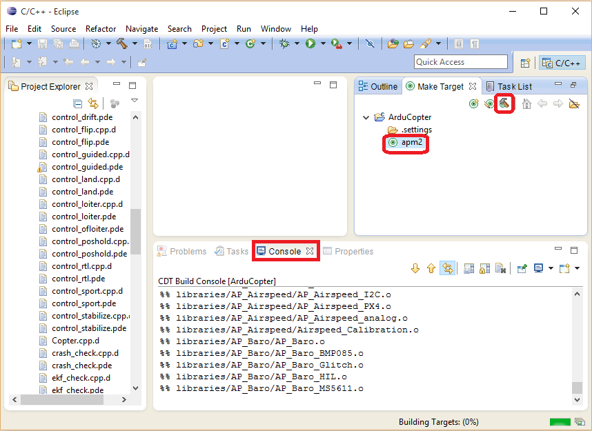

.. _building-apm2-with-eclipse-on-windows:

===============================================================
Archived: Building ArduPilot for APM2.x with Eclipse on Windows
===============================================================

.. warning::

    This topic is archived because APM2.x is no longer a supported autopilot (since AC3.2.1). 
    The information may still be relevant if attempting to use Eclipse for Pixhawk or other autopilots.
    

This article shows how to build ArduPilot for APM2.x on Windows using the Eclipse IDE.

.. note::

   These instructions show to use *Eclipse Luna* from the *PX4 Toolchain* to build for APM2.x targets. 
   They have been tested by building the *ArduCopter-3.2.1* branch on Windows 10.

.. warning::

   Copter 3.3 firmware (and later) and builds after Plane 3.4.0 no longer fit on APM2.x boards. Plane, Rover and AntennaTracker builds can still be installed at time of writing but you can no longer build APM2.x off the master branch (you will need to build off a supported release branch).

   The last Copter firmware that can be built on APM 2.x `can be downloaded from here <http://firmware.ardupilot.org/downloads/wiki/firmware/ArduCopter_APM_2.0_Firmware_3.2.1.zip>`__.

Preconditions
=============

Follow the instructions in :ref:`Building ArduPilot for APM2.x on Windows with Make <building-ardupilot-for-apm2-x-on-windows-with-make>`. These show how to download the source code, install the needed tools (including Eclipse) and how to set up the environment.

.. tip::

   Make sure you update the **config.mk** with the location of your ARDUINO tools.

Starting Eclipse
================

Start Eclipse using the *PX4 Eclipse* link installed with the *PX4 toolchain*. The link can be accessed from either:

-  The Windows Start menu (**Start \| All Programs \| PX4 Toolchain \| PX4 Eclipse**), or
-  You can directly run the file **C:\\px4\\toolchain\\msys\\1.0\\px4_eclipse.bat**

Creating the Project
====================

Create the project:

-  Select **File \| New \| Make Project with Existing Code**
-  Fill in the Project Name and set the *Existing Code Location* to the Copter directory
-  Set the Toolchain to be *Cross GCC*" and press **Finish**

.. image:: ../images/EditingTheCode_Eclipse2.png
    :target: ../_images/EditingTheCode_Eclipse2.png

Use spaces instead of tabs
==========================

By default Copter, Plane and Rover use spaces in place of tabs. This can be set to the default in Eclipse by changing two settings:

-  Select **Window \| Preferences \| General \| Editors \| Text Editors
   \| Insert spaces for tabs**.

   .. image:: ../images/EditingTheCode_Eclipse_spaces1.png
       :target: ../_images/EditingTheCode_Eclipse_spaces1.png
   
-  Select **Windows \| Preferences \| C/C++ \| Code Style \| Formatter** and creating a new Profile (i.e. "K&R Tab") which has the "Indentation" set to "Spaces only"

   .. image:: ../images/EditingTheCode_Eclipse_spaces2.png
       :target: ../_images/EditingTheCode_Eclipse_spaces2.png

Specify build location
======================

In the *Project Explorer* right-mouse-click on the ardupilot folder and select **Properties**. Then under C/C++ Build set the "Build location" to the Copter or Plane directory as shown below.

.. image:: ../images/EditingTheCode_Eclipse6.png
    :target: ../_images/EditingTheCode_Eclipse6.png

Specify make target
===================

In the Make window on the right create, specify an ``apm2`` make target as shown:

   Eclipse: Setting the apm2 maketarget

Building from Eclipse
=====================

The make target can be built by pushing the green circle + hammer icon. 
The build progress will appear in the Console window.

   Eclipse: Building APM2

The firmware will be created in a subfolder of the user’s temp directory. For example you will find **ArduCopter.hex** in **C:\\Users\\\ **YourUserNameHere**\\AppData\\Local\\Temp\\ArduCopter.build**.

