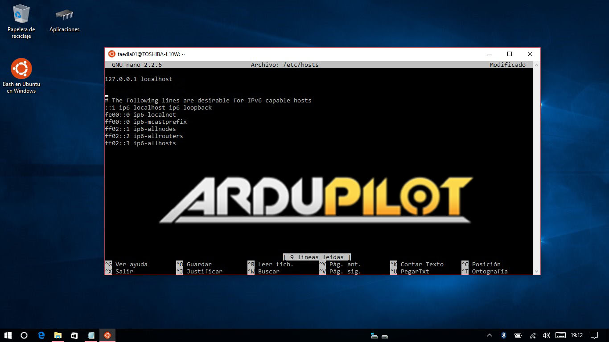

.. _building-ardupilot-on-windows10:

=======================================
Building ArduPilot on Windows with waf and Bash
=======================================
.. warning::
    This build method is ONLY for Windows10 x64 and does not describe building for 
    deprecated Arduino based flight controllers (APM1.x, 2.x). It supports most users,
    however you may need or prefer to use the alternate windows build process here:
    http://ardupilot.org/dev/docs/building-px4-with-make.html
    

Since Windows 10 has Ubuntu as his new partner, it is possible to compile Ardupilot in Windows without adding any strange thing: just install "Bash on Ubuntu on Windows" and follow next tutorial.
   
.. warning::

   This tutorial is intended to be a "copy & paste" approach. Just follow the text step by step and be patient with yourself!

.. tip::

   For install "Bash on Ubuntu on Windows" there are many tutorials on the web. An example is here:
   <http://www.howtogeek.com/249966/how-to-install-and-use-the-linux-bash-shell-on-windows-10/>`__.

Setup Ardupilot Dev Enviromment for Ubuntu bash on Windows 10
=============================================================

#. First, you have to insert your local host to the /etc/hosts file:

   .. code-block:: python
   
       sudo nano /etc/hosts

#. Insert this below first line:

   .. code-block:: python
   
       127.0.0.1 "hostname"
         
   (where "hostname" is your PC name)

#. Then, take root control over the bash:

   .. code-block:: python
   
       sudo passwd root
       su root

#. Back to main directory:

   .. code-block:: python
   
       cd

#. Install git:

   .. code-block:: python
   
       sudo apt-get install git

#. Make a new folder for future reference:

   .. code-block:: python
   
       mkdir GitHub
       cd GitHub

#. Clone ardupilot git:

   .. code-block:: python
   
       git clone https://github.com/ArduPilot/ardupilot.git

#. Run the install-prereqs-ubuntu.sh script:

   .. code-block:: python
   
       ./ardupilot/Tools/scripts/install-prereqs-ubuntu.sh

   .. image:: ../images/Windows10_Ubuntu_1.jpg
       :target: ../_images/Windows10_Ubuntu_1.jpg
       
#. At this point, we need to install some extra tools, because for now, Ubuntu bash on Windows only supports native x64 programs:

   .. code-block:: python
   
       cd
              
       sudo add-apt-repository ppa:ubuntu-toolchain-r/test
       sudo apt-get update
       sudo apt-get install g++-4.9
       
       sudo add-apt-repository ppa:terry.guo/gcc-arm-embedded
       sudo apt-get update
       sudo apt-get install gcc-arm-none-eabi=4.9.3.2015q3-1trusty1
       
       sudo apt-get update
       sudo apt-get upgrade

Compile ArduPilot Code
======================

#. "Waf" is the preferred build tool for Ardupilot, and works well in Windows with Ubuntu Bash. Go to git ardupilot software:

   .. code-block:: python
   
       cd
       cd GitHub/ardupilot/

#. It's possible to get a list of supported boards on ArduPilot with the command below:

   .. code-block:: python
   
       ./waf list_boards
   
#. Configure your board:

   .. code-block:: python
   
       ./waf configure --board target
       
   (where "target" can be px4-v2, navio, pxf,... choose from supported boards as mentioned above)

   .. image:: ../images/Windows10_Ubuntu_3.jpg
       :target: ../_images/Windows10_Ubuntu_3.jpg
   
#. Compile for your target:

   .. code-block:: python
   
       ./waf vehicle
   
   (where "vehicle" can be copter, plane, rover,...)

   .. image:: ../images/Windows10_Ubuntu_4.jpg
       :target: ../_images/Windows10_Ubuntu_4.jpg

#. And here you are! You have compiled your code!

.. note::

    The released Ubuntu on Windows does not have access to USB serial peripherals, so the --upload option
    in waf will not work.  The compiled binary must be uploaded to your flight controller using another 
    tool, such as MissionPlanner as a "Custom Firmware".
    If you wish to upload via waf, at time of writing USB serial access is only available in the Windows Insider
    releases of Windows Support for Linux (WSL), which requires you to join the Windows Insider program.
    https://insider.windows.com/GettingStarted

.. tip::

   if you want to unhide Ubuntu system folder on Windows, open a command prompt as administrator,
   navigate to Ubuntu system path (C:\Users\username\AppData\Local) and change the folder attributes. So (where "username" is your user name):
   
   .. code-block:: python
   
       cd C:\Users\username\AppData\Local
       attrib -s -h lxss
       
   You can make a direct access to "lxss" folder on your desktop for a quick navigation.
