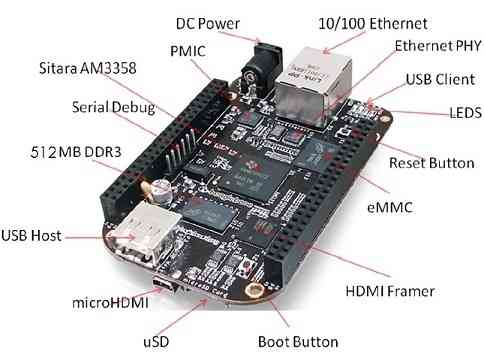
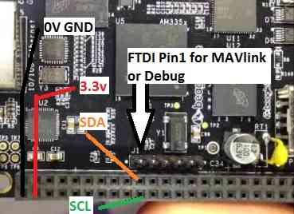
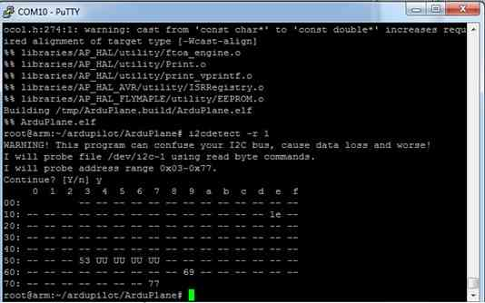
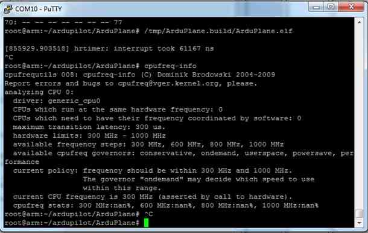

.. _building-for-beaglebone-black-on-linux:

================================================
Building ArduPilot for BeagleBone Black on Linux
================================================
.. warning::

    This project is old and unmaintained, prefer `BBBMini project <http://bbbmini.com/>`__

Get your BeagleBone running Debian
==================================

   BBB title picture

You will need a microSD card of 4GB or greater and a 5VDC power supply
of 1A or higher. You can also use a powered USB hub. It is highly
recommended that you not use the USB port on a laptop, which has current
limitations.

Go to the BeagleBoard website and get the `latest image <http://beagleboard.org/latest-images>`__. You may find multiple
images on the page. For ArduPilot on BeagleBone Black you have to
download the **Debian (BeagleBone Black - 2GB eMMC)** image. You
can find it under **BeagleBone Black (eMMC flasher)** header.

For example, the current image
is `BBB-eMMC-flasher-debian-7.5-2014-05-14-2gb <http://debian.beagleboard.org/images/BBB-eMMC-flasher-debian-7.5-2014-05-14-2gb.img.xz>`__.
The date (in this case 2014-05-14) and the version number (in this case
7.5) may change. Make sure you download the latest image.

On Ubuntu/Mac OS X
------------------

Verify Image with:

::

    md5sum BBB-eMMC-flasher-debian-7.5-2014-05-14-2gb.img.xz
    74615fb680af8f252c034d3807c9b4ae  BBB-eMMC-flasher-debian-7.5-2014-05-14-2gb.img.xz

before plugging your SD card into your computer, type

::

     df -h

this will list the current mounted drives.

Now plug in your SD card and type

::

    df -h

and see what the drive that was added is called.

In my case it was /dev/sdd1

in which case in the command below, the it is writtern dd of=/dev/sdd 
replace this with the correct address for your SD card.

.. warning::

   IF YOU GET THIS WRONG YOU CAN WIPE YOUR HDD

then xzcat it to your SD card in your Ubuntu/Mac OS X machine

::

    xzcat BBB-eMMC-flasher-debian-7.1-2013-10-08.img.xz | dd of=/dev/sdd bs=1M

when this is finished, remove the SD Card and place it into your BBB.

On Windows
----------

Download Win32 disk imager from
`here <https://sourceforge.net/projects/win32diskimager/>`__. Insert your
SD card, then start the application that you downloaded.

Select the image that you downloaded and then press \ **Write**.

when this is finished, remove the SD Card and place it into your BBB.

Flashing the image to the eMMC
------------------------------

Place the SD card in your BBB. Make sure you have removed Ethernet and
all other USB devices from your BBB. Connect it to a wall adapter (5VDC
1A) or a powered USB hub.

Press the boot button, and hold it down while booting, until all four
blue lights are solid.

Let go, and wait. It will take around 15 mins.

The lights will flicker a lot at this stage, you will know it is
complete when the four lights return to solid Blue (no flickering).
Power down the BBB and remove the SD card.

Connect the BeagleBone Black to your machine using the USB cord that's
provided with it. Depending on your OS, install the required
`drivers <http://beagleboard.org/getting-started#step2>`__.

Now ssh into the BeagleBone Black by typing

::

     ssh root@192.168.7.2

There is no password for the root user on the Debian image

You could also connect the BBB to your local network over Ethernet and
ssh to it.

The PixHawk Fire Cape
=====================

In order to run APM in the BeagleBone black you'll need to use the right
set of sensors. Most of these sensors are included in the PixHawk Fire
cape (PXF), an open hardware board available from `Erle Robotics store <https://erlerobotics.com/blog/product/pxfmini/>`__.

Making the rt kernel
====================

(taken from
https://wiki.beyondlogic.org/index.php/BeagleBoneBlack_Building_Kernel
)

modified for the RT version, and to simplify.

Compiling the BeagleBone Black Kernel
-------------------------------------

The following contains instructions for building the BeagleBone Black
kernel on your PC with Ubuntu 13.04 O.S.

to make it simple, run
======================

::

    sudo su

you may need to put in your password here...

if you do not have this already, make the following directory

::

    mkdir /home/YOUR_USERNAME/export

mkdir /home/YOUR_USERNAME/export/rootfs

Prerequisites
=============

ARM Cross Compiler
------------------

To compile the linux kernel for the BeagleBone Black, you must first
have an ARM cross compiler installed on your linux box. I use
gcc-4.7-arm-linux-gnueabi-base that comes with Ubuntu 13.04. To install
the compiler run:

::

    apt-get install gcc-arm-linux-gnueabi

GIT
---

The Beaglebone patches and build scripts are stored in a git repository.
Install git:

::

    apt-get install git

And configure with your identity.

::

    git config --global user.email "your.email@here.com"

lzop Compression
----------------

The kernel is compressed using lzo. Install the lzop parallel file
compressor:

::

    apt-get install lzop

uBoot mkimage
-------------

The bootloader used on the BeagleBone black is
`u-boot <http://www.denx.de/wiki/U-Boot>`__. u-boot has a special image
format called uImage. It includes parameters such as descriptions, the
machine/architecture type, compression type, load address, checksums
etc. To make these images, you need to have a mkimage tool that comes
part of the u-Boot distribution. Download u-boot, make and install the
u-boot tools:

::

    wget ftp://ftp.denx.de/pub/u-boot/u-boot-latest.tar.bz2
    tar -xjf u-boot-latest.tar.bz2

::

    cd u-boot-2013.10   (look to see what this is called, it may have changed)

::

    make tools  (don't work with last revision of u-boot need a revision)
    install tools/mkimage /usr/local/bin

Compiling the BeagleBone Black Kernel
-------------------------------------

Here we compile the BeagleBone Black Kernel, and generate an uImage file
with the DTB blob appended to the kernel for ease of use.

::

    git clone git://github.com/beagleboard/kernel.git
    cd kernel
    git checkout 3.8-rt
    ./patch.sh
    cp configs/beaglebone kernel/arch/arm/configs/beaglebone_defconfig
    wget http://arago-project.org/git/projects/?p=am33x-cm3.git\;a=blob_plain\;f=bin/am335x-pm-firmware.bin\;hb=HEAD -O kernel/firmware/am335x-pm-firmware.bin
    cd kernel
    make ARCH=arm CROSS_COMPILE=arm-linux-gnueabi- beaglebone_defconfig -j4
    make ARCH=arm CROSS_COMPILE=arm-linux-gnueabi- uImage dtbs -j4
    make ARCH=arm CROSS_COMPILE=arm-linux-gnueabi- uImage-dtb.am335x-boneblack -j4

Now we build any kernel modules:

::

    make ARCH=arm CROSS_COMPILE=arm-linux-gnueabi- modules -j4

And if you have your rootfs ready, you can install them:

::

    make ARCH=arm CROSS_COMPILE=arm-linux-gnueabi- INSTALL_MOD_PATH=/home/YOUR_USERNAME/export/rootfs modules_install

Installing the RT kernel
========================

After you have made the Linux kernel...

ensure you have Debian installed on the beaglebone and ssh into the
Beaglebone from Linux....

::

    ssh root@192.168.1.3

(my ip address, adjust for your beaglebone)

Go to folder /boot/uboot/

::

    cd /boot/uboot/

make sure there is a backup folder there. If not:

::

    mkdir backup

then backup your zImage

::

    cp zImage uInitrd backup/

then

::

    ls /lib/modules

it should show 3.8.13-bone28 or similar.

Now we need to go to our Ubuntu computers terminal. Ggo to your export
folder that you made:

::

    cd /home/YOUR_USER_NAME/export/rootfs/lib/modules

and run

::

    rsync -avz 3* root@192.168.1.3:/lib/modules/

then run

::

    rsync /home/proficnc/u-boot-2013.10/kernel/kernel/arch/arm/boot/zImage 192.168.1.3 :/boot/uboot/

back on your Beaglebone run the following

::

     ls /lib/modules

you should now have both the old file and the new rt folder.

Now type:

::

    sync
    reboot

Some useful tips
----------------

Hooking up the sensors
======================

When hooking up your Sensor board it connects as follows (using SHORT
wires)

   i2c connection

I2c Debug
=========

To detect if the i2c is working, you can use the following command

::

         i2cdetect -r 1

   i2c check

The numbers:  1e, 53, 69, 77 are the MAG, Gyro, Accel, and Baro.(not in
that order)

Hooking up your GPS
===================

To be added

Hooking up your Receiver
========================

To be added

Hooking up your servos
======================

To be added

Hooking up your Airspeed sensor
===============================

To be added

Devices tested so far
=====================

Responded with the Who Am I request on SPI

1. MPU6000

2. MPU9250 (may have compass issues due to soldering of jumper wire)

3. MS5611 (SPI)

Not responding on SPI

1 LSM9DS0 ( soldering issue, no connection to I/O

Responded to I2C detect

1. CapeID EEPROM 0x54h AT24CS32

2. CapeID COA_OTP 0x5Ch AT24CS32

3. Crypto 0x64h ATSHA204

4. Airspeed 0x28h MS4525DO-DS3AIXXXDS

5. Compass Ext 0x1eh HMC5883L

6. Power management 0x24 TPS65217C

7. on-board EEProm 0x50h unknown

8. HDMI core.... unused, do not enable 0x34

Not responded to I2C test

1. MS5611 (I2C) 0x76h

2. RGB LED Driver 0x55h TCA62724 (is conflicting with non existent Cape
eeprom)

Adjusting the BBB clock
=======================

``cpufreq-info`` shows your current frequency

   clock check

Edit /etc/default/cpufrequtils (you might need to create it if it
doesn't exist). Specify the governor with the GOVERNOR variable:

::

    nano /etc/default/cpufrequtils

add the following......

::

    # valid values: userspace conservative powersave ondemand performance
    # get them from cat /sys/devices/system/cpu/cpu0/cpufreq/scaling_available_governors

::

    GOVERNOR="performance"

CTRL-X to exit

Y to save

Reboot, and check to see that it has worked

Installing and Making ArduPilot on BBB
======================================

install git, make, gawk, g++, arduino-core on your BBB

::

    apt-get install git make gawk g++ arduino-core
    git clone git://github.com/ArduPilot/ardupilot.git
    cd ardupilot
    git submodule update --init --recursive

then open

::

    cd ArduPlane

or

::

     cd ardupilot/ArduCopter

or

::

     cd ardupilot/APMRover2

or

::

     cd ardupilot/AntennaTracker

then

::

    make linux

from this directory, run the tmp/Plane.elf (or Copter, or Rover)

::

     tmp/Plane.elf

Connecting to GCS
=================

To be added……………

Status
======

The following table sumarizes the \ *driver development status*:

+--------------------------------------------------------+-----------------------------------------------------------------------------------------------------------------+
| Milestone                                              | Status                                                                                                          |
+========================================================+=================================================================================================================+
| ArduPilot running in the BBB (I2C connected sensors)   | Ok                                                                                                              |
+--------------------------------------------------------+-----------------------------------------------------------------------------------------------------------------+
| Device Tree for the PXF                                | WIP                                                                                                             |
+--------------------------------------------------------+-----------------------------------------------------------------------------------------------------------------+
| MPU6000 SPI userspace driver                           | Ok                                                                                                              |
+--------------------------------------------------------+-----------------------------------------------------------------------------------------------------------------+
| MPU9150 I2C userspace driver                           | Ok                                                                                                              |
+--------------------------------------------------------+-----------------------------------------------------------------------------------------------------------------+
| LSM9DS0 SPI userspace driver                           | Coded                                                                                                           |
+--------------------------------------------------------+-----------------------------------------------------------------------------------------------------------------+
| MPU9250 SPI userspace driver                           | Coded                                                                                                           |
+--------------------------------------------------------+-----------------------------------------------------------------------------------------------------------------+
| MS5611 I2C/SPI userspace driver                        | Coded                                                                                                           |
+--------------------------------------------------------+-----------------------------------------------------------------------------------------------------------------+
| GPIO userspace driver                                  | WIP                                                                                                             |
+--------------------------------------------------------+-----------------------------------------------------------------------------------------------------------------+
| I2CDriver multi-bus aware                              | WIP                                                                                                             |
+--------------------------------------------------------+-----------------------------------------------------------------------------------------------------------------+
| AP_InertialSensor_Linux                                | ToDo                                                                                                            |
+--------------------------------------------------------+-----------------------------------------------------------------------------------------------------------------+
| PRU PWM driver                                         |  Ok (`issue <https://groups.google.com/forum/#!topic/beaglepilot/7DKcdm0AEPo>`__ with the PREEMPT_RT kernel)    |
+--------------------------------------------------------+-----------------------------------------------------------------------------------------------------------------+
| MPU6000 SPI kernel driver                              | WIP                                                                                                             |
+--------------------------------------------------------+-----------------------------------------------------------------------------------------------------------------+
| MPU9150 I2C kernel driver                              | ToDo                                                                                                            |
+--------------------------------------------------------+-----------------------------------------------------------------------------------------------------------------+
| LSM9DS0 SPI kernel driver                              | ToDo                                                                                                            |
+--------------------------------------------------------+-----------------------------------------------------------------------------------------------------------------+
| MPU9250 SPI kernel driver                              | ToDo                                                                                                            |
+--------------------------------------------------------+-----------------------------------------------------------------------------------------------------------------+
| MS5611 I2C/SPI kernel driver                           | ToDo                                                                                                            |
+--------------------------------------------------------+-----------------------------------------------------------------------------------------------------------------+

*Status: ``Ok``, ``Coded`` (needs test), ``WIP`` (work in progress), ``Issue``, ``ToDo``*
