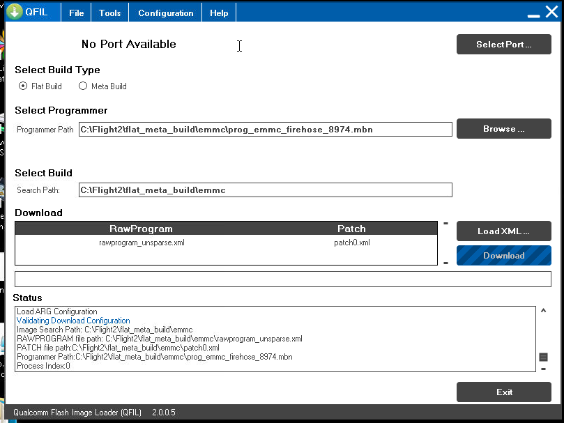

.. _building-for-qualcomm-snapdragon-flight-kit:

=====================================================
Archived: Building for Qualcomm Snapdragon Flight Kit
=====================================================

.. warning::

   **ARCHIVED ARTICLE**

   ArduPilot no longer supports Qualcomm Snapdragon Flight Kit.

This article shows how to build ArduPilot for 
:ref:`Qualcomm® Snapdragon Flight™ Kit (Developer’s Edition) <copter:common-qualcomm-snapdragon-flight-kit>`
with *Make* on Linux.

.. warning::

   Due to some rather unusual licensing terms from Intrinsyc we
   cannot distribute binaries of ArduPilot (or any program built with the
   Qualcomm libraries). So you will have to build the firmware
   yourself.

Overview
========

There are two ports of ArduPilot to this board:

-  `QFLIGHT <https://github.com/ArduPilot/ardupilot/tree/master/libraries/AP_HAL_Linux/qflight>`__
   runs mostly on the ARM cores, with just sensor and UARTs on the DSPs.
   This port is much easier to debug and you can use all of the normal
   Linux development tools.
-  `HAL_QURT <https://github.com/ArduPilot/ardupilot/blob/master/libraries/AP_HAL_QURT/README.md>`__
   runs primarily on the DSPs, with just a small shim on the ARM cores.
   This port has better performance due to its extremely accurate
   realtime scheduling, and is also more robust as it can keep flying if
   Linux crashes for some reason (the QFLIGHT port relies on both Linux
   and QURT working to keep flying). However it is harder to debug!

The build instructions for the two ArduPilot ports are almost exactly
the same (both are covered here).

.. tip::

   We recommend that developers use QFLIGHT port for development and
   debugging, but recompile and target QURT for production use. 

The instructions in this article demonstrate building for Copter (from
the ArduCopter directory). Plane and Rover are build in the same way,
from their respective vehicle source directories.

Preparing the board
===================

Flashing the OS with QFIL on Windows
------------------------------------

Boards purchased from Intrinsyc come pre-loaded with an operating system
(i.e. Ubuntu) but it may not if you receive a board from a different
source.  Use the instructions below to flash the OS onto the board from
a Windows PC.

#. Download and install QFIL
   (`here <http://androidurdu.net/download-qualcomm-flash-image-loader-qfil/>`__
   - search for the green download button with "QPST 2.7.422" written
   below it).
#. Put the board into bootloader mode by first powering the board using
   the power brick and then connect with a USB cable to your PC (note
   the board has a USB3.0 port but a normal micro USB cable will work)
#. Start QFIL and the COM port the board is connected to should
   automatically appear to the left of the **Select Port** button. 
   Normally it appears with the name "QDLoader 9008".
#. Under "Select Programmer" click the **Browse** button and find
   prog_emmc_firehose_8974.mbn (To-Do: which of the packages was this
   from?)
#. Under "Download" the rawprogram_unsprse.xml" should be found
   automatically (?)
#. Click the **Download** button and if all goes well the OS will be
   flashed to the board

Connecting to the board using the FTDI cable
--------------------------------------------

The board should come with an FTDI cable and small green serial adapter
board which can be plugged into the rectangular black connector on the
top of the board next to the USB port.  Use a ssh program such as Putty
to connect to the FTDI cable's serial port at 115200 baud (no password
is required to log into the board this way).

Changing the root password and enabling login as root
-----------------------------------------------------

Connect using the FTDI cable using the instructions above and change the
root password by typing ``passwd`` on the command line and entering your
desired password twice (ie. "penguin").

Enable logging in as root by editing /etc/ssh/sshd_config and modifying
line 28 to look like below:

``PermitRootLogin yes``

Connecting to the board's wifi access point
-------------------------------------------

The board's wifi access point will appear as ssid "Atlanticus_XXXXX"
(where X is a 5 digit number) and password "password".

The IP address assigned to your computer (default range is 192.168.1.10
~ 192.168.1.20) can be changed by modifying the files below.  This may
be necessary to avoid conflicting with your home/business wifi network.

Lines 304, 305 of /etc/dnsmasq.conf as shown below.

``interface=wlan0``

dhcp-range=192.168.**2**.10,192.168.**2**.20,infinite

Line 39 of /etc/network/interfaces.d/.qca6234.cfg.softap as shown below.

`` address 192.168.2.1``

You should be able to use a terminal program such as Putty to ssh to the
board at the IP address shown above (i.e. 192.168.2.1) using
user/password of linaro/linaro or root/penguin.

Correct home directory permissions
----------------------------------

By default the /home/linaro directory permission are incorrect.

``sudo chown -R linaro.linaro /home/linaro``

Create a logs directory
-----------------------

On the flight board, create the logs directory in a location where the
DSPs can write to:

``mkdir /usr/share/data/adsp/logs``

Checking and upgrading the Ubuntu kernel version on the board
-------------------------------------------------------------

Connect to the board using the FTDI cable or ssh via sifi can type
"uname -a".  The output should appear as below (or with a later date),
if it does not then it should be updated.

``Linux linaro-developer 3.4.0-eagle8074 #1 SMP PREEMPT Wed Dec 9 17:42:13 PST 2015 armv7l armv7l armv7l GNU/Linux``

To upgrade to a later version of Ubuntu first `download and extract the
latest "Flight_BSP_X.X" file from the Intrinsic site (Note: these
files had at least temporarily disappeared as of
Jan-2016). <http://support.intrinsyc.com/projects/snapdragon-flight/files?val=1>`__

Upgrade using the fastboot-all script:
~~~~~~~~~~~~~~~~~~~~~~~~~~~~~~~~~~~~~~

On an Ubuntu machine find the Binaries/fastboot-all.bat script from the
above download.

Edit the script and remove the reboot line (line 16) which is shown
below (this reboot can cause the board to become bricked if the upgrade
fails)

``fastboot reboot``

Run the script:

``sudo ./Binaries/fastboot-all.bat``

After the upgrade, the board will be completely wiped meaning any
previous setup (i.e. root passwords, wifi IP addresses) will need to be
redone.

Note: On 25-Jan-2016, while after performing this upgrade and writing
this wiki page we found the /firmware/image was out of date.  We should
add instructions on which files needed to be updated and where the new
files can be found.

Upgrade by manually copying images
~~~~~~~~~~~~~~~~~~~~~~~~~~~~~~~~~~

-  extract the contents of the above zip and find the following files in
   the Binaries directory

   -  boot.img, cache.img, persist.img, system.img

-  on an Ubuntu machine, unpack 3 of the 4 images:

   -  simg2img cache.img cache.ext4
   -  simg2img persist.img persist.ext4
   -  simg2img system.img system.ext4

-  transfer these four files into a new /images directory on the flight
   board (either transfer via wifi or put on an sd card)

   -  boot.img, cache.ext4, persist.ext4, system.ext4

-  check if any partitions are in use by typing "mount"

   -  normally only "persist" will be being used so unmount it with the
      "umount /mnt/persist/" command

-  mount the images:

   -  dd if=boot.img of=/dev/disk/by-partlabel/boot bs=1M

      dd if=cache.ext4 of=/dev/disk/by-partlabel/cache bs=1M

      dd if=persist.ext4 of=/dev/disk/by-partlabel/persist bs=1M

      dd if=system.ext4 of=/dev/disk/by-partlabel/boot bs=1M

Install the baro and mpu9250 drivers
------------------------------------

Copy these two files to the flight board's /usr/share/data/adsp:

libbmp280.so, libmpu9x50.so

Edit dangerous Q6 service startup script
----------------------------------------

On the flight board, edit /etc/init/q6.conf script and comment out the
line below which, if left in place, can cause the board to stall forever
during the boot up process is "q6" fails to start

``#watch -n 1 --precise -g grep -m 1 "2" /sys/kernel/debug/msm_subsys/adsp && true``

Putting the board in to "Storage mode"
--------------------------------------

During the upgrade process, if the above step is skipped, it is possible
to get the board into a state where it will not completely boot up.  You
will be unable to login using FTDI or wifi.  If this occurs you can
exploit a race condition in the startup sequence to get the board in
"storage mode" which allows accessing the disks on the board.

-  first ensure both power and usb cables are disconnected
-  plug in the power
-  quickly plug in the usb
-  disconnect the power brick, hopefully the led will turn red
-  plug in the power

If all goes well, 10 or 20 disk devices will appear on the Windows or
Ubuntu machine connected via USB.  The files on the disk can be edited
including perhaps editing the startup scripts to resolve the boot-up
issue.

Preconditions for building
==========================

These instructions will only work for 64bit Linux machines (including
Ubuntu).

Get the source code
-------------------

First clone the source:

::

    git clone https://github.com/ArduPilot/ardupilot.git
    cd ardupilot
    git submodule update --init --recursive

Get additional tools/libraries
------------------------------

To build ArduPilot for either port you will also need 3 library packages
from Intrinsyc (download links are supplied when you buy the board):

-  **HEXAGON_Tools** package, tested with version 7.2.11
-  **Hexagon_SDK** packet, version 2.0
-  **HexagonFCAddon** package, tested with Flight_BSP_1.1_ES3_003.2

These packages should all be unpacked in a ``$HOME/Qualcomm`` directory.

Building for QURT
=================

To build Copter you do:

::

    cd ArduCopter
    make qurt -j4

Upload the firmware to the board by joining to the WiFi network of the
board and entering the following command (where ``myboard`` is the
hostname or IP address of your board):

::

    make qurt_send FLIGHT_BOARD=myboard

This will install two files:

::

    /root/ArduCopter.elf
    /usr/share/data/adsp/libardupilot_skel.so

To start ArduPilot just run the **.elf** file as root on the flight
board.

::

    /root/ArduCopter.elf

.. note::

   For the QURT port you can't use arguments to specify the purpose
   of each UART.

By default ArduPilot will send telemetry on UDP 14550 to the local WiFi
network. Just open your favourite MAVLink compatible GCS and connect
with UDP.

Building for QFLIGHT
====================

To build Copter for QFLIGHT do:

::

    cd ArduCopter
    make qflight -j4

Upload the firmware to the board by joining to the WiFi network of the
board and entering the following command (where ``myboard`` is the
hostname or IP address of your board):

::

    make qflight_send FLIGHT_BOARD=myboard

This will install two files:

::

    /root/ArduCopter.elf
    /usr/share/data/adsp/libqflight_skel.so

To start ArduPilot just run the **.elf** file as root on the flight
board. You can control UART output with command line options. A typical
startup command would be:

::

    /root/ArduCopter.elf -A udp:192.168.1.255:14550:bcast -e /dev/tty-3 -B qflight:/dev/tty-2 --dsm /dev/tty-4

That will start ArduPilot with telemetry over UDP on port 14550, GPS on
tty-2 on the DSPs, Skektrum satellite RC input on tty-4 and ESC output
on tty-3.

By default ArduPilot will send telemetry on UDP 14550 to the local WiFi
network. Just open your favourite MAVLink compatible GCS and connect
with UDP.

Starting ArduPilot on boot
==========================

You can also set up ArduPilot to start on boot by adding the startup
command to **/etc/rc.local**. For example, on QURT build you'd add the
line:

::

    /root/ArduCopter.elf &
