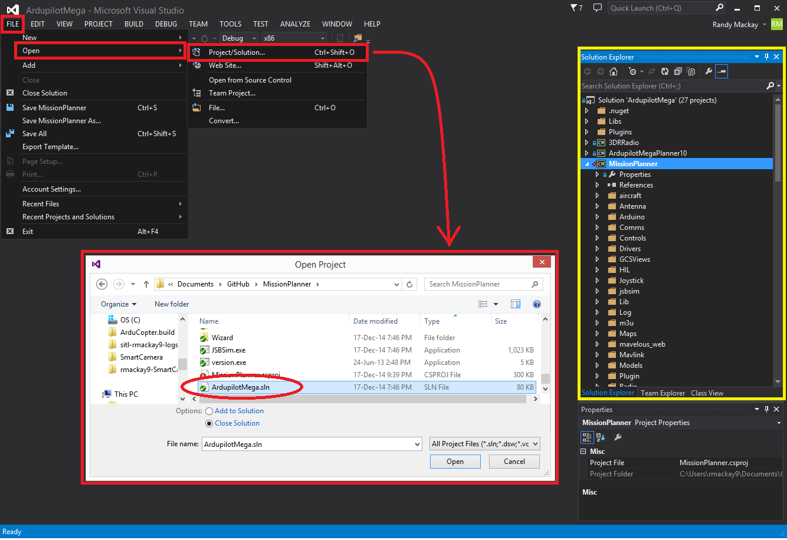
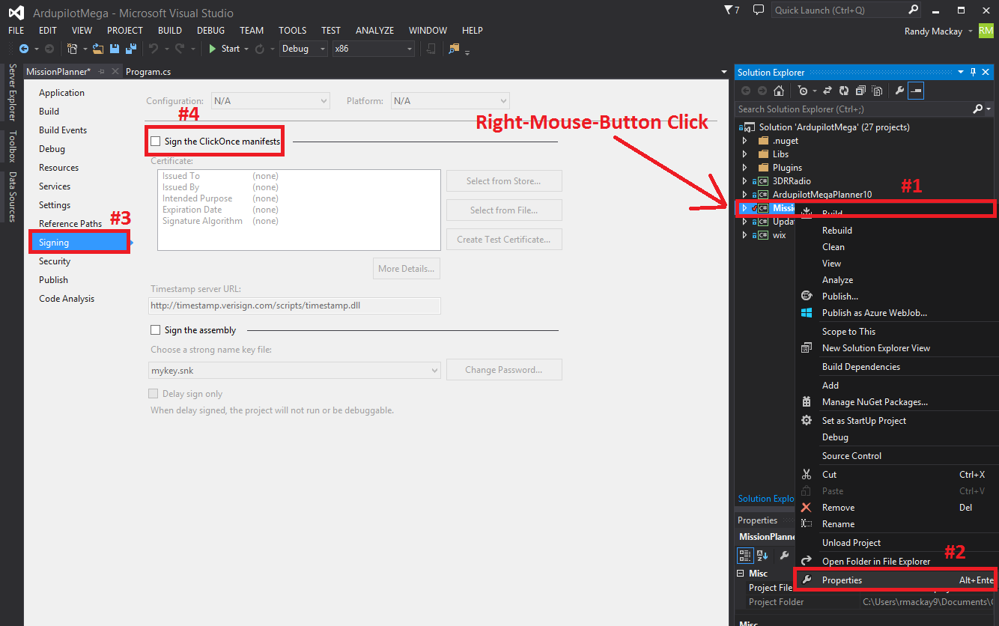
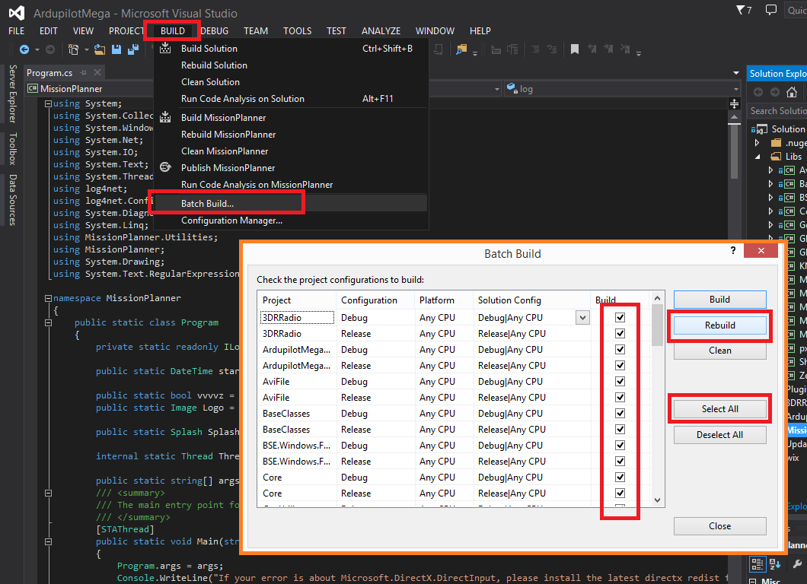
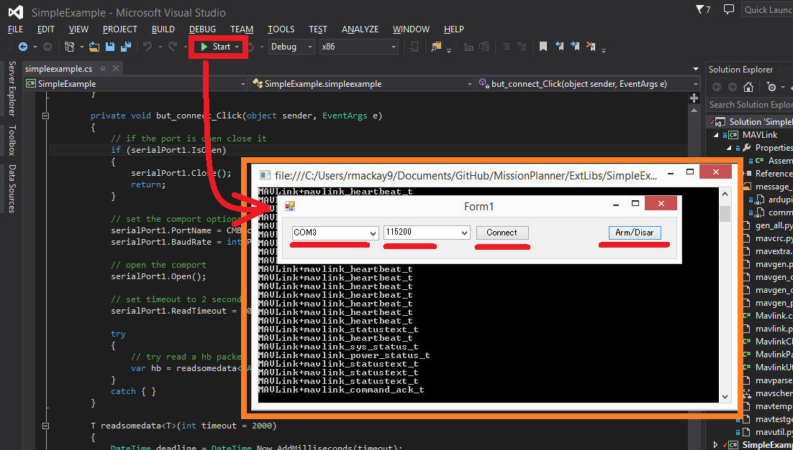

.. _building-mission-planner:

===========================================
Building Mission Planner with Visual Studio
===========================================

.. warning::

    This page is outdated and instructions should be adapted to make it work.

Introduction
============

Mission Planner (MP) is an open source ground station developed in C#
primarily for use on Windows computers (although it can be run on Mac
using mono).  This is the most commonly used ground station as it
provides the most complete functionality for vehicle setup as well as
pre-flight mission planner, in-flight monitoring and post flight log
file analysis.

This page provides instructions on how you can build the Mission Planner
software on your own machine using MS Visual Studio 2017 which may be
useful if you wish to make changes for your own use or improvements for
the community.  Building the mission planner may also help as a guide in
case you plan to build your own custom ground station development.

Some warnings before you dive in:

-  Use your modified / complied version of Mission Planner at your own
   risk.
-  Mission Planner is a very complex including and making changes is not
   for the faint of heart. Here are the basic skills you will need to
   make reasonable progress with MP changes:

   -  C# programming skills and experience (at least or C++ experience).
   -  Experience with Microsoft Visual Studio (VS) development
      environment. MP is not the application to begin learning VS.
   -  Experience using Windows API  (Application programming Interface)
      - including understanding of streams, processes, threads.

-  Support for Visual Studio, programming in C# and Windows API may not
   be forthcoming from the DIY Drones community. You will need to get
   that support from other sources.

System Requirements
===================

Here is what you will need.

-  Windows 10.  Sorry earlier versions no longer work.  Windows 7 etc will NOT work. 
-  Sufficient disk space, memory, processor power to comfortably run
   Visual Studio (details below)
-  An Internet connection.
-  Visual Studio 2017 community edition

Install Visual Studio and DirectX and Python
============================================

The first step is to get `Microsoft Visual Studio Community 2017 <https://visualstudio.microsoft.com/>`__\ installed and working in your
Windows system.

-  Download and install MS Visual Studio 2017 Community Edition which
   can be found `here <https://visualstudio.microsoft.com/>`__.
-  During the install Process, you may be prompted to install optional "workloads", at this stage, you may select: ".NET desktop development" ( or you may install it later... such as when you open the .sln for the first time, you'll be prompted to do it).
-  Reboot your PC
-  Start Visual Studio from the Start Menu

Install Python 2.7 (if not already installed) by downloading it
`here <https://www.python.org/downloads/>`__.    We recommend you install this to the c:\\Python27\\ folder.

After your VS installation is complete: 
=======================================

-   Navigate to "Tools" Menu -> "Get Tools and Features" -> (wait for page load) -> Workloads -> Summary ( right of screen) -> then tick the tickbox labeled ".Net Core 2.0 development tools" ( leaving other tickboxes as-is) -> then click "Modify" button at bottom.  wait for download/install to complete.
-   Also, Navigate to "Tools" Menu -> "Get Tools and Features" -> (wait for page load) -> Workloads -> Windows ( left of screen) -> then tick the tickbox labeled ".Net desktop development tools" ( leaving other tickboxes as-is) -> then click "Modify" button at bottom.  wait for download/install to complete. If it's already ticked, leave it as-is, that's already fine.  :-) 
-   Also, Navigate to "Tools" Menu -> "Get Tools and Features" -> (wait for page load) -> Workloads -> Windows ( left of screen) -> then tick the tickbox labeled "mobile developement with .NET" ( leaving other tickboxes as-is) -> then click "Modify" button at bottom.  wait for download/install to complete. If it's already ticked, leave it as-is, that's already fine.  :-) 
- You may need to install dotnet core 2.2 if you are upgrading from a previous version of mission planner. (https://dotnet.microsoft.com/download/dotnet-core/2.2) 2.2.108 works fine with MP 1.3.68
-  You might like to test your installation on a simple "Hello World" application, or the "SimpleExample" described below.
-  TIP: By default it is installed here: "C:\\Program Files (x86)\\Microsoft Visual Studio\\2017\\Community\\"  

Getting the Mission Planner source code from Github into your computer
======================================================================

The Mission Planner source code is stored in GitHub.  In general you can
follow the instructions :ref:`for the ardupilot flight code <where-to-get-the-code>` except that you should use the
**https://github.com/ArduPilot/MissionPlanner** repository in place of the ardupilot repository.  
You could clone the git repo to (for example) c:\\MissionPlanner\\  but the exact folder is not critical.

Open the Mission Planner solution in Visual Studio
==================================================

-  Start Visual Studio
-  Click File >> Open >> Project / Solution
-  Navigate to where the Mission Planner source was downloaded to and
   open MissionPlanner.sln.
-  Visual Studio should open the "solution" which includes the Mission
   Planner and a few other related applications (i.e. "3DR Radio",
   "Updater", etc) which can all be see in the Solution Explorer
   (highlighted in yellow above).
-  (If you haven't already installed the ".NET desktop development" add-in, you will be prompted to do it now.)
-  Set the "Solution Configuration" to "Debug" or "Release" (this can be
   found just below the Tools menu)
-  Set the "Solution Platforms" to "x86"
-  In the Solutions Explorer, right-mouse-button click on Mission
   Planner and select Properties, Signing and uncheck "Sign the
   ClickOnce manifests"

-  Mission Planner is made up of several projects, you can see these by
   expanding the "MissionPlanner" and "ExtLibs" folders of the Solution
   Explorer.

   -  MissionPlanner (the main code)
   -  AviFile
   -  BaseClasses
   -  BSE.Windows.Forms
   -  Core
   -  GeoUtility
   -  GMap.Net.Core
   -  GMap.Net.WindowsForms
   -  KMLib
   -  MAVLink
   -  MetaDataExtractor
   -  MissionPlanner.Comms
   -  MissionPlanner.Controls
   -  MissionPlanner.Utils
   -  px4uploader
   -  SharpKml
   -  ZedGraph

Building Mission Planner - Use the Batch Build Feature
======================================================

Before you attempt to build (compile) Mission Planner you must also have
the official version installed on your PC.  This is because there are
some .dll files that are not included in the Git repository.

-  Select Build >> Batch Build..., "Select All" (to check all
   checkboxes) and then press "Rebuild".  You will probably see errors
   on your first attempt to compile (build) Mission Planner so try a
   couple more times.

If errors persist try some of the following:

-  For errors related to missing dlls:

   -  In the Solution Explorer right click the MissionPlanner project,
      Properties, Reference Paths
   -  In the Folder entry, browse to and select the location of the
      "installed" Mission Planner which is probably:
      *C:\\Program Files (x86)\\Mission Planner* OR *C:\\Program
      Files\\Mission Planner*
   -  Click the Add Folder button to put the path to the installed MP
      into the Reference paths box.
   -  Click (select)  Build Events.  Remove all pre-build and post build
      options.
   -  Click (select)  Build.
   -  If any of the sub-projects says "(incompatible)" next to it 
      inside Solution Explorer, then right-click that sub-project 
      and choose "reload", that should fix it. 

For  errors about missing references, you will see the name of the
project for each error listed. Select Properties for each project with
such errors and add the location of the Installed Mission Planner like
you did above for MissionPlanner project.  That should reduce the
errors.

If you see an error in project BSE.Windows.Forms "..could not locate the
Code Analysis tool at ''.  You can eliminate this by un-checking the
Enable Code Analysis box in Code Analysis  in the BSE.Windows.Forms
properties.

Some optional help in resolving build errors:

-  In VS, Select menu items [BUILD] [Configuration Manager] This will
   show you which projects are compiled (built) each time you do a build
   or re-build solution.
-  Check 'Build' for any that are not checked:

   (I.E. 3DRRadio, Updater, wix)
-  Do [Build], [Clean Solution] then [Build], [Rebuild solution].
-  All projects should build without errors.

-  When you build without errors, you are ready to begin browsing or editing.

Building the SimpleExample
==========================

The "SimpleExample" solution is available as a near minimal application
to demonstrate how a C# program can connect to a vehicle and cause it to
arm or disarm. This example has many fewer dependencies than the full
Mission Planner and is simpler to build and understand.

Open the solution from Visual Studio by selecting File >> Open >>
Project/Solution, and in the MissionPlanner code directory select
ExtLibs / SimpleExample.sln ( close the MissionPlanner solution first if you have that open )

Ensure the program can be build successfully by selecting Build >> Build
Solution.

After first checking that you can connect to your flight controller and
arm it with the regular mission planner, disconnect the regular Mission
Planner and then press "Start" to run the application in debug mode. 
When the "Form1" pops up, select the COM port, the baud rate (probably
115200) and press Connect.  If it successfully connects, press Arm/Disarm
to attempt to arm the vehicle.

Note: there is no error checking in the application so if it fails to
connect it

Editing and Debugging Mission Planner (and Other Tips)
======================================================

Editing and debugging details are beyond the scope of this Wiki.
Debugging may result in some warnings. You should learn what they mean
and take the necessary steps to resolve them if that is the case. Here
is a simple debugging example to get you started.

-  Do not (yet) connect your AutoPilot Hardware ( Pixhawk, etc ) to the 
   compiled version of MP.  You must  first copy some .xml files to 
   the bin/debug folder. See details below.
-  First be sure VS is configured for debug (versus release) Set this in
   the top menu tools area or the configuration manager.
-  Select menu DEBUG, Start Debugging.   (Or, press F5).  Mission
   Planner should run as you normally see it.  However, some important
   configuration files are missing so connection to the AutoPilot Hardware 
   ( eg Pixhawk, etc ) is not recommended at this time.

   -  If after "Start Debugging" the program loading hangs in the splash
      screen and you see this message:  "Managed Debugging Assistant
      'LoaderLock' has detected a problem ...... "'  and/or the debugger
      has paused at the line  Application.Run(new MainV2()); in
      ArduPilotMega.Program then do this:

      Select [Debug],  [Exceptions].   Expand the [Managed Debugging
      Assistants].  Uncheck the 'Loader Lock' check box

-  Close MP. (Or, select menu DEBUG, Stop Debugging in VS).
-  Next you can try setting a break point.

   -  Expand the MissionPlanner project in the VS Solution Explorer so
      you see the objects included.
   -  Scroll down to MainV2.cs, right click that object and select View
      Code.
   -  In the code window for MainV2.cs, scroll down to the line "public MainV2" 
      then to one of the first code lines after that ( currently it is a log.Info("..."); line ) .
   -  Click in front of that line (In the dark gray bar on the left) to
      set a break point  (red circle).
   -  Start Debugging  (press F5).
   -  You will see the normal MP start up windows up to the Splash
      window but then it will stop running.  You have hit the break
      point. Visual Studio will show the code and the break point will
      be highlighted. Note that you cannot move the splash screen so you
      may need to relocate the VS window to see the break point.
   -  Move your mouse over different variables and objects in the code.
      You will see the current values of many or the items.
   -  Press F5 and Mission Planner will continue loading.

-  Further details on editing and debugging are left to the user.

Using your modified Mission Planner
===================================

If you make changes to Mission Planner, you will probably want to make
use of your version.  Here we will give you some preliminary
information to do that. You can use your local compiled version but the
compiled output files are located in different places in VS and some
additional steps are required.  There are configuration files specific
to your installation of Mission Planner that are not included in the Git
hub download that are only provided in the Mission Planner installation
package. You will need to copy these to the correct area in the folder
you are using for the Visual Studio project. Here are the steps that
will get you started.

-  **Use your modified complied version of Mission Planner at your own
   risk.**
-  These steps assume VS is in the debug configuration.  [editors]
    Details when in Release mode could be added [/editors]
-  In order for your VS version of MP to function with the APM
   connected, you will need to copy several files from the folder where
   MP is installed (C:\\Program Files (x86)\\APM Planner  or C:\\Program
   Files\\APM Planner) to the folder where your VS project compiled
   output is located.  
   
   .. todo:: 
   
       editors: This needs to be made more accurate which files are needed, why etc.

   -  **Copy (don't move) all xml files** (I.E. files with the extension
      .xml) from the root folder of the MP installation (C:\\Program
      Files\\APM Planner)  **to the bin/Debug folder** in the folder
      where your Visual Studio Mission Planner solution is stored. (the
      Git hub clone folder). This will setup your compiled version to
      match the current configuration of your AutoPilot (copter versus plane,
      other options, etc)
   -  I.E, if you solution is in folder MPGitClone, then copy the .xml
      files to MPGitClone\\bin\\Debug.  Some will copy without notice,
      but some  will ask you if you want to replace the existing file.
      Replacing all seems to work but you should investigate further to
      be sure you can use MP for real life situations before you do so.
   -  If you build Mission Planner in Release mode, then the files
      should be copied to the bin/Release folder. This has not been
      tested at this time.

-  Here are some other tips:

   -  Location of Logs saved when using your version will be in the
      /bin/Debug or  bin/Release folder. This can be changed with
      Mission Planner 1.2.63 and later versions.
   -  If you want to make a shortcut to run your version of Mission
      Planner without running Visual Studio, create the shortcut to
      point to the program ArduPilotMegaPlanner10.exe in the bin/Debug
      or bin/Release sub folders.

-  At this point your local version of MP should be working. You should
   be able to connect to your APM, Flight Data including status should
   work, Configuration should bring up you APM parameters, Terminal
   should work including saveing and browsing logs. Flight Planner
   should also work. As mentioned before, use your modified version at
   your own risk.

Submitting your changes for inclusion in Master
===============================================

Generally the advice is the same as for the ardupilot flight code
(:ref:`instructions here <submitting-patches-back-to-master>`) but
here is a very short summary of the steps:

-  Sign up a member of `Git hub <https://github.com/>`__
-  Create a personal Fork of the Mission Planner by going to
   https://github.com/ArduPilot/MissionPlanner and click on Fork  (Upper
   right corner area)  This creates a copy (fork) of Mission Planner
   files in your Git Hub account.
-  Clone your personal repo (created with the Fork above) to your PC
-  Create a new branch in your repo and commit your changes and push
   these back to GitHub (these will only go into your repo on GitHub).
-  Use the GitHub web page to create a Pull Request from your branch

-  The owner of Mission Planner (Michael Oborne) will receive an email
   notifying him of your Pull Request.  He will most likely review,
   provide feedback and if he accepts the commit it will be added to
   master.
