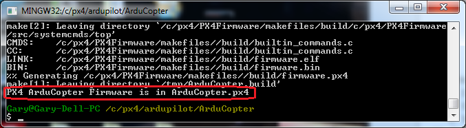

.. _building-px4-with-make:

===================================================
Archived: Building for Pixhawk on Windows with Make
===================================================

.. warning::

   **ARCHIVED ARTICLE**

   ArduPilot no longer supports make.

This article shows how to build ArduPilot for The Cube, Pixhawk, PixRacer on Windows with *Make*.  These instructions assume you have already :ref:`setup the build environment <building-setup-windows>`

.. note::

   The commands for building Pixhawk are (``make px4-v2``). Building for The Cube is the same except ``make px4-v3`` is used. Building for Pixracer is the same except ``make px4-v4`` is used.  For the older (obsolete) PX4 use ``make px4-v1``. 

Build instructions
==================

Open the *PX4Console* and navigate to the target vehicle directory:

-  Start the *PX4Console*. This can be found under **Start \| All
   Programs \| PX4 Toolchain** (Windows 7 machine) or you can directly
   run **C:\\px4\\toolchain\\msys\\1.0\\px4_console.bat**
-  Navigate to the vehicle-specific ArduPilot directory in the
   *PX4Console*. For example, to build Copter, navigate to:

   ::

       cd /c/Users/<username>/Documents/GitHub/ardupilot/ArduCopter

Build the firmware by entering one of the following commands:

+--------------------------------------+--------------------------------------+
| ``make px4-v2``                      | Build the Pixhawk firmware for a     |
|                                      | quad                                 |
+--------------------------------------+--------------------------------------+
| ``make px4-v3``                      | Build The Cube firmware for a        |
|                                      | quad                                 |
+--------------------------------------+--------------------------------------+
| ``make px4-v4``                      | Build the PixRacer firmware for quad |
+--------------------------------------+--------------------------------------+
| ``make px4``                         | Build both PX4 (obsolete) and PixHawk|
|                                      | firmware for a quadcopter            |
+--------------------------------------+--------------------------------------+
| ``make clean``                       | "clean" the ardupilot directory      |
+--------------------------------------+--------------------------------------+
| ``make px4-clean``                   | "clean" the PX4Firmware and PX4NuttX |
|                                      | directories so the next build will   |
|                                      | completely rebuild them              |
+--------------------------------------+--------------------------------------+
| ``make px4-cleandep``                | "clean" .d and .o files from the     |
|                                      | PX4Firmware and PX4NuttX directories.|
|                                      | faster but less complete rebuild     |
|                                      | compared to "px4-clean"              |
+--------------------------------------+--------------------------------------+
| ``make px4-v2-upload``               | Build and upload the Pixhawk         |
|                                      | firmware for a quad (i.e. no need to |
|                                      | upload using a ground station)       |
+--------------------------------------+--------------------------------------+

The firmware will be created in the **ArduCopter** directory with the
**.px4** file extension.

-  Upload the firmware using the *Mission Planner* **Initial Setup \|
   Install Firmware** screen's **Load custom firmware** link

.. note::

   ArduPilot imports addition projects
   (`PX4Firmware <https://github.com/ArduPilot/PX4Firmware>`__,
   `PX4NuttX <https://github.com/ArduPilot/PX4NuttX>`__,
   `uavcan <https://github.com/ArduPilot/uavcan>`__) as *git submodules*
   when you build the project. If you built the project before the change
   to submodules you may get errors. See :ref:`Git Submodules <git-submodules>` for troubleshooting information.
   
   
.. note::

   You can ignore any mesages regarding PX4Firmware and PX4Nuttx hashes. Those are useful labels for developers but optional and sometimes the build system can't find them on your system. As long as it says "Firmware is in.." followed by a .px4 file then you have a successful build which you can safely load onto your aircraft.
   
Hints for speeding up compile time
==================================

Anti virus protection is likely to slow the compile times especially for
PX4 so it is recommended that the folders containing the ArduPilot
source code is excluded from your virus protections real-time scan.

The first scan after a ``make px4-clean`` will be very slow as it
rebuilds everything
